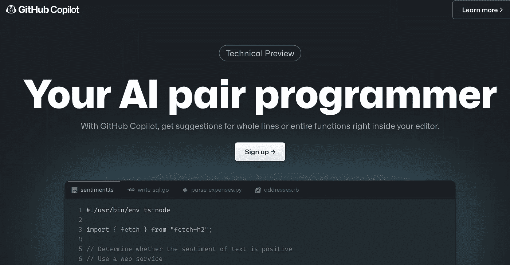
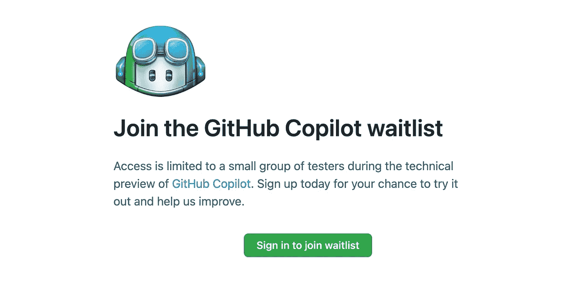
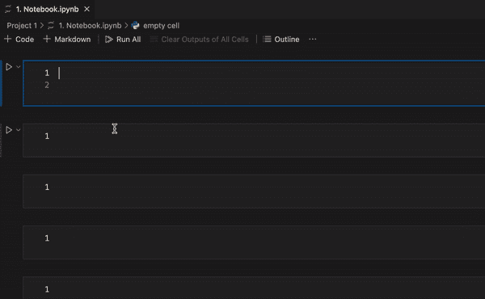

# GitHub Copilot 如何简化我作为数据科学家的生活

> 原文：<https://towardsdatascience.com/how-github-copilot-simplified-my-life-as-a-data-scientist-1fb00f46eced>

## 一个你至少应该尝试一次的人工智能代码编写助手


照片由[丹尼尔·伊德里](https://unsplash.com/@ricaros?utm_source=unsplash&utm_medium=referral&utm_content=creditCopyText)在 [Unsplash](https://unsplash.com/s/photos/coding?utm_source=unsplash&utm_medium=referral&utm_content=creditCopyText) 拍摄

如果你一直关注最近的科技新闻，你可能听说过 [GitHub Copilot](https://copilot.github.com/) ，这是一款基于人工智能的编程助手。如果你已经在使用它，那很好，如果还没有，请继续阅读！

我现在已经使用 GitHub Copilot 几个月了，我绝对喜欢它。在这篇文章中，我将尝试做出令人信服的声明，以便您给副驾驶一个机会。你可能也会坠入爱河！

## 先决条件



GitHub 副驾驶([来源](https://copilot.github.com/))

不幸的是，注册过程是等待上市，因为推出仍然是在技术预览模式。当您尝试注册时，将会收到以下消息:



GitHub Copilot 等候名单

在 Copilot 刚刚推出的早期，我就加入了候补名单。我记得很快就获得了访问权限，我可以试试 Copilot。所以请加入等候名单吧。

在注册 Copilot 的过程中，我是 JupyterLab 的狂热用户，我了解到它只能通过 Visual Studio 代码、Neovim 和 ide 的 JetBrains 套件访问。我很犹豫要不要换成新的 ide 来试用新的 AI 助手，它持续了几个星期，最后，我让步了，安装了 VS 代码和 Copilot 扩展。

# 测试副驾驶

我可以很容易地将 anaconda 环境(我正在 JupyterLab 上使用它)集成到新的 VS 代码中。

是时候测试一些简单的东西了。我首先想到的是进口陈述，所以我用副驾驶试了一下。安装扩展后，它会提示您登录 GitHub 帐户。



导入语句(作者 Gif)

一旦你完成了所有的手续，你就可以开始试用了。你所要做的就是开始打字，副驾驶会尝试“智能地”填写下一部分代码。在上面的 gif 中，可以看到它是如何预测和显示后续的 import 语句的。如果您在某一点进行了修正，它将相应地重新调整下面的代码预测。你点击`tab`按钮接受 Copilot 提出的自动填充建议。


KNN 测试(作者 Gif)

在接下来的测试中，我只写了一个函数`def knn():`，副驾驶会自动填充下一部分代码。我需要给出一些背景，助理做了所有的重活。我印象深刻的是，它是如何让我建立一个 KNN 模型并准确地自动填充代码的。

我们可能不会使用 Copilot 来编写完整的代码，但了解助手的局限性以及它可以帮助我们的所有方式是有好处的。

在我典型的工作流程中，我会编写代码，就好像我不需要助手一样，每当我感到陷入困境或迷失在想法中时，我会看到自动填充建议并相应地修改我的代码。有几次，自动填充提示让我很恼火，尤其是当提示不是我想要的时候。我只是接受了它是一种必要的邪恶。这让我的生活更轻松，但有时也让我感到烦恼。

我大多用副驾驶来做很长的清单和打字很累的事情。我目前正在处理大量的时间序列数据，我必须不断地制作列表，例如

```
months = ['Jan', 'Feb', 'Mar', 'Apr', 'May', 'Jun', 'Jul', 'Aug', 'Sep', 'Oct', 'Nov', 'Dec']
```

打字很累；有时候，无法逃避，不得不去做。使用 Copilot，我输入`months =`,它会自动填充整个内容。事实上，我复制粘贴了上面的副驾驶建议，而不是键入它。您可以对代码做一些小的调整，它会很快跟上。

就像你把第一个月编辑成完整的长度—

```
months = ['January', 'February', 'March', 'April', 'May', 'June', 'July', 'August', 'September', 'October', 'November', 'December']
```

它会以类似的方式自动修正其他月份。我发现这非常有帮助，随着时间的推移，你会明白如何给副驾驶适当的上下文，使你的工作流程更加顺畅。

在其他情况下，我使用 Copilot 来识别方法的参数，例如

```
plt.savefig('plots/iris.png',dpi=300,bbox_inches='tight',
pad_inches=0,facecolor='w',edgecolor='w')
```

我不会试图记住`plt.savefig()`的所有论点，Copilot 在提示方面做得很好，这使得完成代码变得更加容易，不需要太多的谷歌搜索。

# 结论

在我看来，副驾驶永远不会取代从事编码工作的人。它依赖于人类的背景，并开始在此基础上发展。如果你给副驾驶一张白纸，并要求自动填充，它可能会写下你不想要的东西。使用 Copilot 作为辅助工具来编写和自动填充数据输入类型的工作(就像我之前提到的列表和参数)是一个好主意。

当我在没有 Copilot 的情况下使用 JupyterLab 时，我错过了许多可以让我的生活更轻松的事情。VS 代码有一个类似于 JupyterLab 的界面，带有一个浏览器来查看你所有的项目，还有一个集成的终端。所以它给我带来了 JupyterLab + Copilot 的所有便利。在 JupyterLab 中看到 Copilot 的实现可能也会很有趣。哦，好吧，我们可能要等一等。

就这样，我祝你编码愉快。

感谢阅读，干杯！

```
**Want to Connect?**Reach me at [LinkedIn](https://www.linkedin.com/in/rohithteja/), [Twitter](https://twitter.com/rohithtejam), [GitHub](https://github.com/rohithteja) or just [Buy Me A Coffee](https://www.buymeacoffee.com/rohithteja)!
```