# 电动汽车能有多热？

> 原文：<https://towardsdatascience.com/how-hot-can-ev-motors-get-6894b2e1ff2>

## 使用帕德博恩大学 LEA 部门收集的试验台测量数据的数据驱动方法

卢克·切瑟在 [Unsplash](https://unsplash.com?utm_source=medium&utm_medium=referral) 上的照片

**电动汽车**是未来，而**电动汽车**是未来的重要组成部分。

世界各地的工程师旨在提高效率，降低电动汽车的成本。与此同时，**电机**设计者的主要目标是在提高**功率输出**的同时减小电机尺寸和成本。

不幸的是，在这些参数之间有一个**权衡**。

能够对转子温度进行强有力的估计有助于汽车工业用更少的材料制造电机，并使控制策略能够最大限度地利用电机。
精确的扭矩估算有助于更准确、更充分地控制电机，减少功率损耗并最终减少热量积聚。

**推动**更大的电流**会增加**的功率，但是电机内部的**温度也会同时升高，导致**组件失效，效率**降低。**

这就是为什么要实时监控电动机中的**温度**升高，而这**不容易实现**，尤其是在电动机的**旋转侧**。为了克服这一困难，制造商倾向于采用**超大电机**或**利用具有**巨大安全裕度**的电机来确保**安全运行**，即使在过载情况下。**

迈克尔·福塞特在 [Unsplash](https://unsplash.com?utm_source=medium&utm_medium=referral) 上拍摄的照片

如果我们能够**在各种负载条件下估计关键部件的温度**，我们就能够**更好地优化电动机**的参数，以最大限度地利用电动机，这最终意味着**提高性能**和**降低最终用户的成本**。

我将使用帕德博恩大学 [**LEA 部门**](https://ei.uni-paderborn.de/en/lea/) **从永磁同步电机(PMSM)收集的 180 个小时的数据。**

请点击链接获取[原始数据](https://www.kaggle.com/datasets/wkirgsn/electric-motor-temperature)和相应的[CC BY-SA 4.0](https://creativecommons.org/licenses/by-sa/4.0/)(attribute-share like 4.0 International)以及[相关出版物。](https://ieeexplore.ieee.org/abstract/document/9296842)

希望我能够回答下面的问题，

*   有哪些不同类型的驾驶概况？
*   电动机的哪个部分温度最高？
*   哪些因素与温度上升有密切关系？
*   用一个简单的线性回归模型，我们能多好地预测关键部件的温度？

# **第一部分:有哪些不同类型的驾驶模式(电机发动机速度特性)？**

数据集中有 81 种不同的驱动配置文件，每种都有独特的发动机转速特征。尽管如此，我们还是可以根据测试期间发动机转速基于变化的相似性对曲线进行分组，如下所示:

*   18 个配置文件在整个会话期间保持恒定的发动机转速

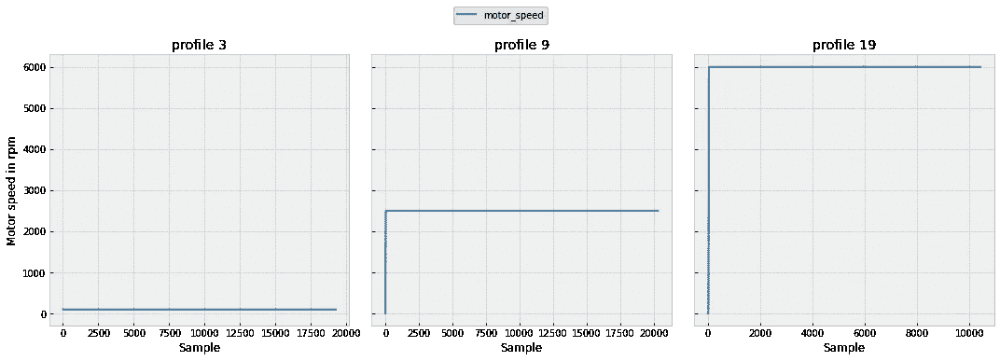

恒定发动机转速曲线示例—图片由作者提供

*   14 个配置文件在发动机转速上有步进

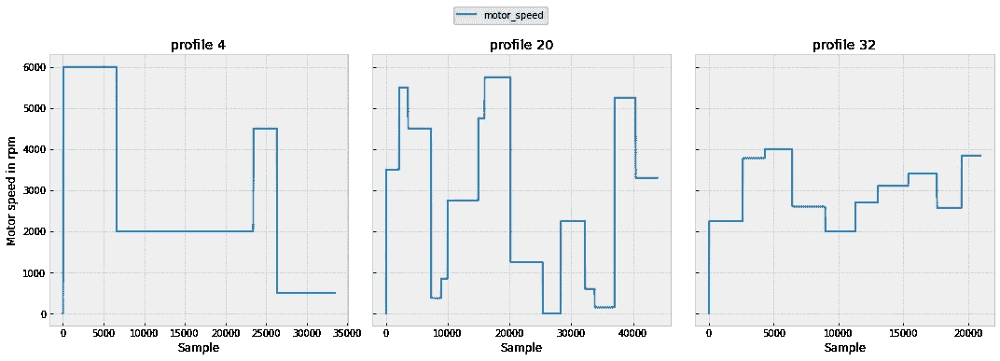

发动机转速步进的配置文件示例—图片由作者提供

*   剩余的 49 个配置文件随机增加和降低发动机转速，以更好地代表真实世界的驾驶循环

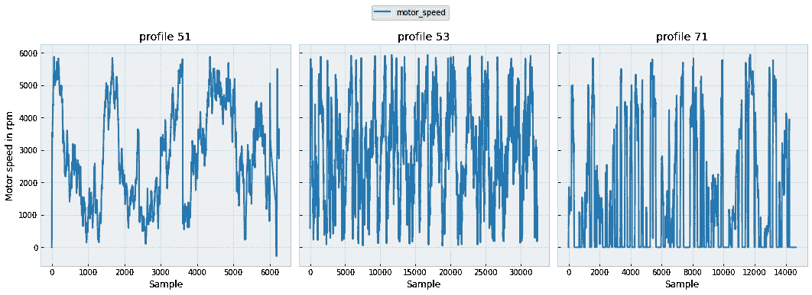

引擎速度随机上升和下降的配置文件-图片由作者提供

# 第二部分:电动机的哪个部分温度最高？

发动机温度在测试期间在定子轭、定子齿、定子绕组和永磁体位置进行测量，这些位置标记为**定子轭**、**定子齿**、**定子绕组**和 **pm** 。

恒定发动机转速曲线中的温度累积—图片由作者提供

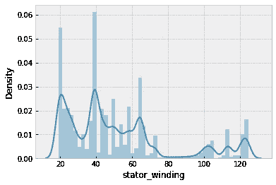

恒定发动机转速曲线中的温度密度图—图片由作者提供

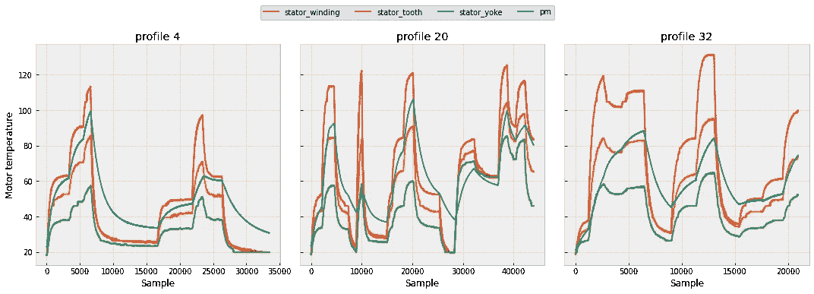

阶梯式发动机转速曲线中的温度累积—图片由作者提供

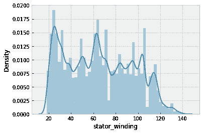

阶梯式发动机转速曲线中的温度密度图—图片由作者提供

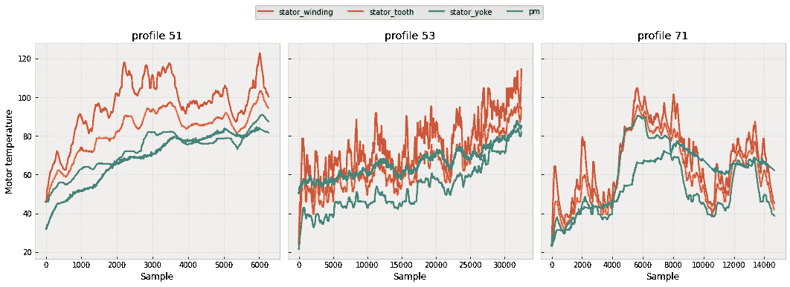

随机加速时温度升高，发动机转速降低——图片由作者提供

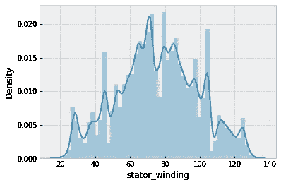

发动机转速随机上升和下降时的温度密度图——图片由作者提供

以下是从上述图表中得出的观察结果:

*   定子绕组达到**最高温度**约 140℃
*   温度与发动机转速呈**高正相关。**
*   当发动机励磁停止时，永磁体**冷却最慢**，发动机绕组**冷却最快**。
*   具有随机速度变化的曲线显示温度的正态分布，而其它曲线分别具有许多局部峰值。

# 第三部分:哪些因素与电机中的温度升高密切相关？

发动机转速和扭矩(记为**电机转速**和**扭矩**)是驾驶条件的结果。电机控制器通过调节提供给电机的电压水平(表示为 **u_q，u_d，i_q，i_d** )来驱动电机，以将车辆保持在期望的速度水平。

借助相关矩阵，我们可以看到定子**温度与发动机转速正相关。**我们还可以清楚地看到**发动机转速与电压和电流高度相关**，这实际上是有意义的，因为它是由电压和电流控制的。

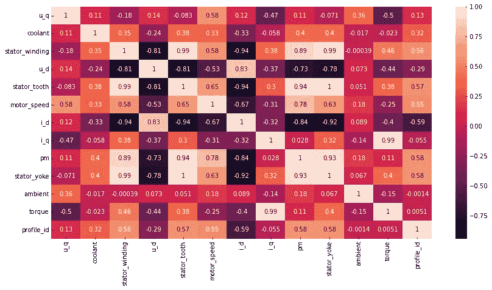

恒速剖面的相关矩阵—图片由作者提供

随着**发动机转速的随机上升和下降**，这种相关性在曲线中恶化。可以看出，与恒速条件相比，在这种驱动模式下，发动机冷却剂和环境温度与温度具有更高的相关性。

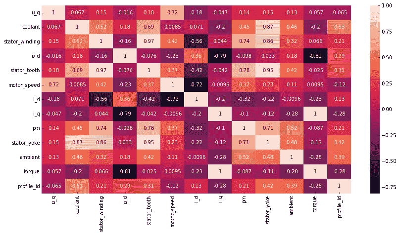

随机速度曲线的相关矩阵——图片由作者提供

# 第四部分:我们能多好地预测关键部件的温度？

您可以在下图中看到定子绕组的预测温度，以及在顶部绘制的特定曲线的相应实际测量值。

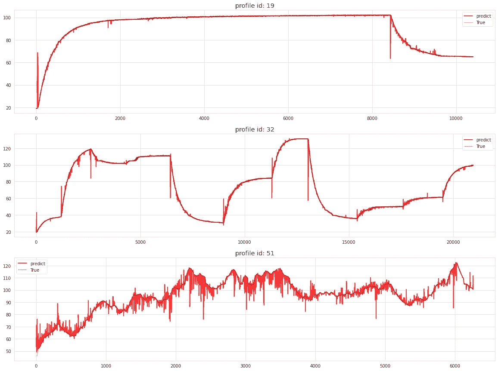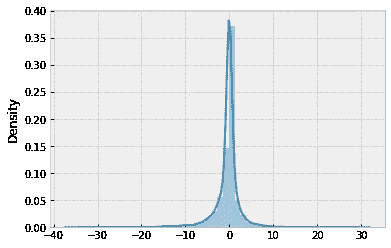

预测误差的密度图—作者提供的图片

观察结果是:

*   一般来说，我们的模型可以预测定子温度，平均绝对误差为 1.2°c。
*   50%的预测准确无误，误差为 0.7–0.2℃
*   具有随机速度变化的曲线具有比恒定和步进速度曲线更大的预测误差。
*   当电机速度发生剧烈变化时，预测会变得更糟。
*   在极端情况下，预测误差为 30–35°C。

# 关键要点和结论

*   在**恒定、逐步和随机速度变化**的数据中观察到 3 种不同的行驶曲线。
*   定子绕组达到**最高温度**约 140℃
*   总的来说，我们的模型可以预测定子温度，平均绝对误差为 1.2°C，50%的预测准确无误，误差为 0.7–0.2°C。

我希望这篇文章对你有用，完整的代码可以在 [Github](https://github.com/eisbilen/how_hot_can_EV_eMotors_get) 中找到。