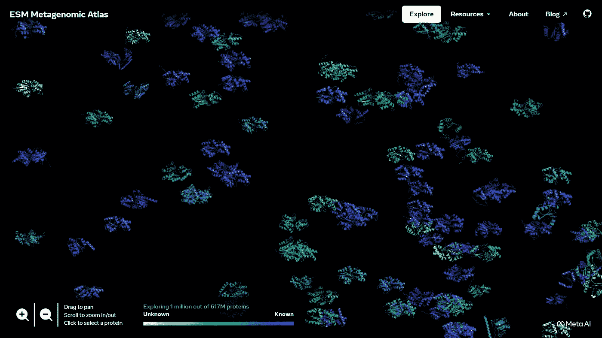
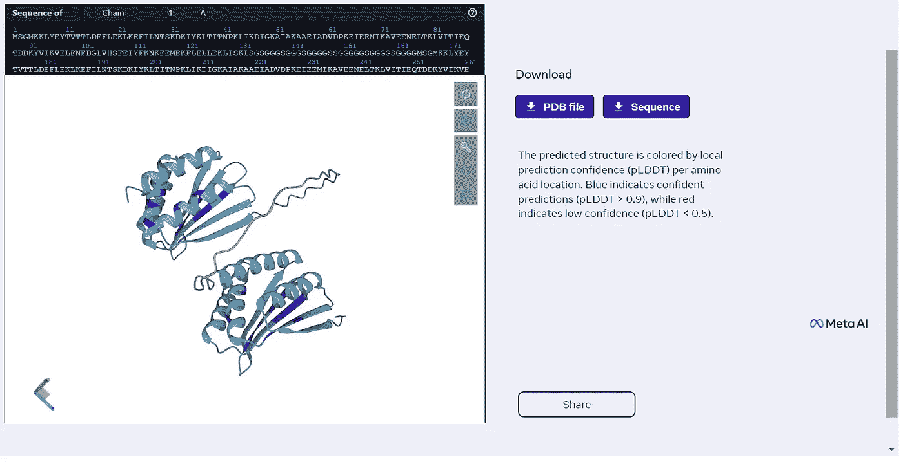
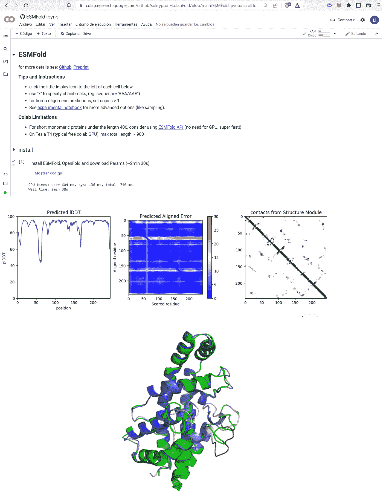

# 巨大的蛋白质语言模型如何破坏结构生物学

> 原文：<https://towardsdatascience.com/how-huge-protein-language-models-could-disrupt-structural-biology-6b98193f880b>

## Meta 的 ESM-2 和 ESMFold 模型用于蛋白质结构预测

## 结构预测的准确性与 AlphaFold 相似，但速度快 60 倍，并且在此过程中开发了新的人工智能方法。



作者的 Meta 宏基因组图谱的一个区域的截屏，放大以解析单个蛋白质模型。正如在[https://esmatlas.com/about#license](https://esmatlas.com/about#license)所解释的那样，esmatlas.com 大学用于创建本文中显示的数字的这些资源和所有其他资源都可以在 CC BY 4.0 许可下用于学术和商业用途。

T 现代生物学的两个标志是:( I)预测蛋白质结构的 ML 模型的出现，导致了该领域的一场真正的革命,( ii)这场革命是由私营部门的研究实验室而不是学术界带来的(幸运的是，这些私营部门开放了所有代码和模型，因此学术界可以在它们的基础上进一步发展)。

我所说的这场革命的明星和种子是 DeepMind 及其用于蛋白质结构预测的 AlphaFold 2 模型。在此基础上，新的 ML 模型发展起来，主要是在学术实验室，可以进行蛋白质设计，预测相互作用表面，等等:

[](/new-deep-learned-tool-designs-novel-proteins-with-high-accuracy-41ae2a7d23d8) [## 新的深度学习工具以高精度设计新的蛋白质

### 贝克实验室的这款新软件设计了在潮湿实验室中实际工作的蛋白质。你可以用它来…

towardsdatascience.com](/new-deep-learned-tool-designs-novel-proteins-with-high-accuracy-41ae2a7d23d8) [](/new-preprint-describes-a-novel-parameter-free-geometric-transformer-of-atomic-coordinates-to-c6545150855e) [## 新的预印本描述了一种新颖的原子坐标的无参数几何变换…

### 它的运行速度如此之快，甚至可以扫描大量的蛋白质结构来寻找易相互作用的氨基…

towardsdatascience.com](/new-preprint-describes-a-novel-parameter-free-geometric-transformer-of-atomic-coordinates-to-c6545150855e) 

(更多信息，[查看我所有关于 CASP、AlphaFold 2 和相关技术的文章的摘要](https://lucianosphere.medium.com/here-are-all-my-peer-reviewed-and-blog-articles-on-protein-modeling-casp-and-alphafold-2-d78f0a9feb61))

然后在相邻的化学领域，我介绍了 DeepMind 和谷歌如何加速量子计算。甚至抖音似乎也有计划用最大似然法来帮助量子计算，因为它最近正在雇佣这些领域的人员。

[](/deepmind-strikes-back-now-tackling-quantum-mechanical-calculations-e1cae792e5d0) [## DeepMind 反击了，现在正在处理量子力学计算

### 这家与谷歌有关联的公司开发了一个新的框架，用高度精确的电子密度来训练神经网络…

towardsdatascience.com](/deepmind-strikes-back-now-tackling-quantum-mechanical-calculations-e1cae792e5d0) [](/google-proposes-new-method-to-derive-analytical-expressions-for-terms-in-quantum-mechanics-d70fff6e1ef2) [## 谷歌提出新方法推导量子力学术语的解析表达式…

### 新方法以符号形式导出精确的泛函(量子力学计算的元素),因此…

towardsdatascience.com](/google-proposes-new-method-to-derive-analytical-expressions-for-terms-in-quantum-mechanics-d70fff6e1ef2) 

梅塔，原名脸书，几年来一直致力于生物学的一些新东西，现在有了成果:开发一种“知道”蛋白质结构的蛋白质语言模型。正如我将在这里描述的，Meta 创造并发展了一系列方法，这些方法现在形成了一套完整的蛋白质结构预测、设计和突变评估，所有这些都完全基于语言模型。

正如我在最近这篇文章的[中解释的那样，将语言模型应用于蛋白质结构预测可以帮助克服 AlphaFold 等依赖于多序列比对的工具的限制，还可以大大加快蛋白质结构预测的速度。](/protein-structure-prediction-a-million-times-faster-than-alphafold-2-using-a-protein-language-model-d71c55e6a4b7)

# 概述什么是蛋白质结构建模，它如何演变，以及蛋白质语言模型的潜在影响

简而言之，“蛋白质结构建模”是关于从氨基酸序列预测蛋白质如何在 3D 空间折叠，以及各种相关问题，如设计折叠成所需 3D 结构的氨基酸序列。这两个问题都是生物学的核心:基础和应用生物学的结构预测，因为科学家需要知道蛋白质的结构，以便了解它们的功能和设计新的药物；以及应用生物技术的蛋白质设计，例如创造新的酶或稳定现有的酶。

通过实验确定蛋白质的三维结构非常昂贵和耗时，甚至可能在多年的工作后仍然不成功。因此，计算方法的相关性，以预测三维结构，理想地尽可能准确和快速。事实上，蛋白质结构预测的问题对生物学来说是如此重要，如此难以破解，以至于自 1994 年以来，预测者之间的竞争每两年进行一次。这个竞赛被称为 [CASP](https://lucianosphere.medium.com/the-critical-assessment-of-structure-prediction-casp-over-a-quarter-century-tracking-the-state-bde0a92b3680) ，传统上是研究这个问题的学者的竞技场。经过多年的无进展和缓慢的改进，DeepMind 用他们的 AlphaFold 2 程序破解了 CASP14 (2020)部分的蛋白质结构预测问题(AlphaFold 1 之前赢得了 CASP13，但它几乎没有将学术界已经知道的一切都推到极限，没有真正解决问题)。

现在我们来看看 AlphaFold 的局限性，以及语言模型是如何帮助我们的。为了从蛋白质的序列中建模蛋白质，AlphaFold 2 首先建立与查询相关的多个蛋白质序列的比对。这种比对由基于 BERT 的语言模型处理，该模型专门用于蛋白质，然后将从比对中处理的数字输入网络的核心，该网络预测结构作为其输出。

Meta 开发的新方法(正如我之前举例说明的那样，一些学者最近也在探索这些方法)使用了比 BERT 更先进的语言模型。这些模型了解了如此多的蛋白质序列和将序列与功能联系起来的进化模式，以至于它们根本不需要序列比对就可以折叠它们。最新的这类方法来自 Meta，名为 ESM-2 和 ESMFold，它们似乎可以像 AlphaFold 2 一样预测蛋白质结构，但预测速度更快，而且不需要计算比对，我将在下一节解释和演示。

但在继续解释之前，让我通过提醒读者 AlphaFold 2 的结果关键取决于建立多序列比对的大量序列的可用性，来强调 Meta 新方法的相关性。因此，AlphaFold 2 对所谓的“孤儿”蛋白质的效用有限，即那些因为数据库中没有多少序列而无法检索到比对的蛋白质。通过不使用比对，基于语言模型的方法原则上可能比 AlphaFold 和类似的方法更好地模拟孤儿蛋白，从而假设现代蛋白质结构预测的潜在改进——剧透:新方法有一点帮助，但不是显著的。

此外，由于不需要编译比对，使用语言模型的方法比 AlphaFold 等常规方法运行得快得多，因此允许在单位时间内处理更大量的序列——正如我稍后描述的那样，Meta 确实利用这种方法在短短两周内处理了超过 6 亿个序列。

# Meta 的蛋白质语言模型如何预测蛋白质结构

这太迷人了。为了开发以 ESM-2 和 ESMFold 为顶点的蛋白质语言模型，Meta 尝试训练神经网络不直接从序列预测蛋白质结构(如 AlphaFold 和其他方法)，而是预测蛋白质序列中隐藏的氨基酸。这与 GPT-3 等语言模型的训练方式非常相似:算法屏蔽令牌，训练程序旨在预测它们。不知何故，ESM-2/ESMFold“只是另一个”巨大的语言模型，但对蛋白质来说超级专业。

像任何其他神经网络一样，这些蛋白质语言网络包含大量的权重(从数百万到数十亿)，这些权重在训练过程中得到微调，在这种情况下，预测屏蔽的残基。Meta 发现，当网络训练有素，能够预测数百万天然蛋白质序列中的屏蔽氨基酸时，其内部权重实际上是在捕捉或“理解”蛋白质结构。明白我为什么说这很有趣了吧？

让我用不同的词再解释一下。ESM-2 的训练只针对序列，包括输入和输出。关于被建模的结构的信息在网络中发展，因为其权重描述了将输入(屏蔽)序列连接到输出(完整)序列的结构模式。当网络处理输入序列时，从网络内部激活的模式中“在侧面”预测蛋白质结构。

不知何故，为了预测序列，网络必须在训练序列中学习进化模式，这确实是有意义的。众所周知，这些模式与蛋白质结构中成对的残基之间的接触直接相关——这一概念在 CASP 和结构生物信息学中已经记录了近十年，在 DeepMind 与 AlphaFold 1 进入游戏之前，它就已经对 CASP12 中的蛋白质结构预测产生了影响。

再深入一点细节，Meta 已经从以前的工作中知道，被训练来模拟屏蔽蛋白质序列的变压器模型开发了与蛋白质的残基间接触图相对应的注意模式。Meta 教 ESM-2 如何从其内部知识中推导出一个结构(从而创建了 ESMFold)的方法是将注意力模式投射到从输入序列的实验结构中获得的已知残基-残基接触图中。因此，当 ESMFold 处理输入序列时，它会立即激活一系列注意模式，然后将其转换为接触模式，然后将这些模式馈送到结构网络，最终计算符合预测结构的实际坐标集。

## Meta 是如何到达 ESM-2 和 ESMFold 的

Meta 的蛋白质和语言模型工作始于他们在 *PNAS* 发表的 2019 年论文[中提出的内容:在蛋白质序列上训练的语言模型在内部学习与结构和功能相关的蛋白质属性的证据。然后在 2020 年，Meta 发布了 ESM1b，这是一种蛋白质语言模型，已经帮助科学家直接从蛋白质序列中对蛋白质结构和功能进行了一些具体的预测和发现。Meta 随后将其放大，创建了 ESM-2，其 15B 参数是迄今为止最大的蛋白质语言模型，并为 Meta 用于蛋白质结构预测和蛋白质设计的现代工具奠定了基础。在开发 ESM-2 和 ESMFold 的过程中，Meta 观察到，随着模型从 800 万个参数扩大到 150 亿个参数，序列预测变得更好，从网络的注意力模式中提取的有关蛋白质结构的信息变得更丰富、更准确，从而有效地允许通过将权重与已知结构匹配来模拟蛋白质结构。](https://www.pnas.org/doi/10.1073/pnas.2016239118)

此外，Meta 发现，ESM-2 的蛋白质结构预测比 AlphaFold 2 快 60 倍，在不需要任何比对的情况下，达到了非常相似的准确性(对一些目标来说只是低了几个点)，对于孤儿蛋白质来说，结果略好于 alpha fold 2-尽管没有语言模型的预期那么引人注目。

# 运行 ESMFold 进行结构预测的多种方法

原则上，Meta 的 ESM-2 可用于折叠蛋白质，设计蛋白质，以及预测突变对蛋白质的影响等其他任务。迄今为止，Meta 发布的主要应用程序是 ESMFold，这是一个从蛋白质序列中折叠蛋白质的工具，以及一个预计算模型图集(下一节将介绍)。

给定一个序列，ESMFold 输出模型和置信度，就像 AlphaFold 2 一样，即 1D pLDDT 图估计每个残基建模的准确性，2D PAE 图估计每个残基相对于所有其他残基的建模程度。

Meta 使得 ESMFold 可以通过多种方式访问。最简单的，直接从他们的网站，允许您提交一个序列建模使用“折叠序列”功能在这个页面:

[](https://esmatlas.com/resources?action=search_structure) [## ESM 宏基因组结构图谱| Meta AI

### ESM 宏基因组结构图谱，一个 6.2 亿宏基因组蛋白质结构的开放图谱

esmatlas.com](https://esmatlas.com/resources?action=search_structure) 

网络服务运行速度非常快；例如，我在不到 4 秒的时间内预测出了这个结构:



请注意，模型结构被着色以显示每个残基的精度，即通过 pLDDT。蓝色意味着高度准确，随着你跟随彩虹的颜色，准确性下降，直到红色被认为可能是错误的。

为了进行更丰富的结构预测，我建议你使用由 so 氪和同事们整理的 Google Colab 笔记本，它提供了完整的输出，包括 1D (pLDDT)和 2D (PAE)急需的模型置信度指标(虽然运行起来需要一点时间):



上图:在 ColabFold 的笔记本中运行 ESMFold 的结果，该笔记本可以在麻省理工学院的许可下访问，包括商业用途。下图:叠加到实际结构中的模型，该图由作者从上面运行 ESMFold 生成的模型中生成。

与 pLDDT 着色的 ESMfold 模型相比，该图底部的图以绿色显示了该蛋白质在 PDB 中可用的实际结构(蓝色是高 pLDDT，即高确定性，红色是低 pLDDT，即不确定性)。你可以看到，仅有的两个不匹配的部分确实被 ESMfold 预测为低置信度(一个粉红色有点不匹配，一个红色非常差)。

## 通过 API 直接调用 ESMFold

当您使用我在上面第一次介绍的 Meta 的服务时，您实际上正在访问一个非常简单的网页，该网页将您的查询序列发送到一个 API，Meta 将该 API 组合在一起以运行程序。

这在提交预测时调用的 URL 的格式中很明显:

```
https://esmatlas.com/resources/fold/result?fasta_header=Example&sequence=MSGMKKLYEYTVTTLDEFLEKLKEFILNTSKDKIYKLTITNPKLIKDIGKAIAKAAEIADVDPKEIEEMIKAVEENELTKLVITIEQTDDKYVIKVELENEDGLVHSFEIYFKNKEEMEKFLELLEKLISKLSGSGGGSGGGSGGGGSSGGGGGSGGGGSGGGGMSGMKKLYEYTVTTLDEFLEKLKEFILNTSKDKIYKLTITNPKLIKDIGKAIAKAAEIADVDPKEIEEMIKAVEENELTKLVITIEQTDDKYVIKVELENEDGLVHSFEIYFKNKEEMEKFLELLEKLISKL
```

这意味着原则上你可以在你正在开发的任何程序或 web 应用中进行这样一个简单的 API 调用，然后在你自己的程序中处理获得的模型！

# 超过 6 亿种蛋白质的模型数据库

鉴于 ESMFold 运行的速度，Meta 可以做一些生物学上前所未有的事情:他们在短短两周多的时间内模拟了 6.17 亿个蛋白质，这些蛋白质的序列是从宏基因组项目中获得的！那是连 AlphaFold 2 都达不到的，alpha fold 2 擅长建模但比 Meta 的新系统慢很多。

宏基因组计划需要对大量生物体的 DNA 进行测序。但是，如果没有蛋白质结构，或者至少是可靠的模型，那么所有这些大量的信息都无法被充分利用，因此，除了 DeepMind 和欧洲生物信息学研究所发布的 2 亿个结构的数据库之外，Meta 的新模型数据库——称为 ESM 宏基因组图谱——也具有相关性。

Meta 的模型图集可以像本文的主图一样图形化浏览，这很有美感，但实际上并没有任何实用价值。当与搜索引擎结合时，图谱的真正力量是:你可以通过 MGnifyID (MGnify 是来自宏基因组数据集的蛋白质序列数据库)、氨基酸序列(试图找到已经为该序列或类似序列计算的模型)或蛋白质结构(寻找数据库中存储的结构相似的模型)来搜索图谱。

# 结束语

当我认为最好的蛋白质结构预测已经发生时(AlphaFold 2)，Meta 推出了这个迷人的方法、工具和数据库。随着 CASP15 的科学摘要刚刚出炉，没有来自 DeepMind 的消息，但有来自 Meta 的消息，我想知道我们可能会有什么惊喜。一方面，初步评估似乎显示相对于 CASP14 没有大的改进，但另一方面，AlphaFold 2 模型已经非常好，几乎没有改进的空间，正如我所讨论的，CASP15 正在朝着新的目标前进。对孤儿蛋白的预测至少会受到 Meta 的 ESMFold 的一点影响，但这种蛋白通常不会在 CASP 中大量存在。我们很快就会知道，就在 CASP15 结果发布的 3 周后，语言模型(不仅是 Meta 的，还有学术界正在开发的其他模型)是否能进一步推动这场革命。

# 参考

ESM-2 主网络、ESMFold 和 ESM 地图集的预印本:

[](https://www.biorxiv.org/content/10.1101/2022.07.20.500902v2) [## 基于语言模型的原子级蛋白质结构进化预测

### 人工智能有可能在进化的尺度上开启对蛋白质结构的洞察。它…

www.biorxiv.org](https://www.biorxiv.org/content/10.1101/2022.07.20.500902v2) 

提供 ESM-2 工具和图集的主要网站:

[](https://esmatlas.com/resources?action=fold) [## ESM 宏基因组结构图谱| Meta AI

### ESM 宏基因组结构图谱，一个 6.2 亿宏基因组蛋白质结构的开放图谱

esmatlas.com](https://esmatlas.com/resources?action=fold) [](https://esmatlas.com/explore?at=1%2C1%2C21.999999344348925) [## ESM 宏基因组结构图谱| Meta AI

### ESM 宏基因组结构图谱，一个 6.2 亿宏基因组蛋白质结构的开放图谱

esmatlas.com](https://esmatlas.com/explore?at=1%2C1%2C21.999999344348925) 

早期的相关工作是关于语言模型如何帮助预测蛋白质突变的影响，以及如何设计蛋白质:

[](https://www.biorxiv.org/content/10.1101/2021.07.09.450648v2) [## 语言模型使得零射击预测突变对蛋白质功能的影响成为可能

### 模拟序列变异对函数的影响是理解和设计函数的基本问题

www.biorxiv.org](https://www.biorxiv.org/content/10.1101/2021.07.09.450648v2) [](https://www.biorxiv.org/content/10.1101/2022.04.10.487779v2) [## 从数百万个预测结构中学习反向折叠

### 我们考虑从蛋白质的主链原子坐标预测蛋白质序列的问题。机器学习…

www.biorxiv.org](https://www.biorxiv.org/content/10.1101/2022.04.10.487779v2) 

www.lucianoabriata.com*我写作并拍摄我广泛兴趣范围内的一切事物:自然、科学、技术、编程等等。* [***成为媒介会员***](https://lucianosphere.medium.com/membership) *访问其所有故事(我免费获得小额收入的平台的附属链接)和* [***订阅获取我的新故事***](https://lucianosphere.medium.com/subscribe) ***通过电子邮件*** *。到* ***咨询关于小职位*** *查看我的* [***服务页面这里***](https://lucianoabriata.altervista.org/services/index.html) *。你可以* [***这里联系我***](https://lucianoabriata.altervista.org/office/contact.html) ***。***