# 我如何使用数据科学分析我自己的驾驶行为

> 原文：<https://towardsdatascience.com/how-i-analyzed-my-own-driving-behavior-using-data-science-d3a33efae3ec>

## 车辆远程信息处理数据可以揭示很多关于你驾驶技术的信息

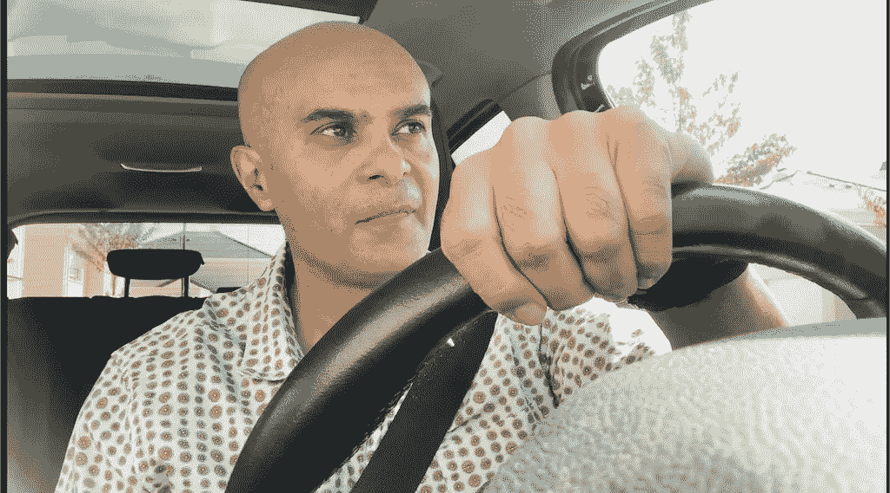

我自己开车收集车辆远程信息数据的照片(图片由作者提供)

你是一个好司机吗？对这样一个问题的回答一直不是很客观。分析这一点的一种方法是听取与你一起旅行的乘客的意见，或者简单地计算你支付的超速罚单！但是，这些都是非常原始的判断驾驶行为的方式。在这篇博客中，我将展示我如何使用数据来客观地分析我的驾驶行为。

驾驶行为分析也被企业用于用例，如设计数据驱动的保险单或车队管理。

在这篇博客中，我将介绍有助于测量驾驶行为的数据科学技术，例如

*   超速行驶
*   硬加速
*   希望
*   机器学习来看看糟糕的驾驶是否会影响车辆状况

# **数据收集**

分析一个人如何开车的第一件事就是收集数据。大多数车辆都有传感器，可以测量各种东西，如速度、温度、加速度等等。这是使用**车辆远程信息处理**设备完成的。有许多供应商提供这种设备。

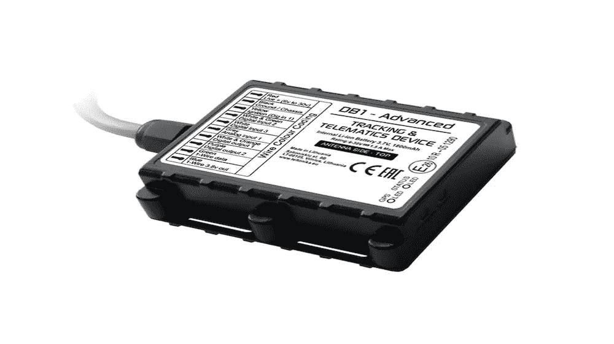

车辆远程信息处理设备(图片由安装在车上的设备的作者提供)

该设备获取传感器记录的数据，然后将其传输到供应商数据库。这些数据可以用来理解驾驶行为。您还可以要求您的供应商提供对数据的访问，以便您可以更详细地分析它。

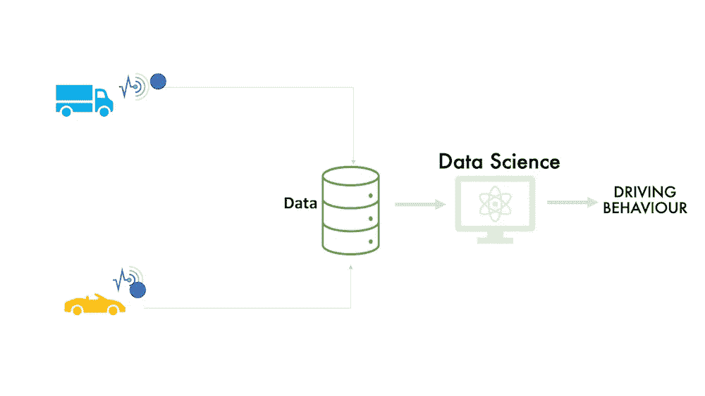

车辆远程信息处理数据收集(图片由作者提供)

在这篇博客中，我将使用我在印度卡纳塔克邦旅行期间收集的数据作为例子。收集的数据截止到 2022 年 8 月 21 日。我们将试图找出我的驾驶技术是否好。收集的数据包含如下所示的信息。

从车辆远程信息处理设备收集的样本数据(图片由作者提供)

该数据具有识别远程信息处理设备的设备 ID。它包含数据记录的时间戳，以及各种需要测量的内容，例如，车辆的位置，测量为纬度、经度和海拔。车速以 KMPH 或英里/小时为单位

现在让我们来分析驾驶行为。

# 超速行驶

为了理解驾驶行为，超速是可以测量的第一件事。这里显示的是我在 2022 年 8 月 21 日走的路线。用于进行该分析的数据基于时间戳、纬度和经度的远程信息处理数据。

行程是从 Udipi 到 Holekattu。所走的路线是沿着印度西海岸的 66 号公路。

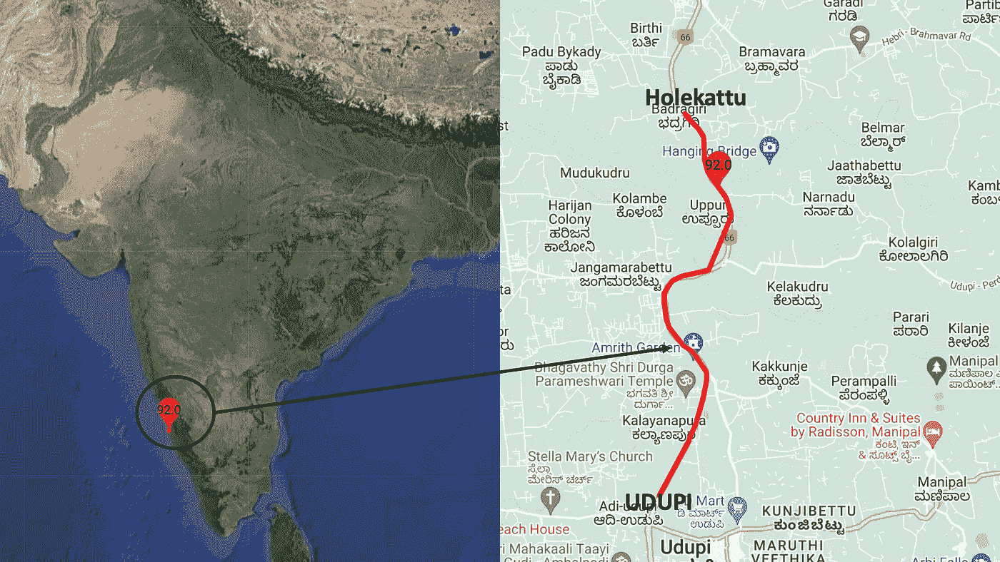

车辆行程可视化(作者使用谷歌地图和 Javascript 制作的图片)

你也可以观察一个标记，它是最高时速 92 KMPH 的记录位置。66 号国道上汽车的限速是 100 KMPH。所以车辆一直在限速范围内，我们可以给超速行为开绿灯。

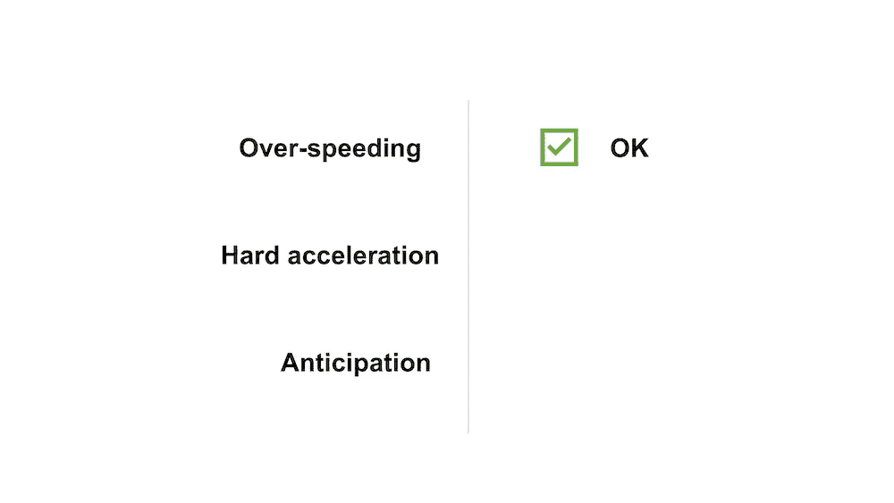

超速驾驶行为是可以的(图片由作者提供)

# **急加速**

急加速是指车辆的加速器或制动系统受到比正常情况下更大的力。有些人可能会把这称为“铅脚”综合症，它可能是侵略性或不安全驾驶行为的一个指标。

现在让我们来测量一下我旅途中的硬加速。这里显示的是在达到最大速度 92 之前的一些其他标记，它显示的速度是 73，然后到 85，然后达到最大速度 92。

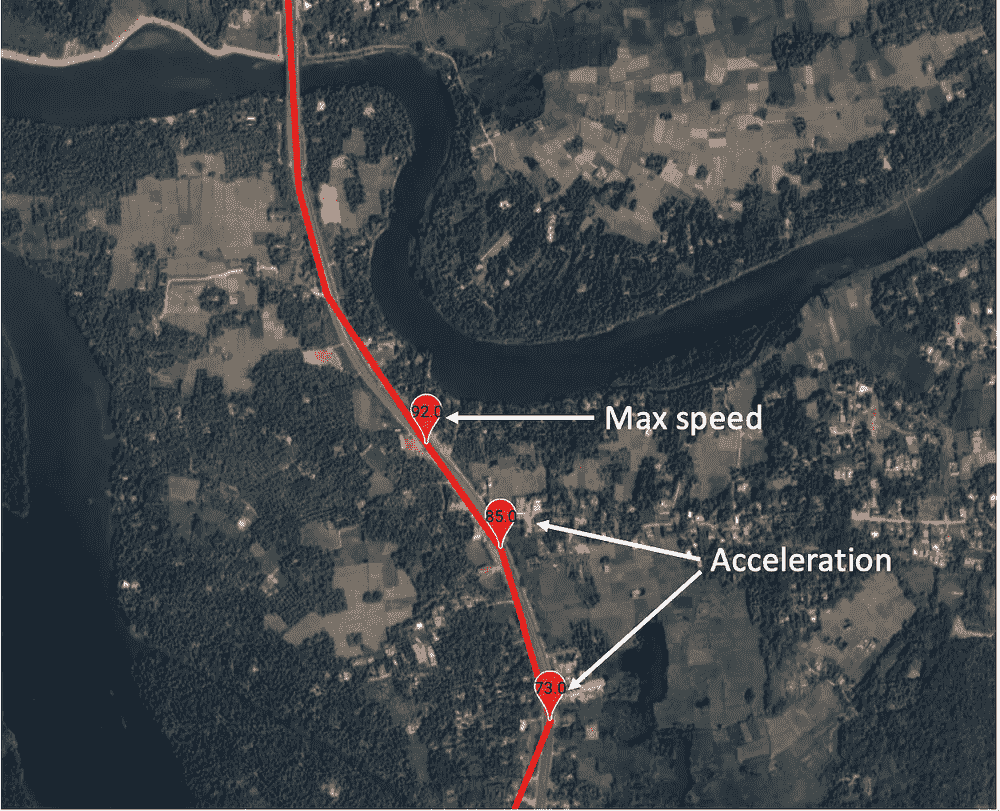

最高速度前的标记(作者使用谷歌地图和 Javascript 制作的图片)

我们可以将这些车速放在一个时间透视图中，并绘制如下图所示的线图。X 轴是时间，Y 轴是车速。这条曲线对应于加速度。我在 14:43:21 开始加速，当时速度是 71，然后在 14:43:49 达到最大速度 92。于是我在 28 秒内把速度提高了 21 公里/小时。

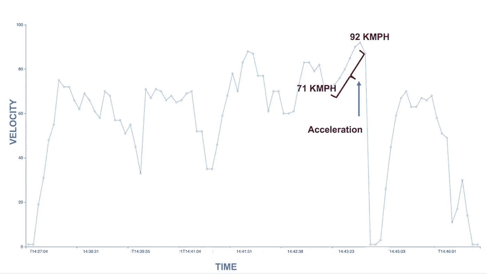

时间与速度(图片由作者提供)

为了看看这个加速度是不是剧烈的加速度，我们需要把它转换成重力，也叫做 g 力，它由于加速度而作用在汽车上。28 秒内 21 公里/小时的速度增加相当于 0.208 米/秒 2 加速度的重力。下图显示了重力与加速度水平之间的映射。

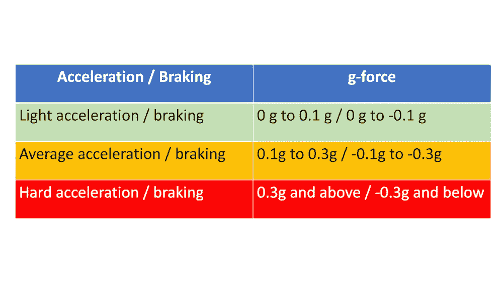

加速度或制动映射到重力(重力)(图片由作者提供)

0.28 的重力被认为是安全的，不是硬加速。所以，我们可以给硬加速一个绿色勾号。

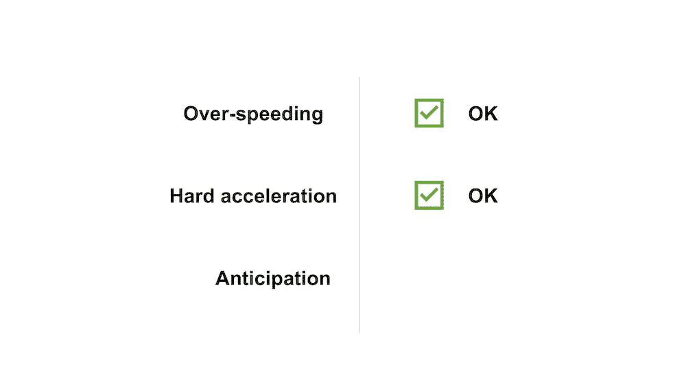

急加速的驾驶行为没问题(图片由作者提供)

# **期待**

驾驶中的预判意味着阅读你的周围环境，并通过睁大你的眼睛和耳朵来保持警觉。这意味着提前做好计划，并准备采取必要的行动。为了预测和计划他人的行动，你应该不断地检查你周围正在发生的事情。

现在让我们检查一下我的预测技能。为了看我的预判技能，可以分析一下我加速后做了什么。看下面显示的曲线，我们可以观察到速度突然降低。

可视化减速(图片由作者提供)

从时速 92 公里，我在 24 秒内减速到 1 KMPH。这相当于-0.3 的重力，相当于紧急制动。原因可能是什么？

让我来揭示这个秘密，因为我确切地知道在我开车时发生了什么。如果我们观察最大速度点之后的路线，我们会看到一座被称为 Heroor 桥的河桥。这座桥降低了速度限制，这就是我不得不减速的原因。

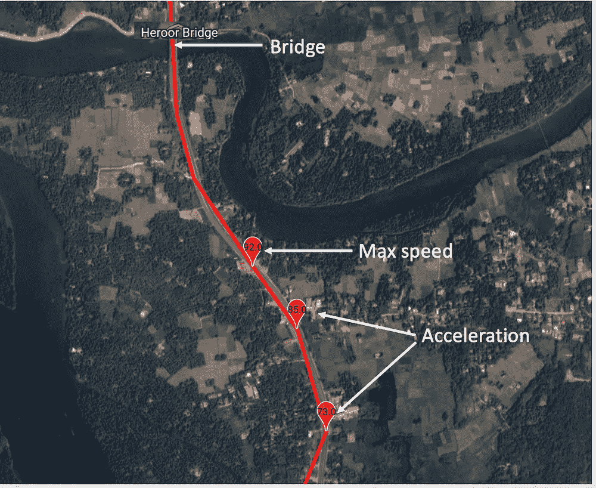

可视化减速(作者使用谷歌地图和 Javascript 制作的图片)

从 92 KMPH 的高速降低到 1 KMPH 的极低速度是我没有预料到的明显迹象。所以让我们为期待而欢呼吧！

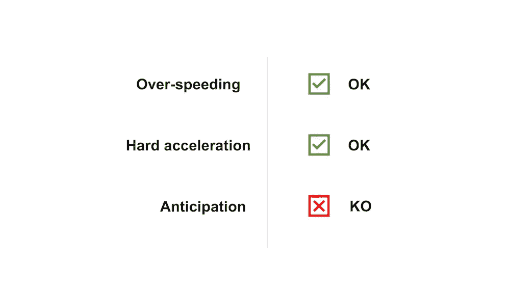

预期驾驶行为不正常(图片由作者提供)

# **驾驶行为影响车辆健康**

现在让我们看看驾驶行为是否会影响车辆？。远程信息处理设备收集与车辆发出的任何警报相关的数据。零表示没有问题，而 1 表示车辆有问题。

还有 50 多个传感器值，如车速、加速度、氧气、油门、气温等等。

我们可以使用机器学习决策树来找到传感器值和警报之间的任何关系。这将有助于我们了解哪些因素会影响车辆健康。

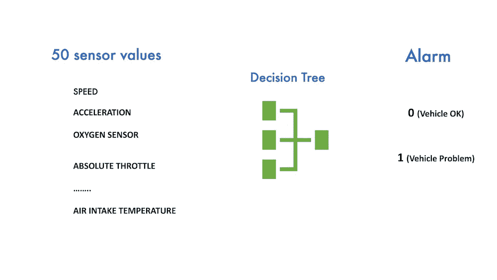

使用决策树查找传感器值和警报之间的关系(图片由作者提供)

下图是一个决策树，将不同的传感器作为决策节点，将报警作为输出节点。您可以看到，导致车辆报警的主要因素是电池、加速度和速度。

因此，不良驾驶行为不仅会影响驾驶员的安全，还会影响车辆的健康。

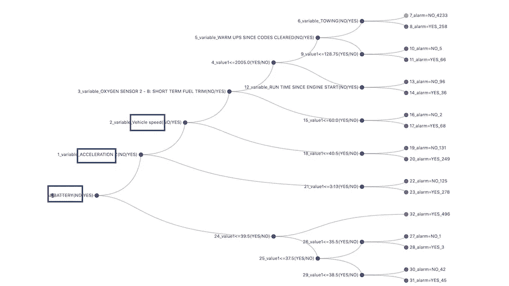

影响车辆健康的主要因素(图片由作者提供)

# **结论**

这里有一些有趣的结论

*   使用远程信息处理设备收集数据是数据驱动驾驶行为分析的关键
*   分析超速要求您将车速数据与限速数据相结合
*   硬加速和预期可以使用时间序列函数来计算。但是，需要从路径分析的角度来看待它们
*   不良驾驶行为对驾驶员和车辆都不安全

如果你喜欢我通过数据和使用数据科学技术分析我自己的驾驶行为的迷你项目，请**用我的推荐链接加入 Medium** 。

<https://pranay-dave9.medium.com/membership>  

请**订阅**每当我发布一个新的故事时，请随时关注。

<https://pranay-dave9.medium.com/subscribe>  

# 额外资源

# 网站(全球资讯网的主机站)

你可以访问我的网站进行零编码分析。[**https://experiencedatascience.com**](https://experiencedatascience.com/)

***在网站上，您还可以参加即将举行的虚拟研讨会，体验有趣和创新的数据科学和人工智能。***

# Youtube 频道

这是我的 YouTube 频道
[https://www.youtube.com/c/DataScienceDemonstrated](https://www.youtube.com/c/DataScienceDemonstrated)的链接