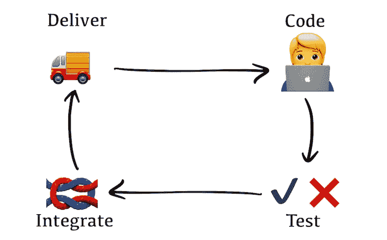
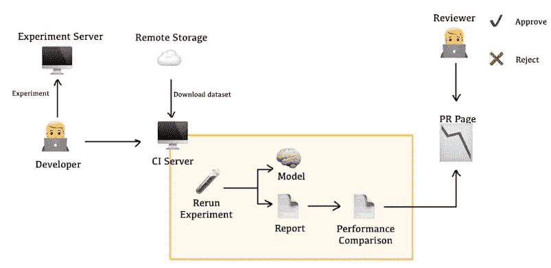
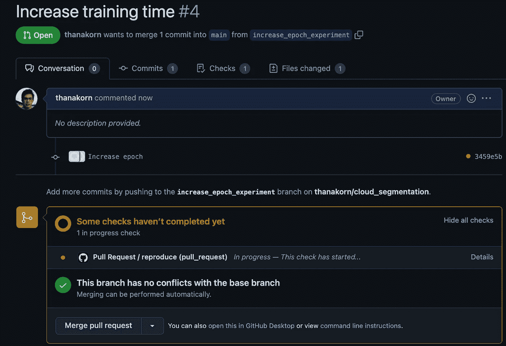
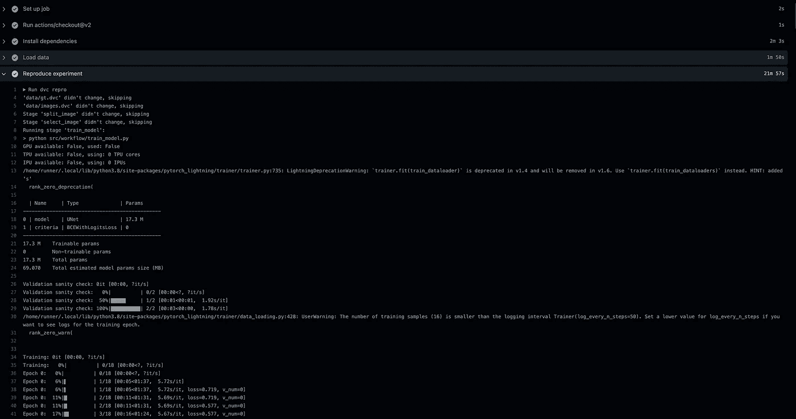
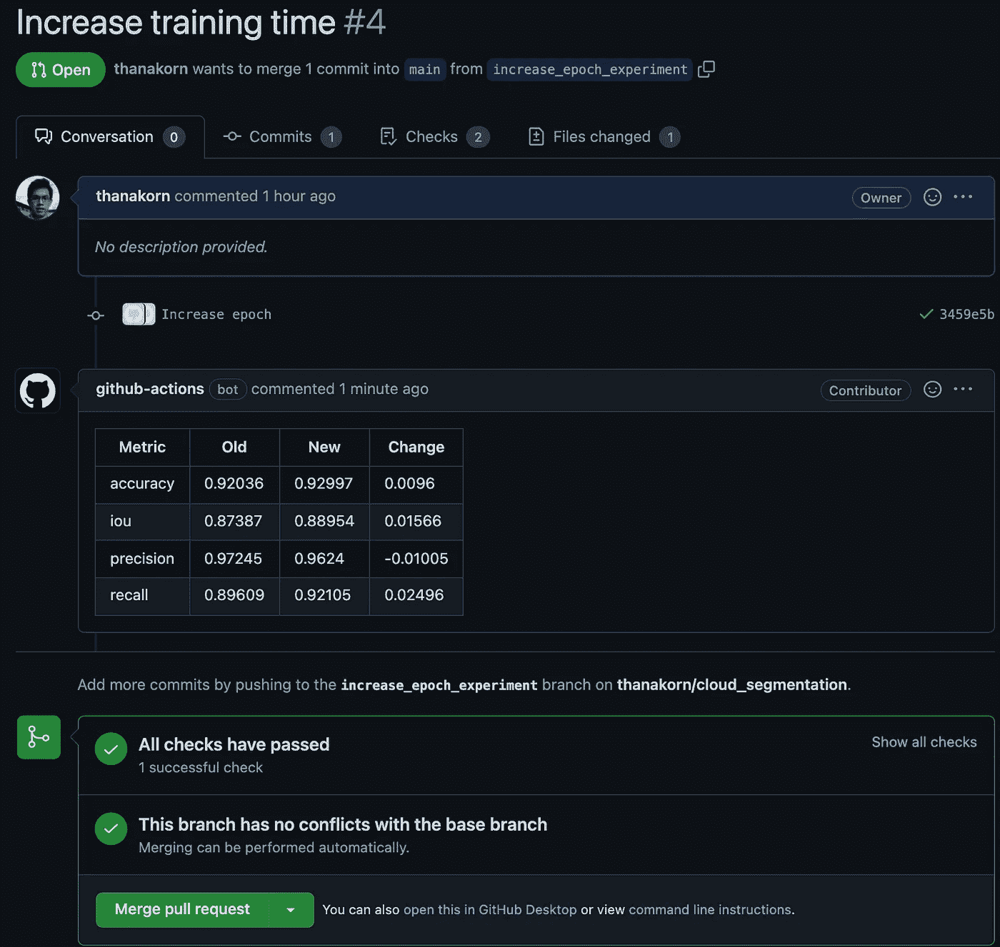

# 我如何将持续集成应用到机器学习项目中

> 原文：<https://towardsdatascience.com/how-i-apply-continuous-integration-to-machine-learning-projects-8273274a565a>

# 我如何将持续集成应用到机器学习项目中

## CI 在软件项目中非常有用，也可以为 ML 项目带来好处。

# 介绍

持续集成(CI)已经被证明是软件开发中的一个极好的实践。然而，当涉及到机器学习(ML)项目时，由于工作的不同性质，CI 并没有被应用(甚至没有被提及)太多。

从我的经验来看，CI 在软件项目中非常有用，我确信它也能给 ML 项目带来好处。因此，我尝试使用开源工具为一个 ML 项目构建一个简单的 CI 工作流。在这篇文章中，我将分享它的样子以及我是如何做到的。

# 什么是持续集成？

持续集成和交付(CI/CD)是一种软件开发实践，在这种实践中，在相同代码基础上工作的软件开发人员将代码集成到主分支，并定期交付他们的产品，以便对系统所做的更改更易于管理。CI/CD 已经成为软件产品开发的核心，因为如果处理得当，它可以确保软件质量并以可持续的方式提高生产率。此外，CI/CD 与敏捷方法学也相处得很好，这使得它在软件行业中更受欢迎。

CI/CD 的工作流程从开发人员在他的本地环境中修改代码开始，直到它满足验收标准。然后，他必须通过运行测试来确保他所做的更改不会破坏现有的功能。一旦通过，开发者将把新代码提交给 CI/CD 服务器，CI/CD 服务器将在中立环境下再次运行测试，以确保可再现性。如果一切正常，新代码将被合并到主分支，这样新版本就可供参与同一项目的其他人使用，并在需要时交付。



简单的持续集成工作流(图片由作者提供)。

# 机器学习项目中的 CI/CD 挑战

机器学习的采用在过去几年中增长迅速。通常，这是通过将 ML 模型嵌入到作为系统一部分的应用程序或数据管道中来实现的。这一趋势给 CI/CD 带来了新的挑战，因为与传统软件不同，ML 应用程序不仅会受到代码变化的影响，还会受到模型训练所依据的数据的影响。

另一个关键挑战是质量控制。在软件项目中，单元/集成/回归测试确保集成和交付变更是否安全。如果所有的测试都通过了，它就通过了，否则就没有通过。由于几个原因，这不适合 ML 模型。首先，输入和输出之间的映射可以是动态的，因为某些类型的 ML 模型具有不确定的行为。第二，ML 模型的输入可以是极其复杂的格式，例如高维向量或图像。像开发人员编写测试时通常所做的那样生成输入将是非常低效和令人疲惫的(如果可能的话)。

# 为 ML 项目构建 CI 工作流

## 先决条件

上一节提到了两个必须解决的关键挑战。对于数据版本控制，有一些开源工具可以用来解决这个现成的问题。我选择的这个叫做[数据版本控制](https://dvc.org/) (DVC)，主要是因为它的功能可以通过命令行界面获得，不需要任何代码。另外，DVC 被设计成可以直观地与 Git 一起工作，并且还提供了其他一些不错的特性，比如 ML pipeline。

质量控制更加棘手，因为它不再是一个通过或失败的问题。两个 ML 模型可以对相同的数据进行预测，问题是哪一个更好(以及好多少)。准确性、损失和 R 分数等性能指标似乎是更合适的标准。

## 开发团队责任

使用评估度量代替测试既解决了问题，同时也产生了问题。一方面，它使标准更加合适。另一方面，正确的度量标准是特定于问题的，只有开发团队能够选择它们。所以不能标准化。

新的职责必须添加到开发团队中，以避免这个问题。由于评估指标将被用作质量关口，ML 管道不仅要生成模型，还要生成性能报告。此外，报告应该遵循一个预定义的约定，这样它就可以跨分支进行比较。例如，它必须是 JSON 格式，位于名为`model`的文件夹下，文件名为`performance.json`，如下所示。

```
{
    "accuracy": 0.9219429016113281,
    "precision": 0.9634803263573233,
    "recall": 0.9050901747682986,
    "iou": 0.8753447772456544
}
```

通过这种方式，团队可以自由地为他们的应用选择正确的度量标准，并通过在他们的 ML 管道中添加一些额外的工作来增加过程的透明度。

## 工作流程

综合所有因素，设计的工作流程如下:

1.  开发人员从 main 分支。
2.  开发人员在本地机器(或远程服务器)上进行更改和运行实验，直到得到想要的结果。
3.  开发人员创建一个针对主要分支机构的 PR。
4.  CI 服务器重新运行实验分支以确保再现性。
5.  CI 服务器将性能指标与主分支进行比较，并报告给 GitHub 上的 PR 页面，以便其他成员可以查看。
6.  如果获得批准，代码将被合并到 main 中。
7.  CI 服务器再次重新运行该实验，但这一次模型被推送到远程存储以供将来部署，并提供性能报告以供比较。



ML 项目的持续集成工作流(图片由作者提供)。

## 履行

工作流是用 GitHub 动作实现的。它包含如下两个关键阶段:

***实验再现***
再现性工作包括检验数据集和运行整个 ML 管道(预处理、训练和评估)。这些是使用两个 DVC 命令完成的:`dvc pull`和`dvc repro`。
`dvc repro`运行 ML 管道并输出训练好的模型和性能报告(在一个简单的项目中，这可能等同于运行`train.py`脚本)这是 GitHub 操作中的样子:

***报告生成***
报告应该显示主分支和实验分支之间的性能比较，以便评审者可以看到变更如何影响模型。DVC 通过`dvc metrics diff`提供了这一功能，在这里您可以将当前变更的指标与任何公共分支进行比较。输出是这样一种人类可读的格式:

使用 GitHub Actions Marketplace 上的 [Create or Update Comment](https://github.com/marketplace/actions/create-or-update-comment) 操作，该输出被保存到一个文件中并在 PR 页面上可见。

如果你感兴趣，完整的 GitHub 动作配置可以在[这里](https://github.com/thanakorn/cloud_segmentation/blob/main/.github/workflows/pr.yml)找到。下图显示了创建请购单时的工作流程:



创建 PR 时，工作流程开始(图片由作者提供)。



CI 服务器重现实验并比较性能(图片由作者提供)。



工作流执行完成时会生成报告(图片由作者提供)。

# 结论

ML 项目就像软件行业中的一种新型动物。将 CI/CD 应用到他们身上代表了与传统软件项目不同的挑战，因此需要不同的方法。本文提出的方法提供了一种将 CI/CD 应用于数据科学的方法。然而，它远非完美，有很大的改进空间。尽管如此，它仍然说明了 CI/CD 对 ML 作品是多么有用。