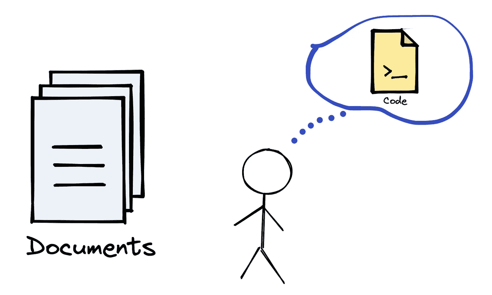
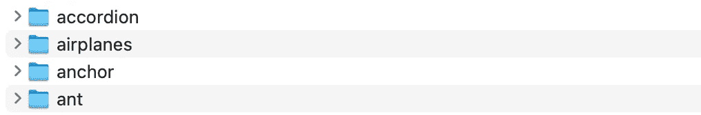
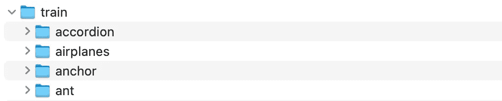
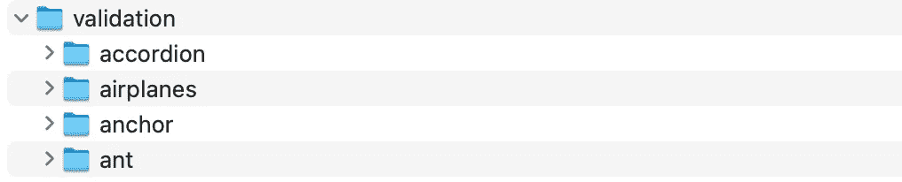

# 我如何用 Python 自动完成一项乏味的任务

> 原文：<https://towardsdatascience.com/how-i-automated-a-tedious-task-with-python-3c48f492575>

## 仅使用内置模块



(图片由作者提供)

Python 让你的生活更轻松。对于各种各样的任务，从构建高度复杂的机器学习管道到组织计算机中的文件，都有一个实用的 Python 解决方案。

所以我愿意称 Python 为“每个人的语言”。

回到 Python 这次是如何帮助我的，我有一个包含不同对象图像的文件夹列表。



(图片由作者提供)

有超过 100 个文件夹，每个文件夹都有不同数量的图像。我需要做的是将每个对象的图像分成训练(75%)和验证(25%)文件夹。

新的结构如下:



(图片由作者提供)



(图片由作者提供)

作为第一步，我创建了培训和验证文件夹。然后，我将所有的子文件夹(如手风琴、飞机等)复制到这两个文件夹中。

# 完成任务的步骤

任务是从训练文件夹中移除 25%的图像，从验证文件夹中移除 75%的图像。重要的是不要删除相同的文件夹，这样训练和验证文件夹中的图像就不同了。

不太友好和繁琐的方法是手动删除这些文件夹中的图像。这是绝对不可能的。我肯定有几种不同的实际方法来完成这项任务，但我们将使用 Python。

我们可以将任务分为以下三个步骤:

*   获取图像的文件路径
*   确定要删除的内容
*   删除它们

让我们从第一步开始。

# 文件路径

我们将使用 Python 的 [os](https://docs.python.org/3/library/os.html) 模块来处理与路径相关的任务。listdir 函数返回给定路径下文件夹中所有文件的列表。我们提供 train 文件夹的路径，并获得其中所有子文件夹的列表。

```
import os
train_base_path = "Data/train/"
train_object_list = os.listdir(train_base_path)print(train_object_list[:5]) # check the first 5
**# output**
['gerenuk', 'hawksbill', 'headphone', 'ant', 'butterfly']
```

为了访问这些子文件夹中的图像，我们需要创建每个子文件夹的路径，这可以使用 join 方法来完成。让我们为训练对象列表中的第一个文件夹执行此操作。

```
folder_path = os.path.join(train_base_path, train_object_list[0])print(folder_path)
**# output**
Data/train/gerenuk
```

下一步是访问该文件夹中的图像，这可以使用 listdir 函数来完成。

```
image_list = os.listdir(folder_path)
```

# 确定要删除的图像

上一步中创建的图像列表包含指定文件夹中所有图像的名称。

```
image_list[:5]**# output**
['image_0019.jpg',
 'image_0025.jpg',
 'image_0024.jpg',
 'image_0018.jpg',
 'image_0020.jpg']
```

下一步是确定将从训练和验证文件夹中删除哪些图像。根据文件名的不同，有不同的方法来处理这个步骤。

在我们的例子中，所有的图像文件都用一个从 0001 开始的 4 位数来命名，但是它们没有被排序。我们可以通过以下步骤完成这项任务:

*   用 Python 的 len 函数求图片数。

```
# find the number of images
number_of_images = len(image_list)
```

*   通过将图像总数乘以 0.75 并将其转换为整数，计算要在训练文件夹中使用的图像数。我们可以使用 int 函数，但它会截断浮点数(即 24.8 到 24)。如果要对浮点数进行四舍五入(即 24.8 到 25)，可以使用数学库中的 ceil 函数。

```
# number of images in train
number_of_images_train = int(number_of_images * 0.75)# to round up
import math
number_of_images_train = math.ceil(number_of_images * 0.75)
```

*   使用内置排序功能对图像列表中的图像名称进行排序。

```
image_list.sort()
```

*   使用序列中的图像数量确定要从序列文件夹中删除的图像，以对图像列表进行切片。

```
remove_from_train = image_list[number_of_images_train:]
```

如果序列中的图像数量为 20，则“从序列中移除”列表包含图像列表中前 20 个项目之后的项目。因此，前 20 个项目将在 train 文件夹中。我们也可以使用这个值从验证文件夹中删除图像。

# 从训练和验证文件夹中删除图像

我们已确定要从训练和验证文件夹中删除的图像。为了移除它们，我们需要首先构建到图像的路径。然后，可以使用操作系统模块的删除功能删除该映像。

对于 remove from train 列表中的每个图像名称，可以按如下方式创建图像的文件路径:

```
for image in remove_from_train:

            file_path_to_remove = os.path.join( train_base_path, 
                train_object_list[0], 
                image )
```

以下是图像文件路径示例:

```
'Data/train/metronome/image_0024.jpg'
```

最后一步是删除该路径下的图像:

```
os.remove(file_path_to_remove)
```

# 把它放在一起

所有这些步骤都将针对训练和验证文件夹中的每个子文件夹进行。因此，我们需要将它们放入一个循环中。

```
train_base_path = "Data/train/"
validation_base_path = "Data/validation/"train_object_list = os.listdir(train_base_path)for subfolder in train_object_list:

    if subfolder != ".DS_Store": print(subfolder)
        subfolder_path = os.path.join(train_base_path, subfolder) image_list = os.listdir(subfolder_path)
        image_list.sort() number_of_images = len(image_list)
        number_of_images_train = int(number_of_images * 0.75) remove_from_train = image_list[number_of_images_train:]
        remove_from_validation = image_list[:number_of_images_train]

        # remove from train
        for image in remove_from_train:

            file_path_to_remove = os.path.join(
                train_base_path, 
                subfolder, 
                image
            )
            os.remove(file_path_to_remove)

        # remove from validation
        for image in remove_from_validation:

            file_path_to_remove = os.path.join(
                validation_base_path, 
                subfolder, 
                image
            )
            os.remove(file_path_to_remove)
```

我把 if 条件换成一个看不见的文件夹名”。DS_Store”。即使我检查了隐藏文件，我也找不到它。如果你知道如何解决这种情况，请告诉我。

让我们检查前 5 个对象的训练和验证文件夹中的图像数量:

```
for subfolder in train_object_list[:5]:

    subfolder_path_train = os.path.join(train_base_path, subfolder)
    subfolder_path_validation = os.path.join(validation_base_path,
                                             subfolder)

    train_count = len(os.listdir(subfolder_path_train))
    validation_count = len(os.listdir(subfolder_path_validation))

    print(subfolder, train_count, validation_count)**# output**
gerenuk 25 9
hawksbill 75 25
headphone 31 11
ant 31 11
butterfly 68 23
```

看起来我们的脚本已经准确地完成了工作。

Python 在自动化日常任务方面非常有效，比如组织文件和文件夹、发送电子邮件等等。如果您经常做这样的任务，我强烈建议让 Python 为您做这些工作。

*你可以成为* [*媒介会员*](https://sonery.medium.com/membership) *解锁我的全部写作权限，外加其余媒介。如果你已经是了，别忘了订阅*[](https://sonery.medium.com/subscribe)**如果你想在我发表新文章时收到电子邮件。**

*感谢您的阅读。如果您有任何反馈，请告诉我。*