# 我如何建立自己的实时停车可用性预测模型

> 原文：<https://towardsdatascience.com/how-i-built-my-own-real-time-parking-availability-predictive-model-31332e1b7747>

## 使用机器学习帮助我日常生活的简单方法。


斯文·米克在 [Unsplash](https://unsplash.com?utm_source=medium&utm_medium=referral) 上的照片

在这个时代，机器学习(ML)被广泛应用于几乎每个行业，解决一些最复杂的挑战。它用于疾病的医疗诊断、欺诈检测、自动驾驶汽车、面部识别、推荐系统等。在大多数应用中，ML 的使用产生了大规模的影响并使大众受益。

但是，一定要这样吗？我们能在日常生活中保持小规模，以我们自己的方式使用 ML 吗？当然啦！在这篇文章中，我写了一个自己发起的项目，我就是这样做的——使用 ML 来预测我的住宅区的停车位可用性。

*附注:请在此*[*GitHub repo*](https://github.com/zeyalt/ParkWhere)*查看该项目的源代码。*

## 目录

1.  [问题陈述](#20ba)
2.  [数据收集](#76c4)
3.  [特征工程](#b73f)
4.  [探索性数据分析](#4d66)
5.  [建立基线模型](#c259)
6.  [使用 Streamlit 创建网络应用](#1c76)
7.  [包装完毕](#b08c)

# 问题陈述

在我住的公寓楼周围，停车位总是有限的。住在几个相邻公寓楼的居民共用这些房间。更多的时候，我会在晚上回家，在我的街区附近找不到任何停车位。

结果，我不得不把车停在几百米远的地方。如果我一个人的话，这很好，但这让我感到沮丧，尤其是当我要从车上把很重的东西搬到我的公寓时，同时还要管理一个活泼好动的小孩和一个婴儿！

一天，我有了一个想法💡！为什么不自己收集一些数据，并使用 ML 来预测我是否能够找到离我的公寓楼最近的停车位？我心想，如果一个 ML 模型可以帮助我做到这一点，那么也许我可以提前计划我的旅程，以避免这种情况。我甚至可以决定乘坐公共交通工具，根本不开车。

# 数据收集

将我的想法变为现实的第一步当然是开始收集一些数据。在这样做之前，我把我家的所有停车位分成了四个区域:1、2、3 和 4 区。我尽我所能绘制了图 1 中的布局。

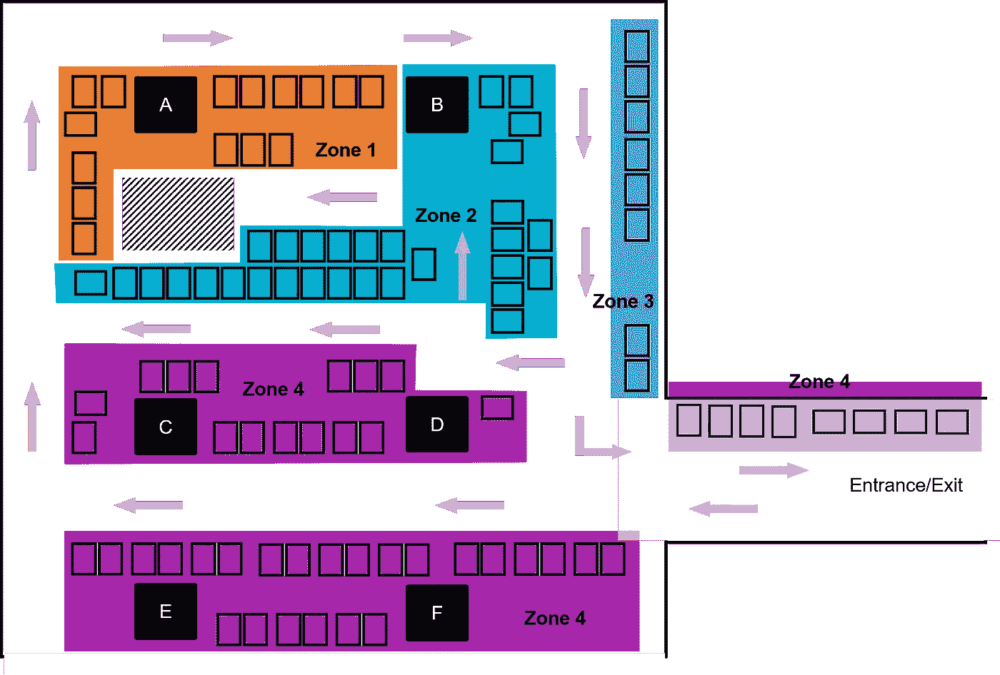

图 1:按区域划分的停车位布局(图片由作者提供)

我住在 A 座，所以 1 区的车位最近，其次是 2 区、3 区、4 区的车位。我妻子和我总是害怕在 4 区停车，因为这意味着要走最远的路才能到达我们的街区。

按区域划分停车位后，我就准备收集数据了！我需要记录的只是:

*   停车的日期和时间；和
*   我找到停车位的地方。

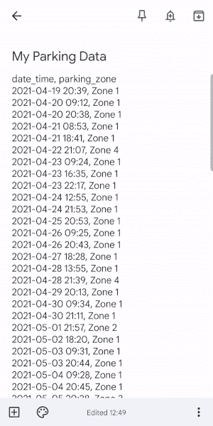

GIF 展示了我如何在智能手机上手动将我的停车数据记录到 Google Keep 应用程序中

我发现记录数据最简单的方法是，我一停好车，就拿出我的智能手机，输入我的谷歌 Keep 应用。我使用了以下格式:

```
YYYY-MM-DD HH:MM, Zone X
```

逗号分隔约定的基本原理是，我可以将 Google Keep on 浏览器中的数据复制并粘贴到记事本中，然后轻松地将其保存为逗号分隔值(CSV)文件(参见图 2)。

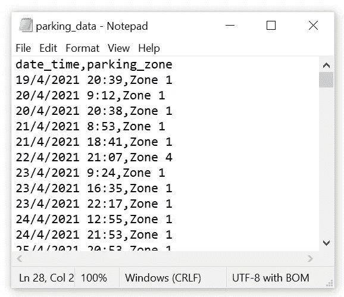

图 2:将我在 Google Keep 上的停车数据以 CSV 文件的形式保存到记事本中(图片由作者提供)

将数据保存为 CSV 文件后，我就可以将它作为熊猫数据帧加载到 Python 中了。

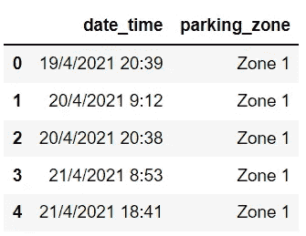

我收集了从 2021 年 4 月 19 日到 2021 年 12 月 20 日总共 8 个月的数据，数据包含 312 行。当然，我收集的数据越多越好，但我认为我可能能够得到一个有 312 行数据的像样的 ML 模型。

# 特征工程

在熊猫数据帧`df`中，我只有两列，`date_time`和`parking_zone`，后者是我们用来训练监督分类模型的目标标签。目标是从`date_time`列中提取不同的特性，比如月、日、小时和分钟。为此，我首先需要使用`pd.to_datetime()`将这个列转换成一个`datetime`列。

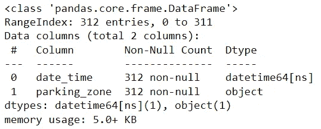

现在，我可以通过使用`.dt`访问器从`date_time`列中提取一些潜在有用的特性。我还将`month`、`day_of_week`和`hour`转换成有序分类变量，这将有助于我随后的探索性数据分析。

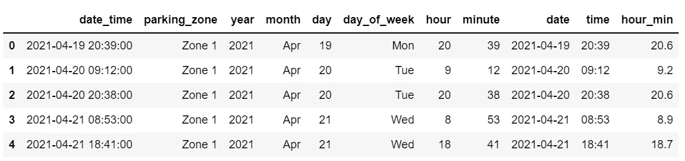

我还想知道停车位的可用性是否会受到某个特定日期是公共假日还是公共假日前夕的影响。例如，如果是在除夕夜，居民是否倾向于待在外面，很晚才回家，从而比平时有更多的停车位？

考虑到这一点，我使用了来自 data.gov.sg 的公共 API 来获取与新加坡公共假期相对应的日期列表。列表中的每个日期都被解析为一个`datetime`对象。为了获得公共假日前夕的解析日期列表，我只需从每个解析的公共假日日期中减去`timedelta(days=1)`。

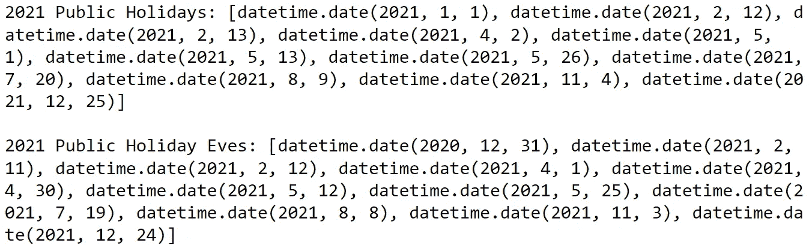

有了这两个列表，我在 DataFrame `df`中创建了另一个特性`ph_eve`。该特征指示`df`中的特定行是否对应于公共假日(值为`ph`)、前夕(值为`eve`)或两者都不对应(值为`nil`)。

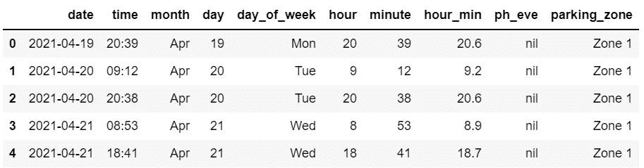

# 探索性数据分析

我从一个单独的`date_time`专栏中创建了总共 9 个不同的特性。然而，并不是所有的方法都有助于预测停车位。我进行了探索性数据分析(EDA ),以帮助我确定哪些特征是停车位可用性的更有用的预测因素。

## 阶级分布

首先，让我们看看停车区的频率分布(见图 3)。不出所料，1 区是最常见的，因为我们总是试图找到一个离我的公寓最近的停车位。这种分布也暗示了一种阶级不平衡，这是在建立和评估一个 ML 模型时需要考虑的。

图 3:停车区的频率分布(图片由作者提供)

## 一天中的某个时刻

接下来，让我们按停车区查看一天中不同时间的停车时段的百分比(见图 4)。我回家越晚，就越不可能在 1 区找到停车位。这是常识，但是很高兴知道我收集的数据证实了这个观察。根据图 4，似乎`hour`也是预测停车可用性的有用特征。

图 4: 100%堆积条形图，显示了停车区停车时段的分布情况(图片由作者提供)

## 星期几

我也问自己，“一周中是否有几天不太可能在 1 区找到停车位？”根据收集的数据，是的！在 1 区获得停车位的概率在周一最高(~83%)，在工作日逐渐下降，在周四最低(~59%)和周日最低(~61%)。因此，`day_of_week`也可以是停车可用性的有用预测值。

图 5: 100%堆积条形图，按停车区显示一周中各天的停车时段分布情况(图片由作者提供)

## 公休日，前夜，还是都不是？

在整个数据收集期间，人们感觉在公共假日更难在 1 区找到停车位。我猜这是因为第二天可能是工作/上学日，居民倾向于呆在家里。公共假日前夕则相反，这意味着居民可能不会早回家，因为第二天是公共假日。

图 6: 100%堆积条形图，显示了公共假日、前夕或平日停车区的停车时段分布情况(图片由作者提供)

图 6 验证了我的直觉！在公共假日前夕，很有可能在 1 区找到一个停车位，而在公共假日不可能找到，这表明`ph_eve`也可能是停车位可用性的一个决定因素。

# 构建基线模型

我也考虑了其他特征，但是`day_of_week`、`hour`和`ph_eve`似乎是更有用的预测因素。我没有使用`hour`，而是使用了`hour_min`，以便考虑到某个小时过去的分钟数。

此外，我把车停在 2 区、3 区还是 4 区对我来说并不重要。它们都意味着我要走比停在 1 区更远的距离。我更关注的是我是否能在 1 区找到停车位。我将区域 2、区域 3 和区域 4 分组为“其他区域”,从而将问题转化为二元分类任务！

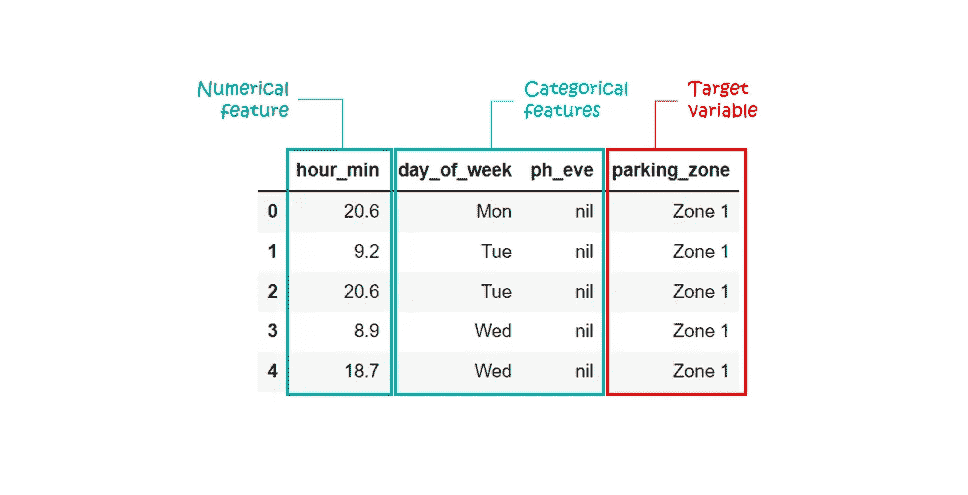

我现在混合了数字和分类特征来训练一个二进制分类模型。在这种异构数据类型的场景中，我们可以使用 scikit-learn 的`ColumnTransformer`,它允许我们对不同数据类型的特性应用不同的预处理和特性提取管道。

有关`ColumnTransformer`的更多信息，请查看下面的 scikit-learn 文档:

<https://scikit-learn.org/stable/auto_examples/compose/plot_column_transformer_mixed_types.html>  

我创建了一个包含`preprocessor`对象和一个分类器的`Pipeline`对象。我选择了`LogisticRegression`作为基线分类器。接下来，我拆分数据集(80%用于训练；20%用于验证)，将训练数据拟合到`Pipeline`对象，并根据验证数据对其进行评估。


验证数据的预测结果也可以使用混淆矩阵进行总结，如图 7 所示。

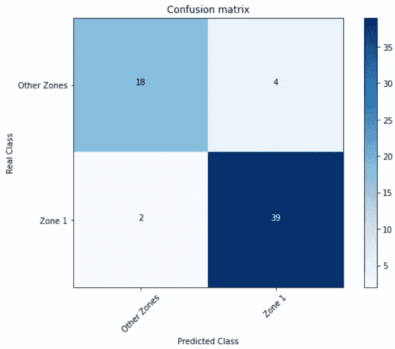

图 7:总结预测结果的混淆矩阵(图片由作者提供)

总的来说，考虑到这只是一个基线模型，验证数据的结果看起来很有希望——准确度为 0.90，精确度为 0.91，召回率为 0.95。我对分类性能很满意，也很高兴使用这个基线模型来生成预测。

# 使用 Streamlit 创建 web 应用程序

如果我没有部署和使用它，培训一个 ML 模型有什么用呢？因此我用[创建了这个叫做**公园**的网络应用。](https://streamlit.io/)

在引擎盖下， **ParkWhere** 使用我训练过的基线模型，预测在给定的日期和时间内，我是否会在 1 区找到停车位。

一旦 web 应用程序启动，它会立即向我提供启动应用程序时的预测。从用户体验的角度来看，这非常方便，因为默认情况下，我只需启动应用程序，无需输入任何内容。

当然，如果我想预测不同时间的停车位，我仍然可以输入任何日期和时间。请随意查看 **ParkWhere** [这里](https://share.streamlit.io/zeyalt/parkwhere/app.py)！

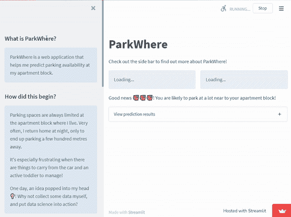

展示 ParkWhere web 应用程序如何工作的动画 GIF

# 包装它

所以，我有了一个实时停车可用性预测模型！概括地说，在预测找到离我的公寓最近的停车位的可能性时，该模型考虑了一周中的某一天、一天中的某个时间以及是否是公共假日(前夜)。

现在，我可以随时随地从我的移动网络浏览器方便地启动 **ParkWhere** ，并让模型为我生成预测。有了这样的预测洞察力，我可以提前计划我的旅程，以避免在很远的地方停车。如果我只是需要快速处理一些事情，我甚至可以决定乘坐公共交通工具，而不开车。


照片由[诺德伍德主题](https://unsplash.com/@nordwood?utm_source=medium&utm_medium=referral)在 [Unsplash](https://unsplash.com?utm_source=medium&utm_medium=referral) 上拍摄

这是我在日常生活中利用 ML 的简单尝试。问题陈述非常具体地针对我的环境和偏好，因此我构建的解决方案的好处可能并不广泛或适用于大众。

仍有改进的余地。我还需要试验不同的分类器，进行定量特征选择，执行超参数调整以找到更优的模型，进行交叉验证以减轻过度拟合的问题，等等。我甚至可以继续收集更多的数据，偶尔重新训练模型。

> “谁拥有数据，谁就拥有力量”——蒂姆·奥莱利

然而，在这个阶段，我对我所拥有的基线原型很满意。事实上，我很自豪能够从零开始构建和部署一个 ML 解决方案——实际上，是使用我自己收集的数据😄。我相信任何有意愿收集数据和一些 ML 知识的人也可以做类似的事情！

目前就这些。感谢阅读这篇文章！如果你觉得它很有见地，请在评论中告诉我。我也欢迎的讨论、问题和建设性的反馈。欢迎在[媒体](https://zeyalt.medium.com/)上关注我，或者通过 [LinkedIn](https://www.linkedin.com/in/zeyalt/) 或 [Twitter](https://twitter.com/zeyalt_) 联系我。祝您愉快！