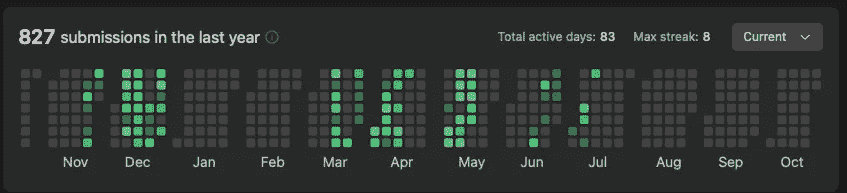

# 我是如何破解元机器学习工程面试的

> 原文：<https://towardsdatascience.com/how-i-cracked-the-meta-machine-learning-engineering-interview-aa32f64b8e4b>

## 编码、设计和行为回合的实用技巧

由 [Pablo Heimplatz](https://unsplash.com/@pabloheimplatz?utm_source=medium&utm_medium=referral) 在 [Unsplash](https://unsplash.com?utm_source=medium&utm_medium=referral) 上拍摄的照片

最近，我得到了 Meta 的一份机器学习工程师(MLE)的工作，相对于我之前的工作，我的总薪酬增加了 20%,并被晋升为高级职位。在这篇文章中，我将概述面试结构，我如何准备，以及如何搞定 MLE 面试的实用技巧。尽管我的经历是在 Meta，但我相信这份指南对其他科技公司的 MLE 面试也是有用的。祝你好运！

## 面试结构

实际上，我没有亲自申请，而是一名招聘人员通过 LinkedIn 联系了我。这是一个很好的提醒，让你的 LinkedIn 个人资料保持润色和更新。我做了一个电话屏幕和一个虚拟现场:

*   手机屏幕持续了一个小时，包括两个编码问题。
*   虚拟现场活动持续了 2 天。第一天包括一次编码面试、一次行为面试和两轮设计:系统设计和 ML 系统设计。第二天最初包括一轮编码和一轮行为，但是后者在最后一分钟被取消了，所以我在第二天只做了一轮编码。

## 编码面试

我一共做了 3 次编码，一次在电话屏幕上，两次在现场。每轮编码有 2 个 Leetcode 中等问题，我需要在大约 1 小时内解决，总共有 6 个编码问题。典型地，一次面试有一个非常普通的问题(在 Leetcode 脸书标记的 10 大问题中)和一个更加模糊的问题(在前 300 名中)。

我在 Leetcode 上研究了过去 6 个月中最常见的脸书标记问题(这一功能是购买 Leetcode Premium 的一个很好的理由)。我关注的不是数量，而是质量:我试图真正理解解决最常见问题的不同方法，以及为什么不同的方法有效，为什么我的第一次尝试没有成功。总的来说，我练习了 137 / 350 个 Leetcode 问题。

👉一些提示:

*   **清晰地传达你的思维过程**。在准备过程中，通过在解决问题时自言自语来练习。推动对话。让面试官尽可能轻松。大纲不应该再令人惊讶了:(1)用几个测试用例来确认你对问题的理解是正确的，(2)在高层次上描述算法和复杂性，(3)实现，以及(4)测试。
*   **找到自己的 bug。如果你的代码有 bug，只要你自己能够发现它们，这是没问题的。完成代码后，总是用测试用例一行一行地手工运行算法。在我的面试问题中，至少有两个我发现了代码中的错误，但是没有时间去修复它们了。那很好。**
*   **偏爱速度。**如果在(2)中，你可以选择实现一个次优解决方案或者头脑风暴一个更优的解决方案，我会偏向于速度，先写下次优解决方案。拥有一个不是最优的完整解决方案比没有解决方案要好的多。至少在一个问题中，我知道(并且交流过)我的解决方案不是最优的，这是可以的。
*   **边学习边记笔记。在准备过程中，我发现在一个简单的减价文件中做笔记很有用。我创建了自己的“课程”,包含最重要的问题和解决方案描述，并随着时间的推移进行编辑和完善。这帮助我把所有重要的问题都集中在一个地方。**
*   **购买 Leetcode Premium** 。能够看到你面试的公司最常被问到的问题是非常有用的。

## 设计面试

有 2 轮设计，系统设计和 ML 系统设计。系统设计面试是关于如何用分布式系统解决一个问题，ML 设计面试是关于如何用 ML 解决一个问题，比如如何建立一个分类系统或者推荐系统。以下是我推荐的准备材料:

*   教育性的'[摸索系统设计面试](https://www.educative.io/courses/grokking-the-system-design-interview)'。虽然总体来说非常有用，但这门课程也是一个大杂烩:一些课程质量很高，另一些则不太好(可能是因为不同的课程由不同的作者编写)。我更多地关注于学习基础组件，比如 REST API、负载平衡、通信模型等，而不是记忆特定系统的设计。
*   教育性的'[摸索机器学习面试](https://www.educative.io/courses/grokking-the-machine-learning-interview)'。本课程也是一个大杂烩，有些课程很精彩，有些则不太精彩，但总体来说，它是一个很好的 ML 系统设计入门课程。
*   Alex Xu 的系统设计 YouTube 频道， [ByteByteGo](https://www.youtube.com/c/ByteByteGo) 。
*   Chip Huyen 的“[设计机器学习系统](https://www.oreilly.com/library/view/designing-machine-learning/9781098107956/)”一书。如果你不想买这本书，可以看看她的[网站](https://huyenchip.com/machine-learning-systems-design/toc.html)，里面有很多和这本书相同的内容。
*   我自己的电子书，“地面上的机器学习:现实世界的 ML 应用的设计和操作”，可以在 [Gumroad](https://samflender.gumroad.com/l/mlontheground) 上找到。这本书是我在过去几年里写的关于 ML 设计和操作的文章的集合，聚合成一个 50 页的 pdf。
*   研究论文:我经常参考的一个很好的资源是尤金·严的[策划论文列表](https://applyingml.com/papers/)。特别是，这里有几篇我认为颇有见地的论文:

[亚马逊搜索:产品排名的喜悦](https://assets.amazon.science/89/cd/34289f1f4d25b5857d776bdf04d5/amazon-search-the-joy-of-ranking-products.pdf)
[LinkedIn 搜索系统的深度自然语言处理](https://arxiv.org/pdf/2108.08252.pdf) [脸书搜索中基于嵌入的检索](https://arxiv.org/pdf/2006.11632.pdf) [推荐系统的深度学习:网飞案例研究](https://ojs.aaai.org/index.php/aimagazine/article/view/18140) [广&推荐系统的深度学习](http://Wide & Deep Learning for Recommender Systems) [YouTube 推荐的深度神经网络](https://static.googleusercontent.com/media/research.google.com/en//pubs/archive/45530.pdf) [神经协同过滤](https://arxiv.org/abs/1708.05031)

👉一些提示:

*   **推动对话**。如果你等着面试官来主导谈话，这只会显示出你缺乏主动性，而你总是想表现出相反的一面:你是被驱动的，是主动的。你应该大部分时间都在说话。两轮设计的大致轮廓如下:(1)阐明问题，(2)提出高层次的设计，(3)画出设计(总是方框和箭头)，(4)放大设计的某些部分。
*   **练习画画**。面试前练习在 [Excalidraw](https://excalidraw.com) 上画几张设计图。这会让面试变得简单一点:如果你能省下几秒钟去弄清楚如何画一个圈，那你就能多花几秒钟来进行头脑风暴。
*   学习的时候记笔记。在准备过程中，总是记下你所学到的东西。不要只是复制粘贴，用你自己的话来写东西，以此来探索你的理解。

## 行为面试

我在虚拟现场进行了一轮行为测试，持续了 1 个小时。以下是我准备的问题:

*   你最引以为豪的项目是什么？
*   你如何处理与同事的冲突/分歧？
*   告诉我你采取主动的一次经历。
*   告诉我你开始跨团队协作的一次经历。
*   告诉我你有竞争优先权的时候。
*   告诉我一个业务需求发生变化而你不得不适应的时候。
*   告诉我你接受经理反馈的一次经历。
*   告诉我你解决的问题不明确的时候。

👉一些提示:

*   **跟随明星法:****S**ituation/**T**问:有什么问题，**A**action:你采取了什么主动？你的推理是什么？你是怎么说服别人的？， **R** 结果:例如，“我将业务指标 X 提高了 Y%”，“我解决了影响 N 个客户的 bug”等等。
*   **回答**前花点时间想一想。没关系。你不是机器。
*   重复使用。可以在多个问题中使用相同的情况，并强调情况的不同方面。
*   **合理内夸大**。夸大是可以的，只要你的故事有一点真实性(否则你将无法回答试探性的问题)。重点不在于获得真实发生的历史记录，而是面试官想知道你的个人价值观是什么。
*   **写**。通过写下来准备你的故事。面试时把它们放在你面前作为提醒也是可以的(只是不要在屏幕上读它们)。

我的 Leetcode 提交的可视化。(图片由作者提供)

## 最后的想法

我对 Meta 面试过程的总体印象是，很公平。我从一开始就被清楚地告知要准备什么，要期待什么。这种经历非常像在学校准备考试。要明确的是，这是一个很大的材料来涵盖。我个人光是 Leetcode 就花了几个月的时间，你可以在上面的截图中看到。

话虽如此，科技面试也包含了运气的重要成分。有可能在同样的准备下，我会因为不同的面试官和问题而失败，就像神经网络用不同的随机种子达到不同的潜在最小值一样。这就是为什么我一般会建议同时面试不止一家，而是几家公司，这取决于你有多少空闲时间。

最后，如果我想让你从面试中学到一件事，那就是:**从你开始打电话的那一刻起，就要有动力，表现出主动性。不要等着面试官指示你下一步该做什么，而是自己来引导对话。比方说“*”接下来，我将放大标签是如何生成的。可以吗*？”，而不是“*下一步该怎么办？*”。作为一个组织中的个人贡献者，你应该主动解决问题，而面试环境，尤其是设计阶段，是你展示这种主动性的绝佳机会。**

## 让我们保持联系…

*确保点击“* ***关注*** *”和“* ***订阅*** *”按钮，这样你就不会错过网上一些最好的 ML 内容。* [*成为中等会员*](/@samuel.flender/membership) *，如果你还没有，那么你可以无限阅读文章。请务必在*[*LinkedIn*](https://www.linkedin.com/in/sflender/)*和/或*[*Twitter*](https://twitter.com/samflender)*上关注我！*