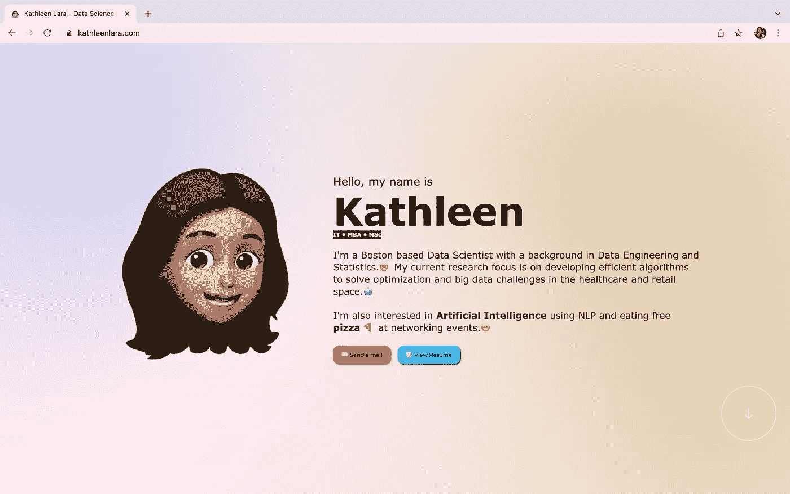
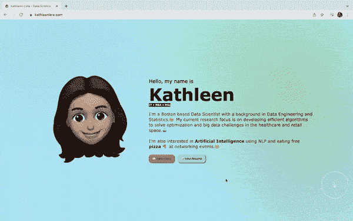
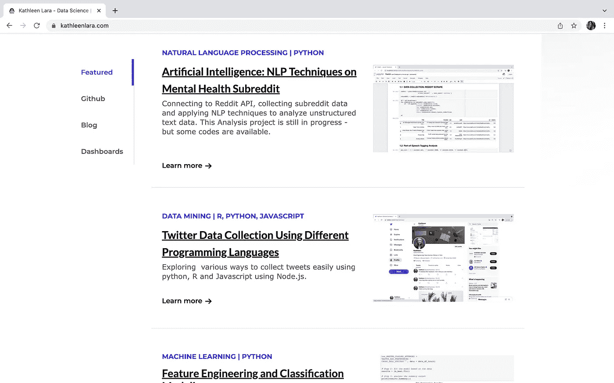
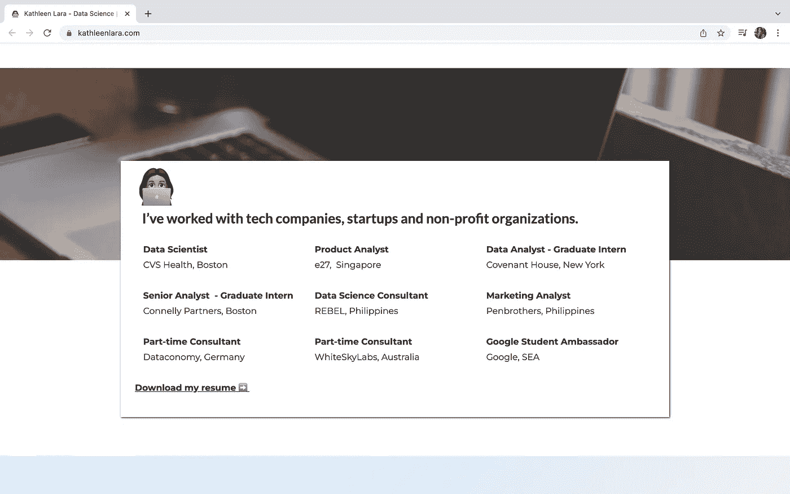
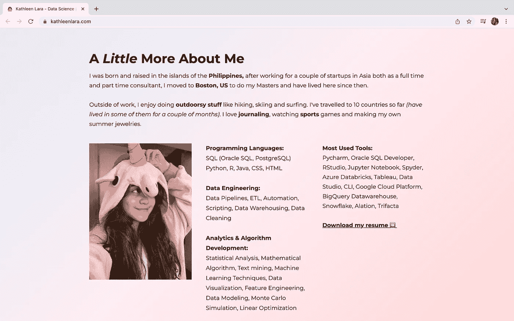
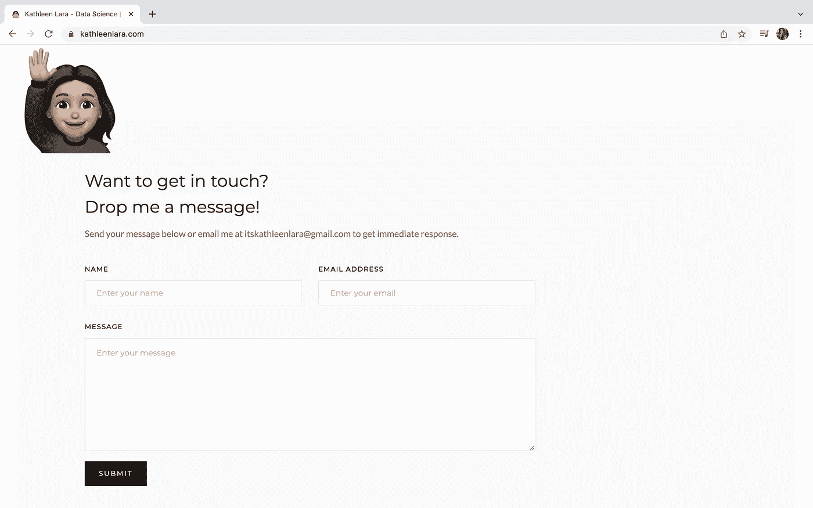

# 我如何设计我的数据科学产品组合

> 原文：<https://towardsdatascience.com/how-i-designed-my-data-science-portfolio-f05f51ebfd9b>

(*图片作者*)

有一个好的作品集对于突出你的作品和你讲述故事的能力是很重要的。精心挑选你的项目是展示你的专业知识和分享你的经验的最好方式。

我个人在整合我的项目和找出分享我的激情的最佳方式方面遇到了挑战。数据科学和工程项目通常很模糊，很难表达，在我的例子中，有两种味道，代码和内容。我把我的源代码放在我的 github 页面上，把我的文章放在我的媒体上或网上的某个地方。

所以我建立了一个个人的五部分投资组合。以下是我对每个部分的思考过程:

# **简介部分:**

kathleenlara.com:简介部分

我设计了这个部分，想象我正在给某人一个关于我是谁和我做什么的电梯推销。我添加了 gif 作为我自己的表现，并给人一种互动的感觉。*(我想我可以加一张我自己的 gif，但是现在，我的自信还没有达到！)*

至于背景，最初是白色的。我通常在几乎所有的视觉效果中使用最少的白色，因为这种颜色看起来很安全。但是，我不能总是习惯的动物，所以我决定冒险，用柔和的渐变。

快速介绍之后，访问者下一步会做三件事。类似于现实世界中给你的选择——当你遇到某人时，你要么主动给他们你的联系方式或代表**发送邮件**按钮的名片(*我知道我说这很主动，但无论如何给我发一封也完全没问题，我喜欢阅读电子邮件！*)，你可以直接进入主题，通过查看**简历**来挖掘更多细节，或者继续进行“了解对方”的对话，通过向下滚动更多文件夹来了解对方。

# **项目部:**

kathleenlara.com:项目部分

在关于我自己和我的兴趣的小型电梯推销之后，我设计了这个部分来分享更多关于我所做的事情。在这个部分中，我对我的项目进行了分类。第一个是特色类别，这是我选择和展示我最喜欢的作品。其他类别与编码、我写的文章和我的数据可视化有关。

*免责声明:我参与的大部分项目都是保密的，不打算共享，这也解释了为什么我现在只列出了有限的项目*****。*** *我目前正在努力找时间做更多的个人研究工作。*

我加入了紫色标签，以便快速了解项目的内容。我还在底部添加了“了解更多”链接，如果你注意到了，点击这些链接会打开一个新标签。我对这个外部选项卡非常挑剔，因为我希望查看者将投资组合放在另一个选项卡中，这样他们可以在了解特定项目后轻松切换回我的页面，并进一步探索投资组合。

# **我合作过的公司:**

kathleenlara.com:我合作过的公司版块

我用一行总结了我合作过的公司类型的话开始了这一部分。我的目标是突出我以前的角色，并引导浏览者下载我的简历。我不想让信息淹没他们，这就是我跳过 JD 要点的原因。

# **再介绍一下我:**

kathleenlara.com:关于我

你可能想知道——为什么把这个放在底部，而不是在最开始强调更多关于我自己的信息？在现实生活中，我注意到人们在社交活动中交流和互动的模式。*(我应该在这里放一些华而不实的行为统计，但是我没有，所以是的，这是基于我的个人经验*😀*)。首先，你询问工作，他们做什么，然后经过一点交谈交流，最终你会变得更加个人化，这就是为什么我把这部分放在底部。*

那么，我是如何决定分享哪些私人物品的呢？这实际上是最难写的部分之一，因为我不习惯分享关于我的事情，我觉得我在工作之外所做的活动并不都是独一无二的。我包括了人们会问的最基本的问题，包括我在哪里工作，我的爱好是什么。我还添加了一张厚脸皮的照片，与其他部分相比可能有点不专业，但它给了页面更多的个性*(我也想展示我有趣的一面)*。

我写下了我的技能和我最常用的工具，让我对自己的日常工作有一个大致的了解。这也是一个挑战，因为我不想表现得像一个什么都懂的人，从数据工程到全面的数据分析，但我认为这些是一个强大的数据科学家应该拥有的一些技能和工具，以提高工作效率和生产力——一个人必须知道如何认真对待和处理数据。我也是一个进步中的人，但我总是试图学习新的东西。

# **取得联系部分:**

kathleenlara.com:保持联系

有两种方法可以联系我，要么复制我的电子邮件地址，要么填写表格。是的，我公开的电子邮件只针对我的公共账户(我有不同的电子邮件地址给更多的私人账户)。

# **投资组合改进:**

我不太擅长网页开发，我希望我有更多的时间来研究如何真正提高我的作品集——但是网页设计不是我的专长，我的主要目标只是展示我的作品。我开始使用 [**webflow**](https://webflow.grsm.io/rp5ql946twqd) 来节省开发时间，我只是添加了自己的 css 和 javascript 代码块来实现额外的功能。Webflow 也让我更容易让网站设备做出响应。它有一些相关的成本，并且需要一点 UI / UX 开发知识，但是还有其他选项，比如 SquareSpace 或 Wix，对于没有编码或开发经验的用户来说可能更友好。

总的来说，我花了一个周末的时间来建立网站，内容和草图都已经准备好了。我还没有优化我的投资组合的单个元素，以提高加载速度，特别是在移动设备上。我仍然需要添加更多的项目，或者选择更好的项目来展示——但总体来说，我对目前为止所做的很满意。

建立投资组合的方式没有对错之分，一条建议是开始思考你想如何讲述你的故事，然后从那里开始创建一个框架。

快乐观影:[https://www.kathleenlara.com/](https://www.kathleenlara.com/)

在推特上关注我:[https://twitter.com/itskathleenlara](https://twitter.com/itskathleenlara)

我用来创建投资组合的工具:[https://webflow.grsm.io/rp5ql946twqd](https://webflow.grsm.io/rp5ql946twqd)