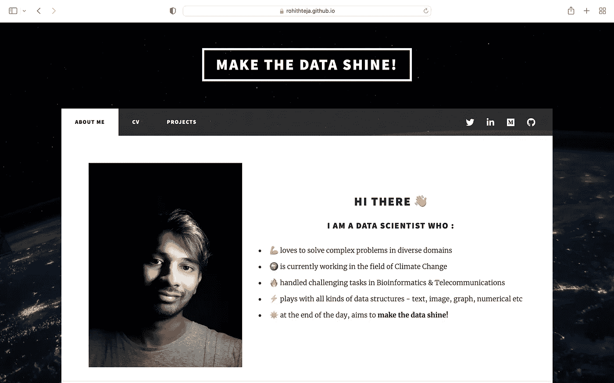
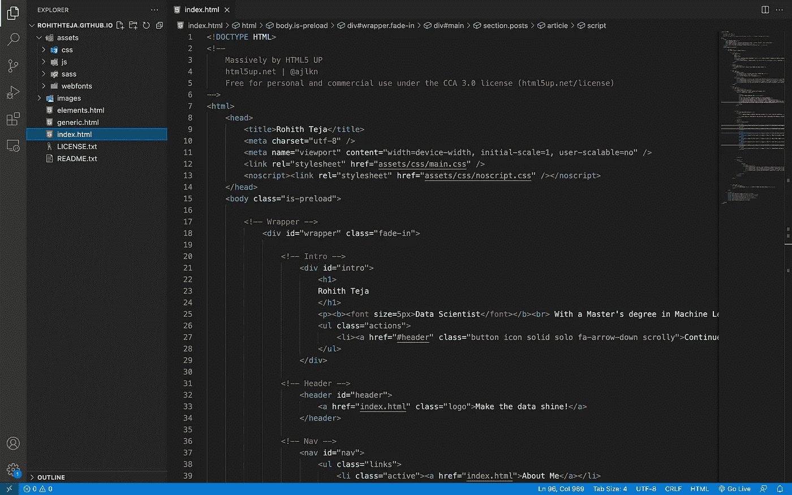
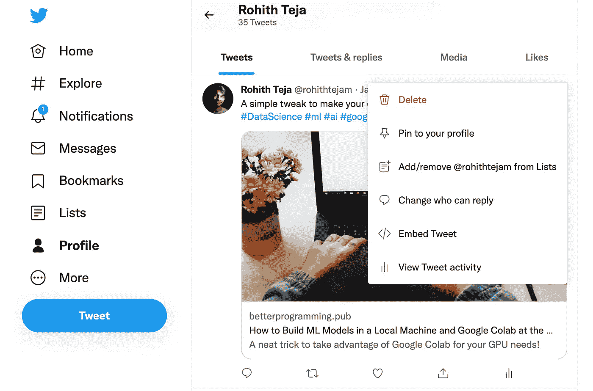

# 我如何设计自己的数据科学组合网站？

> 原文：<https://towardsdatascience.com/how-i-designed-my-own-data-science-portfolio-website-3d146ea6b6cd>

## 用最少的 HTML 编码技巧创建网站的简单说明。



作品集网站(作者照片)

很长一段时间，我想创建自己的作品集网站来展示我的技能和经验。我在 LinkedIn 和 GitHub 等基本应用上做得很好。唯一缺少的是把我所有的职业社交整合到一起的东西——投资组合网站！

看看我给自己做的这个网站——[链接](https://rohithteja.github.io/)。如果你喜欢它的样子，你会喜欢读这篇文章:)

因此，我知道 [GitHub Pages](https://pages.github.com/) 是许多数据科学家创建和托管其投资组合的首选网站。我总是避免它，认为我必须学习 HTML-CSS，我不太热衷于投入这方面的努力。最后，我有了一些空闲时间，浏览了不同的互联网文章和 YouTube 视频，学到了很多关于如何创建一个网站，而实际上并不具备强大的 web 开发技能。

我发现了一些有趣的网站创建方法，列举如下:

1.  取一个 HTML-CSS 模板，并根据你的喜好编辑它，以托管 GitHub 页面。
2.  使用[wix.com](https://www.wix.com/)，这是一个免费的网站建设者(如果你想摆脱广告并获得一个自定义域名，有溢价选项)。

我玩了一会 Wix 网站，我很喜欢它。你不需要太担心 HTML 编码，直接修改他们选择的网站模板。但由于我不想从 Wix 获得任何付费订阅，我选择了 GitHub Pages(目前)，它不运行任何广告，是免费的。

# 入门—概述

并非所有的配置文件都是相同的。如今，数据科学家的个人资料保持了很大的多样性，并且充满了所有重要的方面。让我们列出一些要包含在作品集网站中的重要功能(来自我的观点) :

1.  **介绍自己** —这是显而易见的，通常，作品集网站的第一部分是专门介绍你自己的。你可以保持简单，或者通过添加一张照片来增加趣味(就像我一样)。一个只有几行字的段落，读者会对你有一个大概的了解。
2.  **简历**——应该放在网站的一些容易找到的地方。在我看来，通过赞美你过去的经历来展现自己的正式方式是必不可少的。
3.  额外的部分——这是你向读者展示你自己一些令人敬畏的东西的部分。可能是你的数据科学项目、YouTube 视频、技术社交活动、过去的一些显著成就等等。

我喜欢极简主义的方法，这是我网站模板选择和设计的主要基础。

所以我计划在主页上简单介绍一下我自己，当你滚动的时候，你会看到更多的细节。在你对我有了一点了解之后，下一个计划是展示我做过的最引人注目的事情(目前，这些是我发表在 Medium 上的文章)。像简历和数据科学项目等其他部分都在主页后面。

首先，我觉得如果你决定在你的个人资料中展示什么样的东西会很棒。对我来说，是三件事——我的媒体文章、我的简历和项目。这样，概览就完成了。

> 注:我按照[这个 YouTube 教程](https://www.youtube.com/watch?v=u-RLu_8kwA0&t=689s&ab_channel=JoshuaFluke)得到了网站的初始框架并开始运行，然后根据自己的喜好进行了修改。

# 网站模板

[这个网站](https://html5up.net/)有很多免费使用的 HTML 模板，我选择了一个叫做[的流行模板。从网站上下载 zip 文件就可以了。](https://html5up.net/massively)

接下来，转到 GitHub 并创建一个与您的用户名同名的存储库。然后，将存储库克隆到您的计算机上，并将其添加到您最喜欢的代码编辑器中(为此我使用了 VSCode)。如果你对这一步感到困惑，请查看本教程。

打开 VSCode 并将模板内容解压缩到 GitHub 存储库中。它应该看起来像这样—



GitHub 回购概述(作者照片)

*index.html*、*generic.html*和*elements.html*是你最常编辑的三个文件。

不要让 HTML 吓倒你。很容易征服！

# 你应该知道的 HTML

你需要理解一些简单的 HTML 命令来按照你的要求编辑文件。我花了很多时间学习这些东西，下面是一些可能对你有帮助的重要提示

1.  HTML 元素使用看起来像`<this>`的标签。这些标签成对出现，每一个开始`<tag>`都有一个结束`</tag>`。
2.  大多数标签都是不言自明的，如`<title>`、`<article>`、`<header>`等。
3.  `<div>`是一个 division 标签，用于在网站中制作不同的版块。你会在代码中看到很多。
4.  标题标签表示为`<h1>`到`<h6>`，其中`<h1>`是最大的标题，`<h6>`是最小的标题。
5.  使用`<ul>`标签创建列表，列表中的每个元素都使用`<li>`标签。对于编号列表，使用`<ol>`。
6.  使用`<a href=”[https://rohithteja.github.io/](https://rohithteja.github.io/)”>`标签添加超链接。
7.  使用`<p>`标签添加段落。

上面提到的 HTML 元素将帮助您编辑存储库中的`.html`文件。

来到 CSS，就把它当成 HTML 的帮手吧。你用 HTML 编写网站，CSS 负责网站的布局、字体和一般表现。HTML 和 CSS 携手合作，使网站建立和运行。

我没有修改太多的`.css`文件，但是我使用了一个叫做 [Flexbox](https://css-tricks.com/snippets/css/a-guide-to-flexbox/) 的特殊项目，它基本上将网站的一个较大的部分分成较小的子部分。想象一下，一个大的集装箱箱装着多个较小的集装箱——这就是 Flexbox。我用它将我的照片和文字并排放在*关于我的*部分。

```
.image-txt-container {
display: flex;
align-items: center;
flex-direction: row;
gap: 40px;
@media (max-width: 500px) {
#wrapper {
flex-direction: column;
}
#right-content {
display: flex;
}
section {
flex: 1;
}
}
}
```

上面显示的代码片段被添加到`main.css`文件中，在`.html`文件中，您使用了`<div class=”image-txt-container”>`标签。

# HTML 嵌入

您可以将外部链接(如博客、视频或其他来自不同网站的内容)嵌入到您的作品集网站中。我在媒体上写文章，这是我想在我的网站上展示的东西。不幸的是，如果不经过复杂的过程或使用一些付费服务(为您策划外部嵌入)，我无法轻松嵌入媒体文章。

幸运的是，我通过使用 Twitter 找到了一个解决方法。每次我在 Medium 上发表一篇文章，我都会在推特上发布。而且嵌入一条推文是非常容易的，只需点击下面照片中的`</> Embed Tweet` 选项就简单了:



Twitter 嵌入(作者照片)

然后，将提供的嵌入代码直接复制到`.html`文件中。我使用了嵌入在`<article>`标签中的 Twitter，将它们显示为网站上的方形部分。

# 包装它

使用最基本的 HTML 知识，您现在能够编辑存储库中的`.html`文件。我忘了说，你可以改变网站的背景图片。您需要用您选择的图像替换`images/bg.jpg`，这样才能工作。

一切设置好后，提交并推送回购到 GitHub。现在该网站将被部署到`https://your-username.github.io/`

恭喜你。您已经成功部署了您的作品集网站。

如果你希望使用和我一样的网站模板，你可以下载我的[库](https://github.com/rohithteja/rohithteja.github.io)并根据你的喜好进行修改。我目前的作品集网站看起来不错，但我承认仍有改进的空间。欢迎给我任何改进网站的建议。

感谢阅读，干杯！

```
**Want to Connect?** You can reach me on [LinkedIn](https://www.linkedin.com/in/rohithteja/), [Twitter](https://twitter.com/rohithtejam), or [GitHub](https://github.com/rohithteja).
```