# 我如何使用 Python 开发一个全功能的采购应用程序

> 原文：<https://towardsdatascience.com/how-i-developed-a-fully-functional-purchasing-application-using-python-282e4b18114a>

## 输入采购订单，将其发送给供应商，并在您的仓库中接收产品

克里斯蒂安·柯普克在 [Unsplash](https://unsplash.com?utm_source=medium&utm_medium=referral) 上拍摄的照片

谈到数据，Python 是最著名的语言:从数据集成到分析再到预测。考虑到它是开源的，开发者正在开发新的库，引入新的功能。其中一种能力是开发新的应用程序。

在本文中，我将解释如何使用 Python 开发一个全功能的采购应用程序。

在我们深入研究应用程序开发组件之前，让我们了解一下购买流程的总体流程。

1.  贵公司输入采购订单
2.  它将采购订单发送给公司的供应商。同一采购订单的副本被发送到您公司的仓库。
3.  供应商将货物运送到公司的仓库。仓库根据他们在上述步骤中获得的采购订单接收货物。

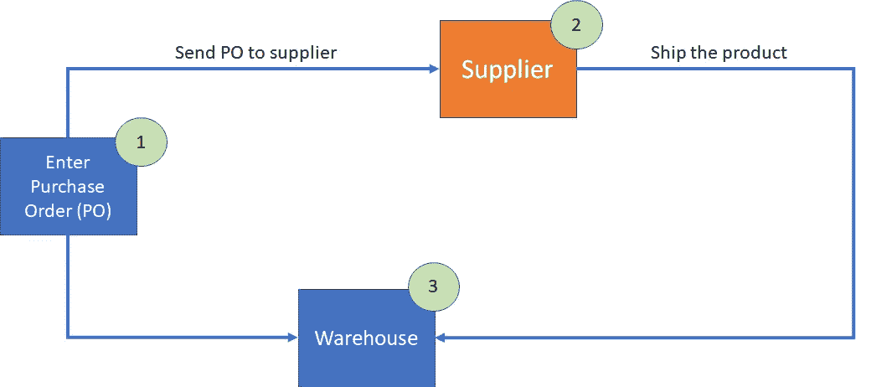

图:采购流程

采购应用程序至少需要以下组件:

*   用于输入新采购订单和查询现有采购订单的采购应用程序。
*   发送给供应商和仓库的采购订单报告

## 应用开发

在开发 python 应用程序时，有许多可用的库和框架。下图显示了基于应用程序类型的可用 python 框架列表。

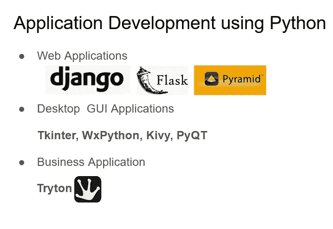

Python 库和应用程序开发框架

如果你是 Python 新手，我建议使用 Tkinter 框架。它易于使用，并且正是您开发桌面应用程序所需要的。我用它来开发采购应用程序。

我的采购应用程序有一个包含三个选项卡的屏幕

1.  采购订单查询:在此页签查询已有的采购订单。在以下字段中输入任意值，并在同一屏幕上显示匹配的 PO 详细信息。

*   采购订单编号(PO#)
*   供应商编号(供应商编号)
*   采购订单日期
*   供应商名称

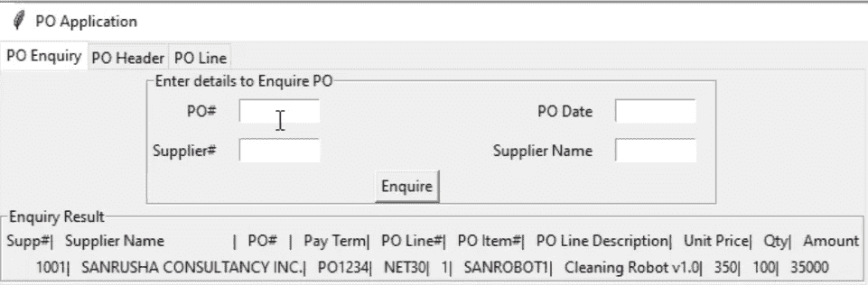

采购订单查询屏幕(图片由作者提供)

2.PO 题头:在此标签中输入采购订单题头详细信息。采购订单标题详细信息包含以下字段。

*   采购订单编号(PO#)
*   采购订单日期(PO 日期)
*   供应商编号(供应商编号)
*   供应商名称
*   交货地址详细信息
*   供应商地址详细信息

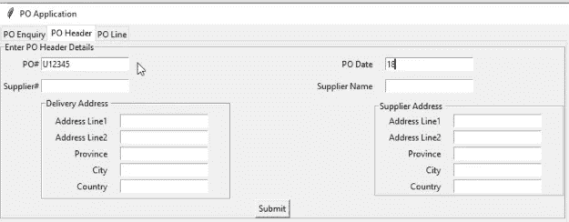

采购订单标题屏幕(作者图片)

3.PO 行:输入采购订单行详细信息。采购订单行包含以下详细信息。

*   项目
*   量
*   单价
*   数量

以及其他细节。

让我们来看一下开发这个带有选项卡的屏幕的代码。

以下代码片段包含用于开发 PO 查询屏幕的 Python 代码。

让我们来理解代码。

下面几行是从 Tkinter 框架导入所需的库。

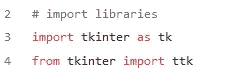

我正在 Oracle 数据库上开发这个应用程序。下面一行代码将应用程序与 Oracle 数据库连接起来。

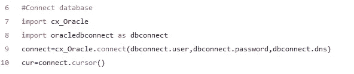

如果您想了解更多关于连接 python 应用程序和 Oracle 数据库的信息，请参考下面的文章。

</spark-and-oracle-database-6624abd2b632>  

下面一行代码创建一个标题为"**采购订单申请**的窗口，并在该窗口上创建三个标签:**采购订单查询**、**采购订单标题**、**采购订单行**

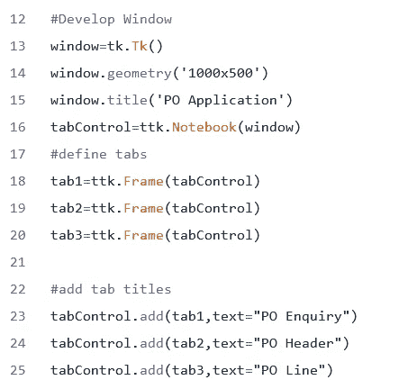

下面一行代码将采购订单编号、采购订单日期、供应商编号、供应商名称字段添加到采购订单查询选项卡中。

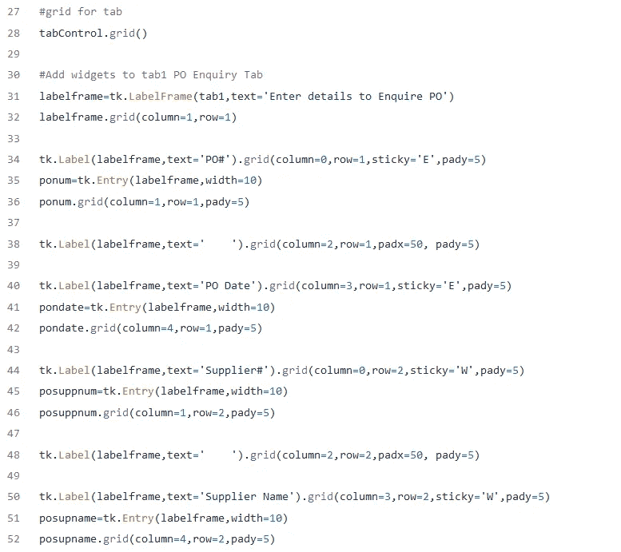

添加 window.mainloop()以显示您的窗口。

从参考列表中提到的 Github 位置获取完整的代码。

## 拟定报告

Python 提供 reportlab，用于开发图片完美的专业报表。下面是使用 reportlab 库开发的采购订单报表的图像。

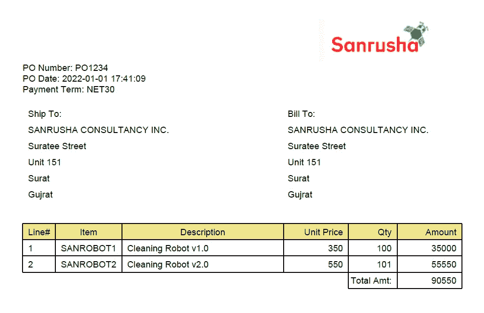

采购订单报告(作者图片)

下面的代码片段显示了该报告背后的代码。

让我们来理解开发报告的代码。

前几行代码导入 reportlab 库和 cx_Oracle 以连接数据库。

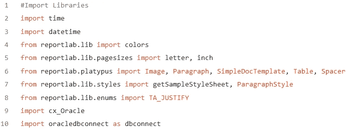

在这里，连接到 Oracle 数据库并打开两个游标:一个包含采购订单标题信息，另一个包含采购订单行详细信息。

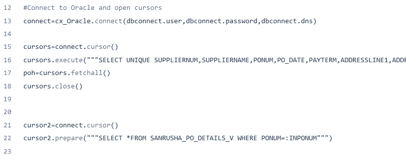

接下来，创建一个变量徽标，并指定徽标图像在计算机上的存储路径。

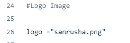

现在用采购订单标题信息打开一个循环。使用报告文件名(podcname+调用 SimpleDocTemplate。pdf)以及带有边距细节的报告的大小。在我的例子中，报告文件名由供应商编号——采购订单编号——报告创建的日期组成。

下面代码片段中的最后一行打开了一个空的数组故事。

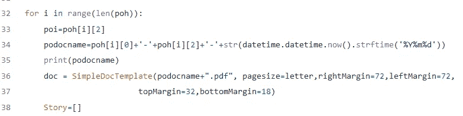

报告数据将被添加到该空数组中，并且该空数组将作为段落添加到报告中。

在代码行下面，将日志添加到报告的右上方。

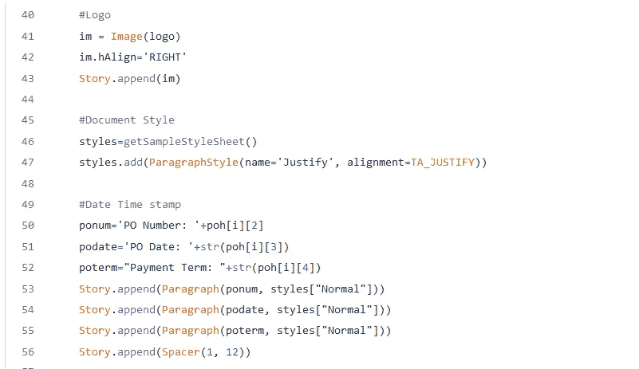

下面几行代码创建了一个包含送货地址详细信息的数组，然后将该数组数据添加到 Story 数组中。

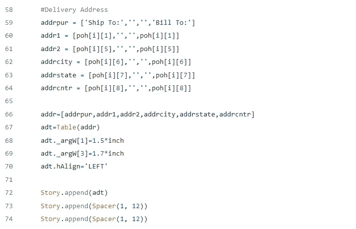

同样，下面一行代码将 PO 行细节添加到 polintab 数组中。

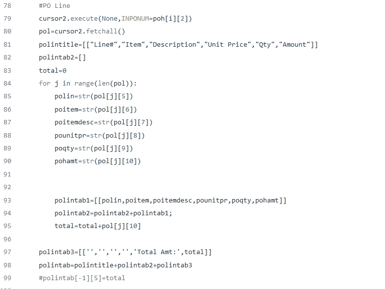

下面几行代码用 polintab 数组数据在报表上创建一个表。

**注意:**与 python NumPy 数组不同，reportlab tab 先有列，后有行。因此，“ALIGN”，(3，0)，(5，-1)，“RIGHT”表示从第 3 列到第 5 列右对齐数据。

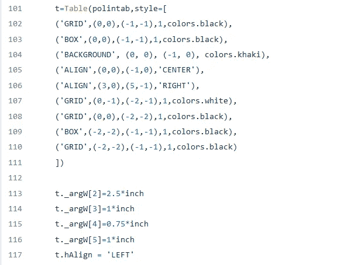

最后，下面一行代码将 polintab 表添加到 Story 数组中，并在报表上显示该表。doc.build(Story)用故事数组数据构建报告。

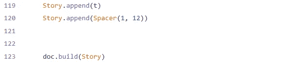

## 结论

使用 Python 在 Oracle 数据库上开发应用程序和报告非常有趣。Python 是一种具有无限可能性的语言，我们正在探索这些潜力的旅程中。

虽然本文展示了如何开发采购应用程序，但是这些步骤也可以用于使用 Python 开发任何类型的数据库应用程序。

期待您的反馈！

## 参考

  

[https://www.reportlab.com/docs/reportlab-userguide.pdf](https://www.reportlab.com/docs/reportlab-userguide.pdf)

<https://github.com/srssingh/Purchase-Order-Application.git>  

[Python+SQL+Oracle，无限可能](https://www.udemy.com/course/python-with-oracle-developer-course/?referralCode=6F68B20A8FB16A20BFE1)