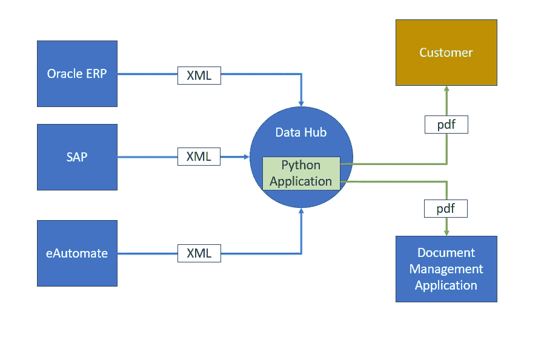
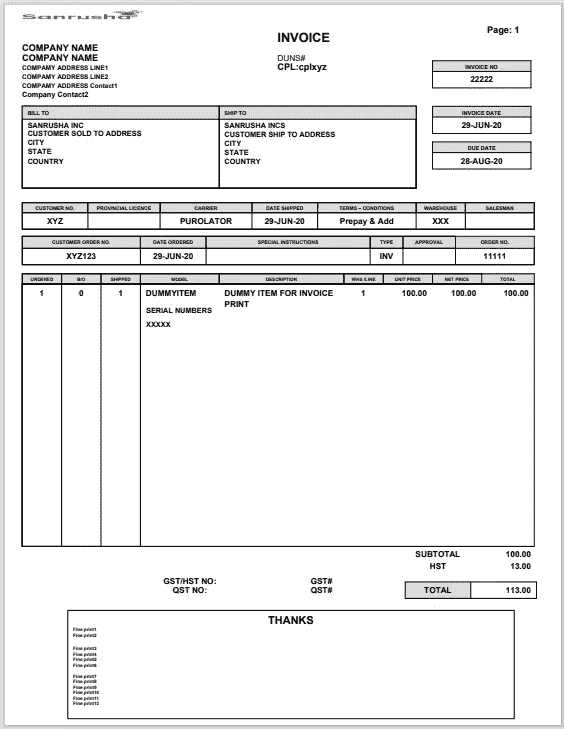

# 如何使用 Python 开发企业文档管理应用程序

> 原文：<https://towardsdatascience.com/how-i-developed-an-enterprise-document-management-application-using-python-97a1c4836602>

## 客户发票管理应用程序

卡罗琳娜·加西亚·塔维森在 [Unsplash](https://unsplash.com?utm_source=medium&utm_medium=referral) 上的照片

Python 是数据科学和机器学习领域最著名的语言。然而，它的魔力并不止于数据科学和机器学习相关的应用。它一直让我惊叹我们可以用它实现什么。这篇文章是关于 Python 的一个惊人的应用。

# 要求

作为一名系统集成专家，我从事过各种 IT 领域的工作——有些看起来过时了，有些则是世界顶级的——打包过 ERP 和商业智能应用程序。我的大部分时间都在获取需求，并将它们与这些打包应用程序提供的内容相匹配。

最近，我遇到了一个非常有趣的挑战。

我们把这个概括为一个虚构的公司。这家公司有许多后台应用程序。

*   一些办公室使用 SAP ERP
*   当地子公司使用 Oracle ERP
*   其服务机构使用 e-Automate

这些应用程序都有内置的订购、运输、服务和发票功能。这些应用程序都可以生成发票并将其发送给客户。问题是，客户从同一家公司获得了来自不同应用程序的不同产品和服务的单独发票。客户希望一张发票列出公司的所有产品和服务。

# 体系结构

当这个需求来到我面前时，它让我想知道我是否可以使用 Python 来做这件事。

> 答案是一个大大的“是”。

我们是怎么做到的？

我们要求每个应用程序的所有者将 XML 格式的发票发送到中央计算机。我们编写了一个基于 python 的应用程序，运行在这台中央计算机上，扫描这些文件。它每隔几分钟扫描一次文件，将每个客户的文件整合成一个 XML 文件，创建 pdf 格式的发票，将整合后的发票通过电子邮件发送给客户，还将发票的副本发送给公司的文档管理应用程序。

以下流程解释了整体系统架构和解决方案。

文档来源到存储和流通(图片由作者提供)

构建这个应用程序我们需要什么？

a.**读取单独的 XML 文件**:每个应用程序都在发送 XML 格式的文件。我们需要一个文档对象模型(DOM)接口来读取这些 XML 文件。Python [最小 DOM 实现](https://docs.python.org/3/library/xml.dom.minidom.html) **minidom** 完美地满足了这一需求。

b.**创建合并的 XML 文件**:在读取来自不同应用程序的 XML 文件后，下一个任务是将它们合并到一个文件中。用于创建统一 XML 文件的 Python 框架。

c.**创建 pdf 格式的发票**:到目前为止，我们读取了不同的 XML 文件，并将它们合并成一个 XML 文件。下一个任务是创建 pdf 格式的专业发票。Python 框架 reportlab 完成了这项工作。如果你想知道什么是 reportlab，这里有来自[网站](https://www.reportlab.com/opensource/)的描述。

*ReportLab 是久经考验的超级强大的开源引擎，用于创建复杂的数据驱动的 PDF 文档和自定义矢量图形。* ***它是免费的*** *，开源，用 Python 写的。*

d.**通过电子邮件发送发票:**创建了 pdf 格式的发票后，就可以通过电子邮件将它们发送给客户了。python 框架 **smtplib** 和 **email** 通过公司的 SMTP 服务器将发票通过电子邮件发送给客户。

# 设计

在上面列出的四项主要任务中，最耗时的是创建 pdf 格式的发票。该公司对发票布局和发票上打印的信息量有非常严格的指导原则。一些关键的设计限制。

1.  客户帐单寄送地址和送货地址应该只在第一页打印一次。
2.  小字应该只印在最后一页。
3.  发货产品的序列号应与产品发货和发票明细一起打印在发票行上。
4.  根据收货地址、省份和税码，会有所不同。应相应地打印明细税码和税额。
5.  生产线上的任何特殊说明都应打印在生产线部分。

与此类似，几个要求使得整个发票布局成为一项困难的任务。

下面是发票的整体布局。

文档示例(图片由作者提供)

# 发展

现在您已经理解了需求和总体设计，是时候更深入地研究组件开发了。让我们来看看这个应用程序的主要组件。

## 步骤 1:读取 XML 文件

第一步是扫描每个应用程序的 XML 文件被发送到的文件夹。

*   Python 库操作系统可用于监控文件夹中的传入文件。
*   文档对象模型接口 xml.dom 的 Python minidom 模块可以用来解析每个文件中的 xml 数据。

下面是扫描文件夹下的文件，然后解析文件中的 xml 标记值的示例代码。

## 步骤 2:编写 XML 文件

读取 XML 文件后，下一步是将数据合并到一个 XML 文件中。Python 包 yattag 非常适合创建 XML 文件。

下面是使用 yattag 包创建 XML 文件的代码片段。

## 步骤 3:发票创建

这是项目的核心，也是最耗时的任务。这项任务包括读取 XML 文件以及创建 pdf 格式的发票布局。

创建发票的第一步是导入 reportlab 的 pdfgen 包并实例化一个 Canvas 对象。创建对象时提及页面大小和文件名。一旦创建了 canvas 对象，您就可以像画家在画布上绘画一样开始构建内容。

在向画布添加内容时，确保选择合适的字体并提到 x 和 y 坐标。下面是创建对象和创建上述发票的前几行的代码片段。

从文件中选择徽标，并通过 canvas 对象 invcanvas 的 drawImage 方法将其分别放置在画布上的 x 和 y 坐标 20 和 760 处。

到目前为止，一切顺利。当你不得不把价值放在画布上的特定位置时，乐趣就开始了，但是内容和它们的总大小可能会随着每张发票而变化。例如，打印买方地址和收货地址。

reportlab 的 getSampleStyleSheet 包最适合此类任务。将内容放在 ParagraphStyle 中，将它们放在一起并打印到画布上所需的位置会变得更容易。

下面是示例代码。

同样，发票的所有其他内容都是在发票画布上创建的。关键的部分是将它们放置在正确的坐标上，没有任何重叠。

## 第四步:发电子邮件

Python 电子邮件模块可用于通过电子邮件发送发票。下面的代码显示了自定义函数 psendmail，它使用 Python 电子邮件模块和 MIMEmultipart 模块来编写电子邮件主题、正文并以附件形式发送发票。

# 结论

Python 是一种多用途的开源编程语言，可以与数据科学和机器学习一起用于应用程序开发。使用 Python 开发文档管理应用程序非常有趣。

我期待您对本文的反馈，以及您在工作中是如何使用 Python 的。

# 参考资料:

[https://docs.python.org/3/library/email.html](https://docs.python.org/3/library/email.html)

https://www.reportlab.com/opensource/

  

【https://www.reportlab.com/docs/reportlab-userguide.pdf 