# 调整人工神经网络:使用 KerasTuner 和其他基本数据分析技术优化多类文本分类器

> 原文：<https://towardsdatascience.com/how-i-improved-the-performance-of-a-multiclass-text-classifier-using-kerastune-and-other-basic-data-161a22625009>

## 探索如何通过将简单数据和/或 NLP 技术与使用 KerasTuner 超波段算法的人工神经网络超参数调整相结合来提高基于文本的模型的性能


[腾雅特](https://unsplash.com/@tengyart?utm_source=medium&utm_medium=referral)在 [Unsplash](https://unsplash.com?utm_source=medium&utm_medium=referral) 上拍摄的照片

在我之前的一篇关于使用 Keras 预测情绪的[多类文本分类的文章](/multiclass-text-classification-using-keras-to-predict-emotions-a-comparison-with-and-without-word-5ef0a5eaa1a0)中，我比较了使用 skipgrams 为深度文本分类器提供预测情绪的学习单词嵌入的结果，以及另一个从零开始学习嵌入的深度文本分类器的结果。**从零开始学习嵌入的人工神经网络分类器比另一个稍微好一点**，在本文中我将把它作为我的基线。

**在这里阅读上一篇文章:**

</multiclass-text-classification-using-keras-to-predict-emotions-a-comparison-with-and-without-word-5ef0a5eaa1a0>  

**在这次重新访问相同的数据集时，**在 Kaggle [这里](https://www.kaggle.com/praveengovi/emotions-dataset-for-nlp)和拥抱人脸数据集[这里](https://huggingface.co/datasets/emotion)，**上公开可用，我将尝试改进模型**，在未见过的数据集上的加权平均召回率为 81%。

在下图中，报告了模型在测试集上的性能。这里，*模型 1* 是指经过**训练的带有** word2vec 嵌入的模型，*模型 2* 是指经过**训练的没有** word2vec 嵌入的模型。回忆那次回忆😏在这个用例中很重要，因此得出结论，第二个模型表现稍好，因此，**模型 2 是本文的基线。**

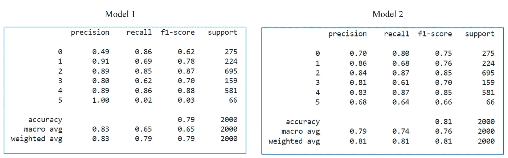

我上一篇关于测试数据集的文章中的两个模型的性能

# **让我们从列出模型改进的 5 大推荐技术开始:**

1.  追加更多的数据，最终给一个 ML 模型更多的例子来学习和归纳。
2.  **特征工程**用于从给定数据中提取有用的信息，使模型能够轻松有效地找到预测模式……以及**特征选择**用于处理 [GIGO](https://www.techopedia.com/definition/3801/garbage-in-garbage-out-gigo) 问题。基本上，这允许模型只使用一些有用的特征，去除噪声，并节省计算时间和资源。
3.  尝试**多种算法**找到最适合预测的算法。
4.  使用**交叉验证**获得一个稳健且通用的模型。使用交叉验证，您可以在数据集的多个块上训练和测试模型的性能，获得平均性能，并确定模型是否处于最佳状态。
5.  **调整超参数**以识别适合数据集的最佳组合，因为它们对模型训练过程的结果有着关键的影响。

# 现在…让我们开始编码吧！😄

参考我在[上一篇文章](/multiclass-text-classification-using-keras-to-predict-emotions-a-comparison-with-and-without-word-5ef0a5eaa1a0)中的[相同的笔记本](https://github.com/royn5618/Medium_Blog_Codes/blob/master/Emotion%20Detection/EmotionClassifier.ipynb)，我做了一些改动

**1。修改了数据策略** —在前一个中，我使用了 2/3 的数据进行训练，并保留了 1/3 的数据进行验证。在这一次，我使用整个 train.txt 进行训练，并在模型训练期间使用验证集来验证和改进模型性能。

**2。文本清理和规范化** —以前，我直接使用文本数据，没有清理和规范化它。在这一次，我删除了停用词，并使用波特斯特梅尔获得了词干。它将 vocab 的大小降低到 10375。

**3。作为引子，我重新设计了**模型，降低了辍学率，并增加了两个 LSTM 层的单元数量。此外，由于前一步骤中的清洗，vocab 大小从 15000 变为 10000。此外，除了 LSTM 之外，我还试用了 [SimpleRNN](https://keras.io/api/layers/recurrent_layers/simple_rnn/) 和[门控循环单元](https://keras.io/api/layers/recurrent_layers/gru/)。

…并告诉模型**应该关注哪些指标。**

之前，该模型是使用度量标准'***'***编译的。由于我们正在处理一个不平衡的数据集，准确性不是正确的衡量标准。**精度**和 **/** 或**召回**更好。我之前选择了查全率而不是查准率，但是无论如何我都想提高两者，所以我将它们指定为评估模型的度量标准。还要注意的是，F1-score 在 Keras 中不是现成的指标，所以为了简单起见，我在列表中直接使用了 precision 和 recall。

## **修正模型性能评估:**

当我更新这些配置时，模型性能有了显著的提升。看看下面 LSTM 模型的性能

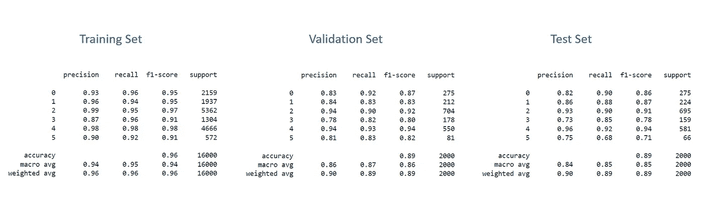

使用更新的超参数和 LSTM|作者图片对训练、验证和测试集的性能进行建模

回想一下我们的加权回忆😉基准模型在测试数据上的准确率为 81%,而在相同数据上的准确率提高到 89%。测试数据中实例数量最多的三个类的召回率等于或高于 90%。

接下来，我想尝试简单和 GRU 以及其他 RNN 层。GRU 在测试数据上的性能与 LSTM 相似，对测试数据的召回率为 90%，而 SimpleRNN 为 81%，相当于基线模型！

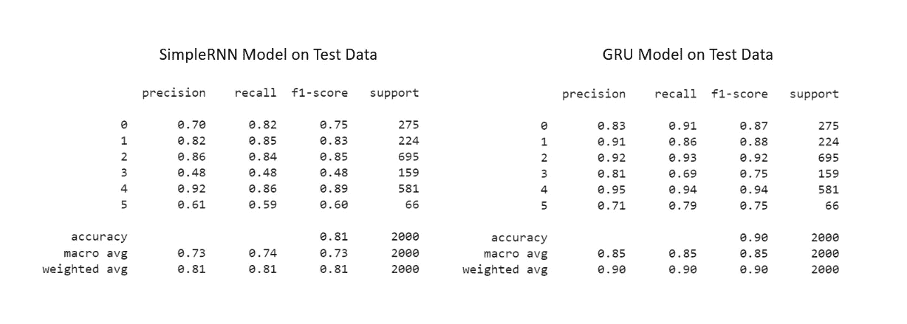

使用 SimpleRNN 和 GRU 的更新超参数在测试集上建模性能|图片由作者提供

SimpleRNN 的性能很差，因为模型明显过拟合。这是模型的训练验证损失曲线-

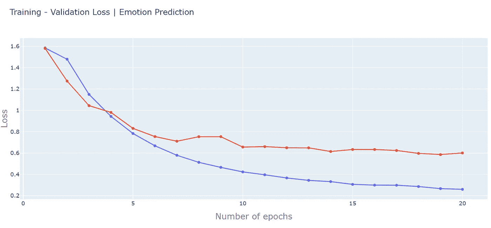

蓝色曲线是训练损失，红色曲线是验证损失|作者图片

注意，重叠发生在时段 4，并且验证损失在时段 7 之后继续改善。之后，验证损失开始变得不稳定，时有增减。早期停止算法使用耐心 5，并且由于验证损失的这种不稳定性，模型继续训练，最终挑选时段 19 作为最佳时段。这也是由于我在代码`epochs=20`中设置的限制。如果我设置了超过 20 个时期，模型将会多训练 5 个时期。显然，这个模型不能对测试集或任何由分类报告显示的看不见的数据进行归纳。

此外，模型的训练时间如下:

*   LSTM—6 分钟
*   简单神经网络—19 分钟
*   GRU—8 分钟

显然，简单神经网络的训练时间较长，但 LSTM 和 GRU 模型的训练速度较快。

最后，这是 LSTM 模型在测试数据上表现的混淆矩阵:

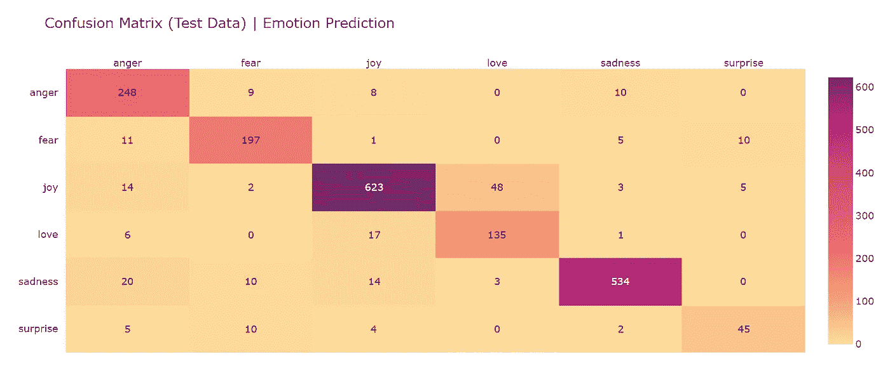

LSTM 模型在测试数据上表现的混淆矩阵|图片由作者提供

这个模型仍然会在愤怒和悲伤、快乐和爱之间，以及在快乐和悲伤之间有点混淆！但是每类错误分类的百分比已经显著降低。

# 重温 5 大推荐技术:

1.  **追加更多 data✅** —自从我在训练时使用单独的验证集来验证模型性能以来，训练集现在有了更多数据。
2.  **特征工程和特征选择** ✅— I 清理并规范化了文本，并且 vocab 大小也从 15k 减少到 10k。
3.  **多种算法和改变的超参数✅** —我修改了模型的网络配置，并将改进的重点从准确度更新为精确度和召回率。我还测试了 SimpleRNN 和 GRU。
4.  使用**交叉验证❌**
5.  **调整超参数❌**

在测试数据上，这三个变化将模型的性能从 81%提高到 89% (LSTM)和 90% (GRU)。所以，是时候探索交叉验证和超参数调整了，看看会发生什么。

# 介绍 Keras-Tuner

Keras-tuner 是一个为您的神经网络模型找到最佳超参数集(或*调整超参数*)的库。

使用以下命令安装 Keras Tuner:

```
pip install **-**q **-**U keras**-**tuner
```

现在，在将文本数据准备成填充序列之后，使用 LSTM 进行调谐的模型构建过程如下:

KerasTuner 允许我们在构建模型时内联定义超参数。比如我用' *vector size* '作为超参数进行调优，指定它应该是一个**整数** (hp。 **Int** )，其最小值为 100，最大值为 500。它将在搜索空间中以 100 的步长递增。

在 model_builder 函数中，我定义了五个超参数-

1.  vector _ size-Integer |范围 100 到 500，步长:100
2.  dropout_rate — Float |范围为 0.6 到 0.9，步长为 0.1
3.  lstm_units1 —整数|范围 32 到 512，步长:32
4.  lstm_units2 —整数|范围 16 到 512，步长:32
5.  learning _ rate-Choice | 1e-2、1e-3、1e-4

[超参数类](https://keras.io/api/keras_tuner/hyperparameters/)给出了一些设计搜索空间的选择。我们可以指定一个超参数是否是布尔( *hp。布尔型*、整型(*hp.Int |第 3、16、21 行*)、浮点型( *hp)。Float | line 11* ，几个选项中的一个选择( *hp)。选择|第 27 行*)，或者一个固定值等等。

现在，我们已经定义了超参数搜索空间，这意味着 ***超模型*** 已经准备好开始调优了。为了找到最佳的超参数，首先我使用下面的代码实例化了调谐器:

为了实例化 Hyperband 调谐器，我为超级模型指定了以下参数:

1.  超级模型:model_builder 函数
2.  目的:超模型中描述的模型的损失函数。我在这个用例中使用了验证召回。
3.  max_epochs:训练一个模型的最大次数
4.  factor:一个整数，用于定义每个括号中模型和时期数的缩减系数。一个括号中训练的模型数计算为`rounded to nearest` (1 + log `**base**=factor` ( `max_epochs`))
5.  目录/项目:在超参数调整期间记录每个试验的配置、检查点和分数

在*第 11 行*中，我添加了一个提前停止配置来监控验证召回。因此，在一个时期中实现最佳验证召回之后，该模型继续为接下来的 5 个时期进行训练，以进行任何进一步的改进。最后我在*第 21 行*开始了最佳超参数搜索。

## **超波段调谐器算法是如何工作的？**

超波段调谐器是连续减半算法(SHA)的扩展，用于提前停止的自适应资源分配。

用于自适应资源分配的连续减半算法的工作原理可以概括为:

1.  将所有资源统一分配给超参数集，并使用一半的资源/时间对它们进行调优。当运行调谐器时，这种策略就显现出来了。请注意，初始模型训练了大约 3 或 4 个时期，这远远低于指定的最大时期数。
2.  性能最好的上半部分超参数集随后被“推进”到下一阶段，在该阶段，使用分配给它们的更高资源/时间来训练结果模型。在运行调谐器时，接近尾声时，这就是 epochs 数较高的原因。
3.  重复直到只有一个配置。

这种算法被调整了一点，使其更灵活的超波段调谐器。它使用η，η是消除率，其中只有 1/ η的超参数集前进到下一个括号用于训练和评估。η由算法的这个 Keras 实现中的公式`rounded to nearest` (1 + log `**base**=factor` ( `max_epochs`))确定。

在原文[的](https://jmlr.org/papers/volume18/16-558/16-558.pdf)中阅读更多相关内容。

## 现在…回到代码上来

我用两个因子进行了实验:3 和 5，这里是最佳超参数值的结果。

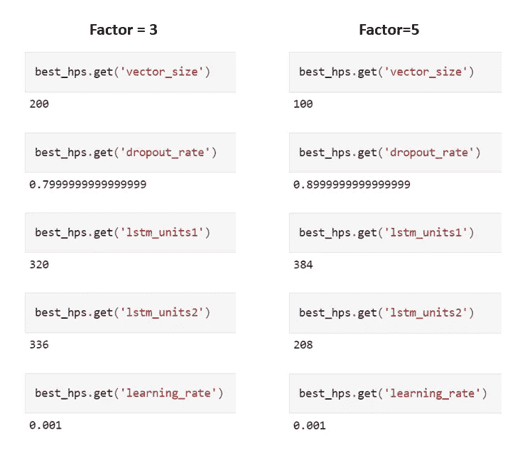

使用因子 3 和因子 5 的优化模型的最佳超参数值|作者图片

接下来，使用最佳超参数来构建最终模型( *line 2* )，我再次使用相同的旧 ANN 回调和训练代码来训练它。

结果如下:

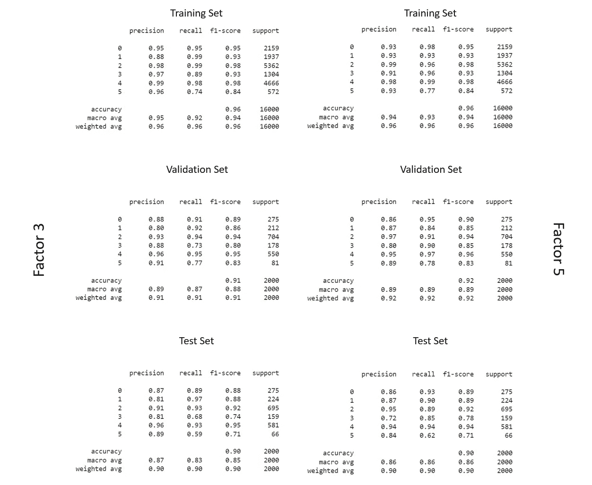

在训练、验证和测试集上使用因子 3 和因子 5 的最佳表现模型的结果|图片由作者提供

这两个模型的性能相似，但是，在未知数据集上，整体性能比基线模型提高了 11%，尽管从最后一个模型来看，只有微小的提高。

## 和...我还使用 GRUs 重复了这个过程

以下是 model_builder 函数的更新代码:

超参数和模型对测试数据的性能是:

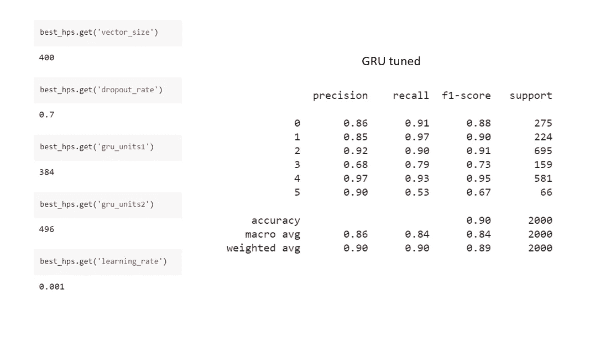

请注意，加权平均召回率与调整后的 LSTM 相同，而宏观平均召回率略有不同。然而，调整后的 GRU 模型的**向量大小是因子为 3 的调整后的 LSTM 的两倍，是因子为 5 的**的四倍。此外，GRU 网络单元比 LSTMS 的大，这表明如果与两个调整的 LSTM 模型相比，该模型将占用更多的内存。

**这些模型不会过度拟合吗？**

过度拟合是指模型从训练数据中学到了太多东西，无法对看不见的数据进行归纳，而欠拟合是指模型没有学到足够的东西，无法从新数据中得出有效的结论。

这是最终模型的训练和验证损失图。在这两个图中，我们可以看到随着时代的增加，训练损失越来越低，模型变得过度拟合。

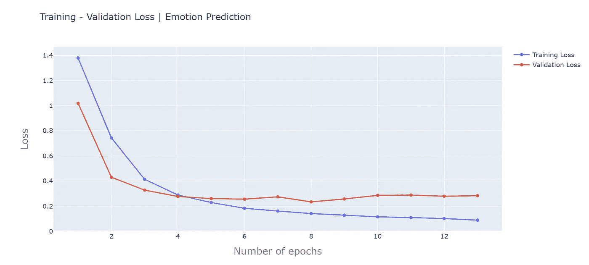

使用因子=3 调整的模型|图片由作者提供

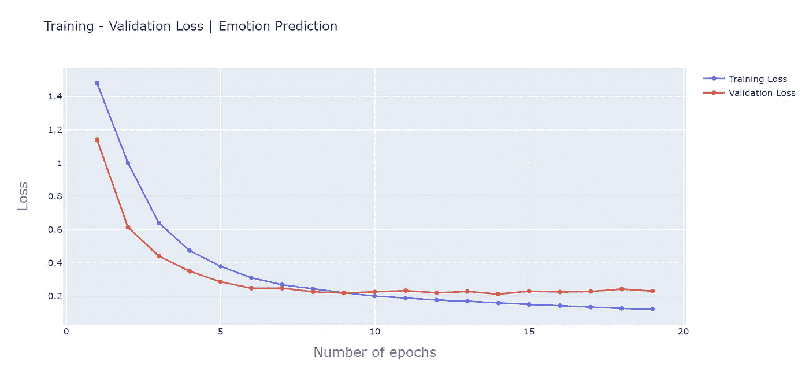

使用因子=5 调整的模型|图片由作者提供

因子=3 的调整模型的验证损失在 0.25 和 0.28 之间波动，而另一个模型的验证损失停滞在 0.22 左右。如图所示，模型的过度拟合确实会影响验证损失。在第一种情况下，在两个损失相同的第 4 个时期之后，训练损失减少，而验证缓慢增加。然而，该模型被训练到第 8 个时期，在该时期验证损失最低，即模型的概括能力最高。然而，在第 8 个时期的模型具有过度拟合的风险，因为验证损失不遵循增加的模式，并且在最佳时期的值是突然下降的(因此基本上它就像一个异常值)。

**如果我不得不选择…** 放弃调整后的 GRU 模型，因为它对未知数据具有相同的性能，但对计算使用了更多的*内存*，我宁愿选择 LSTM 模型之一，如果我专注于资源和计算方面，最好是因子为 5 的模型。召回的*宏观和加权平均值在测试集上对于系数为 5 的 LSTM 来说是高的*，因此我会选择这个。此外，最佳历元处的训练损失和验证损失之间的*差异对于该模型来说更低(…并因此降低过拟合的机会)，为 0.05(*0.21-0.16*)，而对于另一模型来说为 0.09(*0.23-0.14*)。此外，对于系数为 5 的调谐 LSTM，交叉点处的训练损失与最佳时期*之间的*差异也较低。*

然而……在所有的调整、搜索和提炼之后，最好的模型仍然对 love❤️和乔伊感到困惑😄如下图所示:

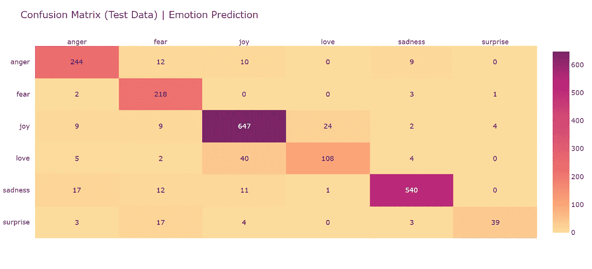

使用因子=3 调整的 LSTM 模型的性能|图片由作者提供


使用因子=5 调整的 LSTM 模型的性能|图片由作者提供

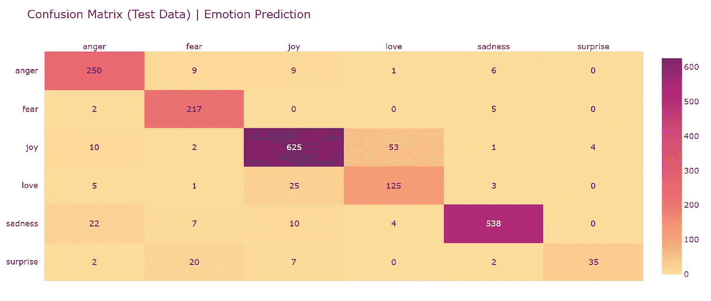

调谐 GRU 模型的性能|图片由作者提供

…但是与我们基线的热图相比，后者看起来肯定更丰富多彩，这表明错误分类率更高:

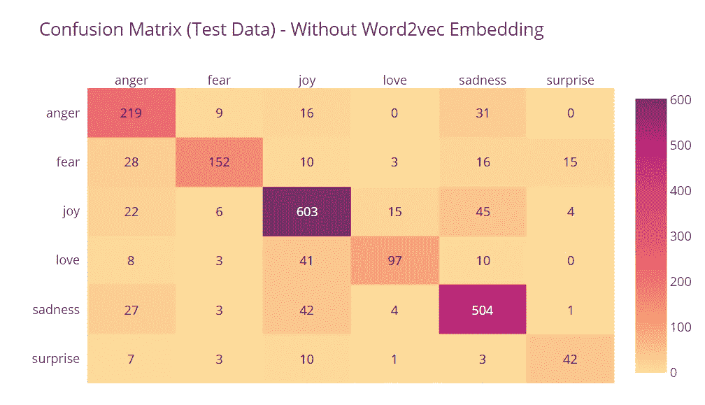

基线模型的性能|作者提供的图片

# **结论:**

最后，回顾一下模型改进的前 5 个最常用的方法，我现在是 4.5/5。

1.  **追加更多 data✅**
2.  **特征工程和特征选择** ✅
3.  **多重算法和被改变的 Hyperparameters✅**
4.  **交叉验证❌验证✅**
5.  **调整超参数✅**

结果是，在测试数据集上，宏召回率从 74%提高到 86%，加权召回率从 81%提高到 90%。

列表中唯一遗漏的是交叉验证，但是，一个验证集已经用于验证模型在训练时的性能。与 [Sklearn 的超参数调优实现](https://scikit-learn.org/stable/modules/classes.html#module-sklearn.model_selection)不同，KerasTuner 没有实现 CV，我在文档中找不到任何关于它的内容。此外，为了执行交叉验证，我可能必须混合训练和验证数据，以使用 K-fold 交叉验证(CV)技术。KerasTuners 中的 Sklearn 调谐器提供了该选项，但要调谐的型号应该是 sklearn 型号。希望在另一个博客中探讨这个问题！💡


在 [Unsplash](https://unsplash.com?utm_source=medium&utm_medium=referral) 上由[Courtney hedge](https://unsplash.com/@cmhedger?utm_source=medium&utm_medium=referral)拍摄的照片

# 资源和代码:

**本博客使用的笔记本:** [车型改进笔记本](https://github.com/royn5618/Medium_Blog_Codes/blob/master/Emotion%20Detection/EmotionClassifier_Model_Improvement.ipynb) | [使用 Keras 调谐器的车型改进](https://github.com/royn5618/Medium_Blog_Codes/blob/master/Emotion%20Detection/EmotionClassifier_KerasTuner_2.ipynb) (LSTM)| [使用 Keras 调谐器的车型改进(GRU)](https://github.com/royn5618/Medium_Blog_Codes/blob/master/Emotion%20Detection/EmotionClassifier_KerasTuner_GRU.ipynb)

**笔记本参考** [**往期博客**](/multiclass-text-classification-using-keras-to-predict-emotions-a-comparison-with-and-without-word-5ef0a5eaa1a0)**:***[数据分析笔记本](https://github.com/royn5618/Medium_Blog_Codes/blob/master/Emotion%20Detection/DataExploration.ipynb) | [分类器训练笔记本](https://github.com/royn5618/Medium_Blog_Codes/blob/master/Emotion%20Detection/EmotionClassifier.ipynb)*

***使用的参考资料和进一步阅读:***

1.  *[https://www.tensorflow.org/tutorials/keras/keras_tuner](https://www.tensorflow.org/tutorials/keras/keras_tuner)*
2.  *[https://keras.io/api/keras_tuner/tuners/hyperband/](https://keras.io/api/keras_tuner/tuners/hyperband/)*
3.  *[https://jmlr.org/papers/volume18/16-558/16-558.pdf](https://jmlr.org/papers/volume18/16-558/16-558.pdf)*
4.  *[https://analyticsindiamag . com/speed-up-hyperparameter-tuning-in-deep-learning-with-keras-hyperband-tuner/](https://analyticsindiamag.com/speed-up-hyperparameter-tuning-in-deep-learning-with-keras-hyperband-tuner/)*
5.  *[http://www.argmin.net/2016/06/23/hyperband/](http://www.argmin.net/2016/06/23/hyperband/)⭐*
6.  *[https://blog . ml . CMU . edu/2018/12/12/massively-parameter-optimization/](https://blog.ml.cmu.edu/2018/12/12/massively-parallel-hyperparameter-optimization/)⭐*
7.  *[https://machine learning mastery . com/learning-curves-for-diagnostic-machine-learning-model-performance/](https://machinelearningmastery.com/learning-curves-for-diagnosing-machine-learning-model-performance/)*

# *数据集引用:*

*[1]萨拉维亚，刘，洪春涛，黄，杨海红，吴，陈永胜(2018)。 [Carer:用于情绪识别的情境化情感表征。](http://dx.doi.org/10.18653/v1/D18-1404)在*2018 自然语言处理经验方法会议论文集*(第 3687–3697 页)*

*[*hugging face 上的许可证:未知*](https://huggingface.co/datasets/emotion)*|*[*ka ggle 上的许可证:CC BY-SA 4.0*](https://www.kaggle.com/datasets/praveengovi/emotions-dataset-for-nlp/metadata)*

**感谢光临！**

***我的链接:** [中型](https://medium.com/@nroy0110)|[LinkedIn](https://www.linkedin.com/in/nabanita-roy/)|[GitHub](https://github.com/royn5618)*