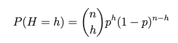
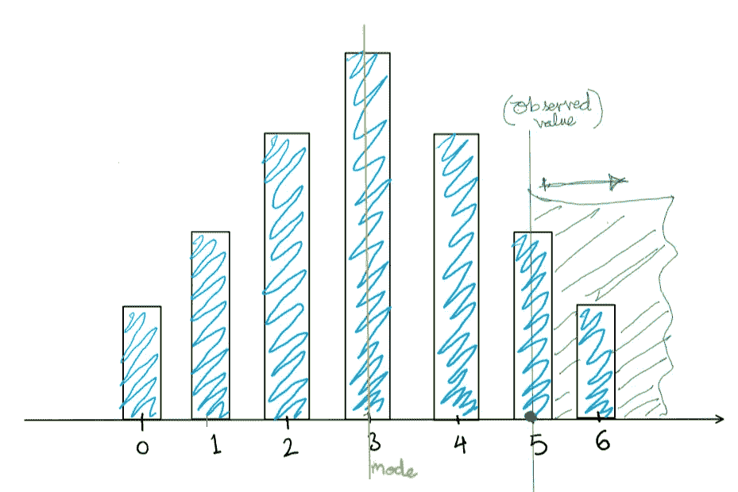
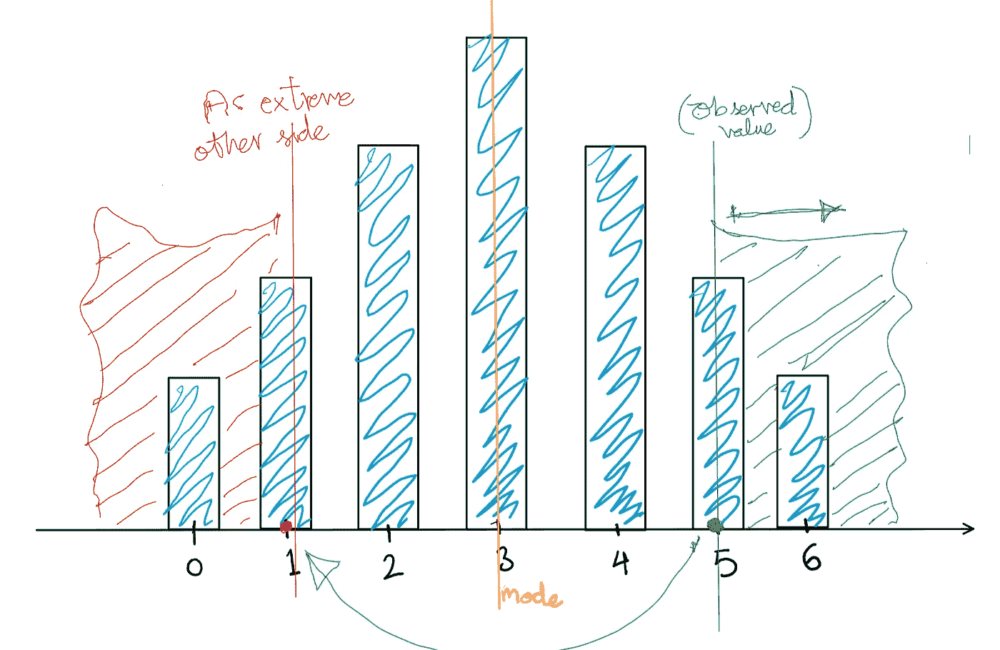
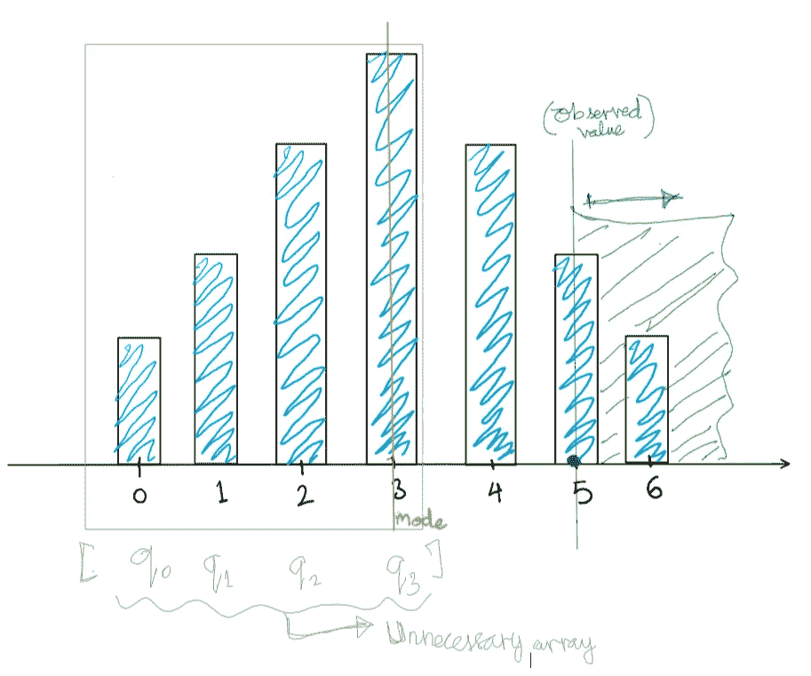
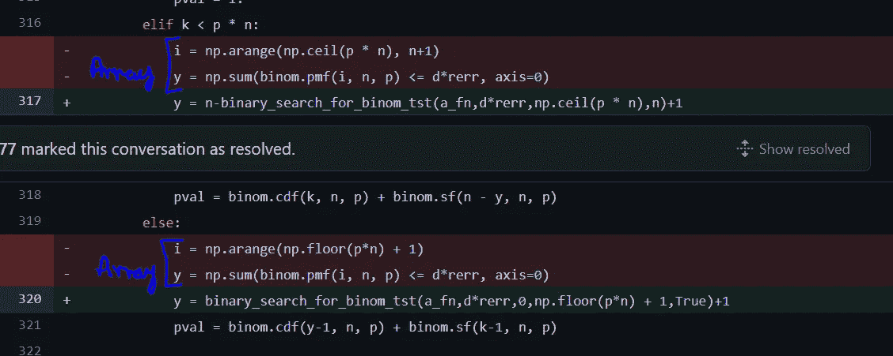
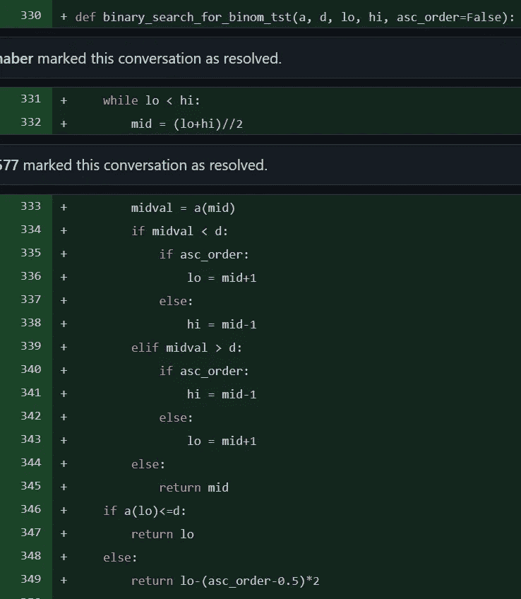

# 我如何做出我的第一个科学贡献

> 原文：<https://towardsdatascience.com/how-i-made-my-first-scipy-contribution-d8c376ff7ac2>

## 或者说，两个样本测试的微妙之处。

# I)为流行的存储库做出贡献

向受你所在领域从业者欢迎的著名开源库投稿是展示专业知识的一个好方法。例如，能够说:“如果你在 SciPy 中使用这个方法，你就是在使用我的代码”肯定会引起注意，让你脱颖而出(我们将使用 SciPy 作为例子，但这适用于任何流行的库)。此外，你会发现从人工智能到分布式计算等领域的许多顶尖研究人员在他们的简介和简历中提到了这些贡献。但是如果这么做很容易，每个人都会这么做。例如，SciPy 总共有大约 1000 名投稿人。这包括对文档、评论等的贡献。如果你只包括触及核心功能的贡献者，你可能只剩下几百个。这对于一个几千万人使用的图书馆来说。

## I-A)“伟大”的过滤器

就像解决费米悖论的“伟大过滤器”框架一样，我们可以想到一系列障碍或过滤器来解释为什么只有少数人贡献这些代码库，而有那么多人使用它们。

向开源库贡献代码的伟大过滤器。图片作者。

首先，仅仅是在 GitHub 上浏览[的源代码](https://github.com/scipy/scipy)就可能令人生畏。

下一步是在本地下载代码，并从源代码编译它。[分叉](https://docs.github.com/en/get-started/quickstart/fork-a-repo)‘代码本地就够简单了。但是构建它需要安装 C 和 Fortran 编译器，因为许多代码将输入传递给这些语言的方法，这些语言比 Python 快得多。此外，从线性代数到统计学的许多基本算法都已经在这些语言中实现，可以追溯到 60 年代。

在您的系统上设置这些编译器可能是一项非常耗时且令人沮丧的工作，尤其是如果您以前从未处理过它们的话。但是在这里你可以像我一样走捷径。我找到了一部分纯 Python 的代码，把它复制到本地，然后只在上面工作。

现在，您必须找到代码中需要改进的地方。实现这些算法的人不是傻瓜，他们会知道最著名的实现，如果不是直接插入它们的话。这可能是最难的部分。为文档做贡献可能是缩短这一艰难步骤的一种方式，因为这是一个总是需要更多手指的领域。我在这方面很幸运，因为我使用的一种方法(一种称为二项式测试的假设测试)是在向它传递大量输入时抛出内存异常。很明显，这种行为是由于执行不力。所以，我知道去哪里找。

最后，如果你通过了所有这些，对这些存储库的审查过程将会非常严格。维护人员可能不会接受您的代码更改，即使您确信这是一个显著的改进。如果他们这样做了，他们会彻底测试你的代码，并提出许多修改建议。这个过程可能需要几个月的时间(至少对我来说是这样)。

现在我们将具体讨论我的贡献。我改进了一个叫做二项式检验的假设检验的实现。因此，我们现在将进入变化本身，并需要建立一些背景。

对于高层次的动机，考虑一个赌场的老虎机。当你玩的时候，你要么赢要么不赢。你有一些关于机器的一些拉的数据，想要决定是否玩它。

# 二项分布

你掷一枚硬币，正面朝上的概率为 *p* ， *n* 次。你会看到多少个头？这是一个随机变量，因为你可能会看到在 *0* 和 *n* 头像之间的任何东西。我们姑且称这个随机变量， *H* 。这个随机变量取某个值的概率， *h* (在 *0* 和 *H* 之间)是:

等式(1):二项式分布 PMF。图片作者。

举个例子，掷三次硬币，两个正面，我们可以得到 HHT，HTH 或者 THH。这些序列中的每一个都有一个概率 *p (1-p)* 。而这三个序列必须乘以 *3* ，解释*(n \选择 h)* 项。

> 脚注 1:随机变量用大写字母表示。

# III)二项式检验

在这个游戏的一个更现实的变体中，我们并不真正知道硬币的 *p* 参数。在这种情况下，问题被颠倒了。我们知道在 n 次投掷中得到的人头数，并想利用这一信息对 p 进行一些推断。这就是二项式检验的用武之地。因为这是一个假设测试，所以让我们快速覆盖一些基础知识(基于抛硬币)。

## III-A)假设检验速成班

在假设检验中，我们从一些假设开始，然后根据收集的数据检验那个假设。我们从这个假设开始，并根据对数据的一些观察进行检验，这个假设被称为“零假设”或简称零假设。在我们的例子中，空值是硬币正面的概率值， *p* 是某个特定值(比如说 *p_0* ，可能是 *.5* )。从这里，我们执行以下操作:

1.  将所有数据汇总成一个数字。这个数字被称为“测试统计”。这应该是我们在空值下很容易推理的东西。在我们的例子中，这是我们在第*次*次投掷硬币中观察到的正面数。
2.  得到原假设下检验统计量的分布。请注意，这种分布完全考虑了它所计算的数据的大小，随着我们收集的数据越来越多，它在单个值处变得越来越峰值化(反映出我们对所得出的结论有更高的信心)。在我们的例子中，假设我们在空值下投掷硬币 *n* 次(正面的概率是 *p_0* ，那么正面数量的分布是一个参数为 *n* 和 *p_0* 的二项式分布。
3.  在假设为空的分布下，找出比计算的测试统计值(从数据中)更极端的概率。在定义“极端”的含义时，我们有三种测试。大于、小于和双面。

## III-B)回到二项式

让我们通过回到二项式检验来使事情具体化。我们示例中的零假设是 *p = 0.5* 。假设这是一个赌场的老虎机，p 是你赢的概率。你只有在 *p > 0.5* 的情况下才想玩。所以，当这不是真的(当 *p < 0.5* 时)时，你想要得到提醒，所以你知道要远离那台机器。现在最好用一张图片来显示“as 或更极端”。下图中的蓝条是检验统计量的概率质量函数(PMF)， *H* (考虑到收集的数据量)。这只是一个参数 *n* 和 *p=0.5 的二项式分布。*

绿线是测试统计的实际值， *h* 由数据计算得出。绿色区域是 PMF 中必须求和才能获得 p 值的部分。

在单侧假设检验中，您只对一侧的面积求和，在这种情况下是在观察检验统计量的右侧。图片作者。

如果是“大于”测试，绿色区域延伸到绿线的右侧，如果是“小于”测试，则延伸到左侧。

第三种测试是双边的。在这里，如果数据显示参数 *p* 明显*不同于其在空值下的假设值*，我们希望得到警告。因为我们现在关心两边的偏差，我们需要对两个区域求和来得到 p 值。这些在下面以绿色和红色显示。绿线是根据之前的数据计算出的测试统计的实际值。

在像二项式检验这样的双边假设检验中，必须取两边的面积来得到 p 值。一方面，您已经有了测试统计数据(绿色)。但接下来你要找到另一边“一样极端”的点。图片作者。

但是我们在哪里划红线呢？我们知道它会在模式的另一边(黄线)。本着比实际观察“更极端”的精神，我们需要找到一个和绿点一样极端的点，但在另一边。这一点在图中用红色标出。在这里，“极端”意味着“不太可能”。我们采用观察绿点的概率，并在模式的另一侧找到具有相同或“等于或略低于”概率的点。

在上图中，由于 *p* 为 *0.5* ，所以分布关于模式是对称的。所以，我们可以很容易地利用对称性找到红点。但是如果 *p* 不是 *0.5* 的任何值，对称性将会打破，我们又回到明确地寻找红点。

# IV)原始代码

在双边测试的情况下，原始代码是非常低效的。具体地说，在红点“在另一侧的极端”将被定位的步骤中。从该模式到另一个极端的值首先存储在一个数组中(在下图中以灰色显示)。

“模式的另一边”的概率质量函数值被存储在一个数组中。当传递给二项式检验的 n 很大时，这个数组变得非常大。图片作者。

然后，在那个阵列上有一个环，识别红点。这就是 *O(n)* 空间和 *O(n)* 时间复杂度！当传递了较大的值 *n* 时，会导致内存不足异常。

# 五)改进

## V-A)消除内存占用

第一个改进是针对将数组保存到内存中所带来的内存占用。这就是当大的值 *n* 被传递时导致该方法彻底失败的原因。实际上没有必要将概率质量函数的值保存到数组中。人们可以很容易地在循环中计算它们，将它们存储在一个变量中(覆盖循环的每次迭代),并继续下去，直到识别出红点。

这样， *O(n)* 内存占用就消除了。如果修复如此明显，为什么首先要使用数组呢？我很确定我知道答案。

“在数组中存储东西”让人想起 R 编程语言中的矢量化运算。这里的明确指导是更喜欢向量化的东西，而不是编写循环。这是因为向量被传递给非常高效的 C 代码。

许多统计方法实际上是从 R 开始的。有人可能把函数从 R 翻译成 Python，但做得有点过了，没有注意到不需要数组。

## V-B)通过二分搜索法降低时间复杂度

通过消除数组，我们把空间复杂度带到了 *O(1)* ，但是时间复杂度仍然是 *O(n)* 。这可以通过观察我们搜索的概率质量函数值总是被排序(以升序或降序)来进一步改进。这意味着二分搜索法可以用来搜索红点在 *O(* log *n)* 时间内的位置。当然，二分搜索法必须在一个函数上，而不是在一个数组上，以避免带回 *O(n)* 内存占用。

# VI)拉取请求

你可以在这里看到拉动请求和围绕它的讨论[。在下面的截图中，您可以看到在旧版本的代码中，通过“np.arange”方法创建了占用 *O(n)* 内存的数组。这是由二分搜索法取代。](https://github.com/scipy/scipy/pull/13433)

放在代码中 SciPy 创建数组的地方，这是不必要的，会导致内存问题。图片作者。

这是改造后的二分搜索法本身:

新的二分搜索法方法，作用于函数而不是数组。图片作者。

与传统的二分搜索法不同，它所操作的参数是一个函数而不是一个数组。这样，我们保留了内存足迹 *O(1)* ，同时仍然占用了 *O(* log *n)* 时间。

结论:向你所在领域的热门图书馆投稿是展示专业知识的好方法，同时也能学到很多你想毕生从事的领域的知识。有许多阻碍会使这变得困难，但是你必须留意机会。此外，尝试通过走捷径来缩短一些困难的部分。在产生积极影响的同时，为文档做贡献是一个让你有所收获的好方法。

_______________________________________________________

如果你喜欢这个故事，成为推荐会员:)

[https://medium.com/@rohitpandey576/membership](https://medium.com/@rohitpandey576/membership)