# 我如何在 2022 年将我的 MacBook Pro 设置为 ML 工程师

> 原文：<https://towardsdatascience.com/how-i-set-up-my-macbook-pro-as-a-ml-engineer-in-2022-88226f08bde2>

## 让您的 MacBook 为 ML 开发做好准备的指南


尼基塔·卡恰诺夫斯基在 [Unsplash](https://unsplash.com?utm_source=medium&utm_medium=referral) 上的照片

[ ***更新 2022 年 7 月 3 日*** *:增加了关于 Chrome 扩展的章节*】
***更新 2022 年 7 月 5 日*** *:增加了 TunnelBlick、黑曜石、矩形和 kubectx/kubens*
***更新 2022 年 8 月 2 日*** *:增加了画中画 Chrome 扩展*

作为一名工程师，个性化的开发环境对于生产力是绝对必要的。这些是我作为 ML 工程师在设置 MacBook 时所做的事情——请随意挑选你认为可能对你的工作流程有用的内容！

这篇文章的灵感来自 vini cius——请点击这里查看他的文章！

# 目录

```
[**MacOS System Preferences**](#1a08)
  - [Remap Caps Lock key to Esc key](#fa4a)
  - [Remove apps from Dock](#7ca4)
  - [Trackpad](#b572)[**Command Line Tools**](#5fe5)
  - [Homebrew](#67e2)
  - [iTerm2](#73ea)
  - [Ohmyzsh + Powerlevel10k theme](#3431)
  - [Ohmyzsh plugins](#9b2b)
  - [Shell aliases](#3122)
  - [Other applications to install using Homebrew](#79e2)[**Python Environment**](#79f0)
  - [pip](#1a05)
  - [conda](#0aff)
  - [pyenv](#8ab2)[**VSCode Setup**](#d925)
  - [Extensions](#dcee)
  - [Ohmyzsh compatibility](#abf7)
  - [Themes, Icons and Fonts/Ligatures](#b0e0)[**3rd Party Apps**](#6f50)
  - [Magnet [Paid] / Rectangle [Free]](#09c1)
  - [Postico](#c335)
  - [Postman](#77f5)
  - [TunnelBlick](#5603)
  - [Others](#8731)[**Accessories**](#5dcc)
  - [MX Master 3S](#4b62)[**Chrome Extensions**](#2ae4)- [Video Speed Controller](#13d8)
  - [Vimium](#f208)
  - [Dark Reader](#73f0)
  - [Authenticator](#3293)
  - [Picture-in-Picture](#1d4f)
```

# MacOS 系统偏好设置

## **将** `**Caps Lock**` **键重新映射到** `**Esc key**`

我为我安装的每一个键盘都这样做，即使是内置的 MacBook 键盘。要重新映射，请转到`**System Preferences > Keyboard > Modifier Keys**`。因为 VIM 使用`Esc`来退出一个模式，把你的手指移到`Esc`键实在是太没效率了，因此我用`Caps Lock`代替了它。相信我——这将改变我的一生。

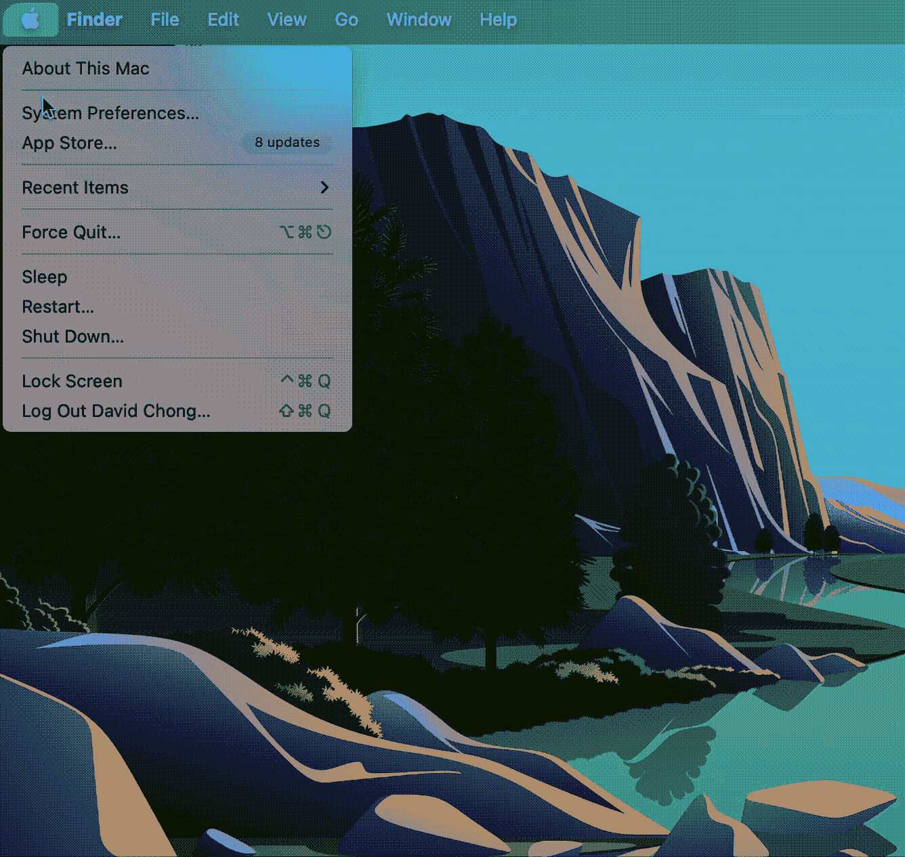

如何将 Caps Lock 键重新映射到 Esc (GIF by Author)

## **从 dock 中移除所有不必要的应用程序并隐藏起来**

来吧伙计们，Spotlight ( `**⌘ space**`)可以打开你需要的一切。没必要点击你的 dock。这是我的极简 dock 的样子。


我的 MacBook Pro Dock(图片作者提供)

## **触控板**

我的偏好是将我的跟踪速度保持在离最右边(最快的)选择大约 2 个标记处。您可以从`**System Preferences > TrackPad > Point & Click**`调整这些设置。

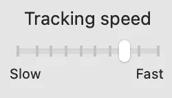

我的跟踪速度设置(图片由作者提供)

# 命令行工具

## [**自制**](https://docs.brew.sh/Installation)

我不能强调获得 MacOS 的这个包管理器有多重要。它管理(安装、更新、删除)你需要的所有苹果没有为你预装的软件包。

要安装它，打开*终端*并运行:

```
/bin/bash -c "$(curl -fsSL https://raw.githubusercontent.com/Homebrew/install/master/install.sh)"
```

安装后，您现在可以使用`brew install <pkg_name>`安装软件包。要升级软件包，使用`brew upgrade <pkg_name>`，最后要删除软件包，使用`brew uninstall <pkg_name>`。

我们将使用`brew`来安装下面的一些包。

## [**iTerm2**](https://iterm2.com/)

Vinicius 在他的[文章](https://betterprogramming.pub/how-to-set-up-your-macbook-for-web-development-in-2021-a7a1f53f6462#f4ca)中提到 iTerm2 是 Mac 内置终端的可选替代品。老实说，对我来说这是强制性的替换。查看不同之处:

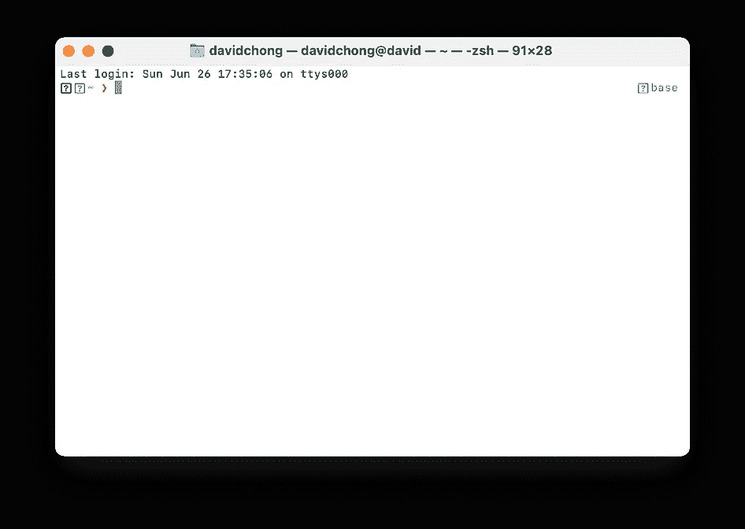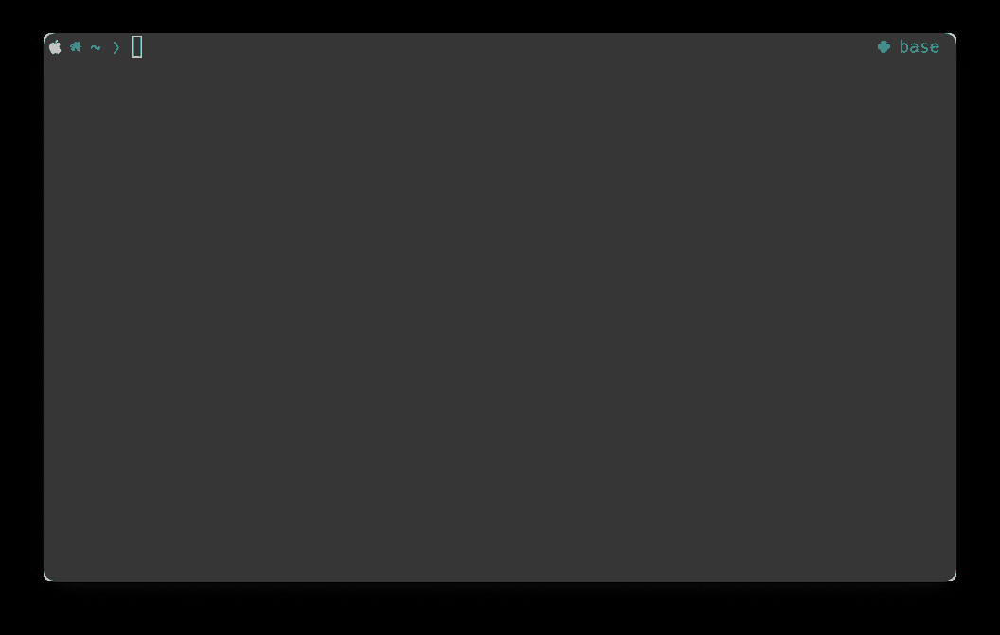

左:终端；右图:iTerm2(作者图片)

我不知道你怎么想，但是右手边的终端看起来更性感，更不用说它的使用了。

要安装，在*终端*中运行以下程序:

```
brew install --cask iterm2
```

从此以后， *iTerm2* 将永远取代*终端*应用。向*终点站*告别。

你一定在想——“嘿，我已经安装了 iTerm2，但它没有你的性感，大卫。”别担心，我的孩子，这是你接下来要安装的。

## [**哦我的 Zsh**](https://github.com/ohmyzsh/ohmyzsh)**+**[**power level 10k**](https://github.com/romkatv/powerlevel10k)**主题**

[*哦我的 zsh*](https://github.com/ohmyzsh/ohmyzsh) 有 147k 颗星是有原因的。这对任何开发者来说都是绝对必要的，因为它包含数百个插件和主题来配置你的 zsh。

要安装 oh my zsh，请在 *iTerm2* 中运行以下命令:

```
sh -c "$(curl -fsSL https://raw.githubusercontent.com/ohmyzsh/ohmyzsh/master/tools/install.sh)"
```

接下来，安装 [powerlevel10k](https://github.com/romkatv/powerlevel10k) 主题。(是的，我知道有很多主题，但我非常非常非常推荐这一个！)在你的终端上使用漂亮的字体和图标，非常容易设置，非常性感。

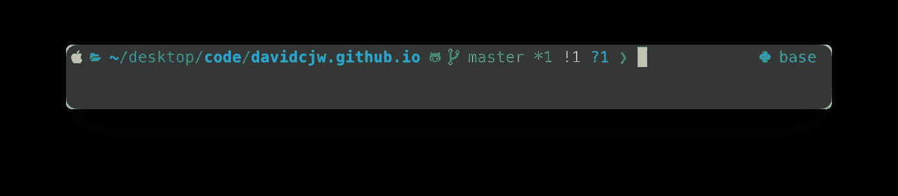

“p10k 配置”后我的 iTerm2 外壳

为了安装它，我们将再次使用`brew`(git repo 上列出了许多其他安装选项):

```
brew install romkatv/powerlevel10k/powerlevel10k
echo "source $(brew --prefix)/opt/powerlevel10k/powerlevel10k.zsh-theme" >>~/.zshrc
```

要配置 p10k 以实现上述效果，请在 iTerm2 中运行以下命令，并按照安装向导进行定制:

```
p10k configure
```

## 哦，我的 Zsh 插件

oh my zsh 的强大之处在于所有可以添加到 shell 体验中的插件。以下是我最少安装的内容:

`**zsh-autosuggestions**` —我们每天在命令行上发布数百条命令。这个插件有助于自动建议您以前使用过的命令，您可以使用→键接受建议。当您不记得一个确切的命令或者您有一个想要修改的长命令时，这特别有用。要安装:

```
git clone https://github.com/zsh-users/zsh-autosuggestions $ZSH_CUSTOM/plugins/zsh-autosuggestions
```

`**zsh-syntax-highlighting**` —这个插件给你输入的命令添加色彩。使用以下方式安装，告别枯燥的白色文本:

```
git clone https://github.com/zsh-users/zsh-syntax-highlighting.git ${ZSH_CUSTOM:-~/.oh-my-zsh/custom}/plugins/zsh-syntax-highlighting
```

安装自定义插件后，我们可以通过将其添加到`$HOME/.zshrc`中要加载的插件列表来启用它们:

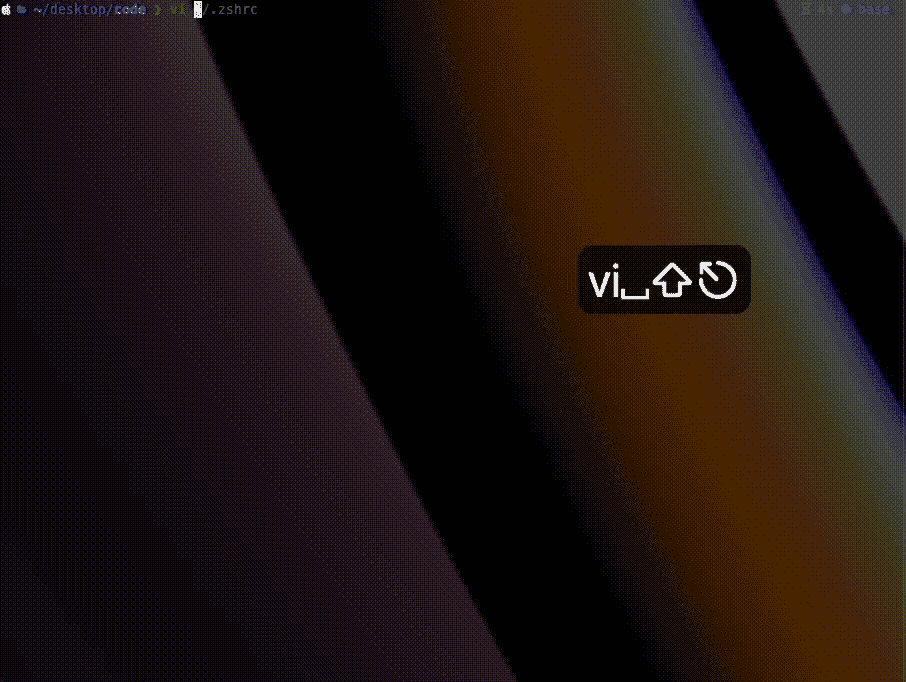

在 zshrc 中修改插件(GIF 由作者提供)

> ***注*** *:自定义插件安装在* `*$HOME/.oh-my-zsh/custom/plugins*` *。*

## **外壳别名**

为了加快终端上的命令，我们总是需要别名。它减少了击键次数，提高了开发人员的效率。对我来说，我在`$HOME/.local/include`中写下我所有的别名，并在`$HOME/.zshrc`中包含这个片段。

```
# .zshrc
for file in $HOME/.local/include/*;
  do source $file
done
```

在文件夹`$HOME/.local/include`中，您可以在别名中包含 shell 脚本。举个例子:

```
# File: my_aliases.sh# Apple system related
alias turnonbt='blueutil --power 1'
alias turnoffbt='blueutil --power 0'
alias turnoffsleep='sudo pmset -a sleep 0; sudo pmset -a hibernatemode 0; sudo pmset -a disablesleep 1'
alias turnonsleep='sudo pmset -a sleep 1; sudo pmset -a hibernatemode 3; sudo pmset -a disablesleep 0'# Git
alias gpom='git pull origin master'
alias gmo='git merge origin'
alias gc='git checkout'
alias gs='git status'
alias gcm='git commit -m'
alias ga='git add'
alias gb='git branch'
alias gf='git fetch'
alias gp='git pull'
alias gr='git restore'
alias push='git push origin'
alias pull='git pull origin'
alias stash='git stash'
alias sapply='git stash apply'# Docker
alias di='docker images list'
alias dcp='docker container prune -f'
alias di='docker images'
alias dpa='docker ps -a'
alias dp='docker pull'
alias drf='docker rmi -f'
alias dsp='docker system prune -f'# Other examples
alias tf='terraform'
alias kcl='kubectl'
...
```

**奖金:如何在不连接电源适配器的情况下，在屏幕盖关闭的情况下将 MacBook 连接到外部显示器:**

我不知道你们是否尝试过在没有电源适配器的情况下将闭合的笔记本电脑连接到外部设备，但我确实尝试过。这个命令是真正的救命稻草:

```
sudo pmset -a sleep 0; sudo pmset -a hibernatemode 0; sudo pmset -a disablesleep 1
```

这里的诀窍是禁用睡眠。这样做会模糊睡眠笔记本电脑的选项，允许您关闭笔记本电脑并将其连接到外部显示器:

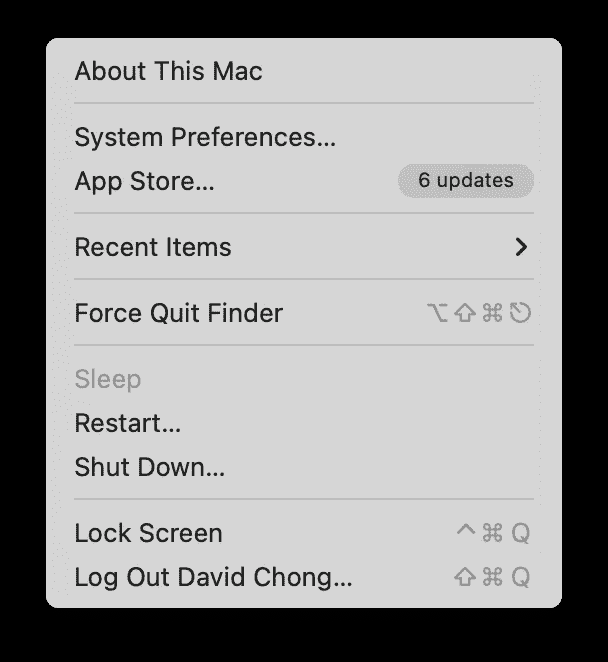

为了让您的生活更简单，让我们将它变成一个别名，以便在您需要时禁用和启用它:

```
# to disable sleep
alias turnoffsleep='sudo pmset -a sleep 0; sudo pmset -a hibernatemode 0; sudo pmset -a disablesleep 1'# to enable sleep
alias turnonsleep='sudo pmset -a sleep 1; sudo pmset -a hibernatemode 3; sudo pmset -a disablesleep 0'
```

## 使用自制软件安装的其他应用程序

*   **Docker** : `brew install --cask docker`(苹果硅 MAC 请从[这里](https://docs.docker.com/desktop/mac/apple-silicon/)下载)
*   **Git** : `brew install git`
*   **库贝克** : `brew install kubectl`
*   **kube txx**&**kubens**:`brew install kubectx`
    一款超级好用的工具，你绝对应该和`kubectl`一起手动安装。`kubectx`允许您轻松管理 K8s 上下文，而`kubens`对您的名称空间做同样的事情。

```
# Get current context and lists all contexts
**kubectx**# Switch context
**kubectx <context_name>**# Switch back to previous context
**kubectx -**# For namespaces, simply replace `kubectx` with `kubens`
```

*   **VScode** : `brew install --cask visual-studio-code`。现在可以使用`code <dir>`从命令行打开 VSCode。例如，要打开当前目录中的 VSCode，使用`code .`。
*   这个漂亮的工具可以帮助你通过命令行界面管理你的蓝牙系统！如果你像我一样想通过键盘做任何事情，你肯定需要这个。
*   这是一个交互式进程查看器，允许您查看系统上正在运行的进程。它显示你的 PID，内存，cpu 的使用和更多！

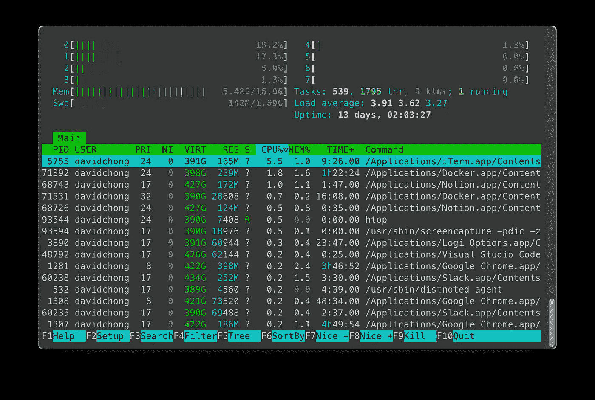

htop 窗口(作者截图)

# Python 环境

## 点

`pip` (Python 的包管理器)应该已经安装在你的系统上了。要更新它:

```
pip install -U pip
```

## 康达

我也喜欢安装`conda`，因为其他一些项目使用`conda`来管理依赖关系。要安装，去它的官方网站[这里](https://www.anaconda.com/products/distribution)，因为它包含了英特尔和苹果硅 MAC 的不同版本。

## Pyenv

由于我们不想使用系统内置的 Python2，我通常会安装另一个 Python 环境管理器，比如`pyenv`。但是要小心，因为安装多个这样的程序会试图修改你的`$PATH`变量。

```
brew update
brew install pyenv
```

如果你不确定，一定要检查你正在使用的 Python 解释器。

```
which python
```

要安装特定版本的 Python，请使用:

```
pyenv install <py_version>
pyenv global <py_version>  # set global version
```

# VSCode 设置

## 扩展ˌ扩张

以下是我在日常工作中*必须*安装的扩展的非详尽列表:

*   **Docker**[*ms-azure tools . vs code-Docker*]
*   **git lens**[*eamodio . git lens*]
*   **金贾**
*   Jupyter
*   **Kubernetes**[*ms-Kubernetes-tools . vs code-Kubernetes-tools*]
*   **皮兰斯**[*ms-python . vs code-皮兰斯* ]
*   **远程-ssh**[*ms-vs code-Remote . Remote-ssh*]
*   **远程容器**[*ms-vs code-Remote . Remote-containers*]
*   **迅雷客户端**[*rangav . vs code-迅雷客户端* ]
*   **VIM**[*vscodevim . VIM*
*   **YAML**[*red hat . vs code-YAML*]
*   **hashi corp terra form**[*4 ops . terra form*
*   **autoDocstring — Python 文档字符串生成器**[*njpwerner . autoDocstring*]

## 与 Oh My Zsh 的兼容性

因为我们使用 zsh 作为默认 shell，所以我们必须对设置进行一些更改，以便在 VSCode 终端上查看字体和图标。

打开*文件→首选项→设置* (PC)或*代码→首选项→设置* (Mac)，在*设置*选项卡顶部的搜索框中输入`terminal.integrated.fontFamily`，将下面的值设置为`MesloLGS NF`【3】。见下面的 GIF 快速指南。

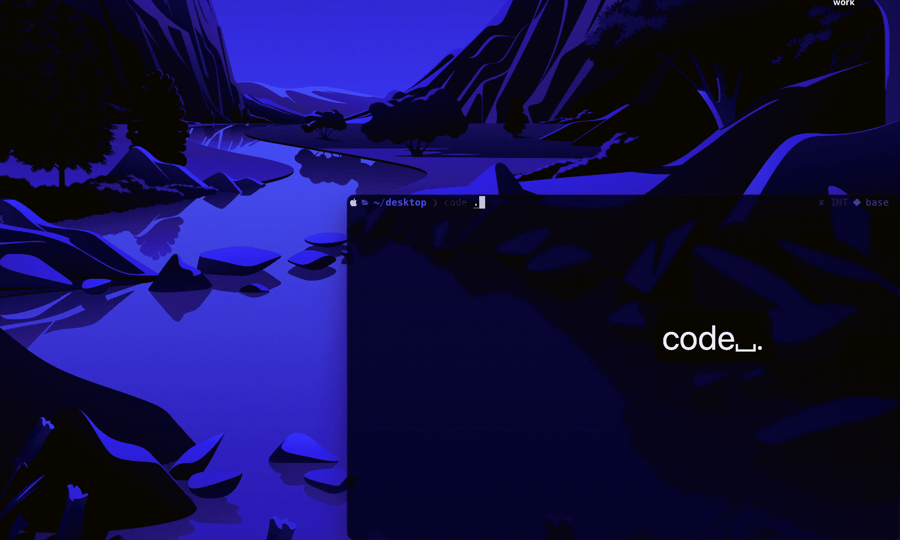

如何修改 VSCode 字体设置(GIF by Author)

## 主题、图标、字体/连字

*   一暗亲[ *庄同发. material-theme* ]
*   素材主题[*equinuscio . VSC-material-Theme*——**我用这个！**
*   材质主题图标[*equinuscio . VSC-material-Theme-Icons*—**我用这个！**
*   Fira 代码字体(附带连字！)作为编辑器字体系列。看看下面是什么样子:

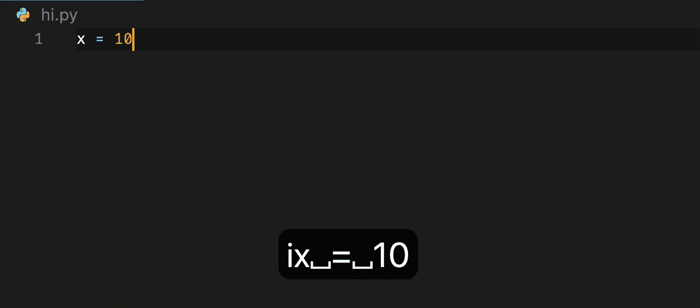

Fira 代码字体(及其连字)的外观(作者提供的 GIF)

要安装 Fira 代码，请运行以下命令:

```
brew tap homebrew/cask-fonts
brew install --cask font-fira-code
```

之后，通过以下方式在 VSCode 上启用该字体:

1.  启用连字—将 *settings.json* 中的`editor.fontLigatures`修改为`true`
2.  将`editor.fontFamily`修改为`Fira Code`

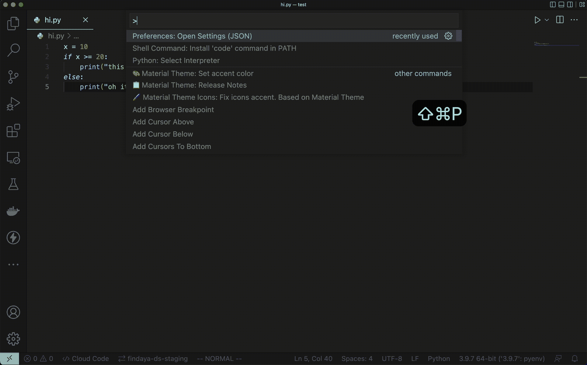

如何把字体改成 Fira 码(作者 GIF)

# 第三方应用

## [磁铁【付费】](https://apps.apple.com/us/app/magnet/id441258766?mt=12) / [长方形【免费】](https://rectangleapp.com/)

你在苹果电脑上唯一需要的付费应用，它改变了你的生活。它只是简单地将窗口固定到位。是的， *Windows* 有这个功能是免费的但是嘿，我们是苹果用户。必须支付保险费。

***编辑*** :我被告知事实上有一个等价的**免费**应用叫做 Rectangle！这里下载[。](https://rectangleapp.com/)

现在，让我们看看它是如何工作的。

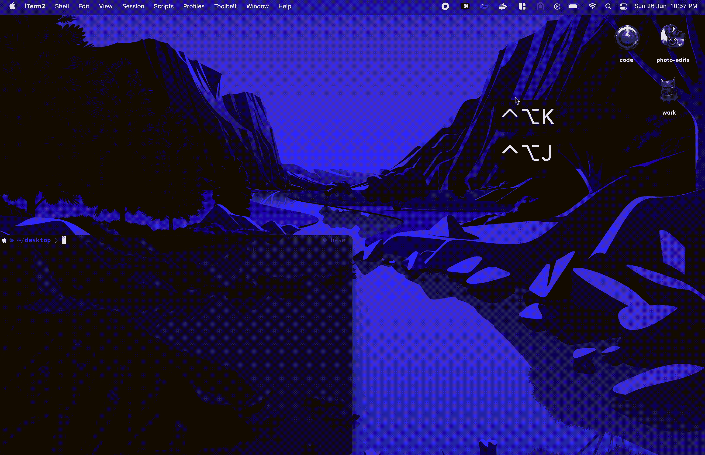

行动中的磁铁(作者 GIF)

## 波斯蒂科

我的 PostgreSQL 数据库客户端。在这里安装[。](https://eggerapps.at/postico/)

## [隧道步行者](https://tunnelblick.net/)

这是 OpenVPN 的必备 VPN 连接器，免费且易于使用。它很神奇，因为它允许你同时连接到多个 VPN。

## 邮递员

除了 Thunder 客户端(作为 VSCode 扩展安装在上面)，我的另一个客户端用于 API 测试。在这里安装它[并选择你的 Mac 版本。](https://www.postman.com/downloads/)

## 其他人

*   [WhatsApp](https://www.whatsapp.com/download//)
*   [电报](https://desktop.telegram.org/)
*   [不和谐](https://discord.com/download)
*   [松弛](https://slack.com/downloads/mac)
*   [键盘手](https://github.com/keycastr/keycastr)
*   [观念](https://www.notion.so/desktop)——我的知识库，在这里我巩固我所学的一切(*已过时，见下文*)
*   [黑曜石](https://obsidian.md/)——如果你没有读过，[我最近*刚刚*把我的生活切换到这个神奇的笔记工具](https://medium.com/gitconnected/the-one-reason-i-moved-from-notion-to-obsidian-as-an-engineer-68c4d78f412c)。

# 配件

## [MX 大师 3S](http://logitech.cfzu.net/Vye44E)

我平时根本不做硬件推广，但是我用了 [MX 主鼠系列](http://logitech.cfzu.net/n13n47)大概 5 年了(没错，我用 2S 用了那么久！)这绝对改变了生活，尤其是如果你有一台苹果电脑的话。

> 如果有一个硬件你必须得到伴随你的 Mac，它必须是这个。

三个手指滑动——左/右，四个手指滑动，两个手指滚动和其他触控板手势——这太麻烦了，尤其是当你的 MacBook 连接到显示器并使用外部键盘/鼠标时。


[Marios Gkortsilas](https://unsplash.com/@mr_mgk?utm_source=medium&utm_medium=referral) 在 [Unsplash](https://unsplash.com?utm_source=medium&utm_medium=referral) 拍摄的 MX Master 系列照片

使用 MX Master，可以将所有 Mac 手势分配给鼠标。以下是我如何定制我的:

1.  使用后退和前进按钮在桌面窗口之间切换
2.  使用手势按钮刷走现有窗口
3.  连接到多台机器/设备以传输文件(光标也从一台机器移动到另一台机器！又名*流*

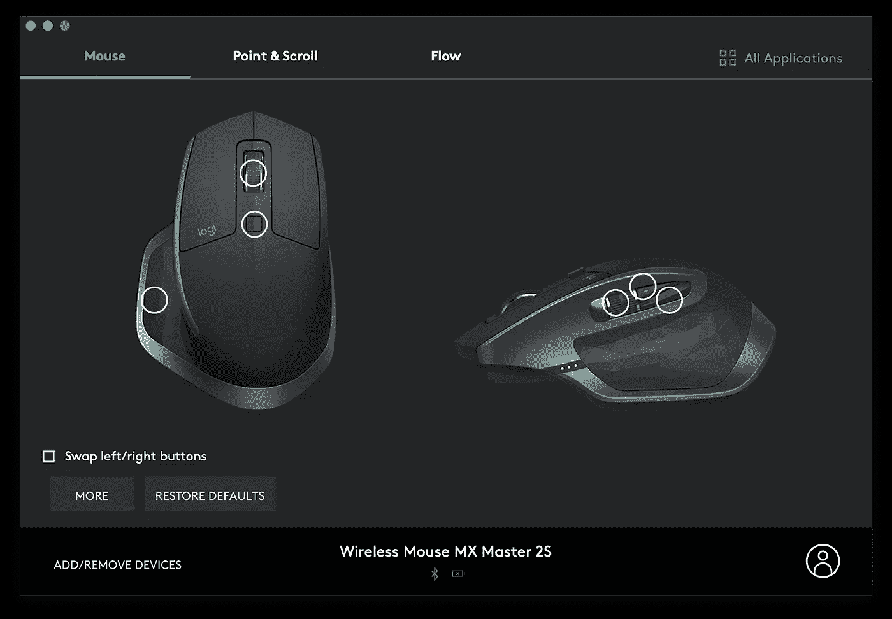

当然，还有其他超级时尚的功能，包括自由旋转滚动和逐行滚动之间的无障碍切换，几乎可以在所有表面上工作，水平滚动等等。

我肯定会期待从 MX Master 2S 升级到 [MX Master 3S](http://logitech.cfzu.net/Vye44E) 。

# Chrome 扩展

## [视频速度控制器](https://chrome.google.com/webstore/detail/video-speed-controller/nffaoalbilbmmfgbnbgppjihopabppdk?hl=en)

作为工程师(也是为了休闲🙂)，看视频能让我们快速学习。这个扩展允许你使用键盘控制视频在浏览器(包括 YouTube)上播放的速度。

`d`:视频加速 0.1
`s`:视频减速 0.1

## [Vimium](https://chrome.google.com/webstore/detail/vimium/dbepggeogbaibhgnhhndojpepiihcmeb?hl=en)

对于 Vim n3rds 伙伴来说，这是必备的。请注意，在某些网页上(例如 Google Docs)，您可能需要禁用此扩展，方法是将其添加到排除列表中。

## [黑暗阅读器](https://chrome.google.com/webstore/detail/dark-reader/eimadpbcbfnmbkopoojfekhnkhdbieeh?hl=en)

这个扩展允许你把任何网页变成黑暗模式。谁不喜欢黑暗模式是吧？

## [认证者](https://chrome.google.com/webstore/detail/authenticator/bhghoamapcdpbohphigoooaddinpkbai?hl=en)

在浏览器上方便地访问您的验证器应用程序上的代码。

## [**画中画**](https://chrome.google.com/webstore/detail/picture-in-picture-extens/hkgfoiooedgoejojocmhlaklaeopbecg?hl=en)

如果你像我一样喜欢通过 YouTube 学习东西，或者只是喜欢狂看 YouTube 视频，那么你现在可以在多任务处理的同时这样做了！画中画创建了一个无干扰的浮动 YouTube 窗口，你可以自由移动。再见了，YouTube 视频的尴尬的单标签窗口。

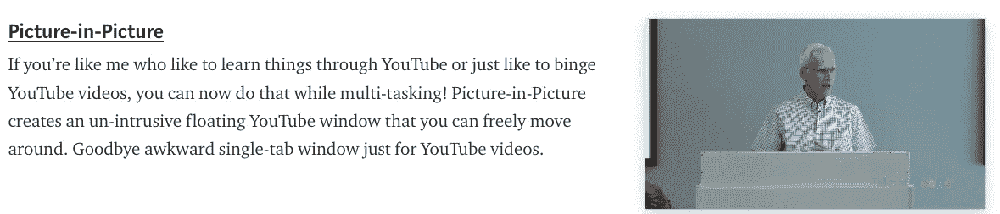

写这篇文章时我是如何观看 YouTube 视频的例子:)(图片由作者提供)

# 最后的话

安装新的 MacBook 时，有哪些必须做的事情？请在评论中告诉我！

大声喊出来[莱米·卡里姆](https://medium.com/u/c2958659896a?source=post_page-----88226f08bde2--------------------------------)回顾并分享了他的一些技巧和诀窍！

***支持我！*** —如果你喜欢我的内容并且*没有*订阅 Medium，请考虑支持我并通过我在这里的推荐链接[订阅](https://davidcjw.medium.com/membership) ( *注意:你的一部分会员费将作为推荐费*分摊给我)。否则，留下一个👏🏻鼓掌或💬注释也有助于算法！

# 参考

[1] [Sourabh Bajaj — Mac 设置](https://sourabhbajaj.com/mac-setup/)
【2】[如何在 2021 年为 Web 开发设置您的 Mac](https://betterprogramming.pub/how-to-set-up-your-macbook-for-web-development-in-2021-a7a1f53f6462#f4ca)—
vini cius De Antoni
【3】[power level 10k GitHub 安装指南](https://github.com/romkatv/powerlevel10k#meslo-nerd-font-patched-for-powerlevel10k)