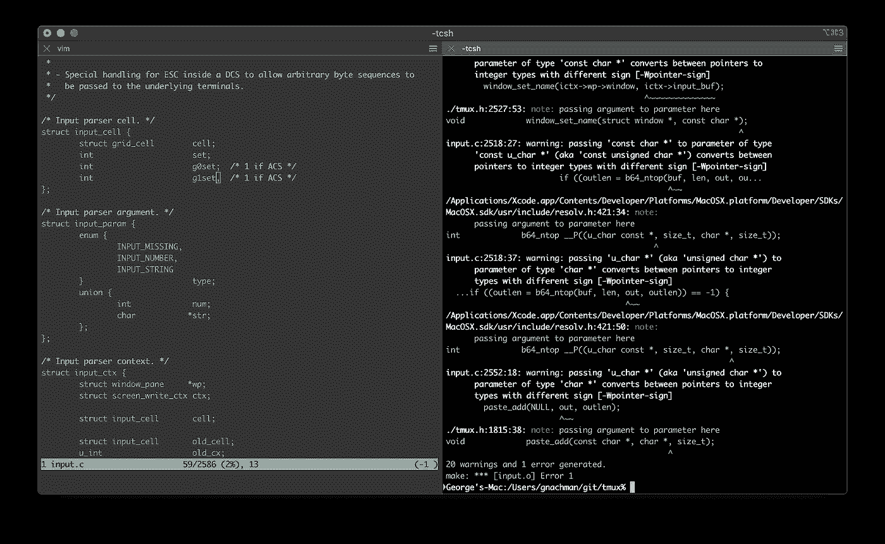
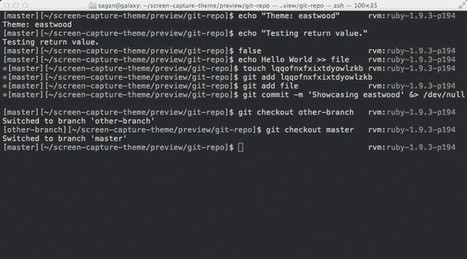
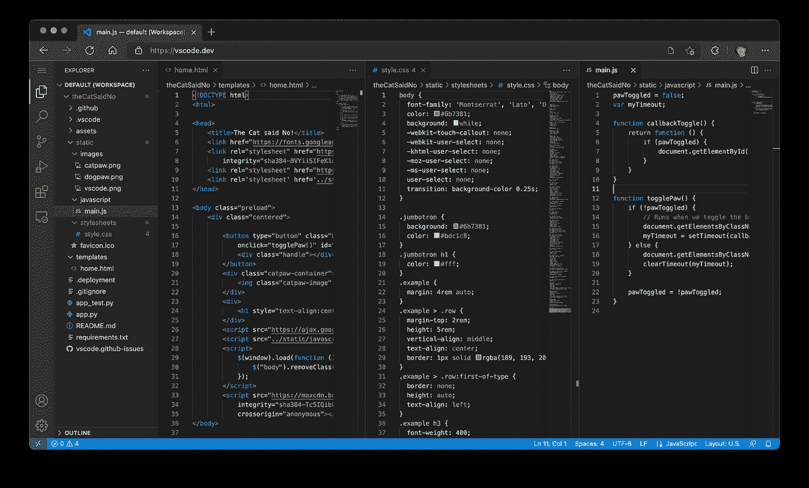
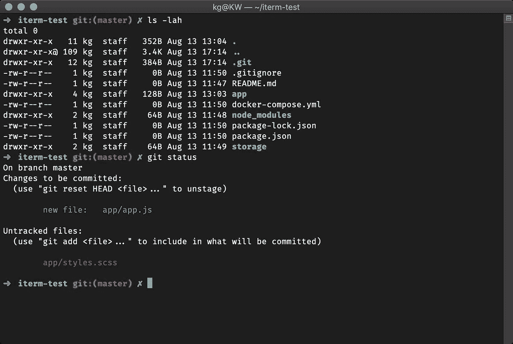
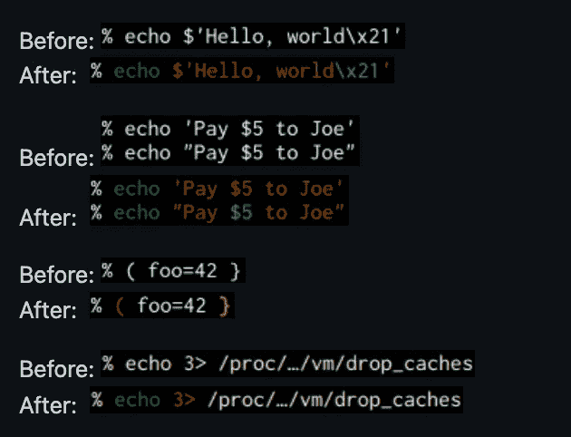
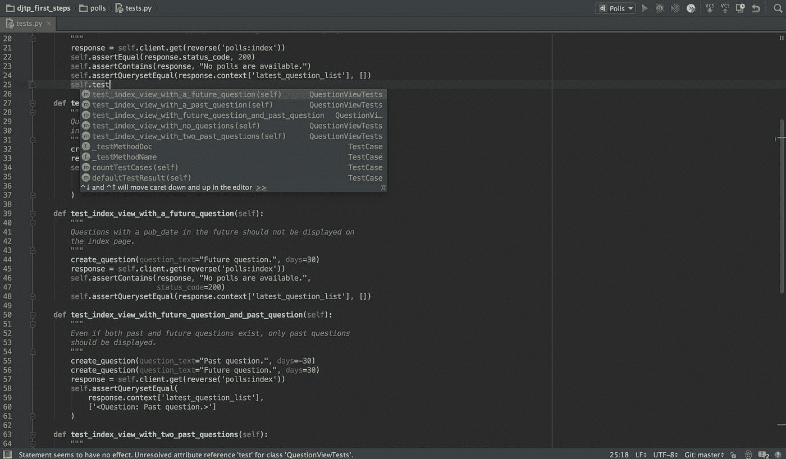

# 我如何为编程和数据科学设置我的新 Macbook Pro

> 原文：<https://towardsdatascience.com/how-i-set-up-my-new-macbook-pro-for-programming-and-data-science-505c69d2142>

艾通过作者创造艺术。 [*见上图 NFT*](https://opensea.io/accounts/createdd?ref=0xc36b01231a8f857b8751431c8011b09130ef92ec) *受* [*彼得·赫尔曼*](https://unsplash.com/@tama66)

# 目录

*   [简介](https://github.com/Createdd/Writing/blob/master/2022/articles/setupNewMac.md#intro)
*   [软件安装一个为什么](https://github.com/Createdd/Writing/blob/master/2022/articles/setupNewMac.md#software-to-install-an-why)
*   [矩形—排列窗口](https://github.com/Createdd/Writing/blob/master/2022/articles/setupNewMac.md#rectangle-arranging-windows)
*   [iTerm 和 zsh —终端和外壳](https://github.com/Createdd/Writing/blob/master/2022/articles/setupNewMac.md#iterm-and-zsh-terminal-and-shell)
*   [Brew —安装包](https://github.com/Createdd/Writing/blob/master/2022/articles/setupNewMac.md#brew-installing-packages)
*   [VS 代码](https://github.com/Createdd/Writing/blob/master/2022/articles/setupNewMac.md#vs-code)
*   [oh-my-zsh->zsh 的插件](https://github.com/Createdd/Writing/blob/master/2022/articles/setupNewMac.md#oh-my-zsh---plugins-for-zsh)
*   [数据科学相关](https://github.com/Createdd/Writing/blob/master/2022/articles/setupNewMac.md#data-science-related)
*   [Github](https://github.com/Createdd/Writing/blob/master/2022/articles/setupNewMac.md#github)
*   [其他](https://github.com/Createdd/Writing/blob/master/2022/articles/setupNewMac.md#other)
*   [操作系统相关](https://github.com/Createdd/Writing/blob/master/2022/articles/setupNewMac.md#os-related)
*   [总结](https://github.com/Createdd/Writing/blob/master/2022/articles/setupNewMac.md#wrap-up)
*   [免责声明](https://github.com/Createdd/Writing/blob/master/2022/articles/setupNewMac.md#disclaimer)
*   [关于](https://github.com/Createdd/Writing/blob/master/2022/articles/setupNewMac.md#about)

# 介绍

每次我拿到一台新的 Macbook，我都会按照相同的步骤来设置它，以适应我的工作体验。我想我会收集我的想法，并展示我安装的应用程序，以充分利用我的工作设置。我用的是 Macbook Pro。你也可以使用一些关于 Windows 安装的技巧和想法，但是，我主要关注 Mac。原因是我用过这两种系统，我发现 Mac 总是更容易使用。

# 要安装的软件及其原因

# 矩形->排列窗口

首先，我将安装[矩形](https://rectangleapp.com/)

来自官方文件；作者截图

这样做的原因是用快捷键重新安排窗口大小。我使用哪种桌面设置并不重要。多显示器、扩展坞等。我总是需要排列窗口的快捷方式。在当前虚拟桌面中，将它们放在一边、居中或最大化。

安装后，只需在安全和隐私设置中添加它的可访问性。然后就可以用了。

# iTerm 和 zsh ->终端和外壳

# iTerm ->更好的终端

[iTerm2](https://github.com/Createdd/Writing/blob/master/2022/articles/iterm2.com) — macOS 终端更换

来自官方文件；作者截图

iTerm 基本上是一个具有可配置选项的更好的终端。在他们的官方文档中可以找到一个特性列表:[https://iterm2.com/features.html](https://iterm2.com/features.html%C2%A0)

然后，我更改了一些设置:

1.  在 General > Closing:我删除了结束 iTerm 的确认。它总是阻止重启，我没有任何确认保存任何东西的用例。
2.  在 Appearance > Panes 中:我将边距值都改为 60。这使得一切更具可读性。
3.  在 Profiles > General 中:我创建了自己的配置文件，并将工作目录改为“重用以前会话的目录，以避免总是从主目录开始。
4.  在配置文件>颜色:我改变背景颜色为深蓝色
5.  在配置文件>窗口:我添加透明度和模糊
6.  在 Profiles > Keys > Key Mappings:我用预置的“自然文本编辑”替换了标准的，以便像使用其他编辑器一样使用命令和控制键

请随意探索更多选项！

# zsh ->更好的外壳

[https://ohmyz . sh](https://ohmyz.sh/)；来自官方文件；作者截图

你可以在这里找到插件的概述:[https://github.com/ohmyzsh/ohmyzsh/wiki/Plugins-Overview](https://github.com/ohmyzsh/ohmyzsh/wiki/Plugins-Overview%C2%A0)

请遵循官方指南进行安装。只需在你的终端输入`$ sh -c "$(curl -fsSL https://raw.github.com/ohmyzsh/ohmyzsh/master/tools/install.sh)"`。

暂时就这样了。

# 自制->安装包

[Homebrew](https://brew.sh/) 是“macOS(或 Linux)缺失的软件包管理器。”

只需按照他们的安装指南将`/bin/bash -c "$(curl -fsSL https://raw.githubusercontent.com/Homebrew/install/HEAD/install.sh)"`粘贴到终端上

之后，确保也执行终端提到的两个命令，即`echo 'eval ....`和`eval " ...`，它们将 bin 导出到您的路径中。你将需要这个来通过终端执行`brew`命令。

# VS 代码->神奇的编辑器

来自官方博客:[https://code.visualstudio.com/blogs/2021/10/20/vscode-dev](https://code.visualstudio.com/blogs/2021/10/20/vscode-dev)，来自官方文档；作者截图

我总是选择使用 VS 代码作为我的轻量级编辑器。它有如此多的选项可以定制，其基本形式是处理代码的最佳环境之一。

它可以通过多个(开源)扩展进行定制和供电:2017 年我写了一篇关于我最喜欢的扩展的文章。也可以随意查看->[https://medium . com/free-code-camp/favorite-vs-code-extensions-2017-786 ea 235812 f](https://medium.com/free-code-camp/favorite-vs-code-extensions-2017-786ea235812f)

我也使用 Pycharm 开发我的大部分代码，但是我仍然使用 VS 代码作为我的选择。有时候我只想改变几个文件，而不需要整个 Pycharm 初始化。那就是我用 VS 代码的时候。也适用于减价写作。就像我写文章一样。

下载 VSCode 并放入 Applications 文件夹后，用快捷键`⇧⌘P`打开命令面板，选择`"Install 'code' command in PATH"`。这样，你只需在你的终端上输入修复前的代码就可以打开文件。我们将在下一步中使用它。

# 哦，我的-zsh-> zsh 插件

[https://ohmyz.sh/](https://ohmyz.sh/)，来自公文；作者截图

# 终端的主题

有多个主题可以选择:[https://github.com/ohmyzsh/ohmyzsh/wiki/Themes](https://github.com/ohmyzsh/ohmyzsh/wiki/Themes)

我总是用 robbyrussell

来自官方文件；作者截图

它简单明了，给了我处理代码时需要的所有信息。这是默认设置。但是，如果你想改变它或查看文件，请按照说明操作。

为了设置主题，我参考了以下文档:

> *要启用主题，请在~/中将 ZSH 主题设置为主题名称。zshrc，之前采购哦我的 Zsh 例如:ZSH _ 主题=robbyrussell 如果你不想启用任何主题，只需将 ZSH _ 主题设置为空白:ZSH _ 主题= " "因此我只需键入代码~/。用 vs 代码打开我的 zsh 配置文件。*

之后重启 iTerm 重新加载你的主题，它应该看起来像截图中的样子:

来自官方文件；作者截图

## 终端的语法突出显示

> *这个包为 shell zsh 提供了语法高亮。当命令在 zsh 提示符下输入到交互式终端时，它可以突出显示命令。这有助于在运行命令之前检查它们，尤其是在捕捉语法错误方面。*

来自官方文件；作者截图

安装它只需遵循安装指南:[zsh-syntax-highlighting/install . MD](https://github.com/zsh-users/zsh-syntax-highlighting/blob/master/INSTALL.md)

我们通过从下载`zsh-syntax-highlighting`来做到这一点

`git clone https://github.com/zsh-users/zsh-syntax-highlighting.git ${ZSH_CUSTOM:-~/.oh-my-zsh/custom}/plugins/zsh-syntax-highlighting`

并将其添加到`.zshrc file`的插件列表中。

重启 iTerm 或者打开一个新的会话，你就可以开始了。

## 终端的自动完成

[https://github.com/marlonrichert/zsh-autocomplete](https://github.com/marlonrichert/zsh-autocomplete)，来自公文；作者截图

> *它会根据历史记录和完成情况，在您键入命令时给出建议。*

同样，安装时，只需遵循他们文档中的说明:[https://github . com/zsh-users/zsh-auto suggestions/blob/master/install . MD](https://github.com/zsh-users/zsh-autosuggestions/blob/master/INSTALL.md)

`git clone https://github.com/zsh-users/zsh-autosuggestions ${ZSH_CUSTOM:-~/.oh-my-zsh/custom}/plugins/zsh-autosuggestions`

并将它添加到您的`.zshrc` 文件的插件部分。

重启 iTerm 或者打开一个新的会话，你就可以开始了。

# 数据科学相关

# 蟒蛇

->[www.anaconda.com](http://www.anaconda.com/)

这种安装的主要原因是它的包管理系统。对于大多数事情和概念验证来说，这是为您的数据科学相关工作创建合适环境的良好开端。特别是用不同的 python 版本来管理它可以成为救命稻草。我尝试了多种其他方法，直到现在，Anaconda 仍然是管理环境/包最轻松的方法。

您只需下载所需操作系统的版本，并附带安装包。

# （舞台上由人扮的）静态画面

当我的团队使用 Tableau 并且购买了桌面许可时，我安装了 Tableau 桌面版来完成我的大部分 Tableau 工作簿。这是因为直到今天撰写本文时，Tableau Server 仍然缺少一些处理大型商业智能分析的关键功能。在我看来，桌面版本价格昂贵。然而，这是一个好产品。

# 数据科学工作的 Pycharm

来自官方文件；作者截图

查看他们的官方主页，浏览为什么它很适合你的需求:[https://www.jetbrains.com/pycharm/](https://www.jetbrains.com/pycharm/)

JetBrains 使用 Pycharm 的原因是，在我的整个工作经历中，它向我展示了这是处理大型数据科学项目的最佳一体化解决方案。即使您可以定制用于大型项目的 VS 代码，我认为 Pycharm 仍然比其他的有优势。

用于连接数据库和处理查询的 Datagrip 扩展非常好用，让我的生活变得更加轻松。

从调试、构建项目、执行代码等等。，得到你目前能得到的最佳体验。它不仅处理数据库部分，还允许 web 开发集成和其他东西，如 Jupyter 笔记本。我仍然使用 Jupyter notebook 来获得详细的探索代码(查看我在 Juypter notebooks 上的文章)，但总的来说，这是我的首选软件，也是我的程序员笔记本电脑上的必备软件。

# 开源代码库

为了使用 Github，安装 Github CLI 是非常好的。

遵循他们文件上的说明。通过简单地执行`brew install gh`用自制软件安装它

在克隆存储库之前，您需要设置身份验证。

这是通过`gh auth login`完成的。只需遵循所有说明。然后你可以直接用

`gh repo clone REPO_NAME`

# 其他的

# 微软办公

使用微软 office 的主要原因是 Excel。许多公司都经常使用 Excel，但就功能而言，它仍然是无可匹敌的。由于客户经常发送带有各种功能的 excel 表格，我也需要使用 Excel。更多关于它的官方文件:[https://www.microsoft.com/en/microsoft-365](https://www.microsoft.com/en/microsoft-365%C2%A0)

# 操作系统相关

# 夜班

几年前，我用各种软件帮助我减少电脑屏幕上的蓝光。现在你可以很容易地使用 macOS nigh shift 功能。

点击这里了解:【https://support.apple.com/en-us/HT2

本质上，它让你的屏幕在夜间更“橙色”。原因是研究表明蓝光会妨碍良好的睡眠。随着许多程序员工作到深夜，这对我来说是一个游戏规则的改变。这对我帮助很大。这就是为什么我总是把它设置成暖色调。对于一个设计师来说，这是行不通的，但是对于一个程序员来说，这不是问题。只需注意更强烈的橙色调。

# 码头

当你得到一台新的 Mac 电脑时，你会发现屏幕底部有一个 Dock，里面有很多垃圾应用程序。所以，我做的是

*   去掉所有不必要的东西。除了经常使用的应用程序，我什么都不用。比如 pycharm，iterm，chrome，finder。就是这样。由于 spotlight 功能是在 mac 上推出的，因此不需要在 Dock 中放置任何应用程序。它们只会让景色变得杂乱
*   将 Dock 移动到右侧。现代的屏幕总是比高的长。我们不想因为这个停靠栏自动隐藏停靠栏而失去更多的高度空间。正如我所说，我们不想失去屏幕尺寸。

# 包裹

就是这样。这是我开始在工作中使用的每一台 Macbook 的设置。除了这些变化，当然还有各种特定软件的设置变化，但这些将在另一篇文章中讨论。如果你喜欢这篇文章，请留下一些掌声，如果你有任何意见，请发表评论。

# 你可能喜欢的其他文章

 [## Jupyter 笔记本还是实验室还是 VS 代码？

### 为什么不是全部？

towardsdatascience.com](/jupyter-notebook-or-lab-or-vs-code-b772f8388911)  [## 开发和销售 Python API —从头到尾教程

### 本文从头到尾描述了开发 Python API 的过程，并在更困难的领域提供了帮助。

towardsdatascience.com](/develop-and-sell-a-python-api-from-start-to-end-tutorial-9a038e433966)  [## 使用 Python 亲自检查数据声明

### 公共媒体越来越多地使用数据可视化。使用您的 python 技能为自己验证声明。

towardsdatascience.com](/check-data-claims-yourself-with-python-an-example-8b8a92c0ae56) 

# 放弃

我与本文中使用的任何服务都没有关联。

我不认为自己是专家。除了做其他事情，我只是记录事情。因此，内容并不代表我的任何专业工作的质量，也不完全反映我对事物的看法。如果你觉得我错过了重要的步骤或者忽略了什么，可以考虑在评论区指出来或者联系我。

这是 2022 年 2 月 23 日写的。我无法监控我的所有文章。当你阅读这篇文章时，提示很可能已经过时，过程已经改变。

我总是乐于听取建设性的意见以及如何改进。

# 关于

丹尼尔是一名艺术家、企业家、软件开发人员和商业法毕业生。他的知识和兴趣目前围绕着编程机器学习应用程序及其所有相关方面。从本质上说，他认为自己是复杂环境的问题解决者，这在他的各种项目中都有所体现。

连接到:

*   [Allmylinks](https://allmylinks.com/createdd)

直接:

*   [领英](https://www.linkedin.com/in/createdd)
*   [Github](https://github.com/Createdd)
*   [中等](https://medium.com/@createdd)
*   [推特](https://twitter.com/_createdd)
*   [Instagram](https://www.instagram.com/create.dd/)
*   [createdd.com](https://www.createdd.com/)

艺术相关:

*   [公海](https://opensea.io/accounts/createdd?ref=0xc36b01231a8f857b8751431c8011b09130ef92ec)
*   [Instagram/art_and_ai](https://www.instagram.com/art_and_ai/)
*   [稀有](https://app.rarible.com/createdd/collectibles)
*   [已知产地](https://knownorigin.io/profile/0xC36b01231a8F857B8751431c8011b09130ef92eC)
*   中等/最先进的
*   [魔鬼艺术](https://www.deviantart.com/createdd1010/)