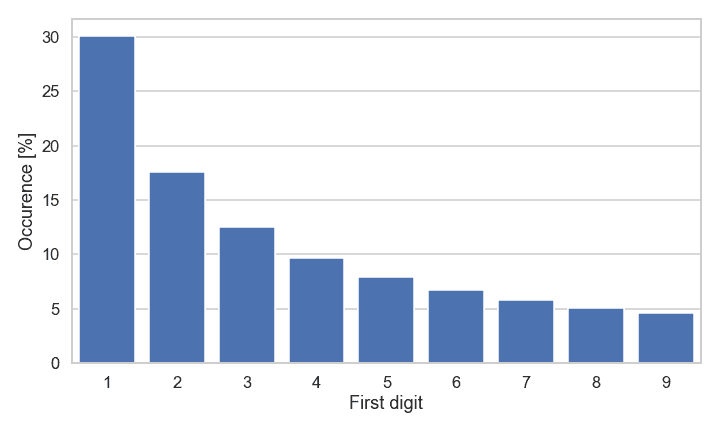
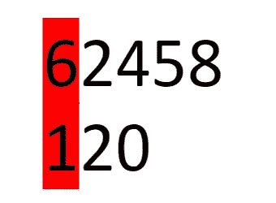
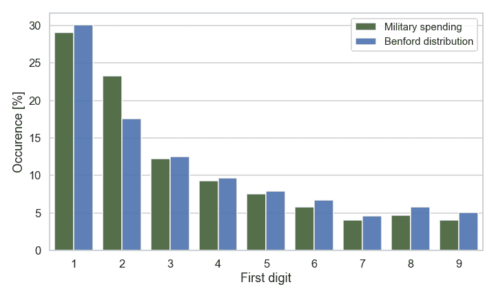
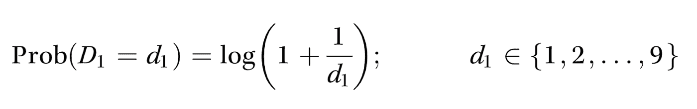
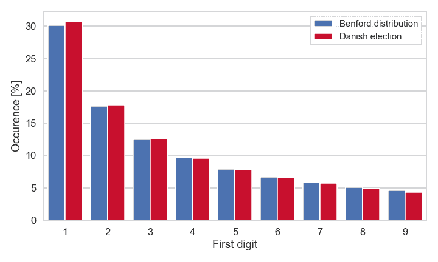
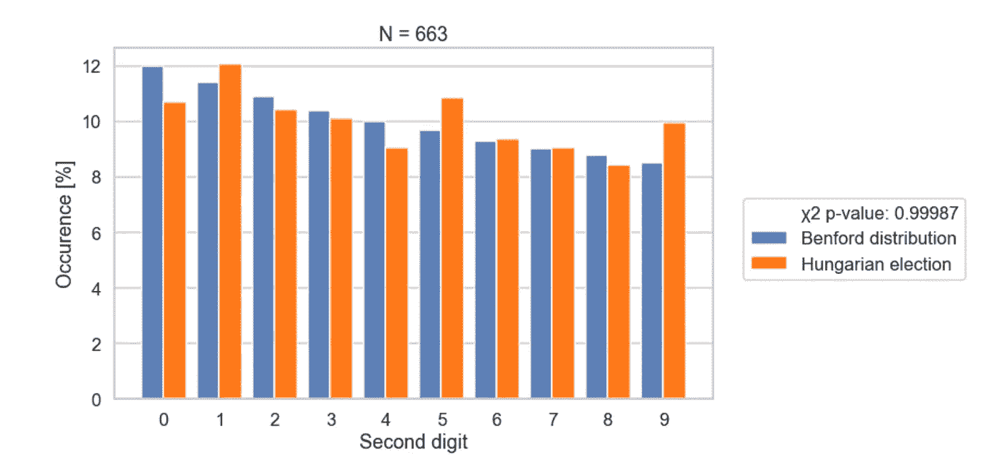
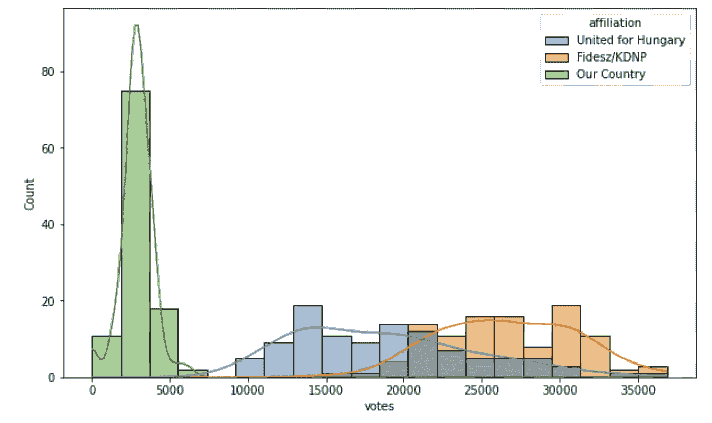

# 我是如何用本福德定律测试匈牙利选举的舞弊行为的

> 原文：<https://towardsdatascience.com/how-i-tested-the-hungarian-election-for-fraud-using-benfords-law-2d32ea92fe7c>

## 我使用本福德定律测试了几个数据集，了解了其中的优势和缺陷。

*根据本福特定律分配第一位数。除非另有说明，所有图片均为作者所有*

我最近偶然发现了一个叫做本福德定律的概念。我正在听一个丹麦的[播客](https://podcasts.apple.com/dk/podcast/frederik-forklarer-internettet/id1592268946)——主持人介绍了一个概念，如果你对数据集中每个数字的第一个数字求和，每个数字的出现应该遵循一定的分布。他说，这可以被用作[检测税务欺诈](https://www.forbes.com/sites/taxnotes/2021/08/19/can-benfords-law-detect-tax-fraud/)和[标记虚假社交媒体简介](https://firstmonday.org/ojs/index.php/fm/article/view/10163/8063#:~:text=An%20account%20on%20social%20media,each%20of%20the%20account%27s%20friends.)的一种方式。

这里用红色标记的是一个数字的第一个数字。

**什么是本福德定律？**

[定律](https://en.wikipedia.org/wiki/Benford's_law)基本上表明，任何自然产生的数据集的第一个数字的总和应该遵循这种分布:大多数数字，30%以 1 开头，17 %以 2 开头，依此类推，如第一幅图所示。

“这听起来不太对，”我起初想。我在学校学过[中心极限定理](https://en.wikipedia.org/wiki/Central_limit_theorem)，也只是直觉上*觉得*不对。

在结束播客后，我立即测试了 BL 关于自 1970 年以来世界上所有国家的年度军费开支(因为我当时是出于其他原因而查看这些数据)。脱离政治背景，这些数字看起来是随机的，因此应该是一个完美的测试数据集。结果成功了！

BL 第一位数分布与世界军事预算第一位数分布的比较

至少上图中第一个数字的分布看起来非常相似。为了进一步测试，我做了卡方拟合优度测试。

对于α = 0.05 的显著性水平，与本福特分布的比较支持预测分布和观察分布之间无差异的零假设(χ 2 = 0.970，df = 8，p = 0.9984)。

也就是说**1970 年以来世界各国军费预算的第一位数字都遵循本福特定律。我还是觉得很诡异，就一头扎进了背后的逻辑。**

**原来这是简单的数学，这种类型的数据往往符合对数正态分布，第一个数字的概率可以表示如下:**

****

**我不打算解释它工作的更深层次的数学原因，但是如果你感兴趣，你可以在这里阅读[，在这里](https://en.wikipedia.org/wiki/Benford%27s_law)阅读[，在这里](https://medium.com/towards-data-science/what-is-benfords-law-and-why-is-it-important-for-data-science-312cb8b61048)阅读[。](https://mathworld.wolfram.com/BenfordsLaw.html)**

****它如何检测欺诈？****

**好的，播客主持人说商业智能可以用来检测欺诈。这是怎么回事？**

**数据集符合 BL 的条件之一是数据必须是随机生成的，如果 1)它们不受最大值和最小值的限制，2)它们没有被分配数字，那么它们就是随机生成的。**

**我认为假设世界上河流的长度是随机分布的是安全的。世界各国的军事预算似乎也是如此。**

****选举数据****

**那么选举数据呢？如果一个特定的候选人在特定的投票站获得 1000 或 999 张选票，我们会认为这是随机的。这意味着，如果没有发生操纵，选举数据应该遵循 BL。**

**首先，我想测试一次合法的选举，与匈牙利的选举进行比较。在丹麦，我假设选举欺诈的概率非常低，所以我测试了 2019 年丹麦上次选举的数据。这里的数据是免费提供的。**

**从这个国家的所有投票站得到每个政党的所有选票，我得到了一个 18714 个投票号码的列表。**

****

**本福特分布和丹麦投票站数据的第一位数分布进行了比较。**

**对于α = 0.05 的显著性水平，与本福特分布的比较支持预测分布和观察分布之间无差异的零假设(χ 2 = 0.046，df = 8，p = 0.9999)。**

**所以投票站的投票数据绝对符合 BL。**

**让我们花点时间想想这意味着什么。我们期望数字的随机分布符合 BL，但是当然这些数字可以根据 BL 被操纵*，欺诈或不公平也可能以不影响第一个数字的方式发生。因此 BL 不能*证明*不存在欺诈**。*****

**所以丹麦选举中没有明显的舞弊——正如预期的那样——但是匈牙利人呢？**

****匈牙利选举数据****

**欧盟成员国匈牙利刚刚在 2022 年 4 月 3 日再次选举其总理维克托·欧尔班。由于乌克兰战争和欧尔班与俄罗斯总统普京的密切关系，一些[猜测选民的反弹](https://www.youtube.com/watch?v=XtTOnqkxZoY)，但欧尔班的青年民主党/KDNP 联盟赢得了[议会 199 个](https://vtr.valasztas.hu/ogy2022)席位中的 135 个席位的压倒性多数。**

**虽然欧尔班确实受到了大量匈牙利公众的青睐，但一些组织一直在关注匈牙利的民主状况:媒体偏见和选举欺诈。**

**这场巨大的胜利，以及对匈牙利民主的所有担忧，让这场选举成为一些选举辩论的绝佳候选。**

**我没有找到可供下载的公开的投票站数据集——但我在匈牙利官方公投网站[上找到了选区投票号码。为了获得数据，我写了一个小的 scraper 脚本，可以在我的 GitHub 页面](https://vtr.valasztas.hu/ogy2022)上找到，还有用来创建本文中所示图表的分析笔记本。你可以自己尝试一下！scraper 给了我 663 个数据点的选区投票数据集**

****

**这次我们看到了实质性的差异，零假设被拒绝(p 值为 0.004 < 0.05).**

**So in this case the data does not conform to Benford’s distribution. I was so excited when I saw this result. It shows that Victor Orbans win was not genuine. Or what?**

****对本福特选举取证定律的批评****

**在发现匈牙利选举的数据不符合 BL 后，我做了更多的研究。2020 年，当像我这样的互联网人用本福德定律来“证明”美国总统选举存在欺诈时，用本福德定律测试选举受到了几位专家的严厉批评。严厉的批评可能也是因为这一次前总统唐纳德·特朗普(Donald Trump)试图抹黑选举结果，所以每个人都在担心是否会正确。**

**在本文中，路透社事实核查小组联系了本福德法律和选举取证方面的几位专家。他们都同意 BL 不能作为证据，而仅仅是一个可以促使进一步调查的危险信号。在美国 2020 年总统选举的具体案例中，投票站的小规模使数据集违反了数据跨越几个数量级的规则。他们还表示，如果您想使用 BL，您需要进行第二位数字分析，因为它对选区大小不太敏感。**

**了解到这一点后，我在匈牙利选举中测试了 2BL，即本福特第二位数定律。2BL 的工作方式与 BL 类似，但数字分布略有不同。结果是:2BL 分析与匈牙利的投票数据非常吻合。**

****

**所以当你这样看的时候，匈牙利的选举很符合基本法，这表明没有理由在这个问题上发出任何危险信号。**

****第一个数字不工作的原因****

**那么为什么 BL 测试对第一位数字不起作用呢？看看在议会中获得席位的三个政党之间的票数分布。我们可以看到，在 20K 和 40K 之间有很多选票，这将解释第二和第三位数字的超额代表。下一次，这是我要做的第一个图，看看 BL 测试是否可行。**

****

**进入议会的三个政党的投票数分布。很明显，有很多数字的第一个数字是 2 和 3——因此给出了倾斜的第一个数字 BL 测试**

****结论:****

**本福德定律是一个有趣而令人惊讶的概念——但当用它来检测选举欺诈时，你需要小心——数据集可能会因为操纵以外的其他原因而偏离本福德分布，即使这样，它也只能被用作发出危险信号的方法——而不是证明欺诈。**

**一路上我玩得很开心，也学到了很多东西！在 LinkedIn 和 GitHub 上随意联系，谈论更多关于选举舞弊、数据科学或任何介于两者之间的事情！**