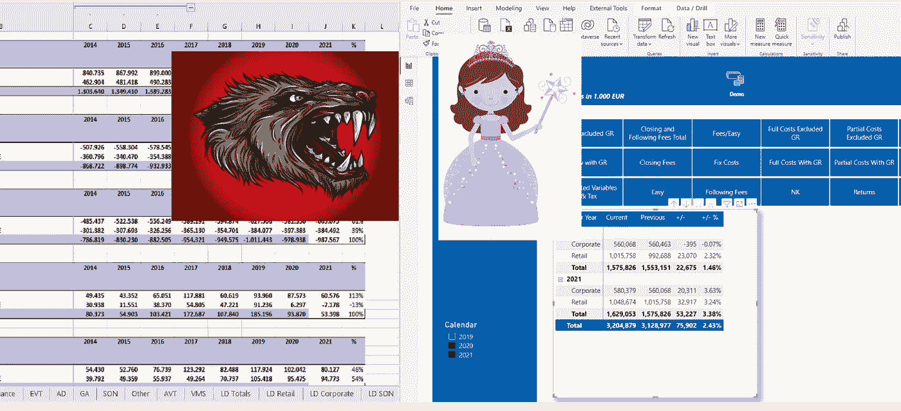
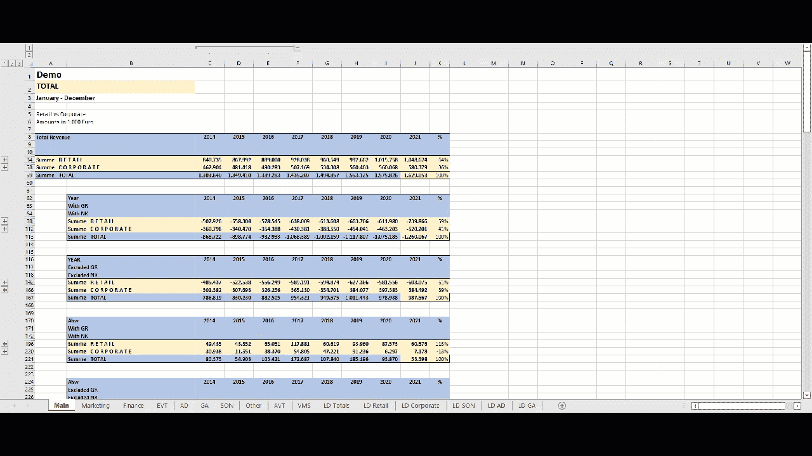
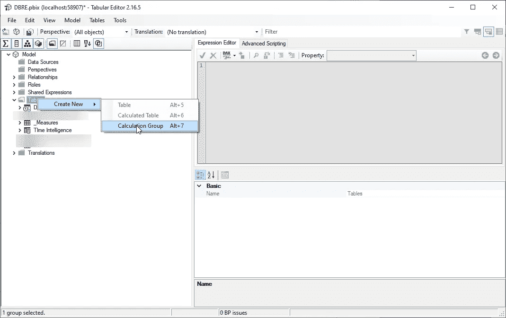
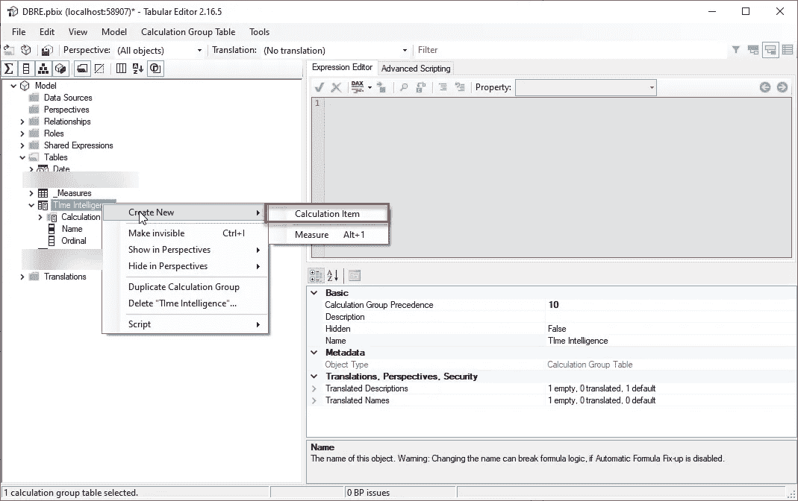
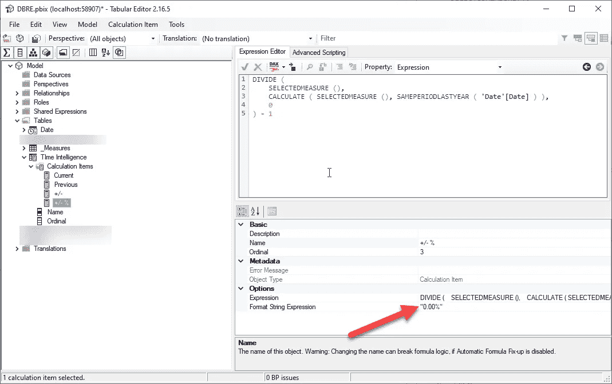
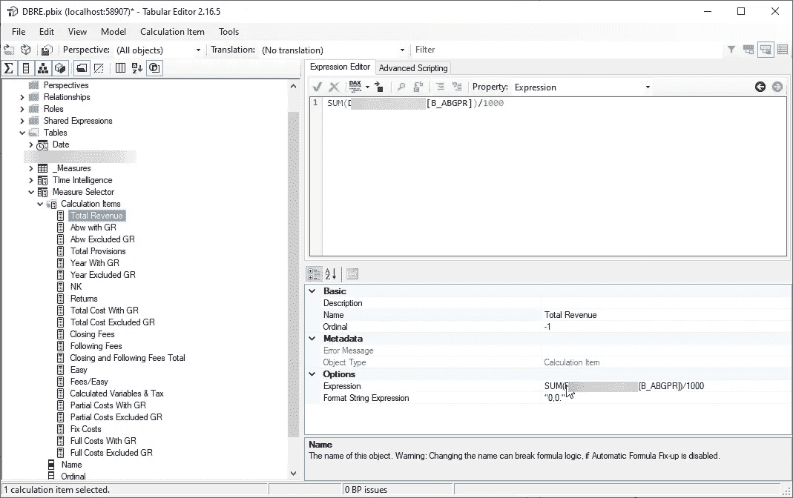
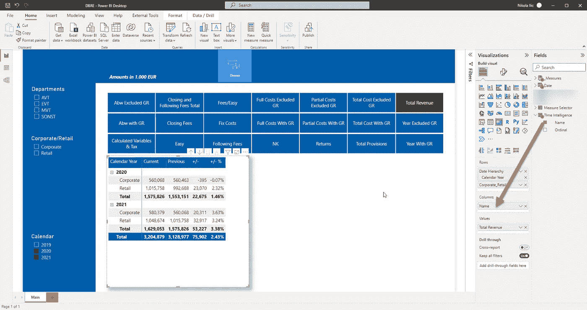
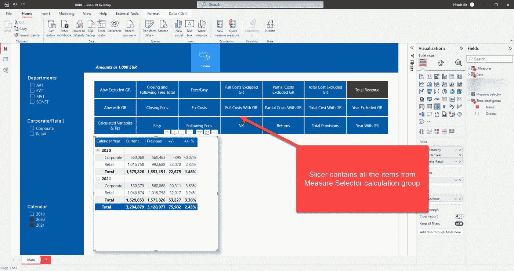
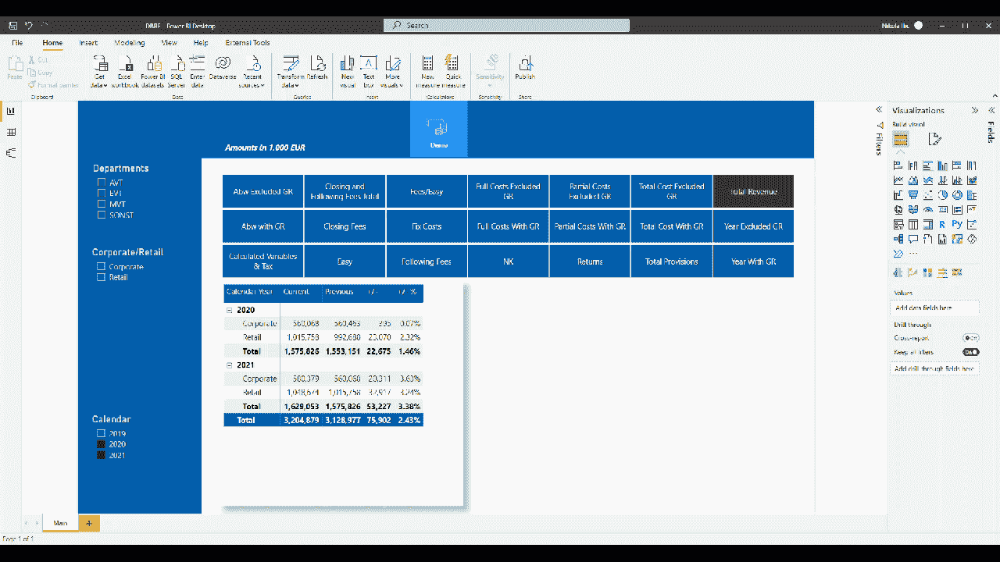

# 我是如何将 Excel“怪物”转化为 BI“美女”的

> 原文：<https://towardsdatascience.com/how-i-transformed-excel-monster-into-power-bi-beauty-c7ba8395959c>

## 在 Power BI 中，从 18 个 Excel 表格中的 380 个表格到单个报告页面中的一个表格，您认为如何？！魔法？奇迹？
查看计算组如何帮助您实现(im)可能性！



作者图片

亲爱的读者，在你继续之前，请记住下面的例子是一个真实的用例！ 当然，本文中的数字和指标进行了调整，以避免丢弃真实的客户数据，但其结构和整体思想与现实中 100%相同！

就在最近，我正在处理为一个客户改进报告的任务。当前的设置如下:Excel 报表，构建在一个巨大的 CSV 文件之上(从其中聚合数据)，有 18 个选项卡，每个选项卡中有 21 个表格！大概是这样的:



作者图片

如您所见，主表单上有 21 个表格。每个表只包含一个指标(按年度和零售与公司细分)…这同样适用于营销表，它包含完全相同的指标，唯一的区别是数字经过过滤，只包含与营销部门相关的数据。而且，您猜怎么着:每个后续的表都包含相同的度量组，与特定的业务线相关。主工作表合并了其他工作表中的数据，显示整个公司的总计。

现在，如果你问我，这是一个可怕的解决方案，因为大多数数据都是冗余的，很难找到任何见解，更不用说在部门之间进行基本的比较了！在 18 个单独的表格中上下滚动，同时试图对齐数字——不要误解我的意思，但这必须是一个更好的方法！

# 搭建舞台—介绍 Power BI

正如我在之前的一篇文章中所描述的，设计高效分析解决方案的第一步也是最重要的一步是[了解业务问题](https://medium.com/p/85db9e2d745b)！一旦您确定了需要回答的关键业务问题，您就可以将注意力转移到寻找最佳工具和技术上。

经过最初的讨论，我们得出结论，Power BI 应该是首选工具，而不是 Excel。好吧，我们检查了一个框，但是下一个明显的问题是:向消费者呈现相同数据的最佳方式是什么？我们应该利用哪种技术或功能来充分利用现有的数据？我的意思是，我们可以简单地将 Excel 中的逻辑复制/粘贴到 Power BI 中，也许还可以在这个过程中添加一些很酷的可视化效果……但是，这是最适合我们用户的吗？

***如果我告诉你，最终的解决方案只有一个报告页面，上面只有一个表格，那会怎么样？*** 让我给你算一下:而不是 18 张，每张 21 个表格(这是 ca。总共 380 个表)，我们将在一个报告页面上使用一个表来实现相同的结果！不信任我？！只要继续读下去…

# 为工作选择正确的工具—计算组

经过一些修补，我决定尝试计算组。对于那些不知道的人来说，这是表格模型的一个非常强大的特性(因此，它不是 Power BI 独有的特性，因为您也可以在 Analysis Services 表格中利用它)。

解释计算组及其工作方式超出了本文的范围，但是我强烈建议查看[马尔科和阿尔贝托关于该主题的文章](https://www.sqlbi.com/blog/marco/2020/07/15/creating-calculation-groups-in-power-bi-desktop/)，或者查看由来自埃斯布林纳的[伯纳特·阿古罗撰写的许多精彩帖子中的一篇，在那里您还可以找到一些超出基础的计算组实现。](https://www.esbrina-ba.com/tag/calculation-groups/)

因此，想法如下:由于我们基本上在每个 Excel 表中使用相同的计算集(本年度值、上一年度值、本年度和上一年度之间的比较)，为什么不创建一个计算组来处理所有必要的计算，然后让用户可以选择应用计算的指标(收入、成本、准备金等)。).根据用户的选择，相应的指标及其所有计算项目将显示在表格中…听起来很混乱？相信我，这比你想象的要容易…

# 构建解决方案

如果你想使用计算组，你需要的第一件东西是[表格编辑器](https://tabulareditor.com/)，因为目前还不能从 Power BI Desktop 创建计算组。我真诚地希望您了解表格编辑器，并且正在使用它，这不仅仅是因为计算组，还因为许多其他[非常有用的特性](https://medium.com/p/6140d90d2cac)，这些特性使 Power BI 开发人员的生活变得更加轻松:)

一旦我们打开表格编辑器(我在这个演示中使用免费版本的表格编辑器)，第一步是创建一个新的计算组。右键单击表并选择创建新的计算组:



作者图片

我将我的计算组命名为“时间智能”，现在我们开始在计算组中定义我们的计算项。右键单击计算组，选择添加新的计算项:



作者图片

下一步是定义所选计算的当前值。这里，我将简单地使用下面的语法:

```
SELECTEDMEASURE()
```

让我停下来解释一下这个 SELECTEDMEASURE()是什么意思。这将被用作对当前上下文中的度量的引用。它可以是销售额、订单数量等等…在我们的场景中，这将是总收入、总成本、供应等等。

接下来，我们要计算前一年范围内的度量值。因此，我将使用以下公式创建另一个名为 Previous 的计算项:

```
CALCULATE(
    SELECTEDMEASURE(),
    SAMEPERIODLASTYEAR('Date'[Date])
    )
```

我们在报告中需要的第三个计算项目是当前值和前一年的比较:

```
SELECTEDMEASURE() - CALCULATE(
    SELECTEDMEASURE(),
    SAMEPERIODLASTYEAR('Date'[Date])
    )
```

最后，我们还想将这一差异显示为百分比，因此让我们创建第四个计算项:

```
DIVIDE (
    SELECTEDMEASURE (),
    CALCULATE ( SELECTEDMEASURE (), SAMEPERIODLASTYEAR ( 'Date'[Date] ) ),
    0
) - 1
```

对于这一项，我们还需要确保它的格式正确，因此在“格式字符串表达式”属性下，我将对其进行设置以显示百分比:



作者图片

还可以通过设置 Ordinal 属性的值来重新排列组内项目的顺序。在上图中，您可以看到“+/- %”项目的序号值为 3，而前面的项目分别被指定为 0、1 和 2，这意味着“+/- %”项目将在组中最后显示。

现在，由于我们希望用户能够选择在表中显示哪个指标，我将创建一个额外的计算组，并将其命名为 Measure Selector。然后，我将为每个指标定义计算项，如下所示:



作者图片

您可以在这里看到我们的所有指标，因此我现在将保存对数据模型的更改，关闭表格编辑器并返回 Power BI Desktop 以构建报告:



作者图片

正如您可能注意到的上图，我已经将 Name 从 Time Intelligence 计算组拖到我的 matrix visual 上作为列，将我的总收入度量作为值，并将 Calendar Year 和 Corporate/Retail 放在行上。

此外，上面的切片器(是的，这是一个常规切片器可视格式，用于提醒按钮)包含度量选择器计算组中的所有计算项。



作者图片

在左侧，我已经[创建了一个切片器窗格](https://medium.com/p/911248b39348)，用户可以在其中轻松地在部门或公司与零售之间切换。用户还可以从日历切片器中选择特定的年份。

最后，让我们看看如果我在切片器中选择不同的指标会发生什么:



作者图片

## 这太棒了。

正如您所看到的，一旦我在切片器中选择了不同的指标，表格中的数字就会发生变化(在演示文件中我省略了其他的视觉效果)。如果仔细观察，切片器中有 21 个项目，每个 Excel 表中的每个表都有一个项目。所以，我们只有一张桌子，而不是 21 张！

左侧的过滤器取代了创建单独表格的需要，因为现在可以在当前报告页面的范围内对数据进行切片和切块！

# 结论

从 21 张表格中的 ***380 个表格到单个报表页面上的一个表格*** 你怎么称呼？！魔法？奇迹？

通过利用表格模型中的计算组功能，我能够构建一个显著降低复杂性的解决方案，并使报表用户能够快速轻松地从底层数据中获得洞察力。

更不用说可伸缩性了，想象一下我们需要添加 10 个新指标或添加一个新过滤器(即部门)，而不是在每个表中创建 10 个额外的表，或为新部门引入额外的表，我们可以简单地扩展现有的计算组，并继续使用我们的单页报告解决方案！

感谢阅读！

[成为会员，阅读媒体上的每一个故事！](https://datamozart.medium.com/membership)