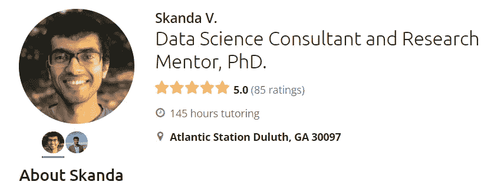
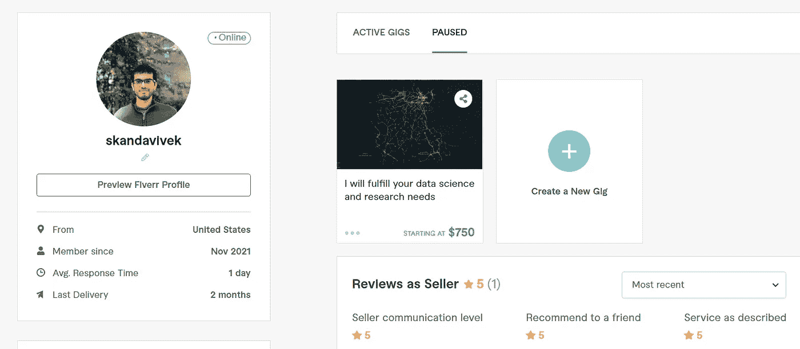
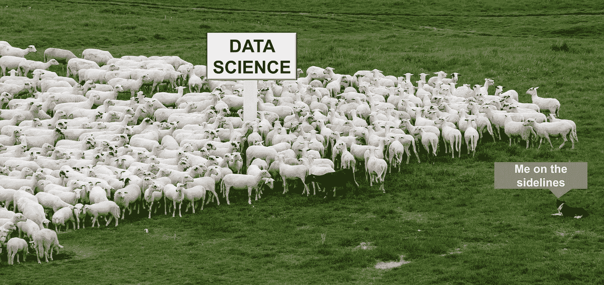
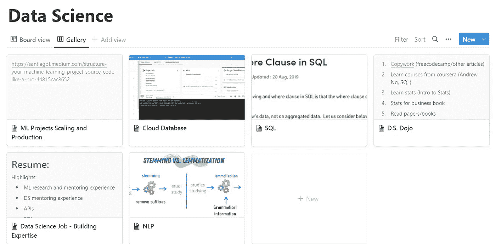

# 我如何从学术界过渡到数据科学行业

> 原文：<https://towardsdatascience.com/how-i-transitioned-from-academia-to-the-data-science-industry-d5e00479fea1>

## 一天，我意识到是时候开始新的冒险了。以下是持续不断的小努力如何为我的下一个角色打下基础。

[https://pxhere.com/en/photo/1284568](https://pxhere.com/en/photo/1284568)

我想分享我从学术界过渡到数据科学的经历，因为这可能会让许多有类似经历的人受益。更广泛地说，我的经历也有助于为实现你的目标打下坚实的基础——过渡到一个完全不同的领域。

大概从 10 岁开始，我就一直想成为一名科学家。因为许多近亲都是学术界的科学家——获得博士学位，然后是博士后，最后成为教授是我的目标。这个目标在很多年里都是遥不可及的，因为我在学校是个糟糕的学生。但是，当我开始从解决高等物理和微积分问题中获得乐趣，而我的朋友们更关心分数而不是科目时，这一切都改变了。我在大学时下定决心要追寻我的梦想，成为一名物理学家。

从那以后，通过努力工作和奉献精神的结合，以及我寻找解决研究问题的天生的创造性倾向，事情相对顺利。我在印度著名的 IIT 获得硕士学位，在埃默里大学获得博士学位，在佐治亚理工学院获得博士后学位。所有的迹象都表明我走在正确的道路上。在我读博士期间。我被埃默里大学物理系授予了最佳研究生奖，在 PNAS 发表了一篇[第一作者论文](https://www.pnas.org/doi/10.1073/pnas.1607226113)，并有许多其他合著出版物。在我博士后期间，我在 GeorgiaTech 博士后研讨会上被授予机器人相关研究的最佳演讲人，我的工作在 [Forbes](https://www.forbes.com/sites/jamiecartereurope/2019/03/05/hacked-driverless-cars-could-cause-collisions-and-gridlock-in-cities-say-researchers/?sh=5a6bc1bd2a09) 、 [BBC](https://www.bbc.co.uk/programmes/w3csz97y) 等媒体上被广泛报道。我给出这个背景来说明我是如何专注于学术界的，以及为什么享受你此刻正在做的事情是重要的。

最后，我在佐治亚·格温纳特学院找到了一个教职——这是一所位于亚特兰大地区的本科学院。我很享受在那里的时光，可以自由地教授我自己设计的课程，选择研究项目，并拥有自己的大部分时间。在 GGC 的第三年快结束时，我决定是时候改变一下了。一个月后，我找到了一份高级数据科学家的新工作。然而，这并不意味着我只准备了一个月。在这里，我谈谈我过去三年的努力是如何成为我人生旅程的垫脚石的。

# 使用数据进行研究

我一直对理解世界上的模式非常感兴趣。因此，当我作为博士后有时间开发一个独立的研究项目时，我想把交通模式作为一个物理问题来探索。最终，我们对网络攻击后交通模式将如何瓦解做出了初步估计。为了这个项目，我研究了大量交通数据——包括来自谷歌、HERE API、纽约市出租车数据、开放街道地图等的数据。我还开发了一个简单的算法，通过本地摄像头追踪车速。

> 虽然我在这些项目中使用的数据科学方法没有一个是突破性的，但它让我在现实世界的背景下获得了数据提取、清理和一些基本机器学习的实践经验。

# 数据孵化器奖学金

我参加了为期 8 周的远程数据科学研究。当时我对学术更感兴趣，但如果我找不到学术职位，我希望数据科学成为下一个选择。我得到了一堆奖学金项目的面试机会，几乎是一份工作邀请。我的顶点项目也在推介之夜得到了强调。最终，我决定不去芝加哥的一家公司实地考察，因为几天前我的妻子刚刚生下我们的双胞胎，我也刚刚在 GGC 大学找到了一份学术教授的工作。这项奖学金最重要的一点是，它让我接触到了同龄人，其中大多数人在获得奖学金后选择了数据科学，并让我大致了解了入门级数据科学家的技术技能和要求。另一个不能轻描淡写的方面是它给我带来的心理优势。

> 在 TDI 之前，我感觉自己像一个精通 python 的物理学家。在 TDI 之后，我感觉自己像一个数据科学家。

这是在 2019 年，但这种心态此后一直存在。

# 博客

我在 Medium 上的第一篇文章是在 2019 年 10 月——[如果下一次大规模黑客攻击涉及到你的车辆而不是你的安全摄像头，会怎么样？这一个月来，它的表现令人沮丧，获得了大约 20 次浏览。但是那时我不知道向更大的出版物投稿。一位来自初创公司(当时 Medium 最大的出版物)的编辑联系我，让我发表这篇文章。从那以后，我一直在顶级媒体出版物上发表文章，尤其是在数据科学方面。](https://medium.com/p/45ba0895861d)

> 与更大的数据科学社区发布和分享我的工作帮助我在求职面试过程中脱颖而出。

# 咨询、辅导、指导

我开始阅读人们如何在像 Fiverr 和 Upwork 这样的平台上销售数据科学服务的故事。与此同时，我在读博士期间也尝试过在公共辅导平台上创建导师账户——尽管我从未真正跟进过。

当我在在线平台上做实验时，我偶然发现了对数据科学辅导的巨大需求。因此，许多大学和学院已经开始提供数据科学硕士课程和本科生专业。我有几个好学生，他们重视我的辅导课，给了我很好的评价。随着时间和收视率的增加，我增加了每小时的费用。令人惊讶的是，我发现当我提高速度时，请求并没有显著减少。事实上，我收到了来自哈佛、哥伦比亚、伯克利等顶尖大学的学生。我甚至给一个人辅导了一个学期，这个人的父亲是一家财富 500 强公司的首席执行官。我还获得了一个长期客户，他就开发图像对象检测平台向我提供咨询。

塞犍陀·维韦克

我在 Fiverr 上也取得了一些成功。

塞犍陀·维韦克

> 咨询和辅导帮助我通过学习先进的机器学习技术和帮助客户实现目标而获得报酬。

# 面试，面试，面试…

当我决定转型时，我的数据科学咨询和辅导经历让我有点紧张。我想肯定的是，就业市场上肯定有大量的申请者——因为每个学院或大学似乎都在开设 DS 课程。

德国科隆:科隆南桥(klner süDBRücke)的一群牧羊狗和一只黑羊

然而，只有在 2022 年 3 月至 4 月的采访中，我才意识到两件事:

A.那段时间有创纪录数量的职位空缺(通货膨胀还不是一个问题)

B.每个自称是数据科学家或者有数据科学学位的人都是不称职的。

后者其实事后来看是显而易见的。我辅导了很多顶尖大学的学生，他们根本不知道自己在做什么。

> 与招聘人员的一次偶遇让我明白面试就像在健身房做练习。做得更多，你会做得更好。面试是求职过程中最重要的部分。你在面试中变得更好的唯一方法就是做更多的面试！

# 不要害怕失败

在你觉得准备好之前，不去面试是很自然的。但是如果你像我一样，你可能永远不会觉得自己 100%准备好了。这就是危险所在——陷入舒适区，为现在不是合适的时机找借口。

我几乎失声，因为一种不相关的流感在我的孩子们的日托所里传播。我申请了简历上有错误的工作。但我还是去面试了，尽管有时我的喉咙不配合。当我一周没有得到面试机会时，我修改了我的简历，让它更有吸引力。之后，招聘人员找到了我。

我发现的最糟糕和最具道德破坏性的工具之一是 Jobscan。我没有听到任何人对 Jobscan 说负面的话——但它对我不起作用。Jobscan 会扫描您的简历和职位发布，并给出匹配分数。我从未在求职扫描系统中获得过 20%或 30%以上的分数——他们建议只有当你的分数达到 70%或更高时才申请。如果我那样做了，我会把我的简历裁剪到今天！现在我得到了这份工作，我打赌我会从 Jobscan 得到更高的分数，因为我的简历上有这份工作(非常感谢 Jobscan…)。

# 记录下你不写博客的所有事情

如果你关注阿里·阿布达尔的 Youtube 频道，你会发现他在医学院非常成功，同时也成为了 Youtube 上的名人。他的生产力工具之一是使用概念做笔记。我使用概念来巩固我的 DS 知识；尤其是在工作面试的时候。它不是很有条理，但确实有用。

我的数据科学概念数据库|塞犍陀·维维克

# 结束语

成为新领域的“专家”不仅仅是有一个特定的目标，并实现它。至少对我来说，旅程比最终目的地重要得多。想一想——如果你决定了一个目标并实现了它，一旦实现了你会做什么？更有可能的是，在没有未来计划的情况下，你可能会崩溃和筋疲力尽。此外，大目标每天都在变化。如果你突然决定下一年的目标，然后明天又改变主意，会怎么样？

反之，如果你在不断的旅程中，享受每一刻；任何目的地都是前进道路上的一步。创造积极的习惯更有可能经受住不断变化的思想。如果你决定每周写博客并坚持 9 周，那么你不太可能在第十周就放弃。你可能会休息一会儿——但之后更容易回到状态。写了 30 篇博客后，招聘人员可能会联系你，你会得到一个面试机会，在那里你可以谈论你的博客，并得到一份理想的工作。

相比之下，我们的目标是一年后转到数据科学工作，而不是持续努力。这可能是一个不切实际的目标，尤其是如果你不能向别人展示你有相关的经验。许多成功人士也以其他方式表达这种巧妙的心理转变。

正如玛丽亚·莎拉波娃所说:

> “我执行的任务非常不同。这并不是说我有或者没有必要成为冠军。我正在学习，成长为一名更好的网球运动员。”— [玛丽亚·莎拉波娃](https://podcastnotes.org/tim-ferris-show/the-tim-ferriss-show-ep-261-maria-sharapova-mental-performance-work-life-balance-and-the-rise-to-the-top/)

Ravikanth Naval 说:

> "对行动不耐烦，但对**结果**有耐心."— [海军拉维坎特](https://twitter.com/naval/status/1131083134248734725)

在《微小的习惯》一书中，B.J .福格讨论了专注的日常小活动如何对你的生活产生巨大的积极影响。

最后，如果你对自己的转变持积极态度，并做出必要的努力——无论是写博客、发表研究、咨询、写书、在社交媒体上发帖、花时间发挥创造力等等。你正在做出最好的投资决定——投资于你的健康和成功，无论你是否到达了最初的目的地，或者发现了你想象不到的更棒的东西。

*如果你还不是中会员，想支持我这样的作家，可以通过我的推荐链接随意报名:*[*https://skanda-vivek.medium.com/membership*](https://skanda-vivek.medium.com/membership)

[*关注我*](https://medium.com/@skanda.vivek) *如果你喜欢这篇文章——我经常在数据科学、安全、物理和社会的界面上写作。*

*每周数据透视* [*订阅此处*](https://skandavivek.substack.com/) *！*