# 我如何在数据科学访谈中使用 Python 中的日期时间特性

> 原文：<https://towardsdatascience.com/how-i-use-datetime-features-in-python-in-data-science-interviews-5b17e68405fa>

## *使用 Python Pandas 的日期时间功能概述*


作者在 [Canva](https://canva.com/) 上创建的图片

在本文中，我们将研究 Python Pandas 中 DateTime 库的一些不同应用。就上下文而言，每当您必须在 Python 中操作表格数据时，您通常可以使用 Pandas 库来完成。就像您可以使用 Excel 或 Google Sheets 一样，Pandas 为您提供了更多处理结构化数据的能力。你可以在这里找到更多关于[熊猫生态系统的信息，也可以在这里](https://pandas.pydata.org/docs/ecosystem.html)阅读它的大量[文档。强大的熊猫技能是 Python 数据科学面试中最常见的期望之一。](https://pandas.pydata.org/pandas-docs/stable/index.html)

# Python Pandas 中的日期时间特性

日期时间操作是最常被问到的[数据科学面试问题](https://www.stratascratch.com/blog/40-data-science-interview-questions-from-top-companies/?utm_source=blog&utm_medium=click&utm_campaign=medium)之一。DateTime 数据集的普遍性和人们可以用看起来简单的数据实现的一系列复杂性使它成为一个流行的数据科学测试领域。Pandas 有许多 DateTime 函数，涵盖了广泛的 DateTime 用例，你可以在这里阅读关于它们的官方文档。

DateTime 函数最常见的一个用例是在清理数据时获取正确的日期格式。在许多情况下，您的日期时间数据太复杂，需要简化到一周中的某一天或一天中的某个小时。在其他情况下，您的数据没有日期或时间，您需要使用 DateTime 库为您的计算添加合理的日期。

为了实现这种格式化和丰富，Pandas 中的 DateTime 函数允许您将字符串或列解析为 DateTime 格式，生成定期的 DateTime 信息，从 DateTime 对象中提取日期或时间信息的子集，等等。

展示这些 Panda DateTime 函数如何工作的最佳方式是通过示例，因此我们将涵盖一些需要使用 DateTime 函数的 [Python 面试问题](https://www.stratascratch.com/blog/top-30-python-interview-questions-and-answers/?utm_source=blog&utm_medium=click&utm_campaign=medium)。

# 需要 Python Pandas DateTime 函数的访谈示例


作者在 [Canva](https://canva.com/) 上创建的图像

**如何使用 today()方法丰富日期时间数据**

我们要看的第一个例子有助于解决优步数据科学采访中的一个问题。

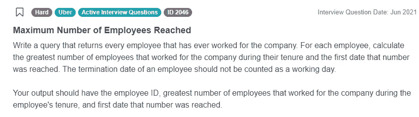

截图来自 [StrataScratch](https://platform.stratascratch.com/coding/2046-maximum-number-of-employees-reached?python=1&utm_source=blog&utm_medium=click&utm_campaign=medium)

问题链接:[https://platform . stratascratch . com/coding/2046-已达到最大员工数](https://platform.stratascratch.com/coding/2046-maximum-number-of-employees-reached?python=1&utm_source=blog&utm_medium=click&utm_campaign=medium)

这个问题要求我们查看在优步工作的每一位员工，并确定优步员工在任职期间的最大数量以及这个最大数量出现的第一个日期。

当谈到理解我们为什么必须使用日期时间函数时，我们通常必须首先分析数据集。在这个问题中，我们只有一个表 *uber_employees* 可供查看。

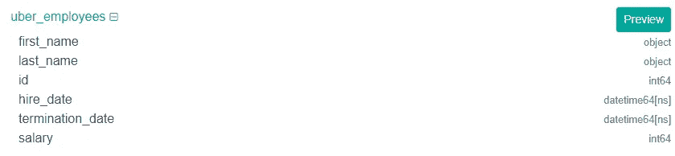

截图来自 [StrataScratch](https://platform.stratascratch.com/coding/2046-maximum-number-of-employees-reached?python=1&utm_source=blog&utm_medium=click&utm_campaign=medium)

以下是一些示例数据:

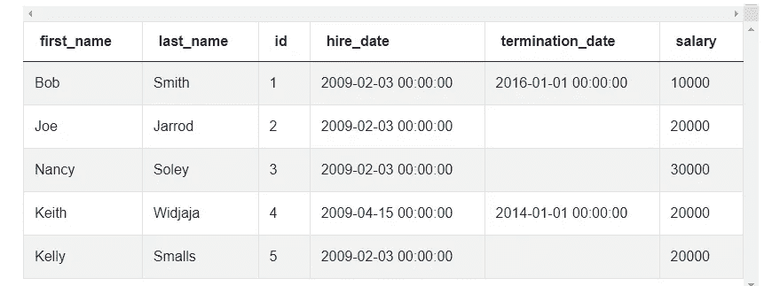

截图来自 [StrataScratch](https://platform.stratascratch.com/coding/2046-maximum-number-of-employees-reached?python=1&utm_source=blog&utm_medium=click&utm_campaign=medium)

拥有像雇佣日期和终止日期这样的日期时间列是不够的，我们需要调用日期时间库。相反，由于该数据包括仍在优步的雇员的 termination_date 列，我们不得不假设当前雇员的该列为空。这很重要，因为我们需要插入他们结束日期的实际数据，以计算雇佣范围并得出我们的解决方案。

为了丰富内容，我们将遍历表，如果存在终止日期，则将结束日期指定为终止日期，如果不存在终止日期，则将终止日期指定为今天。

```
import pandas as pd
import datetime as dt
for i in range(uber_employees.shape[0]):
    if uber_employees.at[i, 'termination_date'] is pd.NaT:
        end_date = dt.datetime.today()
    else: 
        end_date = uber_employees.at[i, 'termination_date']
```

注意 datetime 库最初是如何用别名 dt 导入的。我们使用这个库的模块 datetime 以及它的 today()方法将任何当前雇员的结束日期指定为今天的日期。

由于该解决方案有些复杂，我们不打算详细介绍它的其余部分，但是，它看起来是这样的:

```
import pandas as pd
import datetime as dt

hired_dates = pd.DataFrame(uber_employees['hire_date'].rename('date'))
hired_dates['value'] = 1

terminated_dates = pd.DataFrame(uber_employees['termination_date'].
rename('date'))
terminated_dates['value'] = -1
terminated_dates = terminated_dates.dropna()

all_dates = pd.concat([hired_dates, terminated_dates], ignore_index=True)
all_dates = all_dates.groupby('date').sum().reset_index()
all_dates = all_dates.sort_values('date')
all_dates['emp_count'] = all_dates['value'].cumsum()

for i in range(uber_employees.shape[0]):
    if uber_employees.at[i, 'termination_date'] is pd.NaT:
        end_date = dt.datetime.today()
    else: 
        end_date = uber_employees.at[i, 'termination_date']

    start_date = uber_employees.at[i, 'hire_date']

    max_emp_count = all_dates[all_dates['date'].between(start_date, end_date)]
['emp_count'].max()

    uber_employees.at[i, 'max_emp'] = max_emp_count

    earliest_date = all_dates[(all_dates['emp_count'] == max_emp_count)
& (all_dates['date'].between(start_date, end_date))]['date'].min()

    uber_employees.at[i, 'min_date'] = earliest_date

result = uber_employees[['id', 'max_emp', 'min_date']]
```

如果你对详细的演练感兴趣，请参考本文→ [优步数据科学家面试问题演练](https://www.stratascratch.com/blog/uber-data-scientist-interview-question-walkthrough/?utm_source=blog&utm_medium=click&utm_campaign=medium)。

**如何使用工作日和小时访问器解析日期时间数据**

我们要分析的第二个例子有助于回答关于送货司机平均收入的 Doordash 问题。

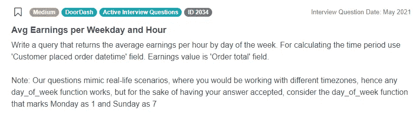

截图来自 [StrataScratch](https://platform.stratascratch.com/coding/2034-avg-earnings-per-weekday-and-hour?python=1&utm_source=blog&utm_medium=click&utm_campaign=medium)

问题链接:[https://platform . stratascratch . com/coding/2034-平均每工作日每小时收入](https://platform.stratascratch.com/coding/2034-avg-earnings-per-weekday-and-hour?python=1&utm_source=blog&utm_medium=click&utm_campaign=medium)

我们看到问题要求我们返回基于一周中的小时和天的平均收入，所以我们已经有一些迹象表明我们将必须进行某种形式的日期时间操作。

该问题仅使用了具有以下字段的 *doordash_delivery* 数据集:

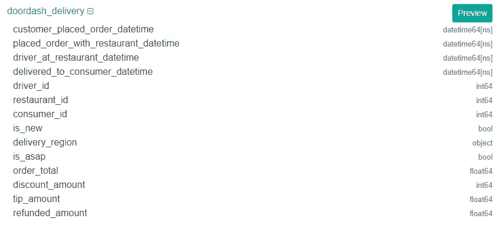

截图来自 [StrataScratch](https://platform.stratascratch.com/coding/2034-avg-earnings-per-weekday-and-hour?python=1&utm_source=blog&utm_medium=click&utm_campaign=medium)

示例数据如下所示:

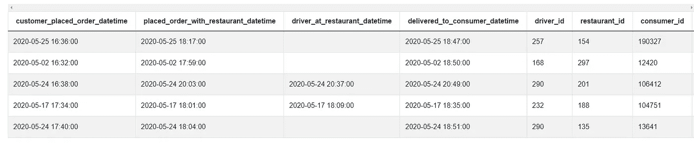

截图来自 [StrataScratch](https://platform.stratascratch.com/coding/2034-avg-earnings-per-weekday-and-hour?python=1&utm_source=blog&utm_medium=click&utm_campaign=medium)

同样，仅仅在我们的数据集中有日期时间列还不足以得出我们需要调用日期时间库的结论。相反，这里的关键信息是必须基于小时和天进行计算，我们可以看到没有一个列只隔离小时或天。

我们首先需要从 customer_placed_order_datetime 字段中提取星期几和小时。首先，我们使用. dt.weekday 属性获取星期几。查看[文档](https://pandas.pydata.org/docs/reference/api/pandas.Series.dt.weekday.html)，得出星期一为 0，因此，由于问题提示我们从星期一的 1 开始，我们在提取的日期的结果上加 1。

```
*# Import your libraries*
import pandas as pd

*# Keep relevant fields*
dd_df = doordash_delivery[['customer_placed_order_datetime', 'order_total']]
dd_df['weekday'] = dd_df['customer_placed_order_datetime'].dt.weekday + 1
```

提取一天中的小时与. dt.hour 属性类似。

```
dd_df['hour'] = dd_df['customer_placed_order_datetime'].dt.hour
```

最后，你所要做的就是根据一周中的每一天和一天中的每一个小时进行合计。解决方案最终看起来是这样的:

```
*# Import your libraries*
import pandas as pd

*# Keep relevant fields*
dd_df = doordash_delivery[['customer_placed_order_datetime', 'order_total']]
*# Get the day of the week (add 1 to keep have Monday = 1)*
dd_df['weekday'] = dd_df['customer_placed_order_datetime'].dt.weekday + 1
*# Hour of the day*
dd_df['hour'] = dd_df['customer_placed_order_datetime'].dt.hour
dd_df.groupby(by = ['weekday', 'hour'], as_index = False).agg({'order_total': 'mean'})
```

查看上面的代码，我们的聚合函数需要根据提取的工作日和小时数据进行分组，以便计算每个工作日和小时的平均收入。

**如何将格式化字符串转换成特定的日期时间数据**

第三个例子来自一个关于用户增长率的 Salesforce 面试问题。

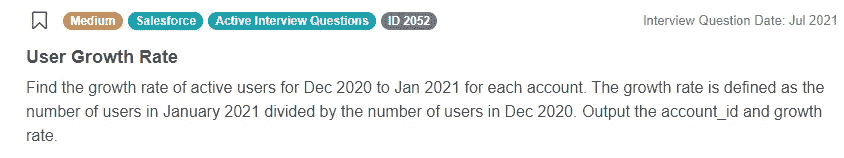

截图来自 [StrataScratch](https://platform.stratascratch.com/coding/2052-user-growth-rate?python=1&utm_source=blog&utm_medium=click&utm_campaign=medium)

问题链接:[https://platform . stratascratch . com/coding/2052-user-growth-rate](https://platform.stratascratch.com/coding/2052-user-growth-rate?python=1&utm_source=blog&utm_medium=click&utm_campaign=medium)

此问题要求我们计算 Salesforce 中每个帐户从 2020 年 12 月到 2021 年 1 月的活跃用户增长率，并列出它们。

我们只有一个单一的 *sf_events* 数据集，看起来相当简单。

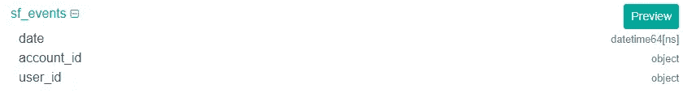

截图来自 [StrataScratch](https://platform.stratascratch.com/coding/2052-user-growth-rate?python=1&utm_source=blog&utm_medium=click&utm_campaign=medium)

数据看起来像这样:

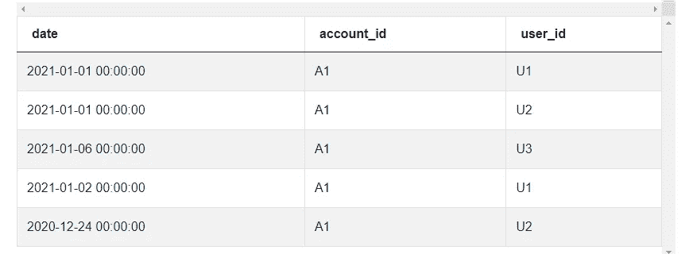

截图来自 [StrataScratch](https://platform.stratascratch.com/coding/2052-user-growth-rate?python=1&utm_source=blog&utm_medium=click&utm_campaign=medium)

查看我们的示例数据，我们可以看到，当我们真正需要将其缩小到月份和年份时，我们得到了诸如日期和时间之类的信息。我们可以使用日期时间库中的唯一方法。strftime()，它根据所需的格式将日期时间数据转换为字符串。

```
*# Import your libraries*
import pandas as pd

*# Create the Year - Month indicator*
sf_events['month'] = sf_events['date'].dt.strftime('%Y-%m')
```

注意我们是如何在？strftime()方法只提取年份和日期。接下来，我们将月份限制在 2020 年 12 月和 2021 年 1 月。请记住，字符串过滤器需要匹配 strftime()方法中指定的格式。

```
summ_df = sf_events[sf_events['month'].isin(['2020-12', '2021-01'])]
```

现在，我们使用数据透视表汇总这几个月的数据，计算增长率，并将输出限制在相关的列中。这是最终的解决方案:

```
*# Import your libraries*
import pandas as pd

*# Create the Year - Month indicator*
sf_events['month'] = sf_events['date'].dt.strftime('%Y-%m')
summ_df = sf_events[sf_events['month'].isin(['2020-12', '2021-01'])].pivot_table(
    index = 'account_id', columns = 'month', values = 'user_id', aggfunc = 
    'nunique').reset_index()
*# Calculate growth rate and output relevant columns*
summ_df['growth_rate'] = summ_df['2021-01'] / summ_df['2020-12']
summ_df[['account_id', 'growth_rate']]
```

同样，在增长率计算中对月份和年份的任何引用都必须与我们之前调用的 strftime()方法保持格式一致。

**如何使用访问器和字符串到日期时间的方法来比较和过滤日期时间数据**

最后一个例子同样来自 Salesforce 数据科学访谈。

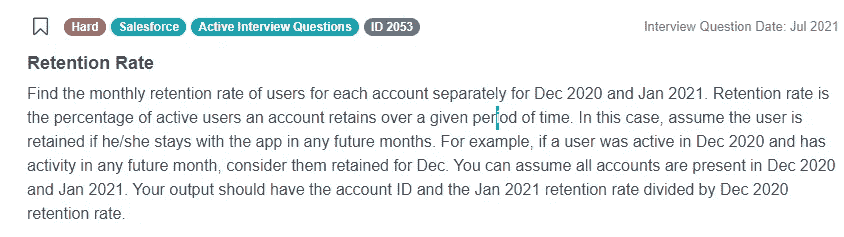

截图来自 [StrataScratch](https://platform.stratascratch.com/coding/2053-retention-rate?python=1&utm_source=blog&utm_medium=click&utm_campaign=medium)

问题链接:[https://platform . stratascratch . com/coding/2053-留存率](https://platform.stratascratch.com/coding/2053-retention-rate?python=1&utm_source=blog&utm_medium=click&utm_campaign=medium)

它要求我们比较两个月内的保持率，而不是增长率。虽然我们只需要比较两个月的数据，但很明显，我们必须查看 12 月和 1 月之后的月份的保留数据。

该问题再次使用了具有以下字段的 *sf_events* 数据集:

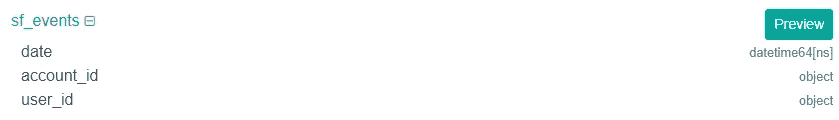

截图来自 [StrataScratch](https://platform.stratascratch.com/coding/2053-retention-rate?python=1&utm_source=blog&utm_medium=click&utm_campaign=medium)

这里有一些数据示例:

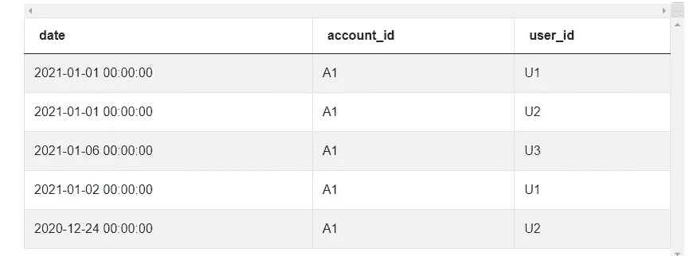

截图来自 [StrataScratch](https://platform.stratascratch.com/coding/2053-retention-rate?python=1&utm_source=blog&utm_medium=click&utm_campaign=medium)

这个问题需要的日期时间函数与我们之前的问题完全不同，因为我们必须找到保持而不是增长。我们可以首先在 12 月和 1 月激活账户。在这两种情况下，我们都可以使用 dt.year 和 dt.month 属性来指定我们需要引用哪一年 2020 或 2021 或 12 月或 1 月。请记住，对于月份，我们将 1 月作为 1，将 12 月作为 12 进行筛选。

```
*# Import your libraries*
import pandas as pd

*# Get Accounts active in Dec 2020*
dec2020 = sf_events[(sf_events['date'].dt.year == 2020) & (sf_events
['date'].dt.month == 12)].drop_duplicates(subset = ['account_id', 'user_id'])
dec2020['in_dec'] = 1
*# Get Accounts active in Jan 2021*
jan2021 = sf_events[(sf_events['date'].dt.year == 2021) & (sf_events
['date'].dt.month == 1)].drop_duplicates(subset = ['account_id', 'user_id'])
jan2021['in_jan'] = 1
```

接下来，我们必须计算每个月之后的活跃客户。在这两种情况下，我们都必须对日期进行比较。我们首先调用. dt.date 属性只获取日期，排除时间。接下来我们调用。to_datetime()函数将相应月份的最后一天的字符串转换为 datetime 对象，然后与日期进行比较。

```
*# Get accounts active after December and January*
aft_dec2020 = sf_events[sf_events['date'].dt.date > pd.to_datetime
('2020-12-31')].drop_duplicates(subset = ['account_id', 'user_id'])
aft_dec2020['aft_dec'] = 1
aft_jan2021 = sf_events[sf_events['date'].dt.date > pd.to_datetime
('2021-01-31')].drop_duplicates(subset = ['account_id', 'user_id'])
aft_jan2021['aft_jan'] = 1
```

在这些日期时间操作之后，我们可以继续合并数据集，并使用标准 Python 和 Pandas 代码计算保留率，因此解决方案如下所示:

```
*# Import your libraries*
import pandas as pd

*# Get Accounts active in Dec 2020*
dec2020 = sf_events[(sf_events['date'].dt.year == 2020) & (sf_events
['date'].dt.month == 12)].drop_duplicates(subset = ['account_id', 'user_id'])
dec2020['in_dec'] = 1
*# Get Accounts active in Jan 2021*
jan2021 = sf_events[(sf_events['date'].dt.year == 2021) & (sf_events
['date'].dt.month == 1)].drop_duplicates(subset = ['account_id', 'user_id'])
jan2021['in_jan'] = 1
*# Get accounts active after December and January*
aft_dec2020 = sf_events[sf_events['date'].dt.date > pd.to_datetime
('2020-12-31')].drop_duplicates(subset = ['account_id', 'user_id'])
aft_dec2020['aft_dec'] = 1
aft_jan2021 = sf_events[sf_events['date'].dt.date > pd.to_datetime
('2021-01-31')].drop_duplicates(subset = ['account_id', 'user_id'])
aft_jan2021['aft_jan'] = 1
*# Merge the datasets to get December and January retention numbers*
dec_merged = pd.merge(dec2020, aft_dec2020, on = 
['account_id', 'user_id'], how = 'left')
dec_summ = dec_merged.groupby(by = ['account_id'], as_index = False).sum()
dec_summ['dec_retention'] = dec_summ['aft_dec'] / dec_summ['in_dec']

jan_merged = pd.merge(jan2021, aft_jan2021, on = 
['account_id', 'user_id'], how = 'left')
jan_summ = jan_merged.groupby(by = ['account_id'], as_index = False).sum()
jan_summ['jan_retention'] = jan_summ['aft_jan'] / jan_summ['in_jan']

*# Merge the Dec20 and Jan21 datasets, calculate the relative retention rate* 
*# and output.*
final_merge = pd.merge(dec_summ, jan_summ, on = 'account_id', how = 'left')
final_merge['retention'] = final_merge['jan_retention'] / final_merge['dec_retention']
final_merge[['account_id', 'retention']]
```

我们在这个解决方案中看到了日期时间属性的重要性，因为我们必须将日期时间对象的年、月和日期数据从日期时间对象中分离出来。在这之后，我们有了一个很好的机会用。to_datetime()函数

## 结论

在本文中，我们能够探索 Python Pandas DateTime 库的几种用法。大多数时候，您将利用其中一个访问器来隔离日期、时间或日期时间数据的其他组成部分。但是，在其他时候，您可能需要利用这个库来填充一些日期时间数据，所以您将利用它提供的函数。

如果你真的想在你的数据科学职业生涯中使用 Python，拥有良好的熊猫技能是一个非常必要的条件。幸运的是，我们能够在这里展示一些实际的例子，这些例子反映了优步、Salesforce 和 Doordash 等顶级公司的实际数据科学面试问题。在我们的平台上，你可以练习回答更多的[熊猫面试问题](https://www.stratascratch.com/blog/python-pandas-interview-questions-for-data-science/?utm_source=blog&utm_medium=click&utm_campaign=medium),通过自己或在我们文章的帮助下交互式地构建这些问题的解决方案。您还可以访问其他用户的大型社区，他们可以在您查看他们的解决方案以获取灵感时对您的解决方案进行评论。

*最初发表于*[T5【https://www.stratascratch.com】](https://www.stratascratch.com/blog/how-i-use-datetime-features-in-python-in-data-science-interviews/?utm_source=blog&utm_medium=click&utm_campaign=medium)*。*