# 我如何用人工智能将哈利波特角色重新想象成日本动画

> 原文：<https://towardsdatascience.com/how-i-used-ai-to-reimagine-harry-potter-characters-as-japanese-anime-87275babb0dc>

## 用文字到图像的人工智能激发你的创意之旅

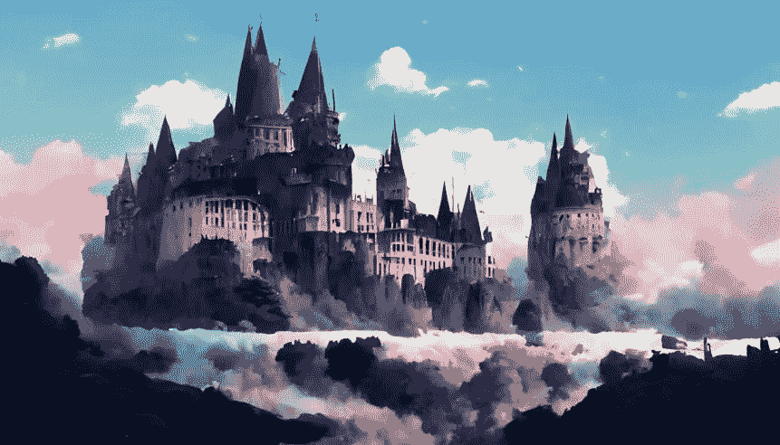

作者中途生成的霍格沃茨城堡

***把一幅字画得如此生动，我甚至不用画。***

我相信你看过一个犯罪系列，在那里目击者描述了一个艺术家眼中的罪犯。

然后，艺术家根据一张陌生面孔的零星描述信息拼凑出一幅素描。

*而且，我很难相信这位艺术家仅凭这些描述就能画出如此精确的草图。*

但是想象一下如果那个艺术家是艾！

这类似于我本周在访问[中途](https://www.midjourney.com/home/)时所做的实验——给人工智能发送文本并从中获取图像。

> 对于那些还没有听说过它的人来说，Midjourney 是一个研究实验室及其人工智能程序的名称，该程序从描述性的 ext 创建图像。《经济学人》用它制作了他们 2022 年 6 月的封面图片。
> 
> 它作为一个机器人在你的不和谐服务器上工作。你必须登录并获得不和谐邀请。然后，您也可以将机器人添加到您的服务器。他们有一个关于如何开始的简明教程[这里](https://midjourney.gitbook.io/docs/)。

在这篇文章中，我尝试了一些独特的**——使用 Midjourney 将 ***哈利波特角色重新制作成日本动漫*** 。**

**这篇帖子旨在激励你，引导你进入创造性人工智能的迷人世界，并分享我学到的经验。**

**因此，我已经将我使用过的所有提示和生成的图像一起发布了。您可以自由尝试相同的提示或使用不同的提示。**

**对于每个提示，AI 会生成 4 幅图像——你可以根据自己的选择创建不同的图像，也可以放大你喜欢的图像。这很简单。**

**所以请坐好，享受这些图像吧！**

# **“重新想象”的人物**

**首先，简单介绍一下我在图片中使用的艺术风格。我使用了一种叫做 ***的日本门艺术风格*** 来生成所有的图像。**

**这是通过在所有提示中使用 *moe art* 来完成的。我敢肯定，即使你没有听说过这种艺术风格，你也一定会从一些流行的动漫中认出它！**

****注意** —所有中途的提示都是以命令**想象**开始的，就像这样:**

```
**/imagine** *prompt*
```

**因此，在下面的所有例子中，我只提到了提示，以避免重复命令。**

**让我们从我们的英雄开始！**

## **1.[文学作品]哈利波特**

**是世界上最知名的虚构人物之一。因此，即使没有太详细的提示，人工智能也能很好地工作。我选择了我认为最合适的一张(以下所有图片都一样)。**

****提示:****

```
**harry potter face + moe art style + anime  --ar 16:9 --uplight**
```

**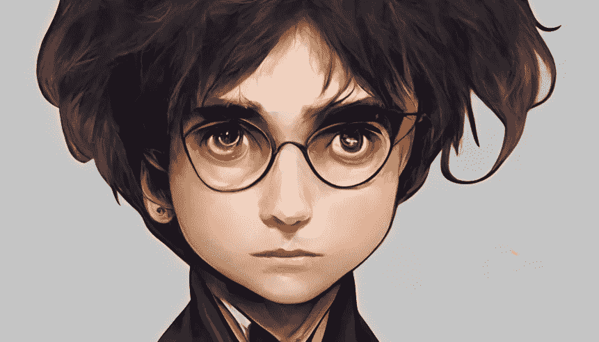**

**由作者通过 Midjourney 生成**

## **2.赫敏·格兰杰**

**就像哈利一样，我不需要对赫敏做任何更详细的描述。**

****提示:****

```
**hermione granger + Moe art style + anime  --ar 16:9 --uplight**
```

****

**由作者通过 Midjourney 生成**

## **3.罗纳德·韦斯莱**

**在这种情况下，我不得不使用相同的提示生成更多的变体，以正确获得 Ron。最后，我选定了下图。**

****提示:****

```
**ronald weasley + Moe art style + anime  --ar 16:9 --uplight**
```

**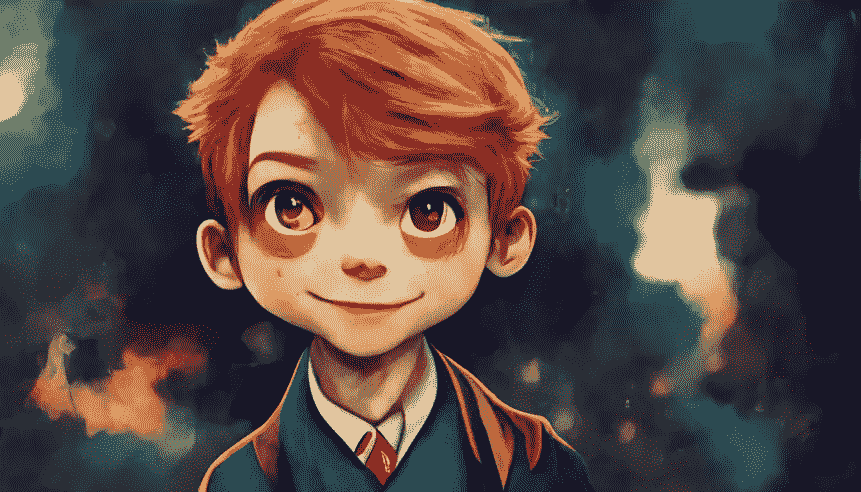**

**由作者通过 Midjourney 生成**

## **4.西弗勒斯·斯内普**

**我给斯内普用了几个更详细的提示，但是简单的一个似乎产生了最好的结果。**

****提示:****

```
**snape + moe art style + anime --ar 16:9 --uplight**
```

**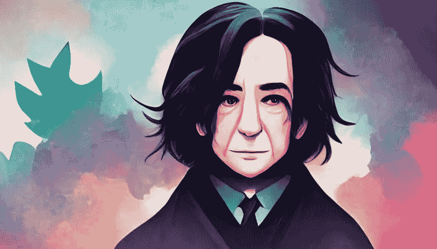**

**由作者通过 Midjourney 生成**

## **5.阿不思·邓布利多**

**邓布利多是这个系列中我最喜欢的角色。所以我想创造一个更详细的他的动漫版。但是由于某种原因，邓布利多很难像哈利那样用简单的提示来生成。每次 AI 把胡子弄得一团糟(*我想不通为什么*)。所以我在这里尝试了一个更详细的，得到了一个比较满意的结果。**

****提示:****

```
**old wizard, dumbledore, benign, smiling, long white beard and hair + moe art style + anime --ar 16:9 --uplight**
```

**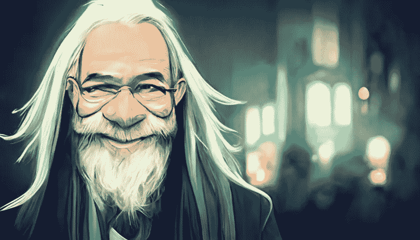**

**由作者通过 Midjourney 生成**

## **6.伏地魔**

**在*那个不能说出名字的人*的例子中，我使用了几个额外的细节来得到一个更恐怖的图像。在我最终选择下面这一个之前，有许多生成。**

****提示:****

```
**voldemort + moe art style + anime + scary scarlet eyes  + slit pupils + forked tongue + symmetrical bald face --ar 16:9 --uplight**
```

**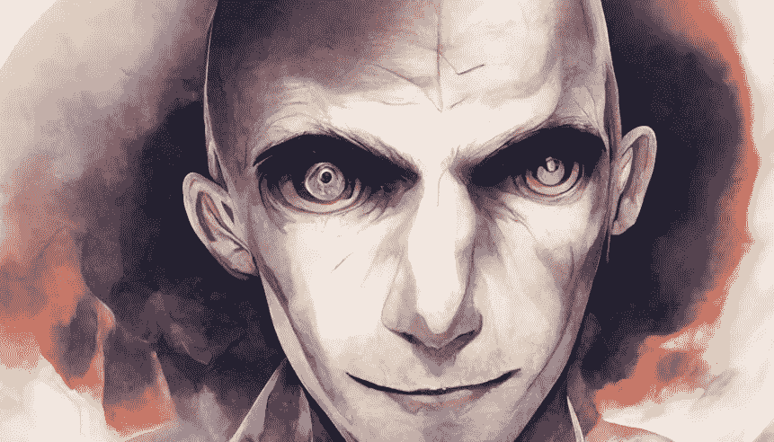**

**由作者通过 Midjourney 生成**

# **这个实验的收获**

## **1.文本到图像的工具令人印象深刻**

**最近几个月，图像生成人工智能出现了爆炸式增长。我不禁为之折服！**

*   **无论是 Dall-E 2 还是 Midjourney，我发现它们都能根据提示快速生成令人惊叹的图像。**
*   **人工智能非常擅长交叉授粉和叠加艺术风格。比如(*自己试试*)——***梵高风格的写实埃菲尔铁塔画像。*****
*   **人工智能很好地创建了一个图像，可以在以后进行微调和修改。**
*   **你可以使用人工智能来生成超现实的场景和景观——你可以用它们作为创作视频游戏甚至电影场景的灵感！**

**尽管有这些优势，我必须承认这一点:虽然我在这篇文章的开始称它们为创造性的人工智能，但我认为这样称呼是误导的，至少在目前的水平上是这样。**

**这让我想到了我的下一个外卖。**

## **2.AI 图像生成很难**

**尽管在本文中看起来非常简单，但至少可以说，生成所有这些图像非常耗时！**

**不经过反复试验，你永远不可能得到一个完美的提示。即使有相同的提示，人工智能也不会每次都生成相同的图像。**

**仔细观察以上所有图片，你会发现它们并不完全正确。 ***好像有什么东西掉了***——好像眼睛不太对，总体看起来有点*诡异*。**

**在这种情况下，真正的艺术是正确地得到提示！**

**这也是人类仍然统治的领域——创造力。**

**因此，即使图像生成技术有所进步，人类的思维仍然处于主导地位。**

**我相信我们还需要几年时间才能让人工智能自己创造出真正有意义和鼓舞人心的图像！**

## **3.人工智能图像生成是昂贵的**

**哦！我还没有提到人工智能图像生成是昂贵的吗？**

**有了 Dall-E 2，你最初可以免费获得 35 张图片，然后每月减少到 15 张。如果你需要生成更多的图片，你需要花费近 15 美元来获得 100 张左右的图片。**

**对于 Midjourney，你最初只能免费获得 25 张图片(我很快就用完了)，然后你必须每月支付 10 美元来获得大约 200 张图片(按 GPU 分钟数计算)。**

*****你觉得还不错？*****

**光是提示的反复试验就足以像饥饿的袋獾一样吃掉你的美元！**

**所以你真的需要明智的判断。我花了将近 10 美元终于得到了我贴在这里的图片！**

**有鉴于此，我将留给你一些值得一提的我的试用图像(*因为我为花了 10 美元却不能使用所有生成的图像*而感到内疚😉):**

**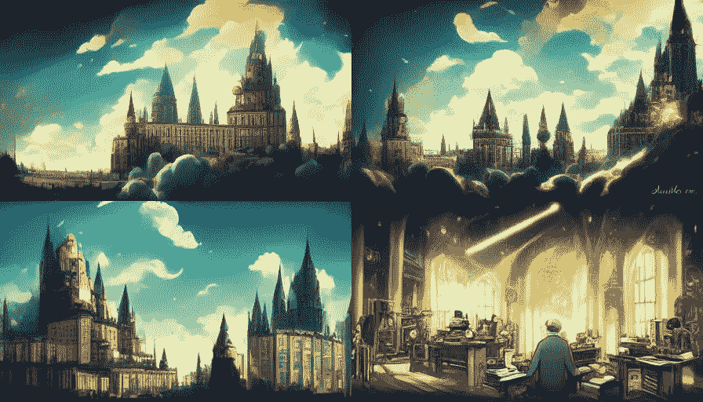**

**由作者在中途使用提示生成:阿不思邓布利多+莫伊艺术风格+动漫+古代办公背景+机械仪器— ar 16:9 — uplight**

**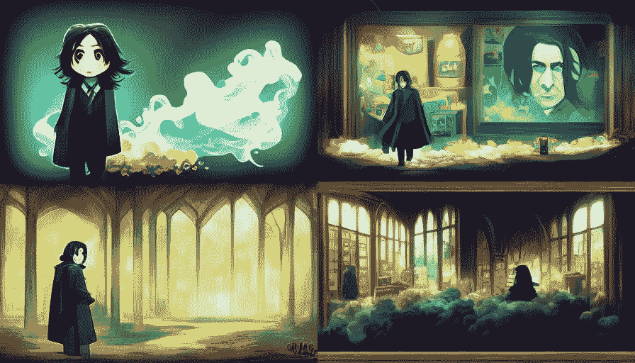**

**由作者在中途使用提示生成:西弗勒斯·斯内普+ moe 艺术风格+动漫+带化学背景的货架— ar 16:9 — uplight**

**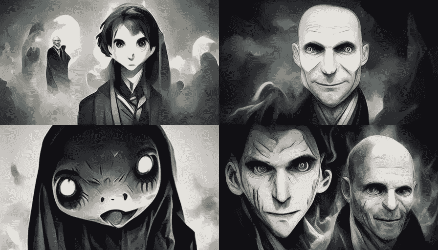**

**由作者在中途使用提示生成:伏地魔+ moe 美术风格+动漫+恐怖— ar 16:9 — uplight**

**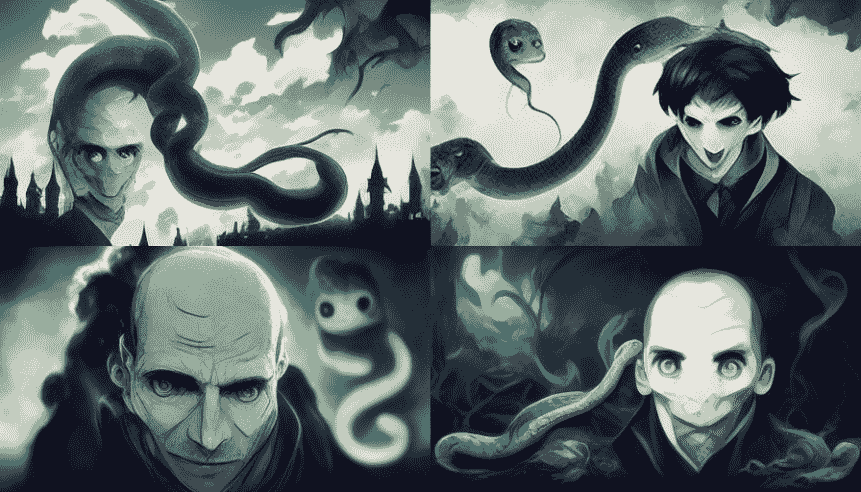**

**由作者在中途使用提示生成:伏地魔+ moe 美术风格+动漫+恐怖+大蛇— ar 16:9 — uplight**

**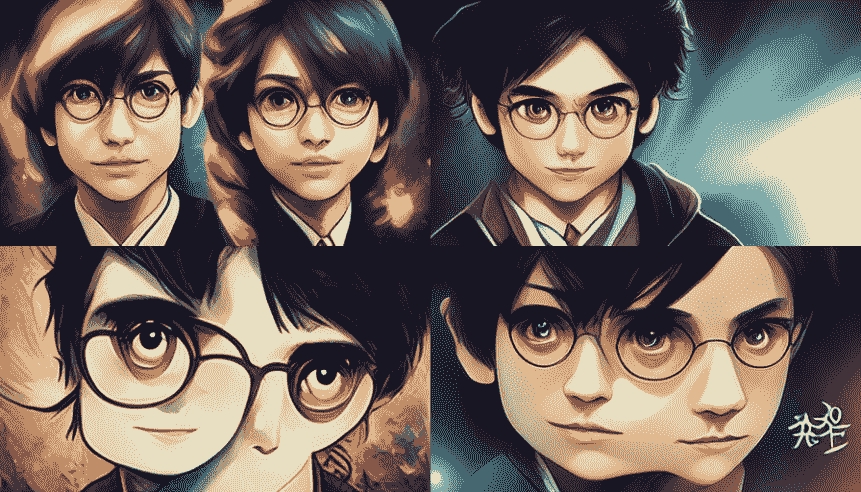**

**由作者在中途使用提示生成:哈利波特脸+ Moe 艺术风格+日本动漫+漫画— ar 16:9 — uplight**

**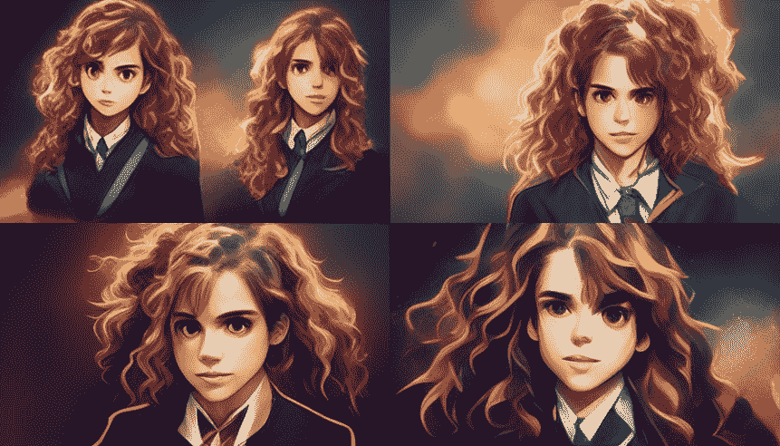**

**作者在中途为赫敏产生的变化(同样的提示)**

**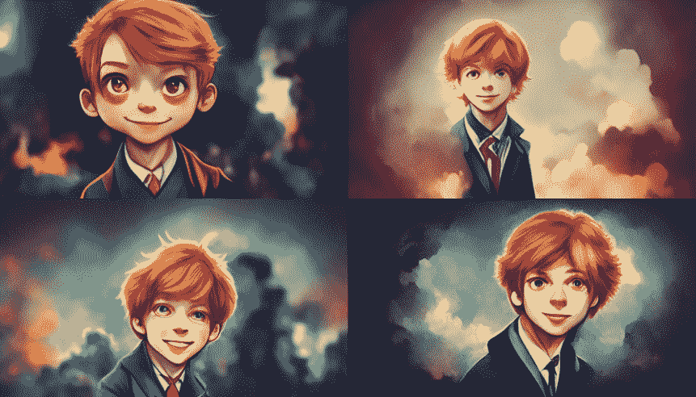**

**作者在中途为 Ron 生成的变体(相同的提示)**

****感谢**阅读到最后！我希望你喜欢这篇文章，就像我喜欢为你创作它一样。**

**那么，你喜欢我最后挑选的图片吗？**

**或者你认为我应该从这些变体中选择一些其他的版本？**

**这里的哪些图片是你最喜欢的？**

**你现在有没有受到启发，想尝试一下生成图像的人工智能？**

**你想知道更多关于人工智能如何工作的细节吗？**

**我很想听听你的看法！**

**在那之前，祝阅读愉快！**

***鳍。***

****资料来源及注释:****

*   **这篇文章的灵感来自创作共用的哈利波特艺术。**
*   **生成的图像仅用于教育目的。**