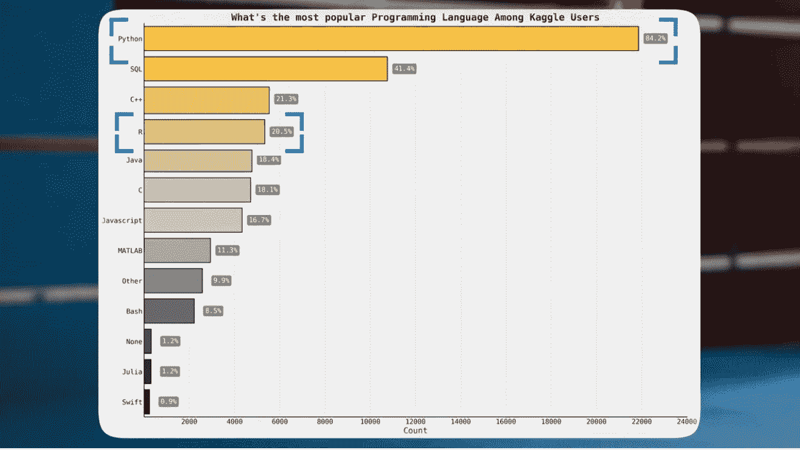
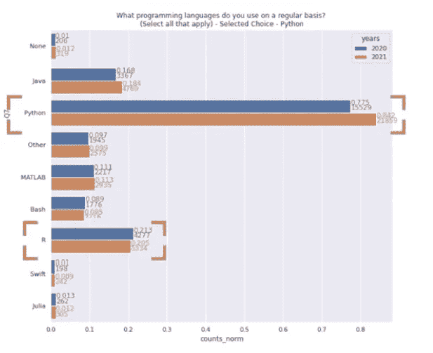
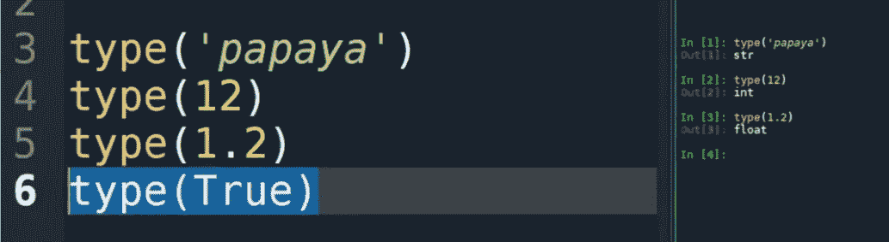
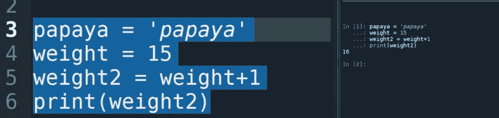
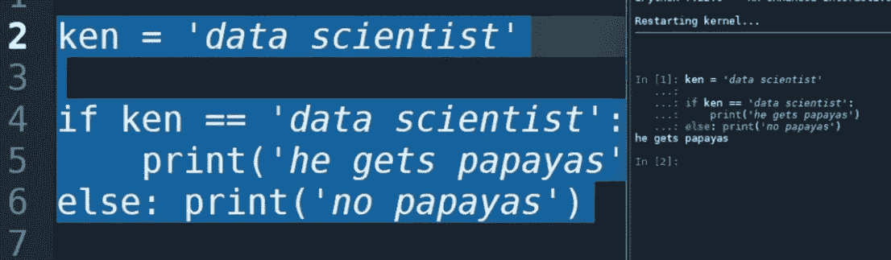
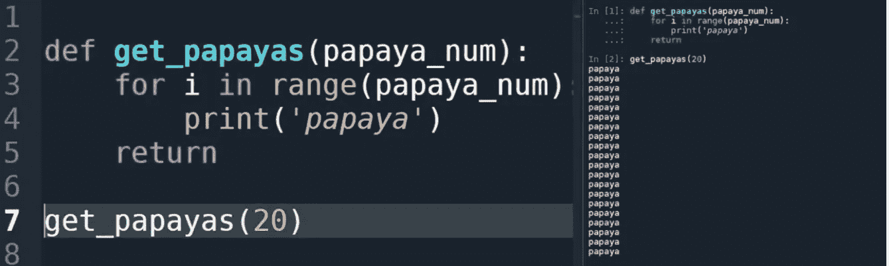
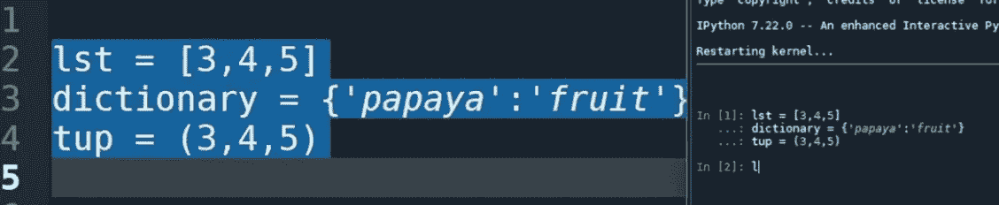
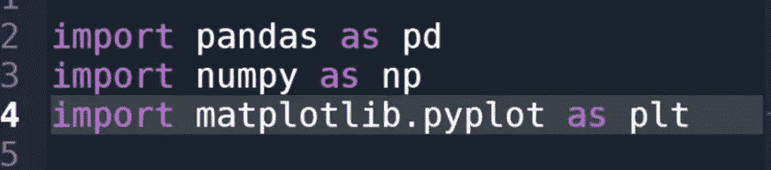
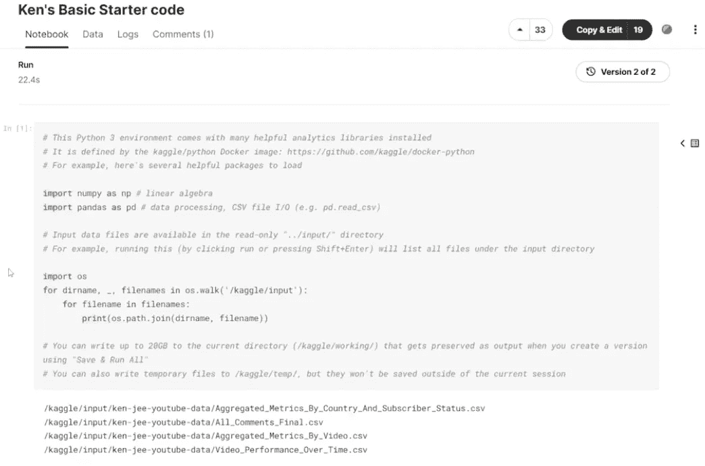

# 我将如何学习编码(如果我必须重新开始)

> 原文：<https://towardsdatascience.com/how-i-would-learn-to-code-if-i-had-to-start-over-607428f14266>

## 学习如何为现实世界的数据科学编码的有力建议

作者图片

# 目录

1.  [R 还是 Python？](#3908)
2.  [第一步:建立环境](#a42f)
3.  [7 个编码基础](#5911)
4.  [基于项目的学习](#a197)
5.  [数据轨道的细节](#67e4)
6.  [新程序员最重要的提示](#d932)

我最近得到了一个惊人的机会，一个朋友提出教我柔术，作为交换，我教他如何编码。我很快意识到，从零开始教别人如何编码，比我想象的要困难得多。毕竟，距离我自己写第一行代码已经快 10 年了。这篇文章是关于我为我的朋友写的非常具体和详细的计划，教他数据科学编码的基础知识。因为我为他做了所有的工作，我想我也应该在这里和你分享所有的细节！

关于如何开始编码，有很多类似的资源。这些都很棒，但我认为这有点不同，因为它更专注于数据编码，并使用了非常具体的真实案例研究。此外，我建议使用各种免费的在线资源来进一步简化初学者编程技巧的自学。最后，我强调了任何新程序员都应该知道的 3 件最重要的事情，所以你肯定想看看。

如果您更喜欢视频格式，请考虑以下内容以了解有关该主题的更多信息:

# r 还是 Python？

让我们从选择的语言开始学习。我知道，如果您正在处理数据，通常有两种选择，Python 或 r。让我们快速比较一下这两种语言的数据科学家风格。

当查看[堆栈溢出开发者调查](https://survey.stackoverflow.co/2022/#professional-developers)时，我们发现大约 48%的受访者使用 Python，而只有大约 5%的人使用 r。在工业中，Python 是一种更常见的语言。现在让我们更具体地看看数据科学家，而不仅仅是所有的堆栈溢出用户。

在我最喜欢的数据科学学习和项目平台 Kaggle 上，我们可以在[这个笔记本](https://www.kaggle.com/code/datafan07/what-takes-to-be-a-data-scientist-story-of-robert/notebook)中看到，大约 84.2%的受访者使用 Python，而只有 20.5 %的人使用 r。由于这些加起来超过 100%，我们可以假设一些数据科学家正在使用两种语言。

图片来自 [Kaggle](https://www.kaggle.com/code/datafan07/what-takes-to-be-a-data-scientist-story-of-robert/notebook) (阿帕奇 2.0)

最后，让我们来看看这两种语言的发展历程。我们可以在[的另一个笔记本](https://www.kaggle.com/code/hasanbasriakcay/what-has-changed-in-data-science)中看到，从 2020 年到 2021 年，Python 的采用有所增加，而 R 的使用有所减少。

图片来自 [Kaggle](https://www.kaggle.com/code/hasanbasriakcay/what-has-changed-in-data-science) (阿帕奇 2.0)

这对我来说是显而易见的。我觉得应该选择学习 python 那种语言更受欢迎，而且还在增长。这并不是说 R 不好。然而，我认为 Python 正在成长，对于就业市场来说，它将是一项更有价值的技能。我个人也觉得比 r 更直观灵活一点。

作者图片

# 第一步:建立环境

既然选择了 Python，那么我的朋友应该先学习哪些编码技巧呢？变量，逻辑，函数，算法，类？我的脑子在打转。这花了我一秒钟的时间，但我对我学习编程的第一天有一个奇怪而混乱的闪回。我甚至不知道从哪里开始在我的电脑上安装 Python。我对教授编程的功能部分感到非常兴奋，我完全忘记了为成功建立环境的基础。

我做的第一件事是给我的朋友一些我最喜欢的关于选择环境和在他的计算机上获得正确版本的 Python 的资源。我实际上有点纠结:他应该使用什么 IDE？他知道 IDE 代表什么吗？对于新手来说，IDE 代表集成开发环境。这实际上只是您用来编写代码的文本编辑器。

如果你在写一篇文章，你可以选择使用微软 Word、谷歌文档、记事本，或者甚至是纸和笔。就像这些都是你写最后一分钟论文的媒介一样，数据科学家和软件工程师也需要写代码的地方。这些地方是理想之地。就像 Microsoft Word 有拼写检查和格式设置来确保您不会犯语法错误一样，许多 ide 可以帮助您确保代码中有正确的语法。从技术上来说，微软 Word 可以被认为是一个 IDE，但是我绝对不推荐这样使用它[，除非你是霍马理工大学的](https://www.youtube.com/watch?v=X34ZmkeZDos)。

这是数据领域中最常用的 ide 列表。如您所见，Python 的常见 ide 有 VSCode、Jupyter Notebook、PyCharm 和 Spyder。

在做任何事情之前，我想让我的朋友对开发环境如何工作有一个很好的理解。这是我完全困惑的事情。当我学习编码时，我从 Python 开始，在一个叫做 IDLE 的 IDE 中进行。IDLE 对于学习来说很棒，但是我真的从来没有在为工作或数据项目编写代码时使用过它。我想确保他使用的东西能够代表他在现实世界中使用的东西。

对于这个特定的朋友，我推荐他从 freeCodeCamp 的以下视频开始学习基础知识。在视频中，他们向您展示了如何设置 PyCharm 环境并轻松使用它。我认为 PyCharm 是可靠的，如果你熟悉它，你可以很快地学会 VScode、Jupyter 笔记本或 Spyder。同样，我不认为你开始使用的 IDE 有那么重要。更重要的是，你使用的是那些真正将 Python 代码投入生产的人使用的工具。

作者图片

# 7 个编码基础

好了，接下来是编码基础。令人惊讶的是，我认为这可能是整个过程中最简单的部分之一。你看，有一种普遍的误解，认为编码是试图欺骗你。有这样一个阴谋，学习编码应该是非常困难和可怕的。我认为事实恰恰相反。编码语言，尤其是 Python，实际上被设计得尽可能直观。它们被设计成在创造良好效果的同时尽可能易于使用。如果你改变你的视角，把它们看成是直观的，编码会变得更加有趣和轻松。这并不是说你不会再被困住了；这是说，当你陷入困境时，几乎总是有一个合乎逻辑的原因和一个合乎逻辑的解决方案来解决它。

符合简约的主题。在最基本的层面上，初学者编码可以分为 7 个概念。我将在这里给出一个非常高层次的概述。

1.首先，我们从**数据类型开始。在 Python 中，你可以处理数字、文本、布尔值、列表或大量数据结构。首先很好地理解这些是很重要的。**

作者图片

2.接下来，我认为熟悉一下**变量**如何工作是有意义的。这可能因语言而异，所以只要确保您知道如何在 Python 中分配和更改变量。

作者图片

3.变量之后，你应该看看**逻辑运算符**是如何工作的。这些在你最初的几个项目中非常方便。 *If* 和 *else* 语句是最重要的一个，但是你肯定可以为其他人找到用例，尤其是当你处理数据的时候。

作者图片

4.你需要了解的第四件事是**循环**是如何工作的。计算机最擅长的一件事就是一遍又一遍地做一件简单的事情。你会惊讶地发现这些对你未来的编程是多么有用。

作者图片

5.之后，你应该学习一下**的功能。**这为您在编程之旅中所做的几乎所有事情奠定了基础。函数允许你封装代码并重用它。如果你真的仔细想想，好的编码就是尽可能多的重用比特。这才是真正的开始。

作者图片

6.至此，您已经对 Python 的关键构建模块有了很好的理解。现在你应该对一些**基本数据结构**的工作原理有了更多的了解。我建议更深入地研究列表、字典和元组。这些将为您以后的大部分数据工作奠定基础。

作者图片

7.最后，你应该开始学习使用**库**。最重要的有熊猫、NumPy、Scikit-learn 和 Matplotlib。这些都为您提供了分析、可视化和操作数据的额外工具。Pandas 和 NumPy 还引入了一些新的数据结构，如数组、序列和数据帧。如果你了解 python 中更基本的数据结构是如何工作的，你应该能够很快学会这些！

作者图片

就是这样。有了这 7 样东西，你就有了处理数据所需的编码基础。如果你是一名软件工程师，你可能会认为我遗漏了一些东西。我在这个列表中有意省略的是对类的解释。类是面向对象编程的基础。面向对象编程是一种围绕对象而不是功能或逻辑组织代码的编程模型。面向对象的编程非常强大，但是老实说，对于处理数据的初级阶段来说，它并不太适用。在你很好地学习了这些其他概念之后，这是你绝对应该自己去探索的事情！

下面的链接是学习所有这些概念的一些很好的资源。其中大多数都是免费的，但如果你正在寻找一种资源，让你超越编码，获得更多切实的数据科学技能，我还提供了 365 数据科学课程的折扣链接。

*   [freeCodeCamp:学习 Python —初学者全教程【教程】](https://www.youtube.com/watch?v=rfscVS0vtbw)
*   Python 教程:[Python 教程](https://docs.python.org/3/tutorial/)和[入门部分](https://www.python.org/about/gettingstarted/)
*   [🌟365 数据科学课程(57%的年折扣；这是一个联盟链接)](https://365datascience.com/knn/?utm_medium=affiliate&utm_campaign=11148&utm_source=kjeeone&irgwc=1)
*   [初学 Kaggle 练习册](https://www.youtube.com/watch?v=I3FBJdiExcg)

作者图片

# 基于项目的学习

我喜欢我链接的所有课程的一点是，它们在课程工作中融入了一些小项目。我认为基于项目的学习是在获得基本基础后学习技术概念的唯一最有效的方法。我强烈建议你考虑如何使用代码来构建对你有用的东西。

对于我的朋友，我让他做的第一个项目是使用 Python 创建一个柔术随机发生器。对于任何训练来说，强化你的技能是很重要的，但是每天做同样的基础训练会很无聊。我让他制定一个计划，从一个更大的列表中随机选择 2-3 个我们应该在训练中进行的训练。这是一个简单的项目，但对我们的工作直接相关和有用。在下面评论一个你想做的 Python 项目，让自己负起责任！

作者图片

# 数据轨道的细节

好了，你已经学习了 Python 的基础知识。现在怎么办？如果你有兴趣学习更多关于数据的知识，我强烈建议你做一个与数据相关的项目。最好的地方是卡格尔。如果这有点太吓人，你可以跟着[一起做我做过的一个项目](https://www.youtube.com/watch?v=I3FBJdiExcg)或者其他人在 Kaggle 上做过的成千上万个项目中的一个。

很多人在这一步失去了动力。他们看到其他人已经完成的伟大工作，感到沮丧。老实说，我记得我也有这种感觉。我建议做的是浏览一些基本的笔记本，比如泰坦尼克号数据集，然后复制代码，在你自己的电脑上一行一行地运行。许多人认为这是“作弊”，但实际上这是一种很好的学习方式。更好的是，当您运行它时，对代码进行一些修改，看看会发生什么。也许可以试着将图表上的颜色从蓝色改为红色，或者将线条变粗。

作者图片

还记得我们谈论 IDEs 时提到的 Jupyter 笔记本吗？Kaggle 使用类似的东西，让你在线使用它。如果您对资源的访问权限有限，这将是一种强大而免费的计算能力。如果您想在笔记本电脑或台式机上处理数据，我建议您下载 Anaconda，这是一个软件包，它将所有相关的 Python 库和数据科学 ide 集成到一个包中。

作者图片

# 对新程序员最重要的提示

最后，我有 3 个建议送你上路。这些可能是新程序员可以学习的最重要的东西。

1.  **使用 Google 和栈溢出。**如果你有一个问题，几乎可以保证之前有人在网上问过。善于通过搜索自己找到答案可能是数据科学家或软件工程师最重要的技能。
2.  **使用错误。**你的代码不会运行，会崩溃，你会难过。不要沉溺于自怜之中。阅读错误消息；他们会告诉你什么是错的。谷歌的错误，这将节省你很多时间和头痛。
3.  **放松点。**唯一不会编程的人是那些从不尝试或过早放弃的人。

感谢您阅读这篇文章。如果您喜欢这篇文章，请记得在 Medium 上关注我以获取更多类似内容，并[注册我的简讯](https://www.kennethjee.com/newsletter)以获取我的内容创作和数据科学行业其他学习资源的每周更新！此外，考虑通过注册会员来支持我和成千上万的其他作家。

下次再见，祝您的数据科学之旅好运！