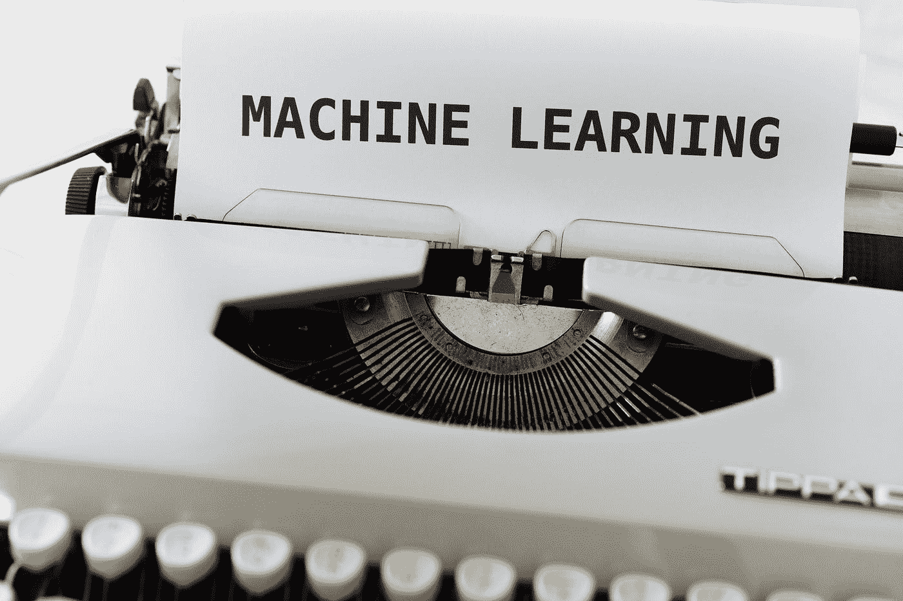

# ML 驱动的系统有何独特之处？—了解为什么需要 MLOps 以及需要 ML 基础架构的哪些组件

> 原文：<https://towardsdatascience.com/how-is-an-ml-driven-system-unique-4b52ae4aed03>

## 更深入地解释为什么需要 MLOps，以及 MLOps 试图解决什么问题来使 AI 在现实世界的生产环境中工作

对于任何已经建立了 ML 解决方案或者甚至处于开发 ML 模型的 PoC 阶段的组织，我确信 MLOps 已经成为一个话题。事实上，为了以可靠、安全和高度可用的方式在生产环境中开发和部署 ML 解决方案，需要 MLOps。

在今天的博客中，我想退一步解释一下:

*   为什么 MLOps 是必要的和必需的？
*   更重要的是，MLOps 到底想解决什么问题？
*   为了解决这个问题，需要 ML 基础设施的哪些组件？

希望通过了解原因，您可以就**做出更明智的决定，如果**您的组织需要 MLOps，如果需要，**为了解决阻止 AI 在您的组织中工作的问题/挑战，MLOps 的哪些**组件是必要的。

首先，我想解释一下 ML 驱动系统的独特性，以及这种独特性需要 MLOps 解决方案的原因。

照片由[马库斯·温克勒](https://unsplash.com/@markuswinkler?utm_source=medium&utm_medium=referral)在 [Unsplash](https://unsplash.com?utm_source=medium&utm_medium=referral) 上拍摄

## ML 驱动系统有何独特之处

为了理解为什么 MLOps 是必要的，并评估您的组织需要建立哪些与 MLOps 相关的能力，我们需要首先理解 ML 驱动的系统是如何独特的。我将 ML 驱动系统的“独特性”总结为以下四个方面:

*   **以数据为中心** —以数据为中心不仅意味着 ML 驱动的解决方案的成功取决于数据的质量和数量，而且数据本身的内在特征决定了需要什么样的 MLOps 功能。
*   **多团队和多技能组合协作** —在大多数组织中，构建和运行一个 ML 驱动的系统通常需要多个团队的努力，包括数据科学家、数据工程师、ML 工程师、DevOps 工程师等等。我将很快解释团队结构如何影响 MLOps 工作流和流程的设计。
*   **动态生态系统** —对于 ML 和 AI 来说，有一个极其丰富且快速增长的生态系统。比如 ML 和深度学习(DL)算法的开源库也不少，像 Scikit Learn，Tensorflow，Keras，PyTorch，Fast.ai，抱抱脸。此外，还有各种各样的人工智能应用可以从 ML 中构建，包括监督、半监督、自我监督、非监督、强化学习等等。根据您的 ML 系统构建的算法和应用，所需的 MLOps 功能也有所不同。
*   **连续变化** —从数据中建立和学习 ML 驱动系统。当底层数据发生变化时，ML 模型和算法也需要相应更新。ML 驱动的系统总是处于持续变化的状态，而且真的没有尽头。因此，监控数据变化和模型性能变化变得非常必要。商业环境和数据变化越快，就越有必要对 ML 模型进行“再训练”和“再学习”。因此，您确实需要了解您的业务需求和数据环境变化，然后确定在您的 MLops 工作流中构建监控解决方案的重要性。

让我们深入探讨上述 4 个方面如何影响您选择整体 MLOps 解决方案的设计。

## 以数据为中心

当我们谈论以数据为中心的 ML 系统时，显而易见的解释是 ML 模型的性能很大程度上取决于数据的质量和数量。的确，这是真的。但是，我认为“以数据为中心”在 MLOps 方面有更多含义:

*   首先，**数据总是变化**。数据总是在变化，这就需要一种监控解决方案来检测数据漂移，包括关键统计数据的变化，如最小值、最大值、标准差变化和数据分布变化。一旦底层数据发生变化，基于该数据训练的 ML 模型的性能也很可能发生变化(通常是以坏的方式)。还需要监控模型性能。因此，如果您的数据更改非常频繁，则绝对有必要在您的整体 MLOps 基础架构堆栈中构建监控功能。
*   第二，**数据几乎总是脏的**。众所周知，数据科学家花了相当多的时间清理数据并将数据转换为干净的状态。了解您自己的数据科学家在清理脏数据上花费了多少时间是值得的。如果时间很长，那么了解您的整个数据管道现在是如何运行的，并包括一些数据质量检查和模式实施以提高整体数据质量和可靠性，可能会很有用。
*   第三，**数据并不总是可用的**。原始数据很少能被输入最大似然算法进行即时学习。数据科学家经常必须将原始数据转换成特征，以帮助最大似然算法更快更准确地学习。这个转换过程被称为特征工程。特征工程通常需要数据科学家投入大量时间和精力。因此，功能也是组织的资产，就像数据本身一样。如果您的组织有多个数据科学家团队，并且他们处理相似的原始数据，那么他们很有可能会生成相似甚至相同的要素。在这种情况下，为数据科学家构建一个中心要素库来发布、共享他们的要素以及发现和重用由其他数据科学家创建的要素，可以显著增加价值并加快 ML 模型的开发时间。当然，除了特征发现和特征重用，特征库还有其他功能。我很快会有另一个关于“特色商店”的深度博客。如果您想在特色商店的博客发布时收到通知，请随时关注我的 Medium。

以上是“ML 是以数据为中心”这一事实所带来的影响。这些暗示需要你的 ML 基础设施的不同组件来处理，比如数据和模型监控，以及特征存储。

**多团队多技能协作**

构建端到端的 ML 解决方案，需要多个团队的不同技能。在我之前的文章— [了解 MLOps 的核心—构建机器学习(ML)管道](/learn-the-core-of-mlops-building-machine-learning-ml-pipelines-7242b77520b7?source=friends_link&sk=0a3006eed886f1071082ac1b5a485785)中，我提到为了构建一个端到端的 ML 解决方案，至少需要以下 3 个关键管道:

*   数据和特征工程管道，通常由数据工程团队开发。
*   ML 模型培训和再培训管道，通常由数据科学团队开发和拥有。
*   ML 模型推理/服务管道，通常由 ML 工程师或生产工程师团队开发和拥有。

为了以可靠的方式自动化这三个管道，还需要其他关键组件—持续集成/持续培训/持续部署(CI / CT / CD)和基础设施即代码(IaC)。这些组件通常归基础架构团队或开发运维团队所有。

通常这些团队使用非常不同的服务和工具集。例如，数据科学家主要使用 Jupyter notebook 进行 ML 模型培训和实验，数据工程师使用 Python、SQL 和 Spark 开发数据管道，而 ML 工程师不仅需要了解 ML 模型如何将数据科学家的笔记本转换为模块化和可测试的代码，他们还必须了解底层基础设施(如 Container 和 Kubernetes 和 DevOps)，以及 DevOps 管道(如 Github actions 和 Azure DevOps 管道)。

使用不同的工具、服务和框架，通常会在这些团队之间产生更多的差距。团队不得不花费更多的时间来集成不同的服务和框架，这可能会重复一些工作，并可能造成不一致。如果这些场景在您的组织中经常发生，那么考虑一个可以支持各种工作负载(数据工程、ML 培训和部署、ML 管道、功能存储、工作流编排、DevOps 集成、数据和模型监控)的单一平台将是非常有价值的，以便这些不同的团队可以在同一个平台上工作。我知道 Databricks 有这样一个数据和 AI 统一的平台，支持上面提到的各种工作负载。

有了这样一个统一的平台，管理您的 ML 基础设施和建立您的端到端 MLOps 工作流程将变得更加容易，因为您可以避免将不同提供商的许多不同服务“缝合在一起”。

如果团队花费相当多的时间集成不同的平台，由于这些集成导致不一致，(甚至错误)，或者由于这些平台差异导致团队成员交流(甚至争论)，也许是时候考虑迁移到统一的平台，从基础设施层解决这些问题了。

## 动态生态系统

ML 生态系统的所有方面都在快速发展，包括 ML 模型算法、分布式培训、数据和模型监控、ML 生命周期管理、ML 管道框架、ML 基础设施抽象、工作流程编排，以及用于共享数据见解和 ML 模型结果的网络应用。此外，人工智能和人工智能可以应用的各种商业用例也在蓬勃发展——例如计算机视觉、自然语言处理(NLP)、音频、表格数据、重新通知学习和机器人，以及多模型任务。

下面，我总结了这些 ML 方面的几个顶级开源库:

*   ML 模型算法— Scikit Learn、Tensorflow、Keras、Pytorch、fastai、拥抱脸变形金刚、XGboost
*   ML 分布式培训— Ray、Horovod、Dask
*   数据和模型监控—显然，arize、whylabs、Deepchecks、
*   ML 生命周期/管道管理— mlflow、ZenML
*   ML 基础设施抽象——元流、库贝流
*   用于共享数据和 ML 结果的 Web 应用程序— Streamlit、Gradio
*   工作流程编排— Metaflow、kubeflow、ZenML、Argo、Luigi、Dagster、Prefect
*   用例—计算机视觉(图像分类、图像分割、对象检测)、自然语言处理(会话、文本分类、问答、摘要)、音频(音频分类、语音检测)、表格(分类、回归)、强化学习和机器人技术

这个动态的生态系统无疑鼓励并创造了 AI 和 ML 社区中的许多创新。但是，如果每个团队都有自己的数据和 ML 栈和库，那么在整个组织中建立标准化和一致的 ML 工作流也会面临挑战。

如果您的组织拥有分散到不同职能部门的各种数据科学和 ML 团队，评估和推荐跨团队的一组一致的开源堆栈和库，并将它们作为整体 ML 基础架构的一部分，将会非常有用。在这种情况下，团队的工作可以重用，知识可以共享，ML 工作流/ MLOps 实践可以标准化。

## 连续变化状态

与普通软件不同，ML 驱动系统的迭代可以非常快，因为 ML 模型是从数据中学习的，而不是用定义的和固定的规则编程的。事实上，我们知道数据可能会很快改变。结果，ML 驱动系统的性能会显著改变(通常以恶化的方式)。为了应对这些挑战并确保 ML 驱动的系统始终保持高性能和可靠性，有两个方面非常关键。一个是监控，一个是自动化。

*   监控 **—** 一般来说，ML 监控包括数据监控、特征监控和模型监控。数据监控是指了解数据的汇总统计、分布和趋势是否发生了变化。与数据监控类似，特征监控是为了了解用于训练模型的特征如何随时间而变化。模型监控侧重于关键指标的性能退化，并在未知问题对您的产品和业务造成真正损害之前将其暴露出来。如果我们以分类模型为例，这些关键指标将包括分类准确度、精确度、召回率、F1 和混淆矩阵。对于可能对特定群体产生偏见和不公平的 ML 驱动的系统，深入了解模型如何跨特定群组得出结果也是至关重要的。用多维比较根除和减轻潜在模型偏差对边缘群体的影响。
*   自动化 **—** 由于 ML 驱动系统的迭代可能非常快，要求任何人通过重新开发新功能、重新训练 ML 模型和重新部署模型来手动响应变化是不现实的，特别是当您有数百个 ML 模型在生产中运行时。首先，这种手动方法非常耗费人力，您必须不断发展您的数据科学和 ML 团队来应对这些变化。第二，这种方法是不可测试的，如果 ML 驱动的系统没有经过充分的测试和验证，可能会产生更多的错误。第三，这种手动方法可能需要几天的时间来完成，并且可能永远不够快来处理变更并部署 ML 模型的最新更新版本。因此，有必要将这种模型重新训练和重新部署过程自动化。强大的监控加上有力的持续集成/持续培训/持续部署(CI / CT / CD)可以实现这种自动化。这就是为什么 MLOps 是非常必要的，特别是对于在生产中有许多 ML 模型或者有非常复杂和关键的系统使用 ML 模型作为基本部分的组织。

## 摘要

对于许多 ML 驱动的系统，MLOps 是必要的。希望通过解释为什么 ML 系统是独特的——以数据为中心、多团队和多技能组合、动态生态系统和持续变化状态——您可以更好地理解为什么 MLOps 是必要的。更重要的是，您可以了解 MLOps 试图解决什么问题，以便您可以做出更明智的决策，如您的组织是否需要 MLOps，如果答案是“是”，那么 MLOps 的哪些组件是必要的，以及您应该如何构建您的数据和人工智能基础设施以真正收获人工智能的价值。

我希望你喜欢阅读这篇博客。如果你想在有新博客发表时得到通知，请随时关注我。我一般每周都会发表 1-2 篇关于数据和 AI 的文章。

如果你想看到更多围绕现代高效数据+AI 栈的指南、深度潜水、见解，请订阅我的免费简讯— [***高效数据+AI 栈***](https://yunnawei.substack.com/) ，谢谢！

注:以防万一你还没有成为一个媒体成员，并希望获得无限制的媒体，你可以使用我的[推荐链接](https://medium.com/@weiyunna91/membership)注册！我可以免费给你一点佣金。非常感谢你的支持！