# 有多少个集群？

> 原文：<https://towardsdatascience.com/how-many-clusters-6b3f220f0ef5>

## **选择正确聚类数的方法**

**简介**

聚类是一种无监督的机器学习方法，可以从数据本身识别相似数据点的组，称为聚类。对于一些聚类算法，如 K-means，需要事先知道有多少个聚类。如果没有正确指定簇的数量，那么结果的信息量就不大(见图 1)。

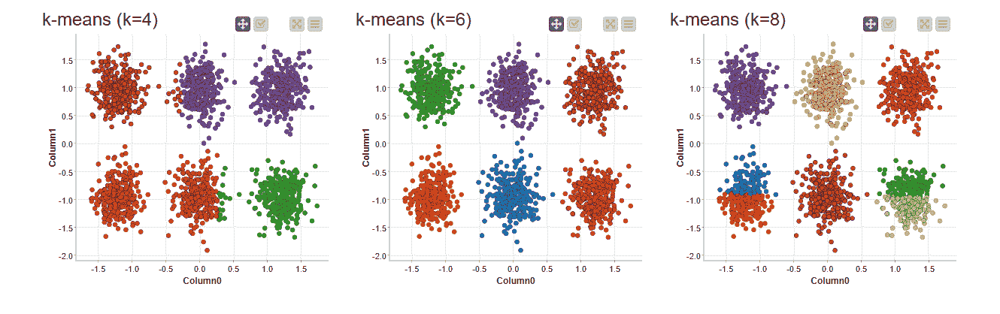

***图 1*** *:不同簇数的聚类，k=4，6，& 8。具有 6 个集群的模拟数据。图片作者。*

不幸的是，在许多情况下，我们不知道我们的数据中有多少聚类。事实上，弄清楚有多少个集群可能是我们首先要执行集群的原因。当然，数据集的领域知识可以帮助确定聚类的数量。但是，这是假设你知道目标类(或者至少知道有多少个类)，而这在无监督学习中是不成立的。我们需要一种不依赖于目标变量就能告诉我们聚类数的方法。

确定簇的正确数量的一个可能的解决方案是强力方法。我们尝试用不同数量的聚类来应用聚类算法。然后，我们找到优化聚类结果质量的幻数。在本文中，我们首先介绍两个流行的度量标准来评估集群质量。然后，我们介绍三种方法来寻找最佳的集群数量:

*   肘法
*   轮廓系数的优化
*   差距统计

**聚类结果质量**

在讨论确定最佳聚类数的不同方法之前，我们先来看看如何定量评估聚类结果的质量。想象以下场景。相同的数据集被分成三个集群(见图 2)。如您所见，左边的分类定义得很好，而右边的分类却很难识别。

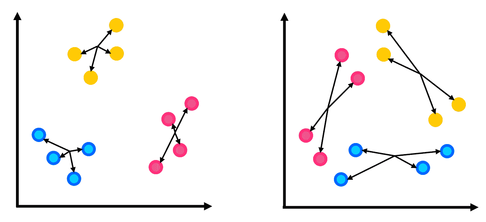

***图 2*** *:基于同一数据集的定义明确的聚类(左)和定义不明确的聚类(右)的例子。箭头指示数据点与其聚类中心之间的距离。图片作者。*

这是为什么呢？请记住，聚类的目标是将数据点分组为簇，以便(1)簇内的点尽可能相似，(2)属于不同簇的点尽可能不同。这意味着，在理想的聚类中，类内变化较小，而类间变化较大。因此，一个好的聚类质量度量应该能够定量地总结(1)和/或(2)。

一个这样的质量度量是惯性。这是通过数据点和它们所属的聚类中心之间的平方距离之和来计算的。惯性量化了集群内的变化。

另一个流行的指标是轮廓系数，它试图总结集群内和集群间的变化。在每个数据点，我们计算到该数据点所属聚类中心的距离(称为 *a* ，以及到第二好的聚类中心的距离(称为 *b* )。这里，第二最佳聚类是指不是当前数据点的聚类的最接近的聚类。然后基于这两个距离 *a* 和 *b* ，该数据点的剪影 *s* 计算为 s=(b-a)/max(a，b)。

在理想的聚类下，距离 *a* 与距离 *b* 相比非常小，导致 *s* 接近 1(见图 3，左侧)。如果聚类不是最理想的，那么距离 *a* 和 *b* 可能不会有很大的不同(见图 3，中间)。在那种情况下, *s* 接近于 0。如果聚类更差，那么距离 *a* 实际上可能大于距离 *b* (见图 3，右侧)。在这种情况下， *s* 变为负值，接近-1。

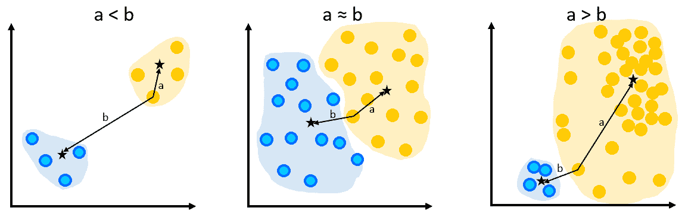

***图 3*** *:聚类最优(左)、次优(中)、更差(右)的场景。星星表示星团中心。图片作者。*

一旦在所有数据点计算了 *s* ，则 *s* 的平均值确定了轮廓系数。可以分别为每个聚类或所有数据点计算轮廓系数。轮廓系数接近 1 表示聚类算法能够将数据划分为分离良好的聚类。

**肘法**

惯性是群集数量 *k* 的递减函数。然而，它的减少率在高于或低于最佳聚类数 *K* 时是不同的。对于*K*K<K*K*来说，惯性下降很快，而对于*K*K>K*K*来说，惯性下降很慢。因此，通过在 *k* 的范围内绘制惯性图，可以确定曲线在 k 处的弯曲位置，图 4 显示了图 1 示例中的惯性图。我们可以清楚地看到在 *k* =6 处有一个弯曲，或者说是肘部。

然而，这种方法有些主观，因为不同的人可能在不同的位置识别肘部。在我们图 4 的例子中，有些人可能认为 *k* =4 是肘。此外，正如我们将在后面看到的那样，肘部可能并不总是很明显。

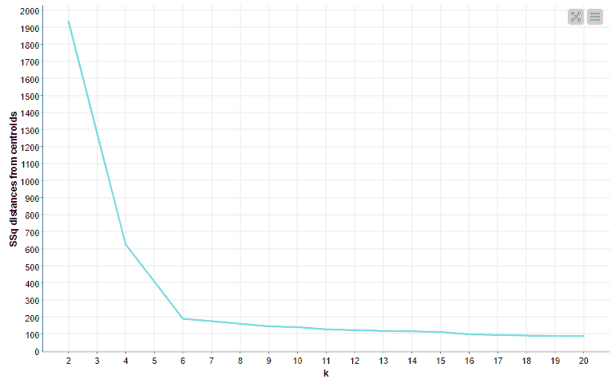

***图 4*** *:不同 k 下的惯量图，为图 1 所示的数据集。图片作者。*

肘方法的用例可以在一个自然语言问题中看到，使用 [KNIME 分析平台](https://www.knime.com/software-overview?utm_source=medium&utm_medium=social&utm_term=&utm_content=&utm_campaign=Community)确定社交网络中的最佳主题数量(参见博客[主题提取:使用肘方法优化主题数量](https://www.knime.com/blog/topic-extraction-optimizing-the-number-of-topics-with-the-elbow-method?utm_source=medium&utm_medium=social&utm_term=&utm_content=&utm_campaign=Community))。因为没有 KNIME 节点来计算惯性，所以在本例中使用了一个 [Java 片段](https://kni.me/n/QNB4FsAPnEAgOMVh?utm_source=medium&utm_medium=social&utm_term=&utm_content=&utm_campaign=Community)节点来计算惯性。下面是用来计算惯性的代码片段。

```
// Initializing the sum of squares
out_sum_squares = 0.0;
/*
The first half of columns belong to features of the origin.
The second half of columns belong to features of the terminus.
The groups of columns have to be in the same order.
 */
int col_count = getColumnCount();
int no_dimensions = col_count / 2;// Loop over the feature columns
for(int i=0; i < no_dimensions; i++){
  /*
  Checking if the feature i from the origin and
  the feature i from the terminus (i.e., i+no_dimensions)
  are not missing, and have similar column names
   */
  if(!isMissing(i) && isType(i, tDouble)
   && !isMissing(i+no_dimensions) && 
   isType(i+no_dimensions, tDouble) &&
   getColumnName(i+no_dimensions).contains(getColumnName(i))){
    // Calculating the squared distance and adding it to the sum
    out_sum_squares += Math.pow(getCell(i, tDouble) - 
    getCell(i+no_dimensions, tDouble), 2);
   }
}
```

**剪影法**

轮廓系数可以提供更客观的手段来确定最佳的聚类数目。这是通过简单地计算 *k* 范围内的轮廓系数，并将峰值确定为最佳 *K* 来实现的。一个 KNIME 组件[优化的 K-Means(剪影系数)](https://kni.me/c/XCtuVNVeuqHSQkqk?utm_source=medium&utm_medium=social&utm_term=&utm_content=&utm_campaign=Community)正是这样做的。它在 *k* 的范围内执行 K 均值聚类，找到产生最大轮廓系数的最优 *K* ，并基于优化的 *K* 将数据点分配给聚类。图 5 显示了来自图 1 所示示例数据的轮廓系数图示例。可以看出，轮廓系数在 *k* =6 处达到峰值，因此被确定为最佳 k

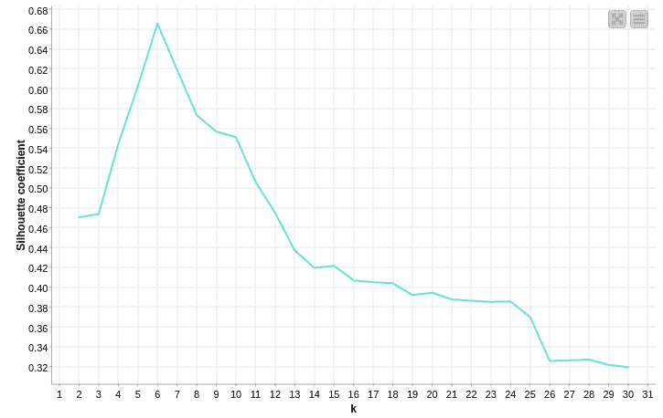

***图 5*** *:不同 k 的剪影系数图，为图 1 所示的数据集。图片作者。*

**差距统计**

为了讨论间隙统计，让我们考虑一个没有任何聚类组织的随机数据集的聚类。假设一个随机数据集被聚类成 *k* 个聚类，然后根据聚类结果计算惯性(见图 6)。尽管缺乏基本的聚类组织，但随着 *k* 的增加，聚类的随机数据产生稳定减少的惯性(惯性的复数)。这是因为聚类中心越多，数据点到聚类中心的距离就越小，从而产生衰减惯性。相比之下，正如我们在图 4 中已经看到的，在具有聚类组织的数据集中，无论 *k* 低于还是高于最优聚类数 *K* ，惯性下降的速率都会变化。当观察到的惯性和随机数据一起绘制时，差异变得明显(见图 7)。通过比较来自(有希望的)聚类数据集和覆盖数据空间中相同范围的相应随机数据集的惯性来计算缺口统计量(Tibshirani 等人，(2001))。

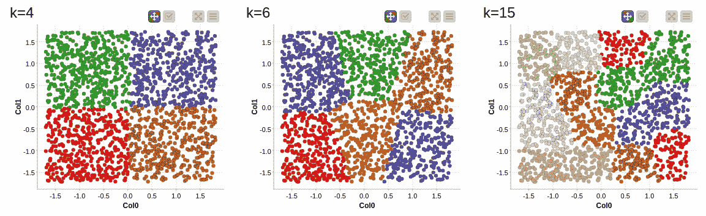

***图 6*** *:均匀分布的随机数据聚类成 k=4(左)、6(中)、15(右)个聚类。图片作者。*

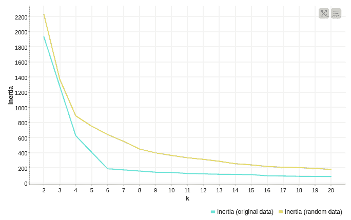

***图 7*** *:原始数据(来自图 1)相对于 k. Image 范围内的随机数据，惯性如何降低。*

在间隙统计的实际计算中，会生成一些随机样本，然后在 *k* 的范围内进行聚类，并记录所得的惯性。这为随机情况提供了一些惯性。原始数据集也在范围 *k* 上聚集，产生一系列惯性。在 *k* 簇上的间隙统计量计算如下

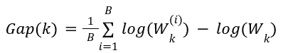

其中，Wk(i)是来自第 *i* 个随机样本(i=1，2，…，B)和第 *k 个*个聚类的惯量，Wk 是来自第 *k 个*个聚类的原始数据的惯量。我们还计算其标准偏差为


然后我们找到最优的 *K* 作为满足条件的最小的 *k*

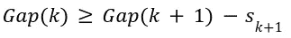

间隙统计的计算涉及模拟。我们调用 R 中的函数，通过 KNIME 工作流中的一些 R 脚本来计算 gap 统计数据。具体来说，调用 clusGap()函数来计算不同 *k* 处的间隙统计量，maxSE()返回满足上述条件的最优 *K* 。图 8 显示了我们在图 1 中的示例数据集的间隙统计图，基于在每个 *k* 处 *B* =100 次迭代。红线代表满足上述条件的最佳 *K* 。

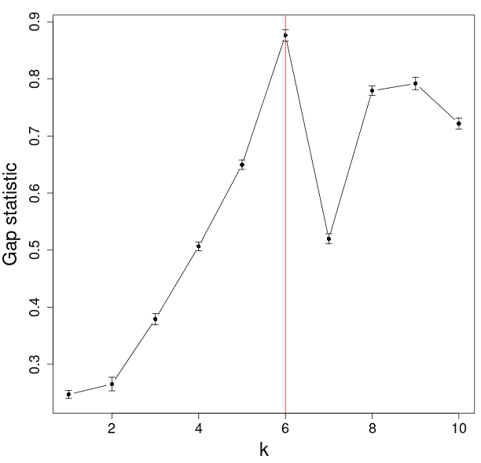

***图 8*** *:基于 B=100 次迭代的缺口统计及其标准差图。满足条件的最佳 k=6 由红线表示。图片作者。*

需要注意的是，间隙统计法确定的最优 *K* 可能不一致。例如，当缺口统计方法多次应用于我们的玩具数据时，得到的最优 *K* 可能会不同(见图 9)。

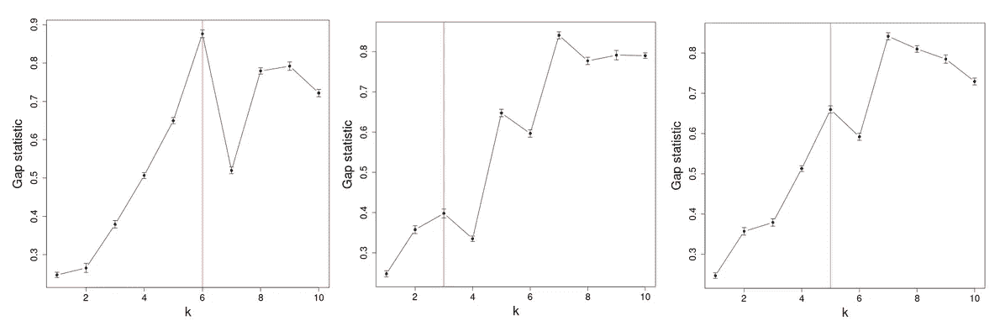

***图 9*** *:缺口统计图示例。最佳 k 可能不一致，这取决于模拟结果。图片作者。*

**示例:MNIST 手写数字数据**

现在让我们在具有集群组织的真实数据集上检查上述三种方法。MNIST 数据集由从 0 到 9 的手写数字的灰度图像组成。在这个例子中，我们使用 8×8 像素的 n=1797 个图像。图 10 显示了数据集的一些例子。上述三种方法用于确定最佳聚类数。由于该数据集中有 10 个不同的数字，因此有理由假设有 10 个聚类，每个聚类对应于其中一个数字。然而，人们可能有多种方式来书写某些数字。因此，实际上集群的数量不一定是 10。数据的 2D 散点图(由 tSNE 投影到 2D 空间，见图 11)显示，一些集群可能与其他集群分离良好，而一些集群可能接触或重叠。这个例子的工作流程可以在 https://kni.me/w/ACjm92qCUGbXsCX6 的 KNIME Hub 上找到。

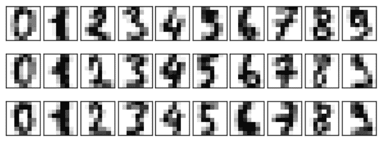

***图 10*** *:手写数字数据的例子，以 8×8 像素下采样。图片作者。*

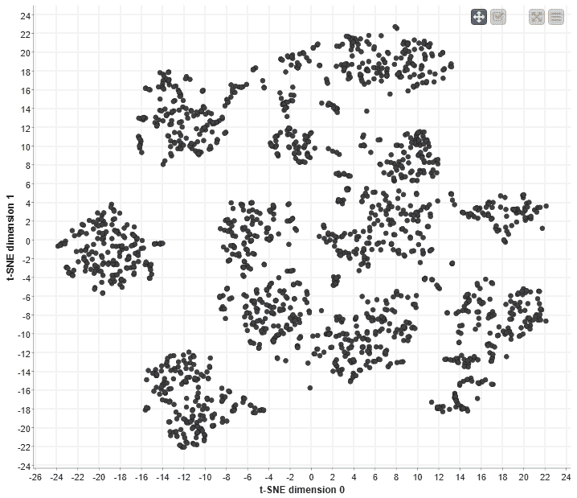

***图 11*** *:用 t-SNE(t-distributed random neighbor embedding)投影到 2D 空间的数字数据散点图。图片作者。*

肘方法的结果是不确定的，因为图中没有明显的肘(图 12，左)。在图中有一些细微的弯曲(例如，9、12、20、24，仅举几个例子)，并且这些中的任何一个都可以被选择作为聚类的数量。

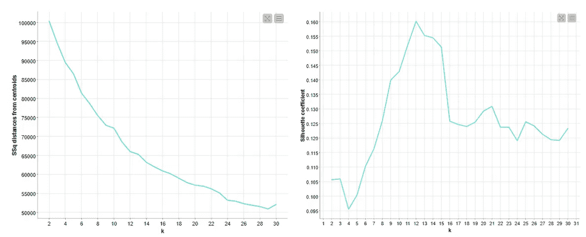

***图 12*** *:由手指数据生成的肘部图(左)和轮廓系数图(右)。图片作者。*

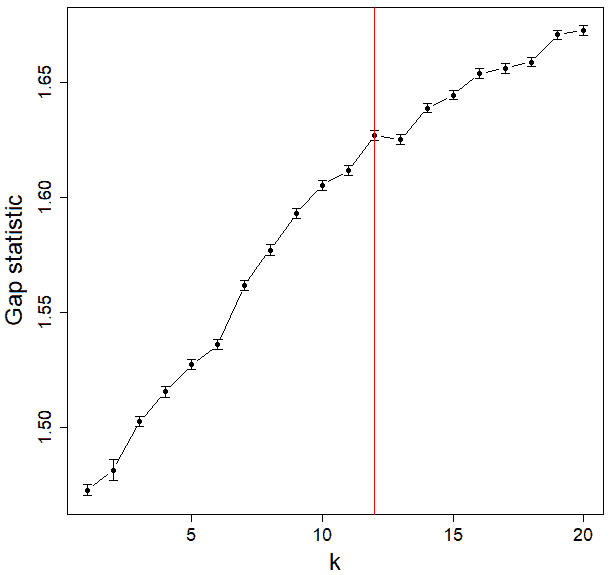

***图 13*** *:基于 B=100 次迭代，从数字数据生成的间隙统计图。红线表示最佳 k=12。图片作者。*

轮廓系数在 *k* =12 处有一个峰值(图 12，右)。根据间隙统计法，k=12 也被确定为最佳聚类数(图 13)。我们可以直观地比较 k=9(根据肘方法最优)和 k=12(根据剪影和间隙统计方法最优)的 k 均值聚类(参见图 14)。


***图 14*** *: K-Means 在 k=9，k=12 的数字数据中找到的聚类，用 t-SNE 投影到 2D 空间。图片作者。*

**结论**

我们展示了选择最佳聚类数的三种不同方法，即肘方法、轮廓系数和间隙统计。虽然肘图的解释是相当主观的，但是轮廓系数和间隙统计方法都可以精确地确定聚类的数量。然而，间隙统计涉及模拟，它可能不总是产生相同的解决方案。

与许多机器学习方法一样，这里描述的方法并不是在所有情况下都适用。由于这些方法量化了聚类中心和数据点之间的距离，因此它们适合于寻找凸聚类，例如在 K-Means 聚类中找到的聚类。

**参考**

*   罗伯特·蒂布拉尼，根特·瓦尔特，特雷弗·哈斯蒂。通过间隙统计估计数据集中的聚类数。皇家统计学会杂志，B 辑，63:411–423(2001)。