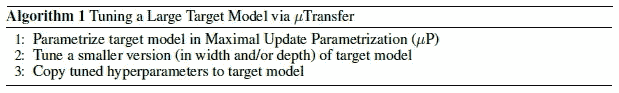
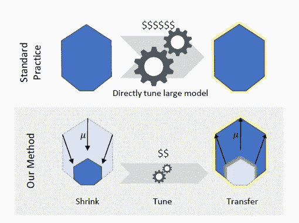
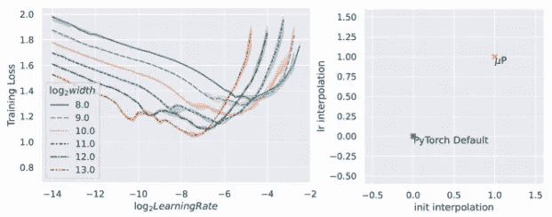
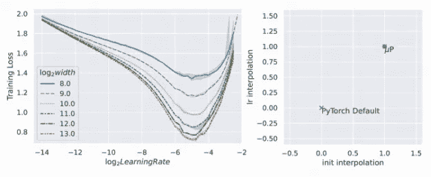
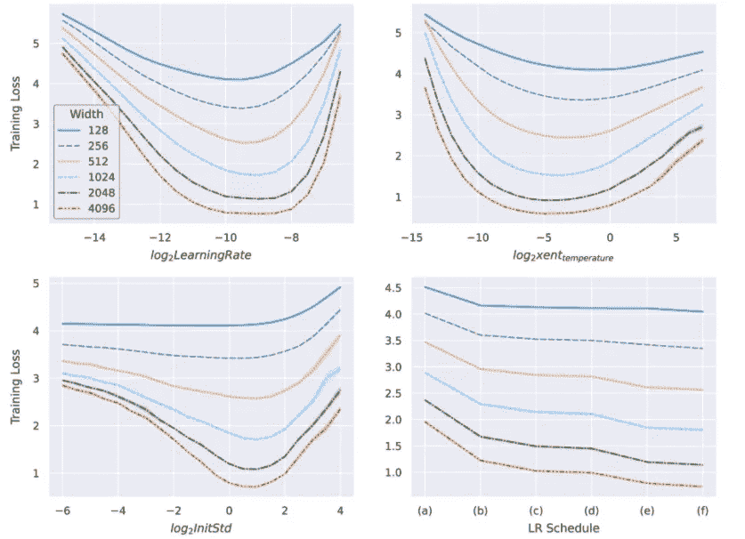
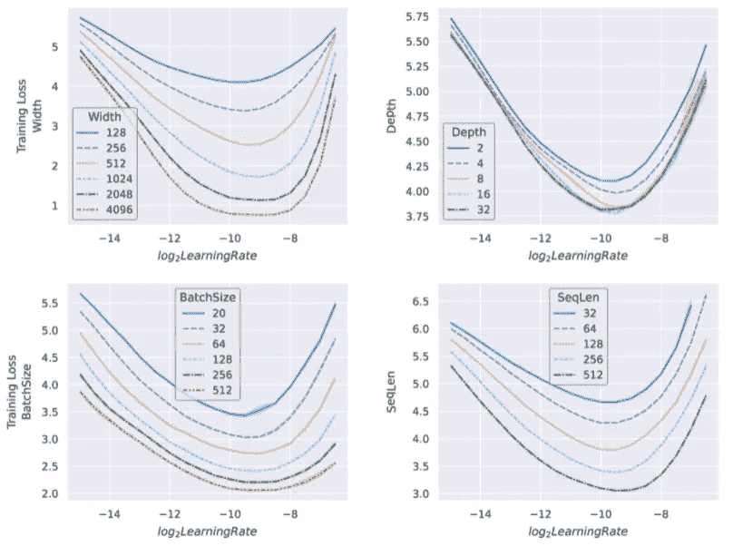
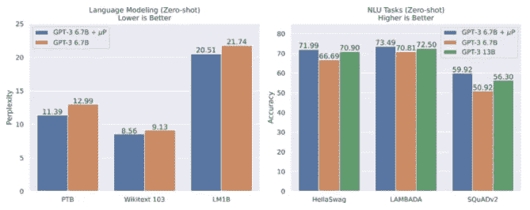

# 微软和 OpenAI 是如何从 GPT-3 中挤出精华的

> 原文：<https://towardsdatascience.com/how-microsoft-openai-are-squeezing-the-best-out-of-gpt-3-ad0990a66cbe>

## μ转移使 GPT-3 模型比以前认为的更好


艾伦·沃伯顿/英国广播公司/AI/Plant/CC 的更好图像-由 4.0

μTransfer 将允许公司廉价地从最大的模型中获得最佳性能。

大型神经网络显示出仅在几年前还不可想象的性能。像 GPT-3、Gopher 或 AlphaCode 这样的模型已经证明了基于大型变形金刚的模型会随着规模的增大而改进。然而，一个限制阻碍了它们在实践中的表现——由于它们巨大的体型，它们只能被训练一次。

GPT-3 175B(家族中最大的)花费了[几百万](https://lambdalabs.com/blog/demystifying-gpt-3/)(具体数字没有透露)[要求](https://arxiv.org/pdf/2005.14165.pdf)“在预训练期间，需要几千万亿次/秒-天的计算。” [AlphaCode](https://storage.googleapis.com/deepmind-media/AlphaCode/competition_level_code_generation_with_alphacode.pdf) 接受过一次训练，尽管再训练对于正确评估表现的变化至关重要。即使研究人员犯了通常会迫使他们重新训练模型的错误，他们也宁愿牺牲性能来避免无法承受的成本。

再培训不仅仅是为了避免错误。当神经网络初始化时，研究人员定义了一组超参数(HPs)。这些 HPs 限制了训练的边界，并引导下降过程以最小的损失收敛。有时，研究人员可以应用足够好的启发法来定义 HPs。然而，在大型神经网络的情况下，他们必须做出假设——通常是基于一组次优的惠普，因为他们无法预测行为如何随着规模的增加而变化。

尽管 GPT-3 在各种任务中的表现令人印象深刻，但由于超参数对模型来说不是最好的，因此它明显是次优的。现在，这将不再是一个问题。[微软与 OpenAI](https://www.microsoft.com/en-us/research/blog/%C2%B5transfer-a-technique-for-hyperparameter-tuning-of-enormous-neural-networks/) ( [论文](https://www.microsoft.com/en-us/research/uploads/prod/2021/11/TP5.pdf))合作，开发了μ参数化(μP)，这是一种允许跨模型大小进行稳定训练的新技术。这种技术允许他们找到较小模型的最佳 HP 集，然后将它们转移(通过μTransfer)到较大的模型，以较小的计算成本获得更好的版本。

此外，为了帮助开发人员将新技术引入他们的模型，他们发布了 PyTorch 包。您可以通过运行以下命令来使用μP:

```
pip install mup
```

# 利用μP 和μ转移优化模型

当训练不同大小的相似模型时，一个关键问题是训练不一致——至少对于通常的参数化是不一致的。128 宽度型号的最佳 HP 不一定与 2048 宽度型号的相同，尽管它们共享一个公共架构。

通过μP(最大更新参数化)，研究人员可以缩放模型大小，保持他们的行为稳定，以便他们"*收敛到*一个理想的极限，我们称之为*特征学习极限*该极限是模型能够达到的最佳状态。

他们提出，如果模型共享相同的训练动态，它们也将共享最佳的 HP。他们可以为较小的模型找到最佳的 HPs，并简单地将它们转移到较大的模型上，这将需要大量的计算来进行调整。转移过程称为μ转移(图 1、2)。



图 1:μ传输算法



图 2:μ转移的图示

## μ学习率在宽度上的转移

为了证明他们的假设，他们训练了多层感知并绘制了跨模型宽度的损失-学习率曲线，同时改变了参数化(图 3，4)。它们表明μP 下的模型在宽度上共享最小损失点。

这意味着，对于所有宽度，在μP 下，而不是在任何其他参数化下，对于相同的学习率值(本例中选择的 HP ),实现了最小的训练损失。



图 3、4:在左边，训练损失相对于学习率绘制。不同的曲线是模型的不同宽度。在右侧，它们绘制了不同的参数化(图 3 中的 PyTorch 默认值和图 4 中的μP)。当参数化为默认值时，最佳学习率会在整个模型宽度内发生不可预测的变化。当参数化为μP 时，曲线共享具有最优学习速率→特征学习极限的最小损失。你可以在这里看到[的动画情节](https://www.microsoft.com/en-us/research/uploads/prod/2022/03/1400x788_Hyperparameters_no_logo_hero.gif)。

## 不同超参数上的μ转移

他们使用变压器展示了μ转移如何在不同的 HPs 上同时发生(图 5)。



图 5:训练损失相对于学习率、交叉熵温度、初始化规模和学习率时间表绘制。以μP 参数化的变压器同时显示了不同超参数的相同值在宽度上的最小训练损失。

这些结果证明，较大模型的 HP 可以很容易地从较小模型的 HP 中预测出来，这对于具有成本效益的 HP 调整过程具有深远的意义。

## 不同维度间的μ转移

但他们并没有就此止步。模型不仅仅在宽度上变化，它们也在深度、批量、序列长度上变化。研究人员表明，除宽度外，μ转移也可能发生在其他维度上(图 6)。



图 6:训练损失与学习速度的关系图。以μP 为单位参数化的变压器显示，对于相同的学习率值，在宽度、深度、批量和序列长度上的训练损失最小。

值得注意的是，μ在宽度方向上的转移有很强的理论基础，而在其他方向上的结果则完全是经验性的。这并没有降低这些见解的有效性，但需要进一步的理论基础来建立这些发现。

## 超参数分类

你可能认为宽度和学习率都是 HP 的类型。为什么作者转移了一些而改变了另一些？其他像退学的 HPs 呢？

他们建立了一个分类，根据它们在μP 和μ转移中的作用来划分 HPs。不是所有的 HP 都能同样好的转移，其他的转移没有意义，等等。他们设计了三个类别:

*   可转让:有三个子类别。1)优化(学习速率、动量、LR 时间表)，2)初始化和 3)参数乘数。
*   不可转移:正规化(辍学，体重下降)
*   通过传输的*:宽度、深度、批量、训练时间和序列长度。*

除了深度、批量大小、训练时间和序列长度之外，所有这些都有理论依据，这些都是使用 transformers 经验验证的。

# 一个实际的场景——μ转移 GPT 三号

由于模型越大，HP 调整的成本越高，研究人员预计最大的模型从使用μP 和μTransfer 中获益最多。

因为更大的模型需要更多的计算资源来调整，所以研究人员通常会在计算成本和惠普优化之间进行权衡。OpenAI 用一组次优 HPs 训练了 GPT-3，并实现了足够高的性能水平，而不是调整模型。

为了展示μTransfer 的潜力，微软和 OpenAI 的研究人员合作，将最初的 GPT-3 与μP 版本的模型进行了比较。他们调整了一个 40M 参数的代理模型，μ将最好的一组高性能处理器转移到 6.7B 版本的 GPT-3(大 168 倍)。

他们发现μ转移的 GPT-3 在所有任务中都优于相同大小的原始版本(图 7)。μ转移模型改进如此之大，以至于它显示出与 13B GPT-3 模型相当的性能。两倍大！



图 7: GPT-3 6.7B + μP 比它的原始对手更好，甚至比两倍于它的原始 GPT-3 更好(13B)。

如果我们推广到其他模型，GPT-3 达芬奇+ μP 将表现得像一个 350B 模型。威震天 NLG 530B 将实现+1T 高密度模型的性能——目前还没有公司制造出这种产品。

更重要的是，他们发现调整成本仅占总预调整计算预算的 7%。这意味着惠普调整现在对于任意大尺寸的型号完全可行，只需多花一点钱。相对于它们提供的性能提升，这些钱可能是最值得花的。

我们可以得出结论，对μP 中参数化的模型进行调优要优于目前可用的其他两种可能性:对更大的模型进行 HP 调优和不进行 HP 调优。

在第一种情况下，它更好，因为在实现类似性能的同时，它要便宜得多；在第二种情况下，它更好，因为虽然稍微贵一些，但性能改善是显著的。

对于给定的模型，p 和 Transfer 以最低的成本提供了最好的性能。

# 结论

p 提供了一种新的方法来调整大型神经网络的成本效益的方式。有了 Transfer，以前没有探索过的将最大的语言模型优化到它们的特征学习极限的可能性现在变成了现实。

像 GPT 家族这样的模型可以通过廉价的训练达到以前只有体型两倍的模型才能达到的性能水平。超参数调优的痛苦终于结束了。我预测 P 将在深度学习世界中像火一样传播，并将成为任何未来模型的默认功能——就像 ReLU、dropout 和 batch norm 一样。

*如果你已经读到这里，考虑订阅我的免费双周刊简讯*<https://mindsoftomorrow.ck.page/>**！每两周一次关于人工智能和技术的新闻、研究和见解！**

**您也可以直接支持我的工作，使用我的推荐链接* [***这里***](https://albertoromgar.medium.com/membership) *成为中级会员，获得无限权限！:)**