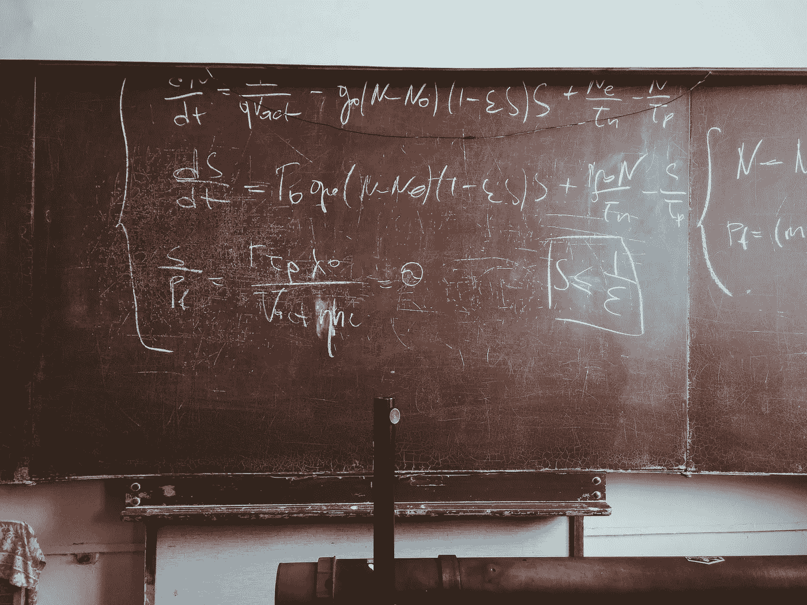

# 我的物理学学位如何帮助我成为一名更好的数据科学家

> 原文：<https://towardsdatascience.com/how-my-degree-in-physics-helped-me-become-a-better-data-scientist-726c643c54ae>

# 我的物理学学位如何帮助我成为一名更好的数据科学家

*照片由* [*罗马法师*](https://unsplash.com/@roman_lazygeek?utm_source=unsplash&utm_medium=referral&utm_content=creditCopyText) *上* [*下*](https://unsplash.com/s/photos/physics?utm_source=unsplash&utm_medium=referral&utm_content=creditCopyText)

我有理论物理的硕士学位*优等生*。当我开始我的数据科学之旅时，我发现它对这种工作非常有用。

# 我的背景

我在罗马的“Sapienza”大学学习物理，并于 2008 年获得了学士学位。然后开始攻读理论物理硕士，2010 年获得。我的重点是无序系统和复杂性理论。

自从我获得学士学位以来，理论物理一直是我的最爱。我讨厌去实验室，用激光和旧电脑工作，它们都没有更新的 Windows 98 系统，不能读取 USB 笔驱动器(我不是在开玩笑)。相反，我喜欢编程和软件开发实验室。我记得有一门关于计算物理学的课程，在这门课程中，我学习了蒙特卡罗模拟和优化算法。一切都是用纯 C 语言完成的(Python 没有现在这么有名，Matlab 也很贵)。对我来说很有趣。不幸的是，对我的大多数同事来说并不是这样。

然后我自学了其他编程语言，像 R 和 Python。我记得从 Python 2 过渡到 Python 3 有多难。

我可以说，这 5 年是刺激和美好的。以下是我学到的一些东西，我后来在工作中用到。

# 科学方法

在我的学术研究中，我被训练成对问题有很强的科学态度。找到原因并排除它。这在软件编程和科学中非常普遍，甚至在数据科学中也变得非常重要。试图从数据中提取信息实际上是一个你不得不面对的非常困难的问题。你发现了问题，然后回到问题的根源去寻找解决方案。它总是以这种方式完成，数据科学强烈地利用了这种方法。

# 不要害怕近似值

不是所有的解都必须精确。物理学告诉我，如果你能控制它们，并能给出它们需要的明确理由，近似法会被很好地接受。在科学领域，永远没有足够的时间来获得可能的最佳结果，因此科学家们经常使用近似值来发布一些部分结果，同时继续努力找到更好的解决方案。数据科学与这种工作方式非常相似。你总是需要估算一些东西(去掉那个变量，简化那个目标等等)。如果你追求完美，你永远得不到任何好的东西，而其他人会用一个近似且更快的解决方案赚钱。不要害怕近似值。相反，把它们作为讲故事的工具。“我们从这个近似值开始，这是结果，然后我们移到另一个近似值，看看会发生什么”。这是执行分析的好方法，因为近似值可以让您更清楚地了解发生了什么以及如何设计接下来的步骤。物理学告诉我，只要你能控制它们的误差，近似值是可以接受的。记住:你接受近似的风险，所以你必须管理它。

# 基本统计工具

在我本科的第一年，我已经学会了最常用的统计工具来分析数据。概率分布，假设检验和标准误差。我永远也不会把重点放在计算标准误差的需要上。任何人都讨厌物理学家，因为他们专注于测量中的误差，这是正确的，因为没有误差估计的测量不会给我们任何信息。无论如何，这些年来我在文章中提到的大多数统计工具都来自于我获得学士学位的第一年。只有 bootstrap 出现在第三年，随机过程出现在我的 MS 的第二年。物理学家生活在数据和分析中，所以这是他们教你的第一件事。即使是理论物理学家也必须分析数据，因为他们使用蒙特卡罗模拟，这是一种模拟实验。所以，物理学给了我正确的统计工具来分析每一种数据。

# 数据就是一切

专业数据科学家知道，数据就是一切，如果与数据质量相比，算法并不那么重要。当你在实验室进行实验时，实验返回的数据就是圣经，必须得到尊重。你不能对噪音进行任何分析，而是必须从噪音中提取信号，这是数据分析中最困难的任务。物理学教会我如何尊重数据，这是数据科学家的基本技能。

所以，下面是物理学教会我如何成为一名更好的数据科学家的原因。当然，物理并不适合每个人，也不是一项必要的技能，但我认为它对开始这个美好的职业真的有帮助。

*原载于 2022 年 1 月 17 日*[*【https://www.yourdatateacher.com】*](https://www.yourdatateacher.com/2022/01/17/how-my-degree-in-physics-helped-me-become-a-better-data-scientist/)*。*