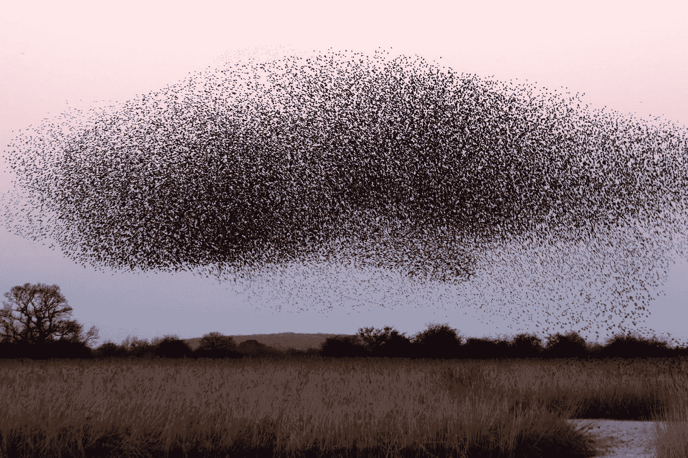
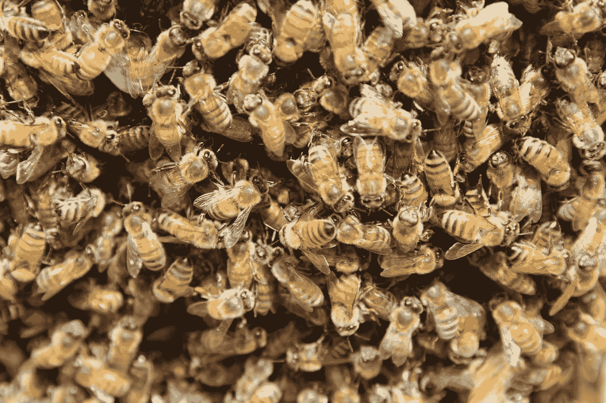

# 大自然如何启发人工智能算法

> 原文：<https://towardsdatascience.com/how-nature-is-inspiring-ai-algorithms-f52261abb75f>

## 大自然是聪明的，我们来复制吧！

图片[来源](https://unsplash.com/photos/4N5huJDOydQ) (Unsplash 许可证)

观察大自然错综复杂的运作方式可以给我们提供大量相关的想法来开发解决我们自身问题的方案。人工智能的[范围很远，其影响者也很远，自然有助于推动该技术的发展。](https://www.rootstrap.com/blog/ai-is-not-just-robots-its-for-everyone/)

许多算法已经模拟了自然现象，如动物如何组织它们的生活，它们如何利用本能生存，世代如何进化，人脑如何工作，以及我们人类如何学习。

计算机科学家甚至用机器模仿人类的智能，设计了很多 AI 算法。

在这篇文章中，我们将深入探讨几种受自然启发的不同人工智能算法。

# 群体智能

群体智能(Swarm intelligence)一词由 G. Beni 和 J. Wang 于 1989 年首次提出，描述了一组个体相互作用并与其环境相互作用而形成的自组织系统。

群体中的每个个体都充当一个简单的代理，遵循一小组规则，在没有集中控制的情况下，代理一起工作以做出明智的决策。

群体智能算法的开发者基于蚂蚁、蜜蜂和鸟类等动物的行为。

鸟类的群体智能(图片[来源](https://images.unsplash.com/photo-1516434233442-0c69c369b66d?ixlib=rb-1.2.1&ixid=MnwxMjA3fDB8MHxwaG90by1wYWdlfHx8fGVufDB8fHx8&auto=format&fit=crop&w=1470&q=80)，Unsplash 许可)

这些不同的动物在独处时智力水平都很低，但是在一起工作时，它们都能建立复杂的组织系统并生存下来。

工程师们已经将这种算法应用于机器人技术，创造出能够独立执行简单任务并与其他机器人合作解决复杂问题的机器人。

一些群体智能算法受到蜜蜂等特定类型动物的启发，如下所示:

蜜蜂的群体智能(图片[来源](https://images.unsplash.com/photo-1581237565769-68e3a3c29157?ixlib=rb-1.2.1&ixid=MnwxMjA3fDB8MHxwaG90by1wYWdlfHx8fGVufDB8fHx8&auto=format&fit=crop&w=1471&q=80)，Unsplash 许可

# 蚁群优化算法

蚂蚁使用一种群体智能来生存。虽然每只蚂蚁都有一个非常小的大脑，但它们成功地合作来支持它们的蚁群。

特别是，一些种类的蚂蚁会在地面上沉积信息素，以标记其他蚂蚁遵循的最佳路径。

受这些蚂蚁智能的启发，研究人员开发了有效的通用**蚁群优化算法。**

# **人工蜂群算法**

****I**Dervis Kara boga 在他的论文[中介绍了一种基于蜜蜂群进行数值优化的思想](https://www.semanticscholar.org/paper/AN-IDEA-BASED-ON-HONEY-BEE-SWARM-FOR-NUMERICAL-Karaboga/cf20e34a1402a115523910d2a4243929f6704db1)，“人工蜂群算法是一种基于蜜蜂行为的优化算法。**

**在蜂群中，不同的个体有不同的角色，例如受雇的蜜蜂，它们从特定的来源收集食物，和失业的蜜蜂，它们寻找新的食物来源(侦察员)或在蜂箱里等待(旁观者)。**

# **细菌觅食优化算法(BFO)**

**另一种受自然启发的群体智能优化算法 [BFO](https://ieeexplore.ieee.org/abstract/document/4731080) 模仿细菌的觅食行为，在搜索过程中获得最大能量。**

# **蝙蝠算法**

**2010 年，杨新社基于微型蝙蝠的回声定位和生物声纳能力推出了[蝙蝠算法](https://ui.adsabs.harvard.edu/abs/2010arXiv1004.4170Y/abstract)。微型机器人利用声音来探测猎物、躲避障碍物和感知周围环境。**

# **萤火虫算法**

**[萤火虫算法](https://www.sciencedirect.com/science/article/abs/pii/S0020025516320497)是一种元启发式算法，灵感来自萤火虫的社会行为和它们通过生物发光闪光的交流。**

****

**图片[来源](https://images.unsplash.com/photo-1606503778312-84ebd27ec624?ixlib=rb-1.2.1&ixid=MnwxMjA3fDB8MHxwaG90by1wYWdlfHx8fGVufDB8fHx8&auto=format&fit=crop&w=1470&q=80) (Unsplash 许可证)**

# **集体动物行为**

**[CAB 算法](https://link.springer.com/chapter/10.1007/978-3-030-16339-6_6)从动物身上获得灵感，这些动物组成群体以受益于群体的优势。**

**在群体中工作的动物在寻找食物时通常会提高效率，优化长距离迁移模式，并更好地躲避捕食者。**

**CAB 算法模拟一群遵循基于集体行为的规则的动物。**

# **粒子群算法**

**许多研究人员也开发了受人类行为启发的算法。例如，[粒子群算法](https://ieeexplore.ieee.org/document/592326)模拟人类社会如何处理知识。**

**作为一种优化算法，它试图通过评估个人知道什么和他们的邻居知道什么来改进候选解。**

# **受自然启发的优化算法**

**除了受群体行为启发的优化算法，研究人员还开发了其他基于自然生物、物理和化学系统的优化算法。**

**这些算法统称为[自然启发优化算法(NIOAs)](https://encyclopedia.pub/entry/12212) 。我们来看几个通俗的例子。**

# **引力搜索算法**

**论文 [GSA:一种引力搜索算法](https://www.sciencedirect.com/science/article/abs/pii/S0020025509001200)提出了一种基于牛顿引力定律的启发式优化算法；**

> **“宇宙中的每一个粒子都以一种与它们的质量乘积成正比、与它们之间距离的平方成反比的力量吸引着其他每一个粒子”。**
> 
> ***引力搜索算法***

# **布谷鸟搜索算法**

**[布谷鸟搜索算法](https://link.springer.com/article/10.1007/s00366-011-0241-y)是由杨和 Deb 在 2009 年为解决全局优化问题而引入的，其灵感来自布谷鸟物种中鸟类的繁殖寄生现象。**

**通过将蛋留在其他鸟类的巢中，某些布谷鸟发展出模仿其他物种蛋的颜色和图案的能力，因此宿主无法识别外来的蛋。**

# **进化算法**

**进化算法(EA)是基于达尔文的进化论，并模仿生物的自然选择过程。**

**该算法从随机群体开始，评估群体解决某个问题的适应度(解决方案有多好)，并选择最佳个体进行繁殖。**

**这种循环在群体中继续，直到算法达到最优解。**

# **遗传算法**

**作为进化算法的一种，遗传算法通过受基因突变、杂交和自然选择启发的方法来解决优化和搜索问题。**

**首先，一个突变被引入一个群体以创造多样性。接下来，杂交将群体中的两个个体结合在一起产生一个新的后代。**

**然后，在每次迭代之后，一个适应度函数评估新一代并选择最佳候选。**

# **神经网络**

**神经网络或人工神经网络(ann)是模仿人类神经元相互通信方式的[机器学习](https://2021.rootstrap.com/machine-learning/)算法。**

**神经网络拥有几个不同的层，包括输入层、一个或多个隐藏层和输出层。**

**神经网络中的每个节点代表一个人工神经元，它以特定的权重连接到其他节点。当被激活时，人工神经元将数据发送到网络的下一层。**

# **强化学习**

**动物和人类通过惩罚和奖励的反复试验来学习。例如，当一个孩子学习走路时，如果摔倒，他们就失败了(惩罚)，如果不摔倒，他们就成功了(奖励)。**

**如果他们摔倒了，他们会站起来再试一次，直到他们最终能正确行走。这是强化学习的一个例子。**

**在机器学习领域，强化学习算法在特定环境中执行一系列任务，目标是最大化奖励和最小化惩罚。**

**在每次迭代中，该算法都会学习在给定的环境条件下什么工作得最好。强化学习不同于监督学习，因为训练数据不提供与输入相关联的答案。**

**相反，程序员制定奖励和惩罚的规则，强化代理计算出如何执行给定的任务并获得最多的奖励。**

# **包扎**

**自然执行许多复杂的功能，科学家们仍在努力理解。通过模仿某些动物的行为，我们可以找到解决生活中问题的方法，也可以更好地了解自然。**

**例如，理解大脑如何工作有助于改进人工神经网络，并且，通过在[神经科学](https://www.rootstrap.com/blog/how-to-detect-eye-movement-using-neuroscience-and-machine-learning-experiment/)研究中利用人工神经网络，我们可以发现有助于我们更好地理解大脑的模式。**

**向大自然学习，我们可以开发高效的解决方案来解决各种复杂的问题。**

**你对自然如何影响人工智能算法有什么看法？请在评论中告诉我们！**