# 神经网络如何看待一只猫

> 原文：<https://towardsdatascience.com/how-neural-network-sees-a-cat-1eab7d19a751>

## 使用目标输出的梯度下降优化可视化卷积神经网络

作为人类，我们知道猫长什么样。但是神经网络呢？在这篇文章中，我们揭示了猫在神经网络大脑中的样子，也谈到了对抗性攻击。

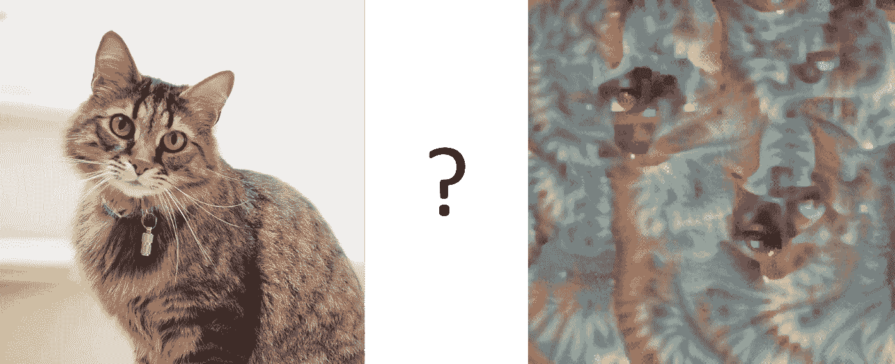

真实而理想的猫。左边的图片是来自 Unsplash 的

[卷积神经网络](https://github.com/microsoft/AI-For-Beginners/blob/main/lessons/4-ComputerVision/07-ConvNets/README.md)非常适合图像分类。有许多预先训练的网络，如 VGG-16 和 ResNet，在 ImageNet 数据集上训练，可以将图像分类到 1000 个类别中的一个。他们的工作方式是学习不同对象类别的典型**模式**，然后通过图像识别这些类别并做出决定。它类似于人类，用他/她的眼睛扫描一张图片，寻找熟悉的物体。

# **AI 初学者课程**

如果你想了解更多关于卷积神经网络和一般神经网络的知识，我们建议你访问微软 GitHub 提供的 [AI for 初学者课程](http://aka.ms/ai-beginners)。这是一个学习材料的集合，分为 24 节课，学生/开发人员可以用来学习人工智能，教师也可以在课堂上找到有用的材料。这篇博文基于课程材料。

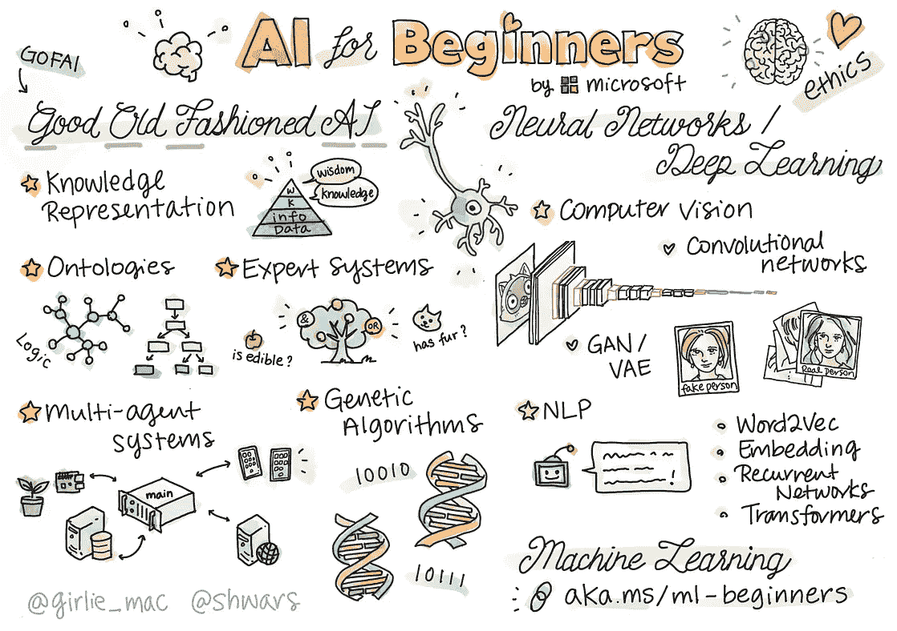

图片来自 [AI 初学者课程](http://aka.ms/ai-beginners)(在麻省理工学院许可下分发)

因此，一旦经过训练，神经网络在它的*大脑*中包含不同的模式，包括**理想的猫**的概念(以及理想的狗、理想的斑马等)。).然而，将这些图像可视化并不容易，因为模式分布在整个网络权重中，并且以分层结构组织。我们的目标是*将一个神经网络在其大脑中拥有的一只理想的猫的形象可视化*。

# 图像分类

使用预先训练的神经网络对图像进行分类很简单。使用 [Keras](https://www.tensorflow.org/api_docs/python/tf/keras) ，我们可以用一行代码加载预训练模型:

```
model **=** keras.applications.VGG16(weights**=**'imagenet',include_top**=**True)
```

对于每个大小为 224x224x3 的输入图像，网络会给我们 1000 维的概率向量，这个向量的每个坐标对应不同的 [ImageNet 类](https://github.com/microsoft/AI-For-Beginners/blob/main/lessons/4-ComputerVision/08-TransferLearning/imagenet_classes.json)。如果我们对噪声图像运行网络，我们将得到以下结果:

```
x **=** tf.Variable(tf.random.normal((1,224,224,3)))
plot_result(x)
```

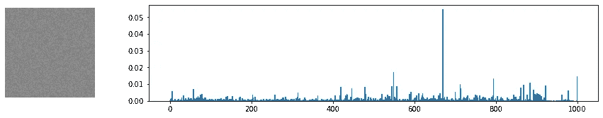

你可以看到有一个类的概率比其他类高。其实这个类就是**蚊帐**，概率在 0.06 左右。事实上，随机噪声看起来类似于蚊帐，但网络仍然非常不确定，并给出了许多其他选项！

# 为猫优化

我们获得*理想猫*图像的主要想法是使用**梯度下降优化**技术来调整我们原始的噪声图像，以使网络开始认为它是一只猫。

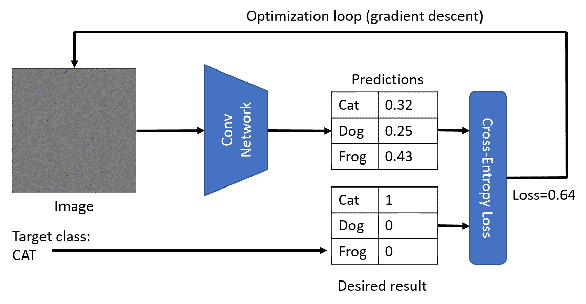

优化循环以获得被分类为猫的图像

假设我们从原始噪声图像 *x* 开始。VGG 网 *V* 给我们一些概率分布 *V(x)* 。为了与一只猫的期望分布进行比较，我们可以使用**交叉熵损失**函数，计算损失*L =*cross _ entropy _ loss*(c，V(x))* 。

为了尽量减少损失，我们需要调整我们的输入图像。我们可以使用用于优化神经网络的*梯度下降*的相同思想。也就是说，在每次迭代中，我们需要根据以下公式调整输入图像 x:

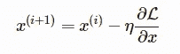

这里η是学习率，它定义了我们对图像的改变有多激进。下面的函数将完成这个任务:

```
target **=** [284] *# Siamese cat* 
**def** **cross_entropy_loss**(target,res):
  **return** tf.reduce_mean(
    keras.metrics.sparse_categorical_crossentropy(target,res))

**def** **optimize**(x,target,loss_fn, epochs**=**1000, eta**=**1.0):
    **for** i **in** range(epochs):
        **with** tf.GradientTape() **as** t:
            res **=** model(x)
            loss **=** loss_fn(target,res)
            grads **=** t.gradient(loss,x)
            x.assign_sub(eta*****grads)

optimize(x,target,cross_entropy_loss)
```

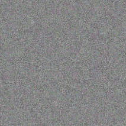

如你所见，我们得到了非常类似于随机噪声的东西。这是因为*有很多方法可以让 network 认为输入图像是一只猫*，包括一些视觉上没有意义的。虽然这些图像包含许多猫的典型图案，但没有什么可以限制它们在视觉上与众不同。但是，如果我们试图把这只*理想的吵猫*传到 VGG 网，它会告诉我们，吵的其实是一只概率相当大的猫(0.6 以上):

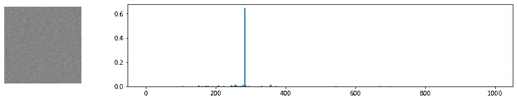

# 敌对攻击

这种方法可用于在神经网络上执行所谓的**对抗性攻击**。在对抗性攻击中，我们的目标是稍微修改一点图像，以欺骗神经网络，例如，使狗看起来像猫。一个经典的**对抗例子**摘自[本文](https://arxiv.org/abs/1412.6572)作者伊恩·古德菲勒看起来是这样的:

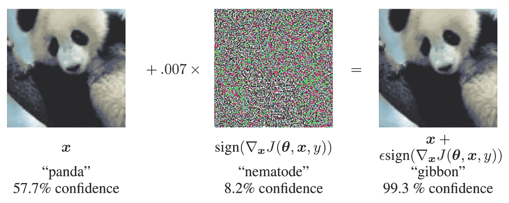

*图片来自报纸*古德菲勒，国际法院；施伦斯，j。解释和利用对立的例子。arXiv 2014， [arXiv:1412.6572](https://arxiv.org/abs/1412.6572)

在我们的例子中，我们将采取稍微不同的路线，而不是添加一些噪声，我们将从一只狗的图像(它确实被网络识别为一只狗)开始，然后稍微调整它，但使用与上面相同的优化程序，直到网络开始将其分类为一只猫:

```
img **=** Image.open('images/dog.jpg').resize((224,224))
x **=** tf.Variable(np.array(img))
optimize(x,target,cross_entropy_loss)
```

下面可以看到原图(归类为**意大利灰狗**概率为 **0.93** )和优化后的同图(归类为**暹罗猫**概率为 **0.87** )。

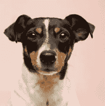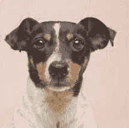

一张狗的原始图片(左边来自 Unsplash)和一张被归类为猫的狗的图片(右边)

# 理解噪音

虽然对抗性攻击本身就很有趣，但我们还无法想象神经网络拥有的理想猫的概念。我们获得的理想猫看起来像噪音的原因是我们没有对正在优化的图像 *x* 施加任何约束。例如，我们可能希望约束优化过程，以便图像 *x* 的噪声更少，这将使一些可见的图案更加明显。

为了做到这一点，我们可以在损失函数中加入另一项。一个好主意是使用所谓的**变化损失**，这是一个显示图像的相邻像素有多相似的函数。对于图像 I，它被定义为

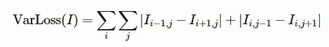

TensorFlow 有一个内置函数`tf.image.total_variation`，可以计算给定张量的总变差。利用它，我们可以按如下方式定义出*总损失*函数:

```
**def** **total_loss**(target,res):
  **return** 0.005*****tf.image.total_variation(x,res) **+**\
    10*****tf.reduce_mean(sparse_categorical_crossentropy(target,res))
```

注意系数`0.005`和`10`——它们是通过反复试验来确定的，以在图像的平滑度和细节之间找到一个良好的平衡。你可能想尝试一下，找到一个更好的组合。

最小化变化损失会使图像更平滑，并消除噪声，从而显示出更具视觉吸引力的图案。以下是这种“理想”图像的一个示例，这些图像很可能被归类为猫和斑马:

```
optimize(x,[284],loss_fn**=**total_loss) *# cat* optimize(x,[340],loss_fn**=**total_loss) *# zebra*
```

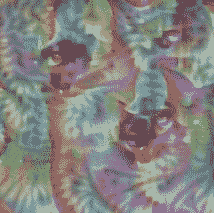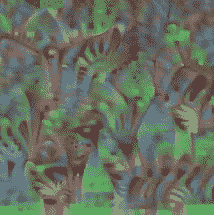

*理想的猫，概率=0.92(左边)和理想的斑马，概率=0.89(右边)*

# 外卖食品

这些图像让我们对神经网络如何理解图像有了一些了解。在“猫”的形象中，你可以看到一些类似猫的眼睛的元素，还有一些类似耳朵的元素。但是，有很多，而且遍布图像。回想一下，神经网络本质上是计算其输入的加权和，当它看到许多猫的典型元素时，它变得更加确信它实际上是一只猫。这就是为什么一张照片上有很多只眼睛比只有一只眼睛给了我们更高的概率，尽管它看起来不太像人类的“猫”。

# 玩代码

“理想猫”的对抗性攻击和可视化在 [AI 初学者课程](http://aka.ms/ai-beginners)的[迁移学习](https://github.com/microsoft/AI-For-Beginners/tree/main/lessons/4-ComputerVision/08-TransferLearning)部分有描述。我在这篇博文中提到的实际代码可以在[这里](https://github.com/microsoft/AI-For-Beginners/blob/main/lessons/4-ComputerVision/08-TransferLearning/AdversarialCat_TF.ipynb)找到。

*原载于 2022 年 6 月 7 日 https://soshnikov.com**[*。*](https://soshnikov.com/education/how-neural-network-sees-a-cat/)*