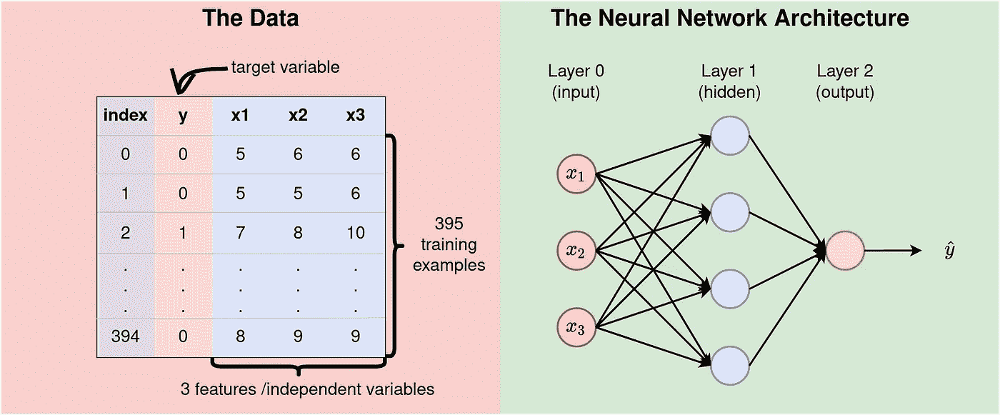
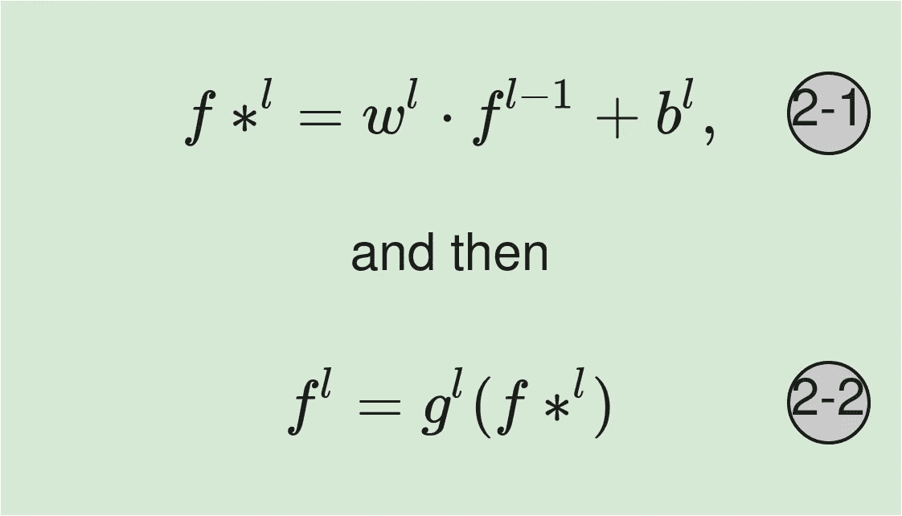
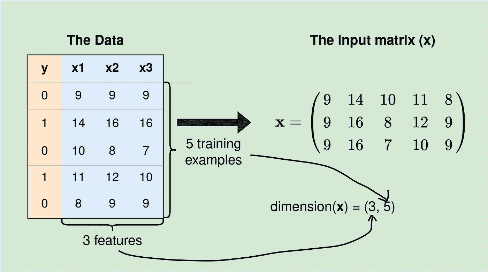

# 神经网络实际上是如何工作的——Python 实现第 2 部分(简化)

> 原文：<https://towardsdatascience.com/how-neural-networks-actually-work-python-implementation-part-2-simplified-80db0351db45>

在这篇文章中，我们继续揭穿神经网络是一个我们不太明白其工作原理的黑箱的理论。我们的目标是以一种容易理解的方式实现神经网络。万一有些概念不能马上讲清楚，请查阅参考资料部分的前几篇文章。

在本文结束时，您应该能够在给定输入数据的情况下，通过一个具有许多功能和训练示例的网络实现数据的单次转发。

让我们从数据和我们将使用的神经网络架构开始。

# 数据和神经网络架构

我们将使用包含 3 个特征和`395`训练示例的数据，如下图`Figure 1`所示。神经网络是浅层的-它在输入层有 3 个节点(因为我们有 3 个特征)，一个 4 个神经元的隐藏层，和一个输出神经元。



**图 1:** 数据和神经网络。该数据包含 3 个特征(x1、x2 和 x3)和 395 个以 y 为因变量的示例。该网络是一个 3–4–1 NN，即具有 3 层的 NN——3 个输入值，4 个隐藏层节点，1 个输出值(来源:作者)。

# 参数初始化

为了执行向前传递，我们需要定义参数(权重和偏差)的初始值。我们将从标准正态分布中随机生成所需的权重，并将偏差设置为零。进行参数初始化时，最重要的概念是确保权重和偏差矩阵具有所需的维数。在执行矩阵乘法时，尺寸错误会给我们带来问题。

## 概述重量和偏差矩阵的尺寸(参见[链接](/how-neural-networks-actually-work-python-implementation-simplified-a1167b4f54fe))

初始化参数时，有两条规则需要考虑:


等式 1:权重和偏差矩阵的维数(来源: [Post](/how-neural-networks-actually-work-python-implementation-simplified-a1167b4f54fe) )。

*   层 `**l**` **(** `**wˡ**` **)的**权重矩阵将具有** `**(nˡ, n^(l-1))**`的维度，即`wˡ`的行数将等于当前层`l`中神经元的数量，列数将等于前一层`l-1` 中神经元的数量。**
*   **偏置矩阵将有** `**nˡ**` **行和 1 列**。这只是矢量引用:[上一篇](/how-neural-networks-actually-work-python-implementation-simplified-a1167b4f54fe)。
*   例如，在我们的例子中，我们在隐藏层需要 4 乘 3 的权重矩阵。请记住，我们在输入层不需要权重，因为那里不发生任何计算，我们只是传递输入值。

> **注 1:** 输入数据必须为(n，m)维，其中 n 为特征数，m 为训练样本数。也就是说，每个训练示例将作为输入矩阵 x 中的一列出现。
> 
> **符号:**本文中，`dim(A)=(r, c)`表示矩阵`A`的维数为 r 乘 c，其中 r 为行数，c 为列数。nˡ是层 l 中神经元的数量。在上面所示的架构中，`n⁰=3`、`n¹=4`和`n²=1`。

参数初始化之后，接下来要做的事情是执行实际的计算。

# 实际计算

在任何给定的层 l，进行以下两个计算:



**等式 2:** 在第 1 层完成的计算。在等式 2–1 中，权重矩阵与输入矩阵相乘并添加偏差，而在第二个等式中应用激活。

**等式 2–1:**权重矩阵与输入相乘，并添加偏差。注意，这里的输入可以是实际的输入值，也可以是前一层`l-1`的值。这些方程的计算需要我们理解矩阵乘法和矩阵加法。如果`A`中的列数等于`B`中的行数，则两个矩阵`A`和`B`可以相乘为`A·B`。记住`A·B`和 `B·A`不一样(矩阵乘法不可交换)。此外，相加的两个矩阵必须具有相同的维数。

**等式 2–2**:激活函数`gˡ`应用于`Equation 2–1`的结果，成为`l`层的输出。请注意，在生成的矩阵/向量上使用激活不会影响其维度。

# 现在让我们将所有这些放入 Python 代码中

对于每一层，我们将初始化参数，然后执行所需的计算。在输入层，即层`0`没有计算发生，因此我们直接进入隐藏层，即层`1`。

## 第 1 层的计算

(参考`Equation 1`中的规则)对于隐藏层，layer `1`，我们需要一个维度为`(n¹,n⁰)`的权重矩阵(即当前层的神经元数乘以上一层的神经元数。这是 4 乘 3。我们需要(`n¹, 1)`作为偏差，也就是 4 乘 1。为了便于打印出数据，我们现在不使用本文开头定义的数据(我们将在本文后面这样做)。我们将使用下面的子集。



**图 2:** 将输入数据转换成输入矩阵。输入矩阵的每一行都包含特征数据。如果每一行都包含训练示例，我们需要转置 **x** ，然后乘以权重矩阵(来源:作者)。

**输出:**

```
X:  [[ 9 14 10 11  8]
 [ 9 16  8 12  9]
 [ 9 16  7 10  9]]
X shape: (3, 5)
w1:  [[-0.14441 -0.05045  0.016  ]
 [ 0.08762  0.03156 -0.20222]
 [-0.03062  0.0828   0.02301]
 [ 0.0762  -0.02223 -0.02008]]
w1 shape:  (4, 3)
b1:  [[0.]
 [0.]
 [0.]
 [0.]]
```

**第 1–5 行:**导入所需的包，并定义输入数据。输入数据`X`具有维度`(3, 5)`，3 个特征和 5 个训练样本。

> **回忆(特征数量影响输入层神经元数量):**输入层神经元数量始终等于特征数量，因此，我们在输入层有 3 个神经元。

**第 7–12 行:**根据`Equation 1`中的两条规则初始化参数。`dim(w¹) = (n¹, n⁰) = (4,3)`。

输出:

```
f11 shape:  (4, 5)
w2:  [[0.01866 0.04101 0.01983 0.0119 ]]
w2 weights:  [[0.01866 0.04101 0.01983 0.0119 ]]
b2: [[0.]]
y0:  [[0.03629 0.03134 0.04005 0.03704 0.03582]]
y0 shape:  (1, 5)
y_hat:  [[0.50907 0.50783 0.51001 0.50926 0.50895]]
y_hat shape:  (1, 5)
```

**第 1–2 行:** w1 乘以输入矩阵`x`。`dim(w1)=(4, 3)`和`dim(x)=(3, 5)`，因此`dim(w1·x)=(4,5)`基于矩阵乘法的规则。

> **注 2:** 最初，我们说(而且是矩阵加法的一个规则)两个矩阵 A 和 B 只有维数相同才能相加。但是`dim(w¹·x)=(4, 5)`但是`dim(b¹)=(n¹, 1) =(4, 1)`然而我们在第 1 行添加了它们。这是为什么呢？Numpy 包裹来救我们了。
> 
> “广播一词描述了 NumPy 在算术运算过程中如何处理不同形状的数组。在某些约束条件下，较小的阵列在较大的阵列中“广播”,以便它们具有兼容的形状。来源: [Numpy 文件](https://numpy.org/doc/stable/user/basics.broadcasting.html)。

在阵列广播之后，`dim(b¹)`变成了`(4,5)`，因此，`z11=w¹·x+b¹`也变成了 4 乘 5 的矩阵。

**第 4 行到第 10 行:**应用 Sigmoid 激活来获得第 1 层 f11 的输出。这是该层中所有神经元的输出。

**第 12–24 行:**显示了输出层的计算。如预期的`dim(w²)=(n², n¹)=(1, 4)`和`dim(b²)=(n², 1)=(1, 1)`。这里我们还需要应用数组广播的概念。

> **注 3:** 输出为 1 乘 5 矩阵。你期望你期望的是一个单一的数字吗？请记住，此输出是我们数据中所有 5 个训练示例的预测向量。换句话说，使用 Numpy 允许我们以如此高效的方式通过网络传递所有的训练示例。不要担心输出向量上的值，因为这只是数据基于随机初始化的权重通过网络的一次传递。

我们需要在模型学习的训练期间优化参数值。训练网络需要前向传递/传播(如本文所讨论的)和反向传播。后者允许我们使用一些损失函数来评估模型，计算函数相对于参数的偏导数，并相应地调整参数值。这个过程是迭代的，通过网络传递整个数据集(正向传递)和反向传递([反向传播](/how-does-back-propagation-work-in-neural-networks-with-worked-example-bc59dfb97f48))的过程构成一个完整的迭代。这就是所谓的新纪元。我们将在接下来的文章中讨论所有这些。

在我们结束之前，让我们写一些代码，对开始提到的数据集进行一次完整的前向传递(我们将直接从[https://kipronokoech.github.io/assets/datasets/marks.csv](https://kipronokoech.github.io/assets/datasets/marks.csv)加载数据)。

**输出:**

```
w1 shape:  (4, 3)
w2 shape:  (1, 4)
X shape:  (3, 395)
w1 shape:  (4, 3)
b1 shape (4, 1)
w2 shape:  (1, 4)
b2 shape (1, 1)
f1 shape (4, 395)
z2.shape (1, 395)
yhat shape (1, 395)
```

关于上面的代码，有几点需要注意:

*   我们需要传递维度为`(# features, # training examples)`的输入特征数据。通常，在熊猫数据帧(`df`)中，我们在行中有训练示例，在列中有特征，但我们需要输入矩阵中的数据，因此我们转置了第 107 行的`X`。
*   正向传递的输出`yhat`是所有训练示例的预测向量。出于这个原因，我们对数据上的 395 个训练例子进行了`yhat(1, 395)`。
*   此时，我们没有使用目标变量(`y`)。我们将在反向传播和模型评估中使用它。

参考资料:

*   [如何用 Python 从零开始实现神经网络——单个神经元上的前向传递](/how-neural-networks-actually-work-python-implementation-simplified-a1167b4f54fe)。
*   [反向传播如何在神经网络中工作](/how-does-back-propagation-work-in-neural-networks-with-worked-example-bc59dfb97f48)

我们已经在[前一节](/how-neural-networks-actually-work-python-implementation-simplified-a1167b4f54fe)中讨论了单个神经元的计算。本文讨论了一个完整的浅 3-4-1nn 的单前锋传球。接下来，我们的重点将是[理解反向传播](/how-does-back-propagation-work-in-neural-networks-with-worked-example-bc59dfb97f48)。

请[以每月 5 美元的价格注册 medium 会员资格](https://medium.com/@kiprono_65591/membership)以便能够阅读我和其他作者在 medium 上的所有文章。

你也可以[订阅，当我发表文章时，你可以把我的文章发到你的邮箱里](https://medium.com/subscribe/@kiprono_65591)。

感谢您的阅读，欢迎下次光临！！！

[](/how-does-back-propagation-work-in-neural-networks-with-worked-example-bc59dfb97f48) [## 反向传播在神经网络中是如何工作的？

### 用一个例子演示背景如何在神经网络中工作。

towardsdatascience.com](/how-does-back-propagation-work-in-neural-networks-with-worked-example-bc59dfb97f48)