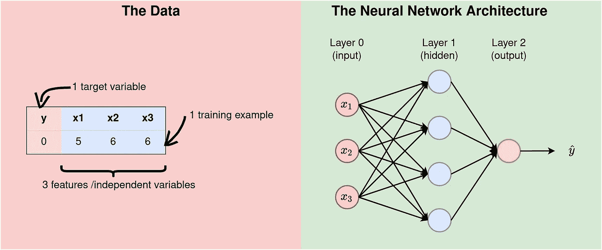
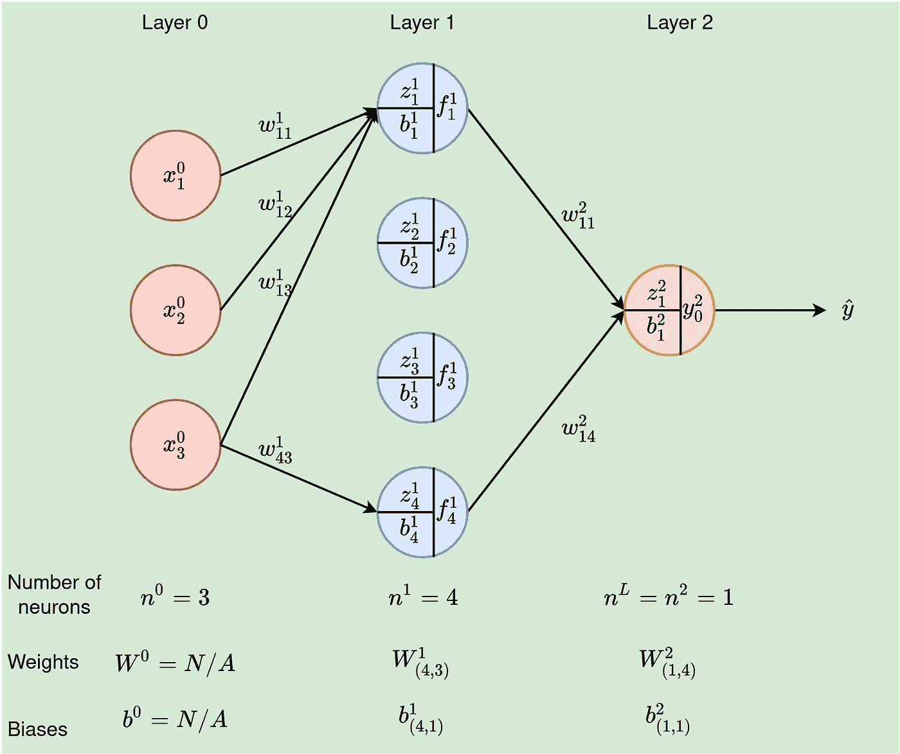
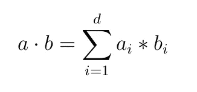
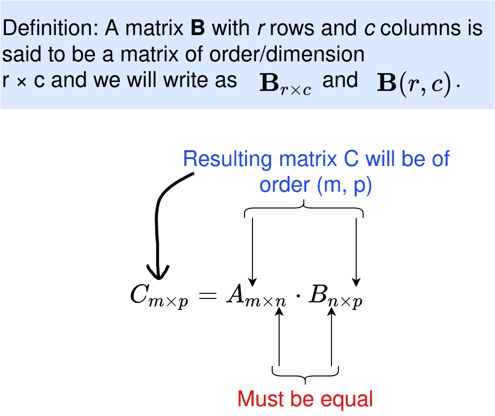
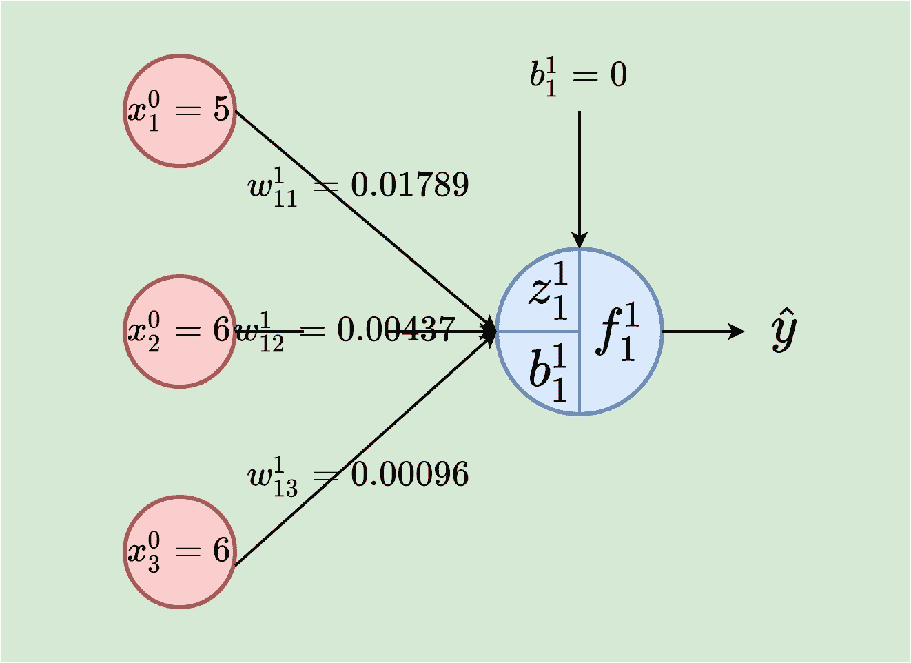
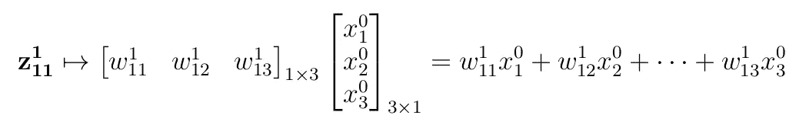
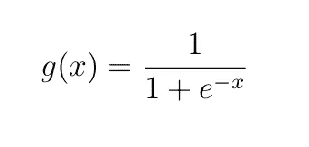

# 神经网络的实际工作方式— Python 实现(简化)

> 原文：<https://towardsdatascience.com/how-neural-networks-actually-work-python-implementation-simplified-a1167b4f54fe>

对于很多人来说，神经网络(NN)是一个黑匣子。我们知道它的工作原理，但我们不明白它是如何工作的。本文将通过一些例子来展示神经网络实际上是如何工作的，从而揭开这一信念的神秘面纱。如果这篇文章中有些术语不太清楚，我已经写了两篇文章来涵盖真正的基础知识:[第一篇](/the-basics-of-neural-networks-neural-network-series-part-1-4419e343b2b?source=your_stories_page-------------------------------------&gi=2781638f7cb8)和[第二篇](/feed-forward-neural-network-with-example-neural-network-series-part-2-eeca7a081ef5)。

# 数据和架构

在第一个示例中，让我们考虑一个简单的情况，其中我们有一个包含 3 个特征、一个目标变量和一个训练示例的数据集(实际上我们永远不会有这种数据，但是，这将是一个非常好的开始)。

事实 1:数据的结构影响建模所选择的架构。事实上，**数据集上特征的数量等于输入层中神经元的数量**。在我们的例子中，如下图所示，我们有 3 个特征，因此架构的输入层必须有 3 个神经元。

隐藏层的数量影响学习过程，因此根据应用来选择。具有几个隐藏层的网络被称为深度神经网络(DNN)。在这个例子中，我们正在处理一个浅层神经网络。我们在输入/第一层有 3 个神经元，在隐藏层有 4 个神经元，在输出层有 1 个神经元，这是一个 3–4–1 神经网络。



图 1 —左:数据，右:神经网络架构(来源:作者)。

# 记号

让我们先设置一些符号，这样我们就可以毫不含糊地使用它们。为此，让我们重新绘制上面的体系结构，以显示神经网络中使用的参数和变量。



图 2:带有变量和参数的 3–4–1 神经网络我们需要在给定输入值的情况下计算输出ŷ(来源:作者)。

以下是我们将使用的符号:

*   x⁰ᵢ-iᵗʰ输入值。输入层(层 0)的特征 I 的值，
*   nˡ——l 层中的神经元数量。如图 2 所示，第一/输入层有三个神经元，n⁰ =3，第二/隐藏层有 4 个单元，因此 n =4，最后，对于输出层，n =1。网络中有 L 层。在我们的例子中，L=2(记住，我们不把输入算作一个层，因为这里不发生任何计算)，
*   m——训练样本的数量。在我们的例子中，m=1，
*   wˡⱼᵢ
*   **第一层中 jᵗʰ神经元的 zˡⱼ加权输入，**
*   **f **ˡ** ⱼ **gˡ是层 l 的激活函数，****
*   **bˡⱼ**——l 层 jᵗʰ神经元上的偏置****

# ****矩阵和矩阵运算****

****为了有效地进行神经元运算的计算，我们可以使用矩阵和向量作为任何给定层的输入、权重和偏差。我们现在将有以下矩阵/向量和运算:****

*   ****输入为 x，****
*   ****权重作为矩阵 wˡ到达层 l，****
*   ****层 1 中的偏差为矢量 bˡ，****
*   ****zˡ = wˡ∙f^(l-1)—是层中所有神经元的加权输入，l . Medium.com 在格式上有限制。f 是来自前一层的输入的幂(l-1)。****
*   ****点积-对于任意两个等长的向量 a 和 b，点积 a∙b 定义为:****

********

****等式 1:点积 a∙b(来源:作者)。****

****aᵢ* bᵢ是向量 a 中的 iᵗʰ元素和 b 中的 iᵗʰ元素之间的标量乘法****

*   ****f **ˡ** = gˡ(zˡ+bˡ)将是层 l 的输出****

## ****矩阵乘法****

****两个矩阵只有兼容才能相乘。当且仅当第一个矩阵的列数等于第二个矩阵的行数时，称两个矩阵相乘是相容的。因此，对于 A(m，n)和 B(n，p)，那么 A∙B 的阶为(m，p)(见下图 2)。****

********

****图 3: Multix 乘法(来源:作者)。****

******重要提示:**矩阵乘法是不可交换的，也就是 A∙B 不等于 B∙A，要确定你是按照正确的顺序把它们相乘。****

## ****矩阵加法****

****两个矩阵 A 和 B 只有在维数相同的情况下才能相加，比如说 A(m，n)，那么 B 也一定是(m，n)阶的，结果 A+B 也是(m，n)维的。****

****在我们的网络中利用矩阵运算需要我们为输入、权重和偏差找到合适的维度。****

# ****单个神经元的计算****

****为了演示在一个神经元中完成的计算，让我们考虑在隐藏层的第一个神经元中的计算(注意，权重是随机生成的，并且在开始时将偏差设置为 0)。在本节中，我们基本上假设我们有一个单神经元网络，即 3–1 个神经元。****

********

****图 4:单个神经元——隐藏层的第一个神经元(来源:作者)。****

****在这种情况下，我们有 3 个输入值 5、6 和 6，以及相应的权重 0.01789、0.00437 和 0.00096。神经元通过计算 z ₁₁来衡量输入，加上偏差 b ₁₁，最后，对结果应用激活函数(我们将使用 sigmoid 函数)来获得 f ₁₁，从而产生输出。****

****加权输入:****

********

****等式 2:加权输入是相应输入值和权重的乘积之和。这相当于 1×3 权重矩阵和 3×1 输入矩阵/向量之间的点积。****

****`z¹₁₁ = (0.01789*5) + (0.00437*6) + (0.00096*6) = 0.12143`****

****添加偏置，然后应用 sigmoid 激活函数:****

********

****Sigmoid 激活函数****

****`f¹₁₁ = g(z¹₁₁+b¹₁₁) = g(0.12143+0) = 1÷(1+e^(−0.12143)) = **0.530320253**`****

****这个神经元输出 **0.5303。******

## ****把这个放到 Python 代码中****

****首先，我们需要随机生成权重，并将 bias 设置为零。****

******输出:******

```
**Weights:  [[0.01789 0.00437 0.00096]]
Weights shape:  (1, 3)
Bias:  [[0.]]
Bias shape:  (1, 1)**
```

******第 1–4 行**:导入 numpy，设置其输出值的精度为小数点后 5 位。除非明确设置了另一个精度级别，否则 numpy 在第 3 行后执行的所有计算都将保留 5 位小数。****

******第 5–8 行**:在第 6 行，一个随机种子被设置为 3(可以是任何数字)。播种确保生成的随机数是可预测的，即每次运行代码时生成的随机数都是相同的。第 8 行实际上使用标准的正态分布生成随机数。为什么要乘以 0.01？我们希望该数字较小(介于 0 和 1 之间)。我们将在下一篇文章中对此进行更多的讨论****

******第 11–14 行**只打印出矩阵的参数值和尺寸(参见下文，了解权重和偏差矩阵形状的调整，非常重要！！！)****

****>>>尺寸重要说明<<<****

****We need to get dimensions of weights and biases matrices correctly. Given the number of neurons in each layer, the dimension for the matrices can be deduced as:****

********

****Dimensions for matrices of weights and biases (Source: Author).****

*   ****The weights matrix for layer l (wˡ) will be of dimension (nˡ, n^(l-1)), that is, wˡ will have the number of rows equal to the number of neurons in the current layer, l, and the number of columns will be equal to the number of neurons in the previous layer, l-1.****
*   ****The bias matrix will have nˡ rows and 1 column. This is just a vector.****

****In our network, we have n⁰=3 input values and n¹ =1 neuron in the output, therefore, dim(w¹) = (n¹, n⁰) = (1, 3) and dim(b¹) = (n¹, 1) = (1,1). Hope this justifies the choice of shapes for the matrices of weights and biases.****

****Next is to multiply weights with input, add bias and apply sigmoid function.****

******输出:******

```
**input shape:  (3, 1)
f11:  [[0.12141]]
The output:  [[0.53032]]**
```

******第 1–4 行**定义输入并打印形状。如果不对输入进行整形，结果将是 shape (3，)的数组。应该避免称为秩 1 数组的(*，)性质的数组，因为它们会在矩阵乘法过程中引起问题。reshape(-1，1)函数告诉 numpy 根据给定的值的数量动态设置数组的行数并保持列数为 1。在我们的例子中，我们有 3 个输入值，因此我们有(3，1)作为输入形状。****

******第 5 行到第 13 行** —将权重矩阵与输入矩阵相乘以获得加权输入并添加偏差，然后对结果应用 sigmoid 激活。当乘以第 6 行中的矩阵时，注意顺序——TT 是权重矩阵乘以输入，而不是相反(还记得上一节中的矩阵乘法规则吗？).****

****并且输出为 **0.5303** 。注意，它与我们之前得到的相匹配。****

# ****将代码放在一起****

****现在让我们把所有这些放在一起****

******输出:******

```
**Weights:  [[0.01789 0.00437 0.00096]]
Weights shape:  (1, 3)
Bias:  [[0.]]
Bias shape:  (1, 1)
input values:  [[5]
 [6]
 [6]]
input shape:  (3, 1)
output [[0.53032]]**
```

****OneNeuronNeuralNetwork 类有两个参数——权重和偏差——由 magic/dunder 函数 __init__ 初始化。****

> ****每次从类中创建对象时，都会调用 __init__ 函数。__init__ 方法**让类初始化对象的属性，没有其他用途——来源:**[**Udacity.com**](https://www.udacity.com/blog/2021/11/__init__-in-python-an-overview.html)****

****我们使用 sigmoid_function 作为静态方法，因为它是一个普通的函数，不必接收第一个参数“self”。我们只是把它放在课堂上，因为它与这里的内容相关，否则就不是强制性的了。****

# ****正向传递中整个网络的计算****

****我们在上一节已经讨论了单个神经元的计算。在下一篇文章的[中，我们将讨论在给定一些数据的情况下，整个网络如何执行单次转发。](/how-neural-networks-actually-work-python-implementation-part-2-simplified-80db0351db45)****

****请[以每月 5 美元的价格注册成为 medium 会员](https://medium.com/@kiprono_65591/membership)，以便能够在 medium 上阅读我和其他作者的所有文章。****

****你也可以[订阅，以便在我发表文章时将我的文章放入你的邮箱](https://medium.com/subscribe/@kiprono_65591)。****

****感谢您的阅读，欢迎下次光临！！！****