# 如何不被时间序列模型所迷惑

> 原文：<https://towardsdatascience.com/how-not-to-be-fooled-by-time-series-forecasting-8044f5838de3>

## 知道什么时候你看到的是看起来准确的预测，什么时候预测实际上非常准确


尼古拉斯·卡佩罗在 [Unsplash](https://unsplash.com?utm_source=medium&utm_medium=referral) 上的照片

很容易被时间序列模型骗。我见过能够(似乎)准确预测最随机趋势的模型，如股票和密码价格，使用的是大多数人不完全理解的先进技术。时间序列在这方面真的像魔术一样吗？执行正确的数据操作，应用足够复杂的模型，很快，对未来任何日期索引线的预测都惊人地准确？

如果你看到了我所描述的同样的事情，并且持怀疑态度，你有这种感觉是对的。通常发生的情况是，分析师正在传递一系列单步预测，这些预测在数据的验证切片上看起来是准确的。分析师得出结论，他们创建的模型足够强大，可以准确预测未来的许多时期。这可能会有意或无意地发生——如果要我猜的话，我会说大多数分析师，他们通常会看到基于横截面数据构建模型的例子，从来没有想过向数据集添加时间元素可能会对他们的模型产生什么影响。时间序列不同于其他机器学习，必须采取额外的预防措施，否则结果会令人误解。

# 自相关的作用

一部电视剧的现在通常与其过去高度相关。这被称为序列的自回归(AR)特性，或自相关。具体来说，任何给定的值都可能非常接近它之前的值。

这一事实的含义比它们初看起来更深刻。让我们考虑一个线性模型，它有一个自回归分量、一个趋势分量和一个季节分量，例如:

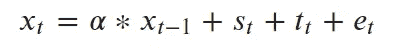

作者图片

该函数表示前一个值(`x_{t-1}`)乘以因子α，序列的“季节性(`s_t`)、序列的“趋势(`t_t`)和误差项(`e_t`)确定序列中的下一个值。假设您想将该模型应用于真实数据，特别是预测未来 10 个月的数据。你有 100 个月的观察时间来做这件事:

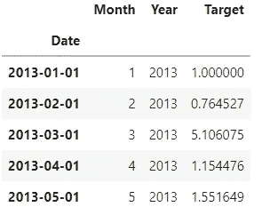

作者图片

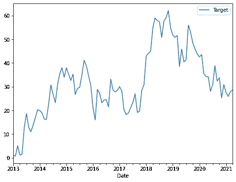

作者图片

数据有了，就准备模型吧。要从列出的方程中获得第一项，即自回归项，我们可以使用 pandas 的`shift()`方法:

```
data['AR1'] = data['Target'].shift()
```

对于季节性，我们可以使用傅立叶变换，而不是使用月份值，傅立叶变换使用波函数来模拟季节性:

```
data['MonthSin'] = data['Month'].apply(
    lambda x: np.sin(np.pi * x/(12/2))
)
data['MonthCos'] = data['Month'].apply(
    lambda x: np.cos(np.pi * x/(12/2))
)
```

最后，我们可以使用数据集中已经存在的`year`变量来模拟趋势。

现在，我们有了我们需要的所有三个组成部分:前一个序列的价值(`x_{t-1}`)、趋势(`t_t`)和季节性(`s_t`)。我们假设误差项(`e_t`)是随机的，无法建模。所以，让我们写一个正常的机器学习管道，看看会发生什么。

```
data_processed = data[
    [
         'Target',
         'AR1',
         'MonthSin',
         'MonthCos',
         'Year'
    ]
].dropna()
data_processed.head()
```

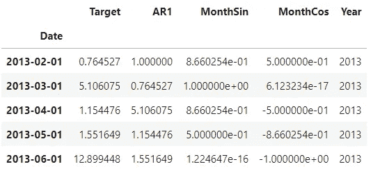

作者图片

我们使用 scikit-learn 来分割我们的数据，这样最后 10 个观察值就在测试集中。

```
y = data_processed['Target']
X = data_processed.drop('Target',axis=1)
X_train, X_test, y_train, y_test = train_test_split(
    X, y, test_size=10, shuffle=False
)
```

剩下的就是小菜一碟了。训练线性模型:

```
lr = LinearRegression()
lr.fit(X_train,y_train)
```

对看不见的测试数据进行预测:

```
pred = lr.predict(X_test)
```

最后，评估误差:

```
mean_absolute_error(y_test,pred)
```

这将返回值 3.8。我们甚至可以画出结果。

```
sns.lineplot(
    y='Target',
    x='Date',
    data=data.reset_index(),
    label='actuals',
)
sns.lineplot(
    y=pred,
    x=data.index[-10:],
    label='predictions',
)
plt.rcParams["figure.figsize"] = (8,6)
plt.show()
```

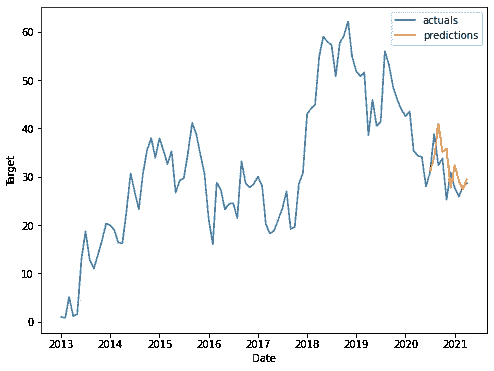

作者图片

看起来相当不错！假设您向您的主管展示了该模型，他们同意该模型是准确的，并且应该实施。但是等等，一个问题。该模型严重依赖上一个序列的值来预测下一个值。如果我们不知道所有十个步骤的前一个值，我们如何将这个模型扩展到未来呢？

做到这一点的一种方法是扩展我们的方程，以便可以使用多步骤过程动态评估线性模型。考虑在原始等式中，不是使用实际的过去值作为输入，而是使用过去值的预测，因此第二预测步骤可以写成:

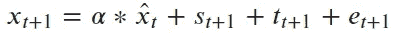

作者图片

更一般地说，我们可以说:

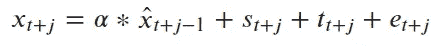

作者图片

其中 *j* 是预测范围内的任意时段。这是将你的预测延伸到未来时期的可靠方法。问题解决了。除此之外，我们遇到了两个问题:

1.  为此，编写预测评估程序需要做大量的额外工作。
2.  我们的模型没有经过这种方式的测试，所以测试集度量可能会产生误导。

我们可能认为第二点没什么大不了的，但实际上，正如我们将看到的，这是一件大事。因为在测试集中，我们知道我们所做的所有 10 个预测的 AR1 值，所以我们报告的错误性能被大大夸大了(或者你可以说缩小了，因为越小越好)。我们的图表也很容易让人误解。这个模型实际上没有那么精确，至少 10 步内没有。

我们可以使用 [scalecast](https://github.com/mikekeith52/scalecast) 包有效地演示这一点。我们将使用相同的数据并将相同的术语添加到`Forecaster`对象中:

```
from scalecast.Forecaster import Forecasterf = Forecaster(y=data['Target'],current_dates=data.index)f.set_test_length(10)
f.generate_future_dates(10)
f.add_seasonal_regressors('month',sincos=True,raw=False)
f.add_seasonal_regressors('year')
f.add_ar_terms(1)
```

然后我们称之为模型。但是，我们要用两种不同的方式来称呼它。第一种方法是 scalecast 的默认方法，其中测试集预测是通过我们已经介绍过的动态预测过程进行的。在测试集中，AR1 的值不再是已知的，但相反，它是 10 个步骤中的 9 个步骤的预测值(在步骤 1 中，我们使用实际值，因为我们知道它是什么)。第二个模型将与我们评估的没有 scalecast、非动态评估的模型完全相同，其中我们总是知道测试集中 AR1 的值:

```
f.set_estimator('mlr')
f.manual_forecast(call_me='mlr_dynamic')
f.manual_forecast(call_me='mlr_non-dynamic',dynamic_testing=False)
```

然后我们绘制结果图:

```
f.plot_test_set()
plt.rcParams["figure.figsize"] = (8,6)
plt.show()
```

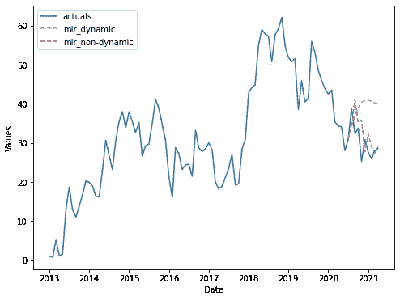

作者图片

上图中的红线是我们之前评估的模型，同样的趋势，同样的预测值。橙色线是我们用同样的输入获得的结果，但是是动态测试模型。差别很大！以至于，事实上，测试 MAE 下降到 9.1，或者几乎差 2.5 倍！

```
f.export('model_summaries')[['ModelNickname','TestSetMAE']]
```

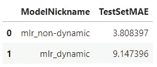

作者图片

哇哦！现在我们需要解释我们的主管发生了什么事。

# 更广泛的影响

这意味着什么？我可以用同样的输入运行同样的模型，似乎可以预测任何事情，我是说任何事情，如果我不动态测试误差项的话。下面，显示的图显示了一条红线，它是非动态评估的预测，以及一条橙色线，它显示了模型在完整测试集上的更公平表示，即真正的样本外预测。所有应用的模型都属于多元线性回归类。

## 标准普尔 500 指数

以下是我对 2021 年开始后不久标准普尔 500 唯一训练数据的预测:

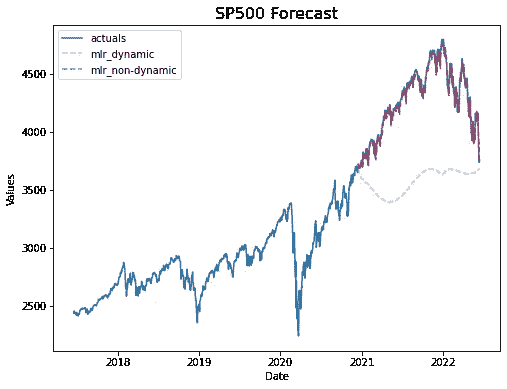

作者图片

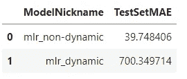

我可以预测到它的急剧上升，也几乎可以预测到它开始下跌的准确时间。

## 比特币

2021 年 12 月，我本可以预测到最近的比特币崩盘:

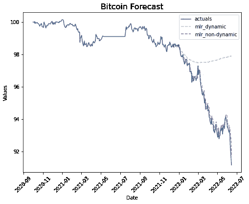

作者图片

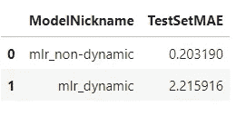

## 新冠肺炎（新型冠状病毒肺炎）

通过使用一个主要机场的航班乘客作为代理，我可以预测到 2015 年新冠肺炎疫情航空旅行的下降，以及随后的复苏！！

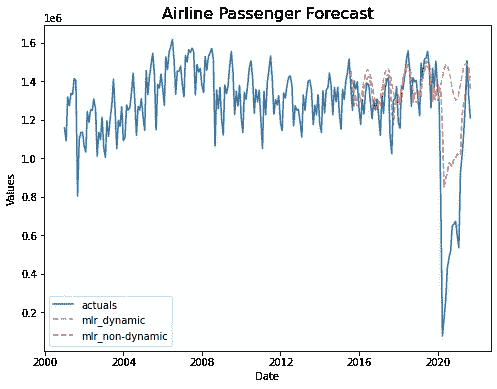

作者图片

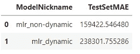

请记住，所有这些模型都是在一个数据集上训练的，并在他们从未见过的数据切片上进行验证。因此，我只能断定，我偶然发现了世界上最强大的模型之一。不错！

# 如何避免制造误导模型

所以，很明显，我不可能预测到这些事情。但是，我们有多经常看到这样的结果，当实际上，除了一系列单步预测之外，分析师试图传递高度准确的模型？这些模型中有很多没有受到挑战，因为它们是用先进的机器学习算法构建的，或者是由不了解情况的分析师构建的。无论它们看起来多么花哨，无论它们的解释多么雄辩，高级模型，包括递归神经网络和 LSTMS，都不是魔法。他们无法预测不可预知的事情。这并不意味着没有高智商的人在用它们做着不可思议的工作，只是意味着当它们被不正确地应用时，它们会变得极具误导性。

所以，现在我们知道不该做什么了。在[第二部分](/model-validation-techniques-for-time-series-3518269bd5b3#1b00-d59e31db8013)中，我们探索了可以帮助我们建立不会欺骗的高效时间序列模型的验证技术。它们在测试集上看起来不那么准确，但它们更擅长预测未来，这正是我们在预测时真正关心的。因此，如果你感兴趣的话，可以订阅并注册电子邮件通知。本分析中使用的所有数据都是虚构的，通过公共 API 获得，或者通过麻省理工学院许可获得[。看到这里的](https://github.com/Zohoor-NezahdHalafi/EnplanementForecasting)[笔记本](https://github.com/mikekeith52/scalecast-examples/blob/main/misc/validation/fooled_by_forecasting_models/fooled.ipynb)我创造的。