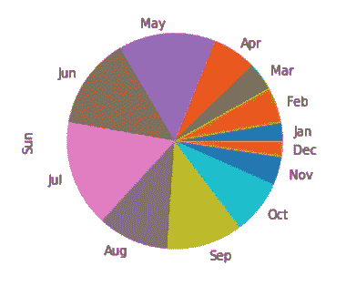
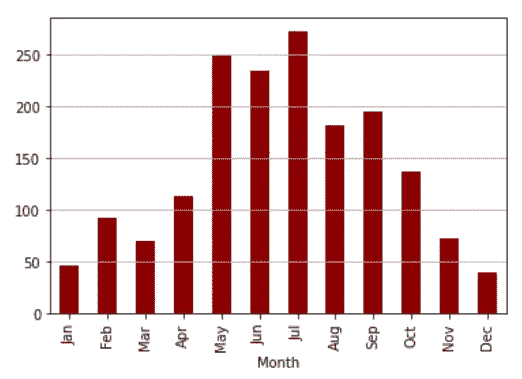
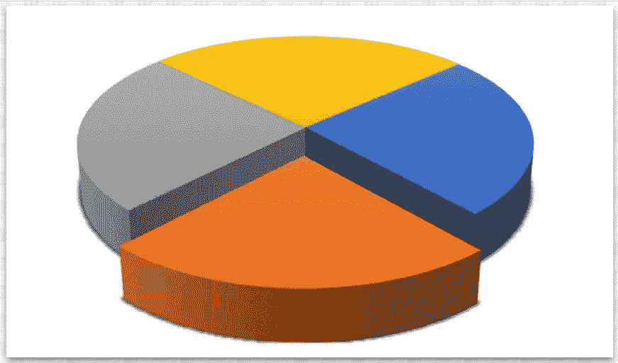
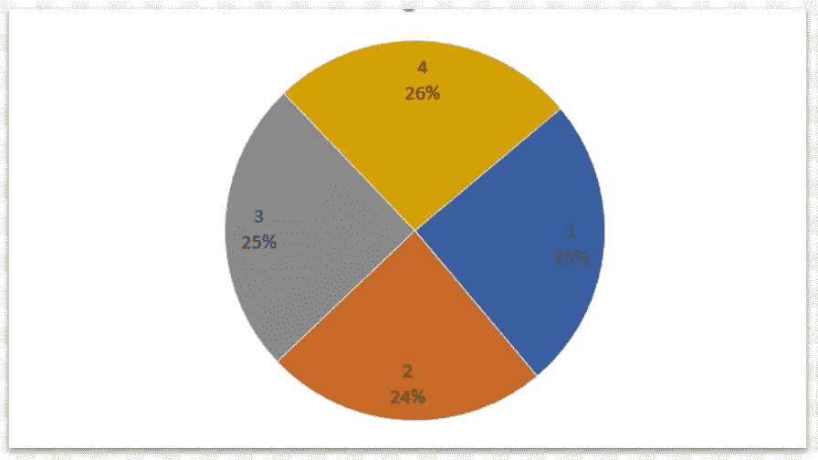
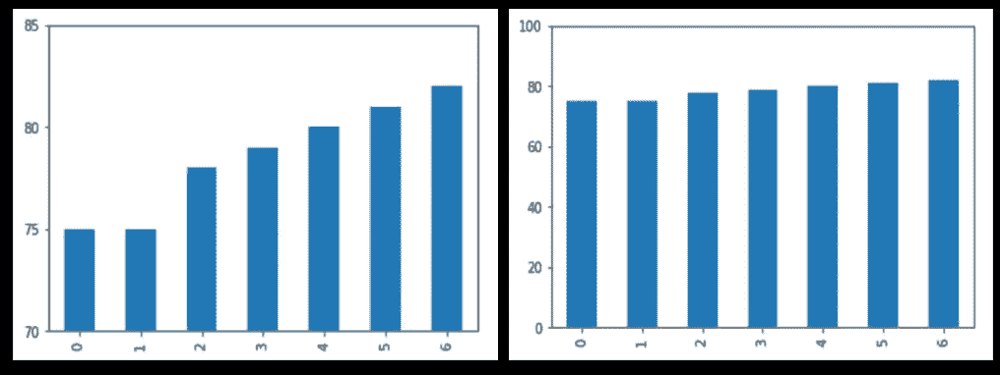
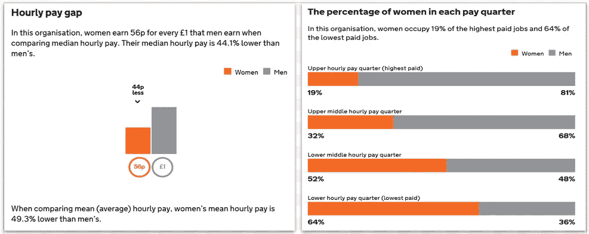
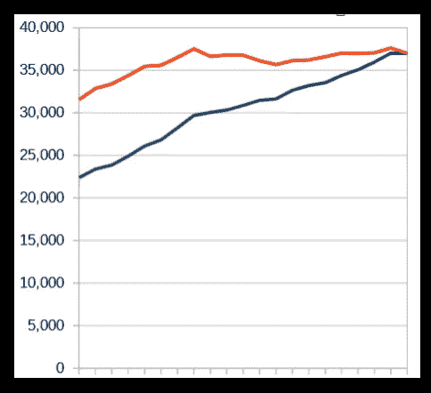
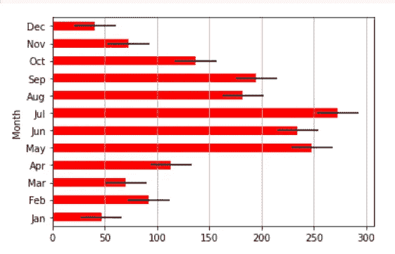

# 如何不和图表撒谎

> 原文：<https://towardsdatascience.com/how-not-to-lie-with-charts-3516b38a680b>

## 数据可视化

# 如何不和图表撒谎

## 你可以用数据可视化来告知，或者误传。如果你想做前者，而不是后者，我们会考虑要避免的事情。

改编自著名的短语* —作者的形象

数据被用来说服我们——提出一个论点。数据科学家或数据记者想要讲述一个关于一个想法、一项研究、一个理论、一项新技术的故事。

但有时有一个隐藏的议程。

也许是一个政客在推动一个党派议程，或者是一个营销主管试图销售一种产品，但有时数据的呈现方式是设计师希望你做一些他们想要的事情——也许是为他们的政策投票，或者也许是购买一台新的洗衣机或冰箱。

我们可能希望数据公平地呈现给我们，但情况并非总是如此。那么，我们能做些什么来发现那些可能想要误导我们的人，以及我们如何确保我们不会无意中误导他人呢？

让我们考虑一下图表是如何对我们撒谎的(然后我们会看一些真实的例子)。

# 图表说谎的 5 种方式

Alberto Cairo 告诉我们，使用图表欺骗观众有五种方法:

*   使用设计不佳的图表
*   显示可疑的数据
*   显示不足的数据
*   隐藏不确定性
*   暗示误导模式

Cairo 是在媒体中使用图表的权威。他在为西班牙和巴西的主要报纸工作时学会了印刷媒体行业。现在他是佛罗里达州迈阿密大学传播学院视觉新闻学的骑士教席，也是私人和政府组织的顾问。

Cairo 也是许多书籍的作者，包括[真实艺术:数据、图表和交流地图](https://www.amazon.com/gp/product/0321934075/ref=as_li_tl?ie=UTF8&camp=1789&creative=9325&creativeASIN=0321934075&linkCode=as2&tag=alanjones01-20&linkId=6a76e8b36d278765355b21a2e9c35d6e)和[功能艺术:信息图形和可视化介绍](https://www.amazon.com/gp/product/0321834739/ref=as_li_tl?ie=UTF8&camp=1789&creative=9325&creativeASIN=0321834739&linkCode=as2&tag=alanjones01-20&linkId=d359c186f70be2eddf4322fda17f2f4a)。

但是上面列出的欺骗方法来自于[图表如何说谎:对视觉信息变得更聪明](https://www.amazon.com/gp/product/B07P88R6DW/ref=as_li_tl?ie=UTF8&camp=1789&creative=9325&creativeASIN=B07P88R6DW&linkCode=as2&tag=alanjones01-20&linkId=c6f4f3ae26ff2bcdc58667e5bdf321d1)(从现在开始， *HCL* )。这本优秀的书以一个必要的章节开始，讲述了图表是如何工作的，但很快就进入了主题的实质:他们如何对我们撒谎，如何发现他们在对我们撒谎，以及自己如何不这样做。

# 糟糕的设计

图表设计不佳的原因有很多。在同一个图表上对不同的测量使用不同的刻度，例如，扭曲图形的比例，选择错误的基线(如果它不是零，你需要思考为什么不是)或使用三维图表。

## 饼图

有些人会说，简单地使用饼图是糟糕的设计，因为数据通常可以通过其他方式更好地交流。

他们说得有道理。

如果一个饼图有两个或三个以上的部分，它们可能很难解释，因为我们不太擅长判断一个饼图部分所代表的数量。与相同数量的饼图相比，更容易看出一堆柱形图之间的差异，这就是为什么条形图通常比饼图更可取。

想象一下你正在考虑安装太阳能电池板——当天气晴朗时，你可能会这么做。看看这张一年日照时间的饼状图:

饼图-作者图片

哪个月阳光最充足？七月，五月？哪个阳光最少？看起来是一月或十二月。

现在看一个显示相同数据的条形图:

条形图-作者提供的图像

这里不需要猜测。哪一列更大是完全清楚的，并且您对月份之间的数字差异有更好的了解。

也许没有饼图那么吸引人，但是数据更清晰。

但是，如果普通的饼状图很难解释，三维饼状图可能会特别有问题。

## 三维图表

看看下面的图表，它是由 *HCL* 中的一个例子启发而来的。想象一下，饼图代表我的公司在小部件制造领域的市场份额(我是橙棕色部分)。

作者从 ***图表如何说谎*** *的例子中获得灵感，作者 Alberto Cairo*

看来我做得不错！我没有主导市场，但我的份额看起来很大。

但这不是真的。

3D 效果并没有给出真实的画面。我的饼图部分，也就是从其他饼图中挤出来的部分，看起来很大，但实际上是四个饼图部分中最小的。

这张更常规的图表显示了实际情况。

作者图片

## 基线效果

下一张图有一个不同的问题。数据来自 HCL，显示了在奥巴马总统任期内美国学校毕业率的改善情况。两个图表显示了相同的数据，但左边的图表显示了成就的明显变化——最后一列的长度是第一列的两倍多——但这是误导性的，因为使用的基线不是零而是 70%(美国政府公布的原始图表比这张图表更引人注目，但说明了同样的问题)。

作者提供的图片

右边的图表是一个更真实的零基线条形图，显示增长是真实的，但没有左边的图表让我们相信的那么剧烈。

如果图表不是从零开始，那么你必须知道为什么不是。例如，气候变化否认者有一个臭名昭著的图表，它绘制了 0 到 100 摄氏度范围内的温度变化。在这种尺度下，全球气温的变化几乎不明显。但这显然是无稽之谈，因为水的冰点和沸点(0 和 100)与气候变化没有多大关系。这是一个明显的例子，零基线是完全不合适的。大多数合理的图表显示了最近几年平均温度的变化，相对较小的温度变化更容易被看到。

# 可疑的数据

2018 年，据报道，某家英国银行存在性别薪酬差异问题。媒体抓住标题数字不放，称女性薪酬比男性低 44%左右。以下是英国政府官方网页的一个片段(暂时关注左边的图表):

银行的性别薪酬差距，2018 年-英国政府转载于[开放政府许可 v3.0](https://www.nationalarchives.gov.uk/doc/open-government-licence/version/3/)

但是，尽管报纸抓住了这些数字，但它们并没有说明全部情况。虽然总体来说女性确实比男性挣得少，但世界银行报告称，做同样工作的男性和女性的薪酬相似。到底发生了什么？

在比较类似的工作时，没有明显的性别工资差距。但是有一个问题。

标题数字的原因是从事低收入工作的妇女比男子多，所以这些妇女的总收入当然低于男子。

世行不存在性别薪酬差距问题，而是存在机会均等问题。

右边的图表显示，大多数高薪雇员是男性，女性倾向于从事低薪工作。

这仍然是一个问题，但不是报告的问题！

解决性别薪酬差距问题相对简单——给女性加薪就行了。但是，改变公司各个层面的性别比例需要更长的时间——你不能解雇大部分男性，雇佣更多女性，因为那样会因为公司的不良行为而惩罚员工个人。你必须等待人们继续前进或者退休。

有时需要多挖掘一点才能找到真实的故事。

# 数据不足

有时，我们可能会被缺乏数据或不清楚到底在测量什么所误导。

## 不要忘记通货膨胀

当政客们想要吹嘘他们在任期内如何资助某事或工资如何上涨时，他们通常会引用绝对数字——资助增加了 X 百万美元，平均工资增加了 Y 千英镑。

根据经合组织的数据，这是 2001 年至 2020 年间英国的平均工资。

2001 年至 2020 年英国平均工资——作者图片，数据来源:OECD

蓝线显示实际增加的 GB 磅数。2001 年平均工资为 22，371 英镑，2020 年为 36，987 英镑。这相当于增加了 14616 GPB，增幅约为 65%。

现在，如果我是一位执政时间很长的首相，我可能会忍不住指出，如此显著的增长是在我的任期内发生的。但这并不完全正确。

由于通货膨胀，现在英镑的价值比 10 年前要低，所以 2001 年的英镑价值比 2020 年的英镑高，所以这种增长并不像乍看上去那样。

图表中的红线使用 2020 英镑的值作为平均工资的衡量标准，正如你可以看到的那样，工资的增长没有那么急剧。2001 年的起点是 31，542 英镑(2020 年)，2020 年的起点当然与之前的 36，987 英镑(2020 年)相同。现在，这比 2020 年增加了 5，445 英镑，或在 10 年内增加了约 17%——不太好！

如果你看到一个政客声称国防经费、护士工资、对外援助资金、教育预算或其他任何东西都大幅增加，确保他们使用的是经过适当调整的数据。如果你正在研究这样的证据，那么确保你也是。

阿尔贝托·开罗在他的书中提供了一个类似的例子。它对近年来最卖座的电影提出了质疑，并发现尽管按照现代标准，实际数字看起来很小，但电影《大白鲨》仍然是最大的财务成功之一。

## 我们所说的平均是什么意思

上面的例子是合理的，因为我们看到的是一段时间内的工资轨迹，而不是某个人的收入。

但是如果我们对普通英国人的实际工资感兴趣，这是一个有用的图表吗？

平均实际上是什么意思？大多数人的收入都在这个平均工资左右吗？

根据经合组织，他们对平均值的定义如下:

*“平均工资的计算方法是将基于国民账户的工资总额除以整个经济中的平均雇员人数，然后乘以每个全职雇员每周平均工作时间与所有雇员每周平均工作时间的比率。”*

换句话说，它是工资的平均值，并根据人们工作的实际时间进行调整。

但是，正如 Alberto Cairo 指出的那样，当一位政治家说减税将意味着普通人减税 X 美元时，这意味着什么呢？一般人是谁？

平均值可以是一组数据的统计平均值、中值或众数。这个词的日常用法通常是统计平均值，即某一特定测量值的总和除以这些测量值的个数。

但是平均数可能会被少数非常高的薪水扭曲，英国国家统计局(ONS)更喜欢使用中位数，这是范围的中心点，也就是说，50%的工人收入高于这个数字，50%的工人收入低于这个数字。

国家统计局 2021 年的工时和收入年度调查显示，全职工人的平均工资为 38，552 英镑，中位数为 31，285 英镑。差别很大。

所以，我们需要明确一点，我们说的是平均工资还是一般人的工资。

# 清楚不确定性

所有模型都是近似值。它们必须如此，因为它们是现实的简化版本。要想百分之百准确地预测一个事件，唯一的方法就是使用时间机器。即便如此，如果《回到未来》电影可信的话，那也可能行不通。

但是当我们看到 a 候选人在选举中有 75%的胜算时，我们自然会相信他们真的会赢，如果他们赢不了，我们就会抱怨说民意测验专家说的是错的。75%的胜算，当然还有 25%的败局。但试图说服一个押注热门人选的人相信，如果选举再举行 100 次，我们的候选人将赢得其中的 75 次，是没有用的。

缓解这个问题的一种方法是使用误差线。这是我们之前看到的相同的降雨量数据，但是让我们假设这是一个预测。误差棒显示我们的预测误差在正负 10%以内。

作者图片

# 误导模式

相关性并不意味着因果关系——这是统计学家的口头禅。仅仅因为两个变量变化的方式看起来像是有联系的，并不意味着一个直接影响另一个。例如，冰淇淋销售和晒伤之间可能有某种关系。那么，我们是否可以得出结论，吃冰淇淋会导致晒伤？

显然不是。

这种不太可能的相关性是由一个混杂变量引起的。在这里是太阳。当天气晴朗时，更多的人被晒伤，也有更多的人吃冰淇淋。晒伤病例和冰淇淋消费量都在上升，但它们都依赖于第三个变量，而不是相互依赖。

然而，有时混杂变量不太明显。在 *HCL* 中，Cairo 给出了一个很好的例子。散点图似乎显示，吸烟的人越多，预期寿命越长——这至少是一个意想不到的发现。然而，仔细观察，它实际上表明，富裕国家的人比贫穷国家的人更长寿，吸烟更多，而贫穷国家的人往往寿命更短。在中等收入国家，人们的寿命和吸烟率各不相同。将数据组合在一张图表上显示出奇怪的相关性，但当突出显示国家财富时，很容易看出正是这一点对预期寿命产生了重大影响。

我希望通过图表可能说谎的五种方式的小旅行是有用的，并将帮助你更深入地思考如何呈现你的数据。当然，真正的专家是 Alberto Cairo，他给出了比我更多的例子，我强烈推荐他的书。

一如既往地感谢阅读。如果你想知道我什么时候发表文章，你可以在 Medium 上订阅(见下面的链接)，或者，你可以得到我偶尔的免费时事通讯，Substack 上的[技术文件](https://technofile.substack.com/)。

# 参考

## 书

[图表如何说谎:让视觉信息变得更聪明](https://www.amazon.com/gp/product/B07P88R6DW/ref=as_li_tl?ie=UTF8&camp=1789&creative=9325&creativeASIN=B07P88R6DW&linkCode=as2&tag=alanjones01-20&linkId=c6f4f3ae26ff2bcdc58667e5bdf321d1)作者 Alberto Cairo，W. W. Norton &公司(2019)

《真实的艺术:数据、图表和地图的交流》,作者 Alberto Cairo，New Riders (2016)

[功能艺术:信息图形和可视化介绍](https://www.amazon.com/gp/product/0321834739/ref=as_li_tl?ie=UTF8&camp=1789&creative=9325&creativeASIN=0321834739&linkCode=as2&tag=alanjones01-20&linkId=d359c186f70be2eddf4322fda17f2f4a)作者 Alberto Cairo，New Riders (2012)

## *报价

*“谎言有三种:谎言、该死的谎言和统计数据”这句话经常被认为是马克·吐温说的，但它的起源*<https://en.wikipedia.org/wiki/Lies,_damned_lies,_and_statistics>**可能早于他的用法。**

**本文包含附属链接。**