# 政策梯度如何让你登上月球

> 原文：<https://towardsdatascience.com/how-policy-gradients-in-reinforcement-learning-can-get-you-to-the-moon-15940cbc076a>

## RL 实践课程—第 7 部分


墨西哥霍尔博克斯的贾戈达和凯(图片由作者提供)

**策略梯度**是一系列强大的强化学习算法，可以解决复杂的控制任务。在今天的课程中，我们将从头开始实现普通的渐变政策和**登月**🌗。

如果您是强化学习的新手，请查看 [**课程简介**](/hands-on-reinforcement-learning-course-part-1-269b50e39d08) 以了解基础知识和术语。

[](/hands-on-reinforcement-learning-course-part-1-269b50e39d08) [## 实践强化学习课程—第 1 部分

### 从零到英雄。循序渐进。

towardsdatascience.com](/hands-on-reinforcement-learning-course-part-1-269b50e39d08) 

同样，你可以在 [**这个资源库**](https://github.com/Paulescu/hands-on-rl) 中找到今天课程的所有代码👇🏽

[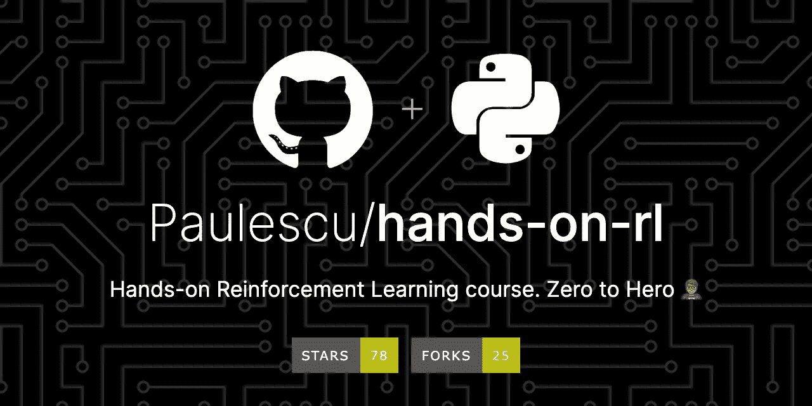](https://github.com/Paulescu/hands-on-rl)

喜欢吗？在 GitHub 上给它一颗星

# 内容

1.  政策梯度如何上月球？🚀🌙
2.  `LunarLander`环境
3.  基线代理
4.  欢迎政策梯度🤗
5.  策略梯度代理
6.  关键要点
7.  家庭作业📚
8.  下一步是什么？

# 1.政策梯度如何上月球？🚀🌙

为了登上月球，我们使用宇宙飞船，这是一个巨大的、模块化的工程，结合了令人难以置信的力量和温和的精度。

在我们旅程的开始，我们使用强大的火箭(如下图所示)来帮助宇宙飞船摆脱地球的引力。


两枚火箭将我们的宇宙飞船推入太空

一旦火箭耗尽，宇宙飞船将它们安全地释放到地球的海洋中，并开始其 385，000 公里(239，000 英里)的月球之旅。

三天后，我们的宇宙飞船接近月球，并开始绕月球运行。这部精湛戏剧的最后一幕是**登陆**。

宇宙飞船释放了一个装置，月球着陆器，月球的引力场向下拉向它的表面。我们整个任务的成功取决于这个装置的平稳着陆。

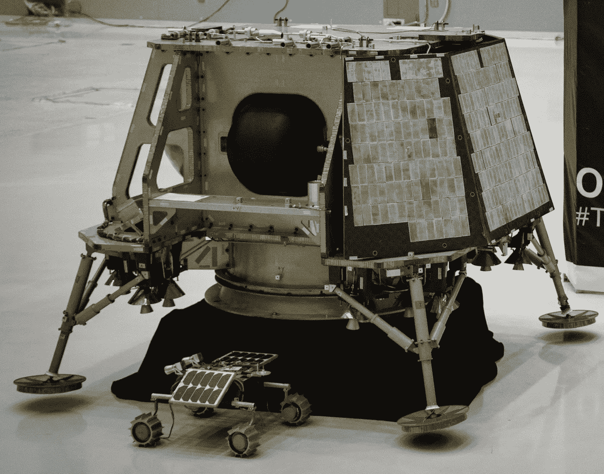

月球着陆器([维基共享资源](https://commons.wikimedia.org/wiki/File:NASA_Selects_First_Commercial_Moon_Landing_Services_for_Artemis_Program_(47974915541).jpg))

在今天的讲座中，我们将使用强化学习来训练一个代理(又名控制器)将这个设备降落在月球上。

此外，我们将使用 OpenAI 中的`LunarLander`环境作为着陆问题的一个方便(和简化)的抽象。

最后，这就是您今天要实现的代理如何在月球上着陆。

# 2.`LunarLander`环境

在进入建模部分之前，让我们快速熟悉一下`LunarLander`环境。

## 状态

代理获得具有 8 个分量的状态向量:

*   目前在 2D 世界的位置: **x** 和 **y**
*   沿这两个轴的速度: **vx** 和 **vy**
*   相对于垂直方向的角度位置 **θ** :
*   角速度 **ω** ，捕捉设备绕自身轴的旋转。
*   两个二进制信号( **s1** 和 **s2** )指示设备的两个腿中的哪一个(如果有的话)与地板接触。

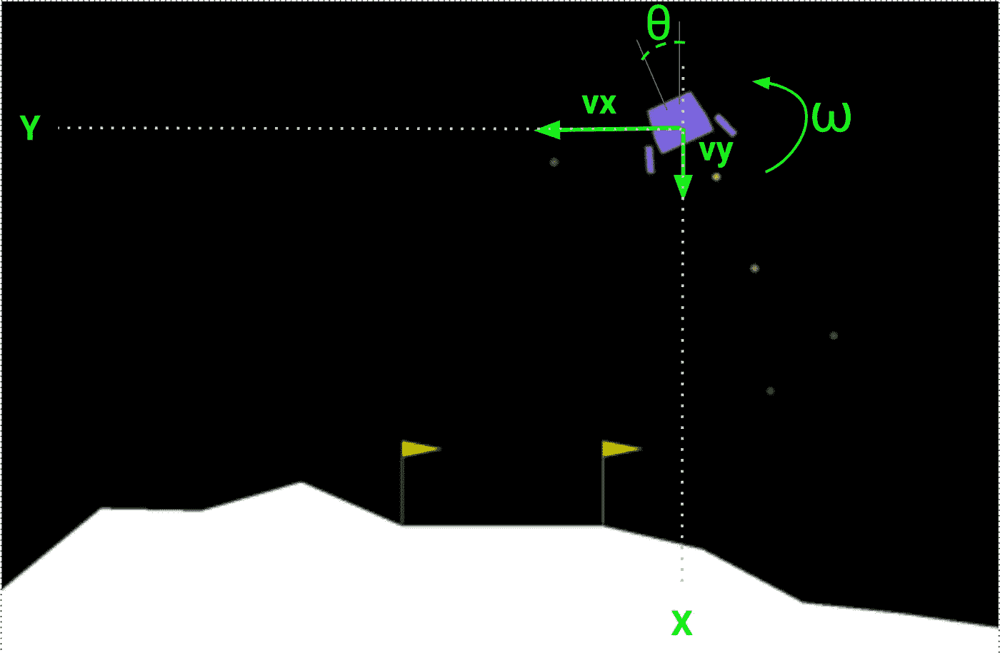

## **动作**

有 4 种可能的操作:

*   `0`无所事事。
*   启动左引擎。
*   `2`点燃主引擎(中央)。
*   `3`点燃右侧发动机。

## **奖励**

在这种环境下，奖励函数被设计成向代理人提供足够的信号。这使得训练更加容易。

这是着陆器在每个时间步得到的奖励:

*   如果着陆器远离着陆垫，它会得到负奖励。
*   如果发生事故，它将获得额外的-100 分。
*   如果是休息，它会获得额外的+100 点。
*   每条腿着地+10 分。
*   启动主引擎每帧-0.3 分。
*   发射侧边引擎每帧-0.03 分。
*   最后，解决了 200 分。

> ***奖励工程的利弊***
> 
> **奖励工程**是一种建模技巧，通过向代理提供频繁的反馈来帮助 RL 代理学习。奖励很少的环境更难解决。
> 
> 然而，它也有两个缺点:
> 
> 👉🏽设计奖励功能很难**，就像你看到`LunarLander-v2`奖励后可能想象的那样。在人们找到鼓励代理学习正确行为的奖励函数之前，通常要进行大量的反复试验。**
> 
> **👉🏽奖励塑造是**环境特定的**，它将被训练的代理的泛化限制在稍微不同的环境中。此外，这限制了在模拟上训练的 RL 代理到真实世界环境的可移植性。**

# **3.基线代理**

**[👉🏽notebooks/01 _ random _ agent _ baseline . ipynb](https://github.com/Paulescu/hands-on-rl/blob/main/04_lunar_lander/notebooks/01_random_agent_baseline.ipynb)**

**像往常一样，我们使用一个随机代理来获得问题的快速基线。**

**接下来，我们使用 100 集来评估这个代理，以获得着陆器的总奖励和成功率:**

**然后我们画出结果**

**终于意识到我们的代理人是一个彻底的灾难**

```
Reward average -198.35, std 103.93
Succes rate = 0.00%
```

****由于代理固有的随机性，当您在笔记本电脑上运行笔记本时，这些数字不会完全相同。无论如何，成功率几乎肯定是 0%。***

**另外，你可以看一段这个随机代理的视频，来说服自己我们还远远没有解决问题。**

**失败时间**

**事实证明，登上月球并不是一件容易的事(多么令人惊讶)**

**让我们看看**政策梯度**如何帮助我们登上月球。**

# **4.欢迎政策梯度🤗**

**任何强化学习问题的目标都是找到一个最大化累积回报的**最优策略**。**

**到目前为止，在课程中，我们已经使用了基于**值的**方法，如 [**Q-learning**](/hands-on-reinforcement-learning-course-part-2-1b0828a1046b) 或 [**SARSA**](/hands-on-reinforcement-learning-course-part-3-5db40e7938d4) 。这些方法以间接的方式找到最优策略，首先找到最优 Q 函数，然后使用这个 Q 函数按照ε-贪婪策略选择下一个最佳动作。这样他们就能得出最优策略。**

****另一方面，基于策略的**方法直接找到最优策略，而不必估计最优 Q 函数。**

**基于策略的方法的两个基本步骤如下:**

## **第一步。政策参数化**

**我们使用神经网络模型来*参数化*最优策略。这个政策被建模为一个**随机**政策，与确定性政策相反。我们称之为策略网络，我们将其表示为**

**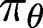**

**策略取决于参数 ***θ*****

> ****随机政策和勘探与开采的权衡****
> 
> **随机策略将一个给定的观察(输入)映射到一个概率列表，每个概率对应一个可能的动作。**
> 
> **为了选择下一步要采取的操作，代理会根据操作的概率对其进行采样。因此，随机策略自然地处理探索与利用的权衡，而没有像ε这样的超参数技巧(如 Q-learning 中使用的ε-贪婪技巧)。**

**在`LunarLander-v2`环境中，我们的随机策略将有 **8 个输入**和 **4 个输出。**4 个输出中的每一个都代表采取 4 个行动中的每一个的概率。**

**策略网络的架构是一个您需要试验的超参数。我们今天要用的是一个有 64 个单元的隐藏层。**

**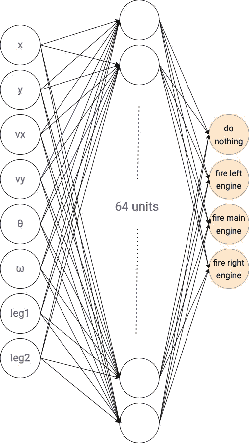**

**政策网(图片由作者提供)**

**解决我们的 RL 问题就相当于找到了这个神经网络的最优参数。**

**但是我们如何找到这个网络的最佳参数呢？**

## **第二步。寻找最佳参数的政策梯度**

**评估一项政策有多好很容易:**

*   **首先，我们对 ***、N*** 随机剧集遵循该策略，并收集每集的总报酬**

****

*   **第二，我们平均这个 **N** 总报酬，得到一个整体绩效指标。这个表达式就是总报酬的**经验平均值**。**

**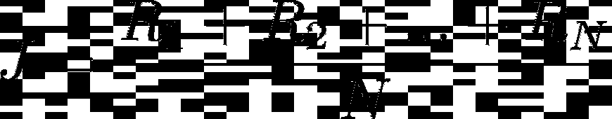**

**此外，总报酬以及 J 取决于策略参数 ***θ，a*** 我们的目标是找到使 **J** 最大化的参数 **θ** 。**

**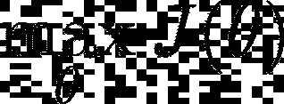**

**同样，有不同的算法来解决这个最大化问题(例如，遗传优化)，但通常在深度学习中，基于**梯度**的方法是王道👑。**

## **基于梯度的方法是如何工作的？**

**我们从政策参数θ₀的初始猜测开始，我们希望找到一组更好的参数，θ₁**

**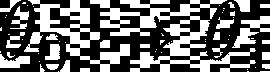**

**θ₁和θ₀的区别在于我们在参数空间中行进的方向。**

**问题是，增加 ***J*** 的最佳方向是什么？**

**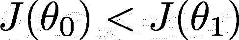**

**而答案就是……这个**渐变。****

***什么事？***

**一个函数 ***J*** 相对于一个参数向量 ***θ*** 的梯度就是我们需要从 ***θ*** 到产生 J 的最大增量的方向。**

**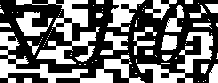**

**J 相对于θ的梯度**

**但是，*我们在梯度方向上应该移动的距离呢？***

**这是另一个(非常流行的)超参数:**学习率α****

**配备了梯度和适当调整的学习率，我们做一步梯度上升，以提出一个更好的参数θ₁向量**

****

**梯度上升的一步**

**如果我们迭代重复这个公式，我们将获得更好的政策参数，并有望解决环境问题。**

******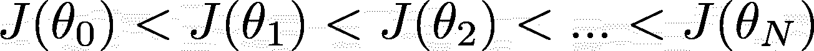**

**这就是梯度上升如何帮助我们找到最优的政策网络参数。**

**剩下的问题是，我们如何计算这些梯度？**

## **估计政策绩效的梯度**

**为了实现这个算法，我们需要一个可以数值计算的策略性能梯度的表达式。**

**利用一点微积分和统计学，我们可以从数学上证明，政策参数可以用轨迹样本来近似，这些轨迹样本是用当前政策收集的，如下 **:****

****

**其中轨迹𝛕是直到情节结束所观察到的状态和所采取的动作的序列**

****

**重要的是要强调这样一个事实，即这些轨迹**必须使用当前政策参数**来收集。**

> ****符合策略与不符合策略的算法****
> 
> **策略梯度方法是基于策略的算法，意味着我们只能使用在当前策略下收集的经验来改进当前策略。**
> 
> **另一方面，使用**非策略**算法，如 Q-learning，我们可以保留使用旧版本策略收集的轨迹的回放记忆，并使用它们来改进当前策略。**

**此外，上面的公式对应于最简单的政策梯度方法。然而，有这个公式的变化，取代每轨迹总回报 R(τᵢ)**

**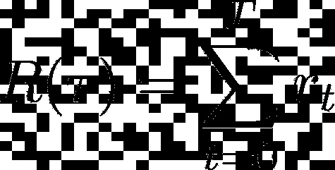**

**每集总奖励**

**其他*成功*指标。**

**特别是，我们将在本课程中看到两个版本，一个在今天，另一个在下节课:**

*   **给定动作后的累积奖励，又名**奖励-继续****

**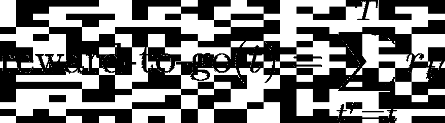**

*   ****优势函数**，是当前策略的 Q 函数和 V 函数的区别。**

**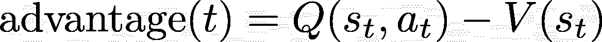**

***如果我们已经有了一个公式，为什么还需要其他公式来估计梯度？***

**政策梯度公式的所有 3 个变量都有相同的期望值，所以如果你使用一个**非常大的**轨迹样本，这 3 个数字将非常相似。然而，就计算性能而言，我们只能负担得起一小组轨迹，因此这些估计的可变性很重要。**

**特别**

*   **奖励去的版本有一个比原来的公式更低的方差**
*   **并且优势功能版本甚至比奖励去版本具有更小的方差。**

**较低的方差导致更快和更稳定的策略学习。**

**今天，我们将实现奖励到去的版本，因为它几乎与原始的累积奖励的香草政策梯度公式一样复杂。在下一讲中，我们将看到如何估计优势函数并得到更好的结果。**

> **想了解细节吗？**
> 
> **由于本课程的目的是给你一个实践这个主题的方法，我将数学术语保持在最低限度。**
> 
> ***如果你想了解从上面推导政策梯度公式的所有步骤，我推荐你阅读 Wouter van hees wijk**的这篇* [*优秀博文📝。*](https://medium.com/towards-data-science/policy-gradients-in-reinforcement-learning-explained-ecec7df94245)**

# **5.策略梯度代理**

**[**👉🏽notebooks/03 _ vanilla _ policy _ gradient _ with _ rewards _ to _ go . ipynb**](https://github.com/Paulescu/hands-on-rl/blob/main/04_lunar_lander/notebooks/03_vanilla_policy_gradient_with_rewards_to_go_as_weights.ipynb)**

**让我们实现最简单的策略梯度代理，其中策略梯度公式中的权重是阶段性的回报。**

**超参数只有 3:**

*   **`learning_rate`是政策梯度更新的大小。**
*   **`hidden_layers`定义策略网络架构。**
*   **`gradient_weights`是每个时间步的奖励:即从当前时间步到剧集结束的奖励总和。**

**我们使用 Tensorboard 设置了基本的日志记录，并开始训练我们的 VPGAgent:**

**训练逻辑封装在`[src/vgp_agent.py](https://github.com/Paulescu/hands-on-rl/blob/main/04_lunar_lander/src/vpg_agent.py)`中的`agent.train()`函数中。该函数本质上是一个具有`n_policy_updates`次迭代的循环，在每次迭代中，我们:**

1.  **收集`batch_size`轨迹的样本**
2.  **使用随机梯度上升更新策略参数。**
3.  **将度量记录到 Tensorboard**
4.  **可能评估当前代理，如果它是我们目前找到的最好的代理，将其保存到磁盘。**

> ****什么是正确的** `**batch_size**` **使用方法？****
> 
> **每次策略更新的轨迹数量(又名`batch_size`)是一个**超参数**，你需要调整它以确保你的训练在合理的时间内收敛到最优解。**
> 
> **👉🏽如果`batch_size`太低，您将得到非常嘈杂的梯度估计，并且训练将不会收敛到最优策略。**
> 
> **👉🏽相反，如果`batch_size`太大，训练循环会不必要地变慢，而你会坐着等🥱**

## **标绘训练结果**

**当模型正在训练时，我们到终端并按如下方式启动 Tensorboard 服务器:**

```
$ tensorboard --logdir tensorboard_logs
```

**如果您访问控制台上打印的 URL，您会看到一个类似于此的图表，其中横轴是代理到目前为止收集的轨迹总数，纵轴是每集的总奖励。**

**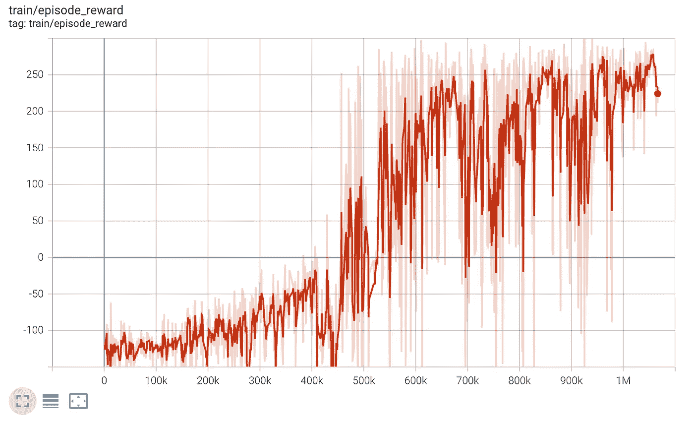**

**1M 步后每集总奖励(图片由作者提供)**

**我们清楚地看到代理正在学习，并在 100 万步后实现了大约 250 英镑的平均总回报。**

**由于总报酬不是一个非常直观的衡量标准，我们在`100`新剧集的培训结束时直接评估代理，并检查登陆成功率:**

```
Reward average 245.86, std 30.18
Succes rate = 99.00%
```

**哇哦！99%的准确率已经很不错了吧？**

**让我们快速休息一下，回顾一下，然后展示作业。我们走吧。**

****

**休息和补水的时间到了(图片由作者提供)**

# **6.关键要点**

**今天我想让你睡在这三样东西上:**

*   **首先，策略梯度(PG)算法直接参数化最优策略，并使用梯度上升算法调整其参数。**
*   **第二，与深度 Q 学习相比，PG 算法更**稳定**(即对超参数不太敏感)，这很好。**
*   **最后，PG 算法的数据效率**更低**，因为它们不能重用旧的轨迹来更新当前的策略参数(即它们是基于策略的方法)。这是我们需要改进的地方**

# **7.家庭作业**

**[**👉🏽笔记本/04 _ 作业. ipynb**](https://github.com/Paulescu/hands-on-rl/blob/main/04_lunar_lander/notebooks/03_vanilla_policy_gradient_with_rewards_to_go_as_weights.ipynb)**

*   **你能找到一个更小的网络来解决这种环境吗？我用了一个隐藏层 64 个单位，但我觉得这是矫枉过正。**
*   **你能通过适当调整`batch_size`来加速收敛吗？**

# **8.下一步是什么**

**在下一课中，我们将介绍一种新的技巧来提高策略梯度方法的数据效率。**

**敬请关注。**

**爱情，**

**活下去。**

**学习。**

# **想支持我吗？**

**你喜欢阅读和学习关于 ML、AI 和数据科学的知识吗？**

**无限制地访问我在 Medium 上发布的所有内容，并支持我的写作。**

**👉🏽今天使用我的 [**推荐链接**](https://pau-labarta-bajo.medium.com/membership) 成为会员。**

**[](https://pau-labarta-bajo.medium.com/membership) [## 成为一个媒体成员来阅读我在媒体上分享的一切。

### 你的会员费的一部分给了所有你喜欢阅读的作家。希望是我。

pau-labarta-bajo.medium.com](https://pau-labarta-bajo.medium.com/membership) 

👉🏽订阅 [***datamachines* 简讯**](https://datamachines.xyz/subscribe/) **。**

👉🏽 [**跟着我**](https://medium.com/@pau-labarta-bajo) 上媒。

祝你愉快🤗

避寒胜地**