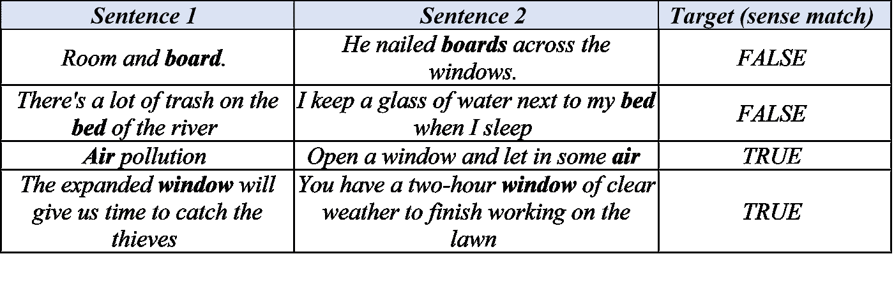
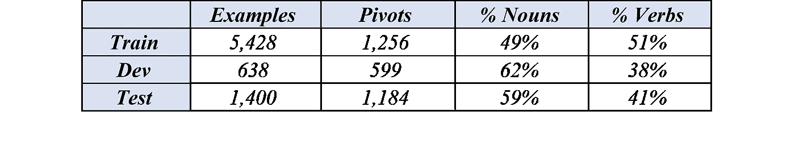
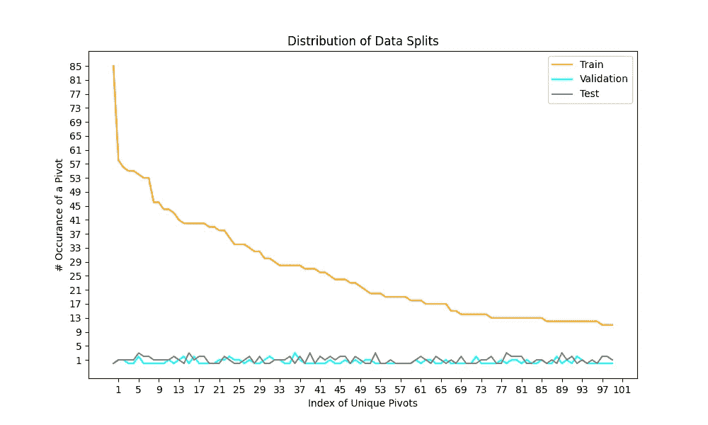
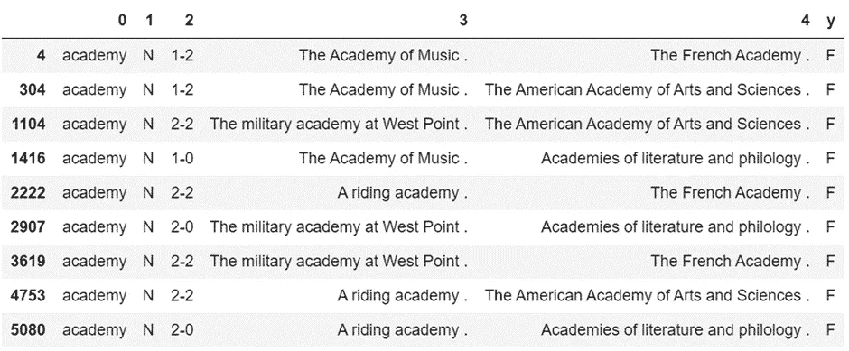
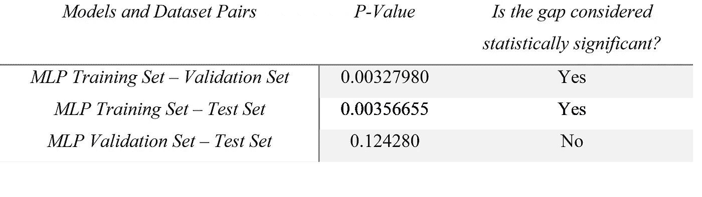

# NLP 基准有多可靠？

> 原文：<https://towardsdatascience.com/how-reliable-are-nlp-benchmarks-fb1a0a70e26a>

## **WiC 数据集案例研究**

*作者*[司南](https://medium.com/@singultek) *和* [*雷奥纳多*](https://medium.com/@leonardo.rigutini)

尼尔·托马斯在 [Unsplash](https://unsplash.com?utm_source=medium&utm_medium=referral) 上的照片

# **排行榜的争夺**

如今，对数据集和构造越来越多的关注是研究模型学习何种行为的自然结果。这种关注导致研究人员建立基准平台，如 GLUE 及其继任者 SuperGLUE [1]基准，旨在成为语言理解任务的优秀评估平台。尽管许多研究人员开展研究，为这些基准的排行榜提供主要工作，但很少有人关注开箱即用和问题的关键边缘，评估数据集的充分性。上下文中的单词(WiC)数据集[2]是 SuperGLUE 基准中的数据集之一，它通常用于评估 NLP 系统的词义消歧[3]能力。这篇文章将评估这样一个数据集的质量及其在评估 NLP 性能中的用途。

# **WiC 数据集**

WiC 数据集包括由两个句子对组成的例子，这两个句子对共享一个多义(多种意义)单词的出现，该单词被称为中枢单词。词义消歧是 NLP 模型的一项高级任务，研究人员为这项任务做了大量的工作，制作了一个二元分类数据集。二元分类任务是一个问题，其目标是识别在两个句子中两次出现的中心词是否具有相同的含义:

*表 WiC 数据集片段[* 作者图片 *]*

这些例子是使用三种广泛的词汇资源半自动构建的:WordNet、VerbNet 和 Wiktionary。作者在构建 WiC 数据集时遵循的程序已在[2]中描述。我们按照同样的过程自行重建 WiC 数据集；因此，我们能够以 [93.4%的准确度](https://competitions.codalab.org/competitions/20010#results)检索测试集的目标标签。逆向工程背后的动机不是为了作弊，而是为了更深入地分析测试集(即 Welch t-Test，分析单个目标标签的性能等。)，我们需要知道测试集上的目标标签。此外，通过仅设置两个启发式规则成功地再现数据集表明，WiC 严重依赖于资源，并且几乎完全是自动构造的任务。它应该是基于知识的，并允许语言模型产生它们的下降粒度函数来区分词义。

数据集被组织成三个部分(训练集、验证集和测试集)，并且仅针对训练集和验证集提供监督。原始论文中报告了三个数据集的大小:

*表 WiC 数据集分割的统计[* 作者*的图片]*

在分析 WiC 数据集后，可以概括出三个值得注意的问题。

**1。独特枢纽词的不同分布**

第一个问题涉及训练集、验证集和测试集中的唯一关键词的分布的显著差异。特别是，训练集遵循长尾分布，而验证集和测试集是均匀分布的，如图 1 所示:

*图 1:不同数据集部分的样本分布[* 作者图片 *]*

尽管研究人员打算鼓励模型学习通用函数并避免在训练集上过度拟合，但数据分割之间的这种不平衡分布将使一些中枢产生偏差，并阻止模型学习正确的粒度函数来预测正确的类。

**2。不平衡标签**

第二个问题是关于中心词的不平衡标注。尽管所有三个数据集拆分都经过精心设计，具有平衡的目标标签，但对于单个 pivot 单词的目标标签来说，情况并非如此。在图 2 和图 3 中，我们报告了数据集中出现的两个只有真或假标签的枢纽词示例:

*图 2:中心词“academy”的不平衡目标标记示例[* 作者的图像 *]*

*图 3:枢纽词“furniture”的不平衡目标标注示例【作者*的*图片】*

训练集的显著百分比(12.93%，包括不止一次出现)显示了这个问题。这可能会导致学习中的偏差，并导致模型过度适应特定的中枢。由于大型神经语言模型已被证明是非常有效的样本，因此在训练和测试集的重要部分上存在过度拟合的高风险。此外，当用具有这样缺陷的数据集训练时，该模型无法学习感觉的粒度。对于这些枢轴样本，可以认为模型预测是任意的。

**3。词典标注**

第三个问题是，一些句子对是根据它们的词典角色而不是意义或词义来标记的。这种效应可能依赖于词源，Wiktionary，它将动词分为及物动词和不及物动词。最后一个缺陷可能会误导模型，因为它完全违背了任务的目标。当检查图 4 中的样本时，甚至人类也会感到困惑。

*图 4:作者*根据词典角色*图像标注的一个例子*

# ***好，我们来评价一下质量…***

*我们执行了 5 个不同的实验集，旨在深入评估基准的质量。我们在所有实验中使用了 3 种不同的机器学习方法:SVM、MLP 和余弦相似度。此外，我们使用各种数据扩充技术来理解 WiC 数据集构建约束及其对学习的可能影响，获得了 13 个额外的训练集。执行扩充步骤是为了测量(1)分布转移和(2)不同场景中的枢轴重叠的影响。*

*首先，我们使用 SVM 模型执行网格搜索，从 14 个可用数据集(包括原始数据集)中识别并选择性能最佳的数据集。随后，选择的数据集被用于执行与 MLP 模型的实验。相比之下，第三种方法基于余弦相似性，并且不包括任何训练步骤。在这种方法中，使用 BERT [4]构建每对中两个句子的向量表示。余弦相似性分数被评估，并且使用阈值导出输出。在最初的文章之后，我们进行了同样的 3 组子实验。此外，由于我们对调查训练/验证和测试集之间的分布差异的影响感兴趣，我们执行了 Welch t-Test。*

*由于我们没有一个完整的实验数据集，我们使用训练集设计了 K-Fold 验证程序。特别地，我们将训练集分成 5 个折叠，使用 4 个折叠用于训练目的，并丢弃剩余的 1 个折叠。评估在原始验证集上进行。我们将该实验的显著性水平设置为“*事实标准”值*的 5%，这是文献中大多数实验中常用的。该值意味着，如果 P 值结果小于显著性水平，则可以认为两个群体之间的差距具有统计显著性。*

*Welch t 检验结果报告在表 3 中:*

**

**表 3。韦尔奇 t 检验结果[* 图片作者 *]**

*实验中使用的群体数据如图 5 所示:*

**

**图 5。Welch t-Test 对训练、验证和测试数据集进行 K 倍验证[* 图片作者 *]**

*Welch t-检验结果清楚地显示了可能与 WiC 数据集的构造缺陷和上述数据的不同分布有关的显著差异。在 Welch t 测试结果之后，我们分析了目标类(真和假)的准确性。令人惊讶的是，在其中一个目标标签中，所有模型的表现都更好。虽然余弦相似性在真实标签上被极化，但是其他两个模型(SVM 和 MLP)在错误类别上报告了更好的性能。*

*另一个非常重要的结果来自对错误预测的详细分析。这种暗示来自于这样一个事实，即有几个模型锁定了某些精度值。因此，分析这些错误，我们发现 638 个样本中的 81 个，或 12.7%，被所有模型错误预测。因此，我们决定运行一个涉及一些人类主管的最终实验，因为强力胶基准声明“任务应该超出当前最先进系统的范围，但可以由大多数受过大学教育的英语使用者解决。”[3].*

*特别是，我们提取了这 81 个没有目标标签的常见错误预测(61 个正确，20 个错误)，我们要求一小组人类主管提供标签。分析它们，我们注意到 50 个错误分类的中枢词在训练数据集上不存在，并且剩余的 31 个错误分类的中枢中的 24 个遭受不平衡的目标标签效应。此外，错误预测样本的标签分布(61 个真和 20 个假)证明了我们关于不平衡分布和低质量监督的假设。*

*人类专家测试表明，高级母语者在这些错误预测的数据子样本上报告了 52.93%的准确度值。这些实验表明，构造缺陷影响 WiC 数据集，使其成为 NLP 模型和人类专家无法完成的任务。*

# ***结论***

*WIC 数据集是超级胶水基准中包含的数据集之一。它被设计用来测量 NLP 的一个基本问题，即词义消歧任务(WSD)。具体而言，它提出了一种创新的方法来完成 WSD 任务，即将其转移到二元分类任务(对/错)中，目标是识别一个中枢词在两个观察到的句子中是否具有相同的含义。虽然将 WSD 任务转换成二进制分类问题可以被认为是一种非常创新的解决方案，但是所产生的数据集显示出低水平的质量，特别是在表达词义的粒度方面提供的知识水平不足。*

*训练集和验证测试集之间的分布差异限制了分类模型的预期性能。因此，最常用的分类模型(SVM、余弦相似度和 MLP)表现出不超过 68%准确度的低性能。此外，韦尔奇 t 检验结果表明，如果误差不超过 5%，排行榜结果就不能被认为是显著的。*

*最后，额外的调查表明，12.7%的验证集样本不能被任何模型正确预测，因为:*

*   *在常见的错误预测中，61.72%的关键词不存在于训练数据集上，模型没有任何数据样本可供学习。*
*   *对于剩余的 38.28%可学习的中枢词，77.42%的中枢遭受不平衡的目标标签。*

***建议***

*首先，如果您想在 WiC 数据集上评估您的模型，请仔细考虑😊。然后，调整 WiC 数据集以修复其中出现的许多构造缺陷:*

*   *定型集应该遵循与验证集和测试集相同的分布。*
*   *除了整个数据集级别上的平衡目标标签之外，每个中枢词也应该具有平衡的目标标签。*

*此外，我们认为应该扩展人类监督测试。事实上:*

*   *在 WiC 论文中，人类基线建立在以下基本思想之上:“我们从测试集中随机抽取了四组 100 个实例，其中两个注释者之间有 50 个实例重叠。”[2].然而，像为一项任务设定一个黄金标准这样的强有力的结果可能不会用这种初步评估来表述。*
*   *除了测试集检查之外，训练集和评估集应该由人类主管检查。词义消歧问题(WSD)即使对人类来说也是一项复杂的任务，并且 WSD 数据集，尤其是如果从词典编纂来源自动生成的话，应该非常小心地处理评估过程。*
*   *如果可能的话，整个训练、评估和测试集应该由人类专家进行检查(而不是随机选择 100 个样本)，因为许多研究人员依赖这个基准而不质疑质量，并且他们使用它来评估他们昂贵的机器学习模型的性能。如果我们仔细观察强力胶基准测试的排行榜，我们可以看到一些昂贵的型号的行为几乎就像抛硬币一样。*

***参考书目***

1.  *Wang，a .，Pruksachatkun，y .，Nangia，n .，Singh，a .，Michael，j .，Hill，f .，Bowman，S. R. (2019)。强力胶:通用语言理解系统的一个更棘手的基准。doi:10.48550/ARXIV.1905.00537*
2.  *皮列瓦尔，麻省理工学院，卡马乔-科拉多斯，J. (2019)。WiC:用于评估上下文相关意义表达的上下文相关单词数据集。*
3.  *洛雷罗 d .豪尔赫 A. (2019)。语言建模是有意义的:通过 WordNet 传播表示以实现全覆盖的词义消歧。计算语言学协会第 57 届年会会议录。https://doi.org/10.18653/v1/p19-1569*
4.  *Devlin，j .，Chang，m .，Lee，k .，Toutanova，K. (2018 年)。BERT:用于语言理解的深度双向转换器的预训练。*