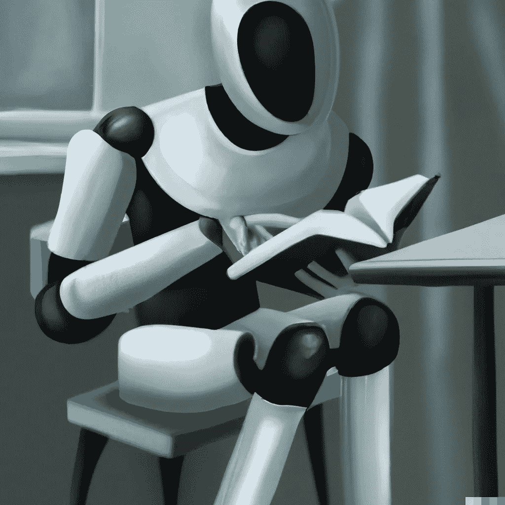
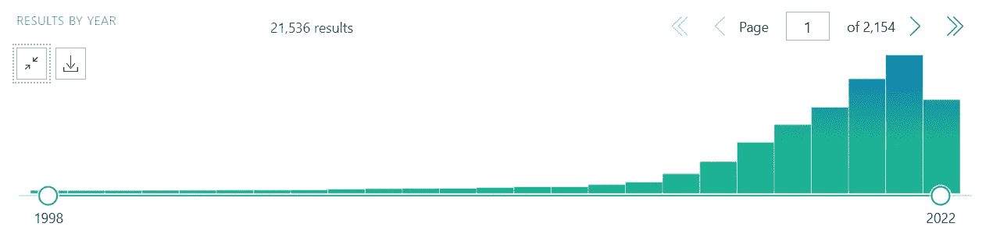
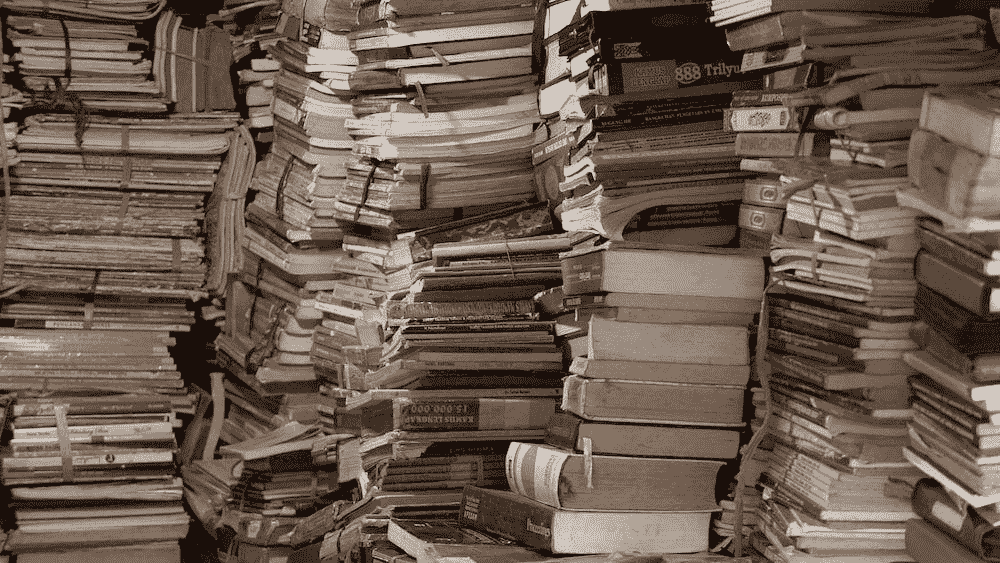
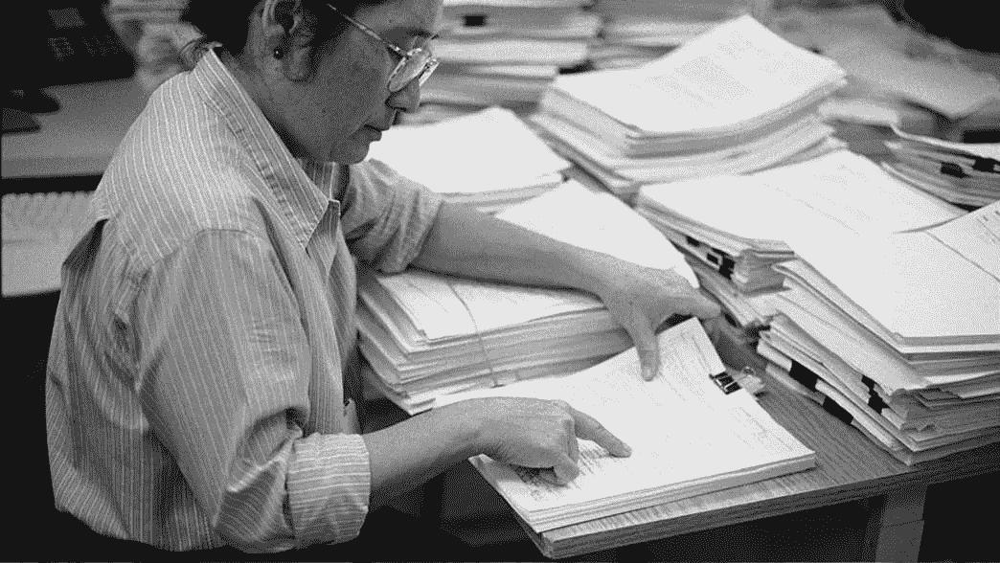

# 科学贡献如何变成一个有毒的环境

> 原文：<https://towardsdatascience.com/how-science-contribution-has-become-a-toxic-environment-6beb382cebcd>

## 意见

## 计算机科学是如何继承了其他学科同样的错误的

图片由作者用[OpenAI](https://openai.com/)DALL-E 生成

[同行评议](https://en.wikipedia.org/wiki/Scholarly_peer_review)是学术研究的核心，如果你想[在任何科学期刊](https://www.biomedcentral.com/getpublished/peer-review-process)上发表论文，无论是医学、物理学还是生物学期刊，这都是必不可少的一步。尽管在计算机科学领域，引领潮流的不是期刊，而是会议，选择将被选中并发表的幸运论文，他们也使用同行评议。同样，事实上，项目委员会也进行同行评审。

结果是，机器学习/人工智能领域的研究包含了与其他学科相同的问题，创造了一个不是基于期刊编辑，而是基于会议委员会的权力系统。

什么是同行评议？这是为了什么？为什么有人认为它是有毒文化的基础？如何改进？这对计算机科学界有什么影响？本文试图回答这些问题

**看到所有瑕疵的眼睛**

由作者使用 [OpenAI](https://openai.com/) 和 [DALL-E](https://arxiv.org/abs/2204.06125) 生成的图像

什么是同行评议？给出一个明确的答案是困难的。多年来，它似乎已经成为一种必要的礼仪形式，以安抚对一篇科学文章的命运负有责任的神秘实体。

> 因此，同行评议就像诗歌、爱情或正义。但这与资助申请或第三方审查的论文有关”——理查德·史密斯

没有人能够独立评估自己的工作质量；研究人员通常无法在自己的研究中发现错误和缺陷。同行评审的最初想法是，外部研究人员(同行)应该在发表前评估一篇科学文章的质量，并提供如何改进稿件的建议。

在最经典的同行评议形式中，科学期刊的编辑收到一份手稿，然后选择两位该领域的专家阅读并提供意见。通常情况下，编辑在阅读稿件后会选择该领域的两名相关专家，他们会提供匿名意见(针对稿件作者)。在审查结束时，作者会收到期刊的决定和/或在某些情况下收到一系列评论，如果他们想发表自己的作品，就必须对这些评论做出回应。

这个系统后来不断发展，现在每个期刊都使用自己的版本。有些期刊先把手稿寄给一位顾问；其他人选择至少三或四个评审者。在其他情况下，即使是审稿人也不知道是谁写的稿子([双盲](https://www.exordo.com/blog/double-blind-peer-review/))。

> 这种模仿——与我见过的系统相差不远——比扔硬币好不了多少，因为在论文是否应该发表的问题上，审稿人之间的一致程度比你可能会偶然想到的好不了多少— [理查德·史密斯](https://www.ncbi.nlm.nih.gov/pmc/articles/PMC1420798/)

**俱乐部成员的价值**

图片由作者用[OpenAI](https://openai.com/)DALL-E 生成

如今，同行评议被用于各种领域，无论是发表文章还是分配资金。各机构召集专家进行同行评审，并决定哪些项目应该获得资助。

另一方面，专家评审的文章或项目会增加价值。毕竟，在同行评审期间，作者会经历一个严格的过程，如果有错误或弱点，评审者会要求他们改正。如果作者不改正他们手稿中的弱点，只有一种命运:退稿。

最负盛名的期刊和会议以拥有有史以来最高的退稿率而自豪(《自然》杂志每周收到的 200 篇论文中，只有不到 8%被接受)。此外，科学家希望在这些期刊上发表文章，因为他们的研究更有声望(或者至少更大的感知价值)与他们相关。

此外，一篇发表在期刊上或被著名会议接受的文章，平均来说，会被更多的引用，得到更多的宣传，被更多的读者阅读。所有这些都转化为职业发展，赢得声望很高的奖项等等。

但真的是这样吗？这些有声望的报纸的文章被拒绝或被遗弃在门外是没有价值的吗？

> “我们是由我们的朋友来评判的。
> 
> *我们错了，先生。犹大保持优秀的公司。*——出自电影《T4》*调侃* (1996)

**计算机科学怎么还有人类审稿人**

由作者使用 [OpenAI](https://openai.com/) 和 [DALL-E](https://arxiv.org/abs/2204.06125) 生成的图像

即使是关于最复杂的人工智能的文章，仍然要经过人类审稿人的手。在计算机科学中，手稿的路径是以预印本的形式发布在 [arXiv](https://arxiv.org/) 上，然后提交给会议，根据 arXiv 上和会议手稿中的审稿人的指示进行修改，如果被接受，还会添加一个会议链接。一篇文章的价值取决于会议的价值，而会议的接受率越低，会议的声望就越高。

与科学文章一样，同行评议在计算机科学领域也是盲目的。会议通常使用单盲审查，作者不知道审查者的姓名。为了减少偏见，更有声望的会议已经实施了双盲评审，评审者不知道作者是谁。理论上，这可以防止同行评议偏向或偏向作者。

最重要的会议包括元审查者，以确保过程在科学上是严格的。元审稿人是该领域的专家，当审稿人没有就手稿的命运达成一致意见时，他应该做出最终决定。

**谁看守望者？**

图片由作者用[OpenAI](https://openai.com/)DALL-E 生成

> “同行评审的实践是基于对其效果的信任，而不是基于事实”。— [来源](https://pubmed.ncbi.nlm.nih.gov/12038911/)

同行评议严重影响了研究人员的生活。“[发表或灭亡](https://en.wikipedia.org/wiki/Publish_or_perish)”是学术界的常用表达。事实上，科学家是由他们的出版物质量来评估的。然而，评估通常不在于评估他们的研究的相关性，而在于评估他们的出版物的影响因子(重要性)。由于同行评议是选择哪些手稿可以发表的关键步骤，你可能想知道这一过程是否运作良好和/或其缺陷是什么。

> “对同行评议的一个主要批评是，几乎没有证据表明这一过程实际上是有效的，它实际上是对高质量科学工作的有效筛选，它实际上提高了科学文献的质量”——[来源](https://www.ncbi.nlm.nih.gov/pmc/articles/PMC4975196/)

对同行评议过程的第一个反对意见是，我们没有精确的标准来定义一篇文章或一个好的研究提案的质量。是什么让一篇文章有价值？或者说，是什么让一个研究提案能够带来有趣的发现？从某种意义上说，重要的研究是事后发现的(衍生应用、被引用的次数等等)。

2008 年的一项研究表明，通过向几家期刊提交一篇有八处故意错误的文章，在 420 名审稿人当中，不到一半的审稿人[只发现了两处错误](https://michaelnielsen.org/blog/three-myths-about-scientific-peer-review/)。事实上，任何经历过同行评审的人都会有这样的印象，即许多决定都是武断的；评论者的评论特别严厉，只是因为他们受到匿名保护，而不是以良好科学的名义。

此外，[专家人数有限](https://www.sciencedirect.com/science/article/pii/S0165178122000683)，随着提交率的增加，我们没有足够的合格人员来进行审核。另一方面，同行评审[没有报酬](https://www.researchgate.net/post/Why-reviewers-of-the-articles-are-not-paid-by-the-journal-authorities)；它是研究人员提供的免费服务，没有任何报酬。多年来，学术界工作人员的工作量增加了，因此许多研究人员拒绝了出版商的请求。这导致手稿作者收到的评论质量很差，或者在发表前不得不等待很长时间。

截图是作者在 PubMed 上用简单的关键词研究拍摄的。如图所示，关于一切的出版物呈指数增长。

同行评议的另一个严重问题是它并非没有偏见。事实上，几项研究表明，授予奖学金对少数民族和妇女不利。此外，知名作者更有可能被知名期刊接受，无论他们的工作质量如何，从而使不平等的循环永久化，知名作者可以获得奖励和资助，而其他人分享其中的碎屑。

**新科学，旧罪恶**

图片由作者用[OpenAI](https://openai.com/)DALL-E 生成

最近，爱德华·李教授发表了一篇博客文章，批评同行评议是有毒文化出现的原因。他注意到，一方面，会议项目委员会如何保持一定的接受率，许多论文被拒绝而没有真正的原因，或者他们用“缺乏新颖性”来证明拒绝的合理性。

> “我们中有太多的人使用自托马斯·库恩以来就过时的科学概念，认为一门学科的进步是新事实的积累”——爱德华·李

这种对新奇事物断断续续的追求正是源于这种过时的科学观。除了成为许多研究人员的障碍之外，它还不允许他们发表对未来工作至关重要的工作(不同的方法，相同的想法在其他领域的应用)。毕竟，没有任何作品是完全原创的，而是基于前人的见解。

此外，作为一个评论家带来了相当大的优势。在计算机科学中，有机会在文章发表前阅读文章会导致不公平的优势。匿名审稿人往往与作者有利益冲突，他们的文章也同样提交给会议。结果是他们有更多的动机拒绝竞争对手的文章。

2017 年，莫斯科的[高等经济学院](https://en.wikipedia.org/wiki/Higher_School_of_Economics)为一座“匿名同行评审者纪念碑”揭幕。

Lee 建议质量差的文章设法发表(因为经过一些修改后，它们会被提交给每一次会议，直到被接受)。另一方面，许多博士生和其他学生反而对这种拒绝文化感到沮丧，以至于离开学术界。

此外，即使有截止日期，大多数文章都是在最后 24 小时内(甚至是截止日期之后)提交的，这导致了所谓的“紧急审查”有限的阅读时间和压力导致对每篇文章的关注减少(一些研究人员有时不得不阅读 1000 多篇论文)。因此，在类似的情况下，评论看起来更像是随机选择。

图片由[卡莱斯·拉巴达](https://unsplash.com/@carlesrgm)在 [unsplash](https://unsplash.com/) 拍摄

事实上，主要会议收到[过多的文章](https://academia.stackexchange.com/questions/148003/effective-reviewing-in-top-tier-computer-science-conferences)和[接受率](https://www.lamsade.dauphine.fr/~sikora/ratio/confs.php)甚至逐年下降，截至 2022 年:

*   AAAI: 9000 份申请，15 %的接受率
*   ICML: 5630 份手稿，21 %的接受率
*   NeurIPS: 9122 份手稿，25 %的接受率

在这些前提下，如果审稿人将阅读所有这些手稿或只限于阅读标题和摘要，这是有争议的。如果是这样的话，这就不允许评估手稿的价值或将其标记为“缺乏新颖性”因此，如此数量的文章，很难相信如此大量的被拒绝的手稿是不值得的。

**来自河两岸的回忆**

图片来自[马丁·桑切斯](https://unsplash.com/@martinsanchez)来自 [unsplash](https://unsplash.com/)

任何攻读博士学位的人都必须在某个时候提交至少一篇文章。通常情况下，要求发表至少一篇文章(如果不是更多)才能为自己的博士论文辩护。

每个会议或科学期刊都有具体的手稿格式指南。虽然其中一些是有争议的，并不总是清楚的，但他们必须不假思索地遵循。

> 浏览不同的提交指南本身就是一个挑战。

第一步显然是为了避免案头拒绝(当编辑决定由于“缺乏新颖性”或缺乏相关性的手稿将不会被转发给审稿人)。回复是一封没有人情味的电子邮件，实际上和每一份被拒绝的稿件都一样。典型的感觉是，手稿实际上并没有被阅读，而是被某个随机过程丢弃了。

仁慈的审稿人建议接受提交的手稿。图片由来自 [unsplash](https://unsplash.com/) 的 [Jan Antonin Kolar](https://unsplash.com/@jankolar) 拍摄

惊心动魄的等待过后，点评往往令人失望。事实上，许多评论与手稿无关。此外，评论的语气相当咄咄逼人，仿佛目的是攻击提交的作品。此外，评论者经常试图通过建议他们引用自己的文章来增加他们的统计数据，即使这些文章与主题无关。

> “作者应该引用 XXXX 的开创性工作，该工作在(另一个完全不同的领域)的背景下使用了类似的模型”——我收到的一位真正的评论家评论的释义

近年来，能够在学术界获得稳定的工作职位已经变得非常具有竞争力。能否获得一个职位通常取决于出版物的数量或质量。这导致了掠夺性期刊和会议的泛滥。事实上，近年来，向付费期刊或会议提交稿件的邀请越来越多，这些期刊或会议保证以出版换取报酬。

每次发表文章或参加会议后，我的邮箱都会被掠夺性期刊和会议的邮件淹没。这些通常是不知名的会议，声称有声望的研究人员(来自不知名的机构和公司)出席，并且似乎与你感兴趣的领域只有模糊的关联。

> “NLP 似乎不是你们(公司)的重中之重，因为在离截止日期 3 天的时候，没有人注册参加(虚假的 NLP 会议)”—摘自掠夺性会议销售代表的真实电子邮件，我忽略了之前的所有电子邮件。

虽然这些会议显然没有价值，但许多绝望的研究人员经常参加，希望他们可以提升自己的简历。

掠夺性会议试图抓住另一个作者。图片来源:[卡米尔·苏莫塔尔斯基](https://unsplash.com/@kamilszumotalski)来自 [unsplash](https://unsplash.com/)

另一方面，做一个评论者也不容易。随着越来越少的人可以进行同行评审，你经常会被联系(即使是不完全属于你领域的文章)。虽然审稿人不得不阅读充满方法错误的文章，但通常高质量的手稿会被其他审稿人拒绝。在这些情况下，不清楚编辑如何决定继续(拒绝或接受)。

这些期刊提供了一种格式，在这种格式中，它们实际上推动追求新奇，并使用多种选择(1 个优秀，5 个差)综合一个人的评论，几乎就像是对猫途鹰的评论。这给人的印象是，编辑更感兴趣的是新颖的文章，而不是调查结果的整体质量。

> 甚至阿尔伯特·爱因斯坦也有一篇手稿被《物理评论》拒绝[因此，我们不应该认为拒绝等同于质量差](https://physicstoday.scitation.org/doi/10.1063/1.2117822)

此外，当您需要成为审核者时，您必须在很短的时间内完成审核。虽然会议和期刊对手稿有严格的文字限制，但作者将大部分结果放在附录中(有时肯定会滥用它)，阅读起来很累。就我个人而言，我发现所有对附录的不断引用令人讨厌，这使得阅读一篇文章相当痛苦。

**如何自救科学**

图片来自[廷杰伤害律师事务所](https://unsplash.com/@tingeyinjurylawfirm)来自 [unsplash](https://unsplash.com/)

一篇有趣的文章表明，很难量化同行评审的有益效果。通过分析计算机科学领域的 9000 篇评论和 2800 篇投稿，作者注意到同行评议过程的排名和引用数量的影响之间没有相关性。事实上，从长远来看，被会议拒绝的论文对计算机科学产生深远影响的例子数不胜数:

*   PageRank 的手稿[在 1998 年被 SIGIR](https://news.ycombinator.com/item?id=3493890) 拒绝。
*   [word2vec 手稿](https://www.reddit.com/r/MachineLearning/comments/vywfx3/d_are_there_any_rejected_papers_that_ended_up/)收到大会弱拒绝和强拒绝。
*   介绍[辍学](https://jmlr.org/papers/v15/srivastava14a.html)的文章在 2012 年被 NIPS 拒绝。
*   还有， [YOLO](https://arxiv.org/abs/1506.02640) ，[卡尔曼滤波器](https://www.cs.unc.edu/~welch/kalman/kalmanPaper.html)，[变压器 XL](https://arxiv.org/abs/1901.02860) ，[罗伯塔](https://arxiv.org/abs/1907.11692)手稿被一个会议拒绝。

一些改善同行评审的尝试正在进行中。正如经常被批评的那样，评论者滥用盲评来评判带有特别敌意的文章。一方面，有一些实验，审稿人的名字在稿件决定后被公布。在其他情况下，作者的评论和回复会被发布。

像《自然》这样的期刊在投稿前给编辑提供了询问的机会。会议可以设立一个服务台，在截止日期前提交摘要或征求建议。这将有助于作者在提交前改进手稿。

此外，收到数千份提交材料的会议应该增加审查人员的数量，以确保更高质量的审查。此外，向审稿人支付服务费可以确保质量。事实上，通常被选中的评审者会要求他们自己的研究团队成员帮助他们或进行评审(这对博士生来说是一个额外的负担)。或者至少在职业发展或申请资金时，应该考虑作为评审者的服务。

另一方面，编辑和元审稿人的权力几乎是绝对的，因此应该保持平衡，特别是在审稿人在决策上存在分歧的情况下。目前，虽然这些尝试令人鼓舞，但还不够，应该深入讨论这一制度。

提交你的手稿。来自 [unsplash](https://unsplash.com/) 的 [Abolfazl Ranjbar](https://unsplash.com/@ranjbarpic) 的图像

还有，在 ArXiv 上提交的文章，对于一个研究者的职业生涯应该更有价值。同行评审可以在 ArXiv 上进行，而不需要截止日期，使评审者有足够的时间和压力(也许通过授予作者答辩权)。甚至将注册和验证用户的评论作为一种公开的同行评审。因此，我们可以尝试从以编辑为中心的模式转向以社区为中心的模式。

**离别的思念**

美国国立卫生研究院的一名评审员正在评估一项拨款提案。图片来源:[此处](https://en.wikipedia.org/wiki/Peer_review)

每天都有越来越多的文章被提交，其中许多文章几乎没有相关性，有明显的错误，甚至有科学不端的例子。因此，我们需要能够区分哪些文章是相关的，哪些是不相关的。多年来，解决方案一直是同行评议，我们盲目相信期刊和会议的权威，但现在是时候对该系统进行批判性分析了。

然而，通过当今科学支柱的同行评议并非没有问题。结果是许多文章仅仅因为一个武断的决定而被拒绝。评论者的评论常常是傲慢的，甚至不完全恰当。毕竟，匿名保证了一个没有责任的权力位置。同行评议最终导致一个昂贵的过程，延长出版时间，并不能保证成功。

甚至计算机科学和新学科也不能幸免于历史上影响其他学科的问题。当越来越多的论文产生，研究人员的职业生涯严重依赖于出版物时，我们应该重新思考科学的一个不可触及的支柱，同行评议。

我相信任何提交文章的人都遇到过挫折，如果你愿意在评论中分享你的故事，我很高兴听到。

# 如果你觉得有趣:

你可以寻找我的其他文章，你也可以 [**订阅**](https://salvatore-raieli.medium.com/subscribe) 在我发表文章时得到通知，你也可以在**[**LinkedIn**](https://www.linkedin.com/in/salvatore-raieli/)**上连接或联系我。**感谢您的支持！**

**这是我的 GitHub 知识库的链接，我计划在这里收集代码和许多与机器学习、人工智能等相关的资源。**

** [## GitHub - SalvatoreRa/tutorial:关于机器学习、人工智能、数据科学的教程…

### 关于机器学习、人工智能、数据科学的教程，包括数学解释和可重复使用的代码(python…

github.com](https://github.com/SalvatoreRa/tutorial) 

或者随意查看我在 Medium 上的其他文章:

 [## 机器学习:科学的朋友还是敌人？

### 机器学习如何影响科学再现性以及如何解决它

towardsdatascience.com](/machine-learning-a-friend-or-a-foe-for-science-9c0b421eabd8)  [## 人工智能如何加剧全球变暖

### 新的大型模型是能源密集型的。他们的训练需要多少二氧化碳？

towardsdatascience.com](/how-ai-could-fuel-global-warming-8f6e1dda6711)  [## 说生命的语言:AlphaFold2 和公司如何改变生物学

### 人工智能正在重塑生物学研究，并开辟治疗的新领域

towardsdatascience.com](/speaking-the-language-of-life-how-alphafold2-and-co-are-changing-biology-97cff7496221)  [## 谷歌的 Minerva，用 AI 解决数学问题

### 定量推理对人类来说很难，对计算机来说也很难。密涅瓦刚刚在解决…

towardsdatascience.com](/googles-minerva-solving-math-problems-with-ai-4f0a6aaabaf1) 

**附加资源**

*   关于枪枪，这里查[这里](https://enago.com/academy/publish-or-perish-consequences/)和[这里](https://en.wikipedia.org/wiki/Publish_or_perish)
*   关于“匿名审稿人纪念碑”，请点击[这里](https://www.atlasobscura.com/articles/peer-review-monument-moscow-cube)，这里[，这里](https://www.theguardian.com/science/2017/may/29/monument-celebrates-an-unlikely-hero-the-anonymous-peer-reviewer)和[这里](https://www.nature.com/articles/nature.2017.22060)
*   博士生与学术倦怠:[此处](https://www.thesavvyscientist.com/phd-burnout/)，[此处](https://medium.com/creative-science/burnout-culture-4d560d1cb0f2)，[此处](https://www.nature.com/articles/d41586-021-00663-2)
*   计算机系博士生苦苦挣扎:[此处](https://www.cs.unc.edu/~azuma/hitch4.html)，[此处](https://dl.acm.org/doi/pdf/10.1145/1083431.1083474?casa_token=begIw630g_YAAAAA:Hlh0eeAZnTEKX2FjbKLOkatpkY8YeGNGqm0l_lLFIGRqzV3-fzLWphQ6zgCVhg0U_lHp8Ycj5lmVuQ)
*   更多关于被会议拒绝的开创性论文:[这里](https://www.reddit.com/r/MachineLearning/comments/vywfx3/d_are_there_any_rejected_papers_that_ended_up/)
*   关于如何重新思考计算机科学同行评议的文章:[此处](https://www.researchgate.net/publication/257663357_On_peer_review_in_computer_science_Analysis_of_its_effectiveness_and_suggestions_for_improvement)
*   关于掠夺性会议:[这里](https://libguides.adelphi.edu/c.php?g=868569&p=6244195)、[这里](https://www.iferp.in/blog/2022/04/26/all-you-need-to-know-about-predatory-conferences-how-to-avoid-them/)、[这里](https://en.wikipedia.org/wiki/Predatory_conference)、[这里](https://www.technologynetworks.com/tn/articles/inside-a-fake-conference-a-journey-into-predatory-science-321619)**