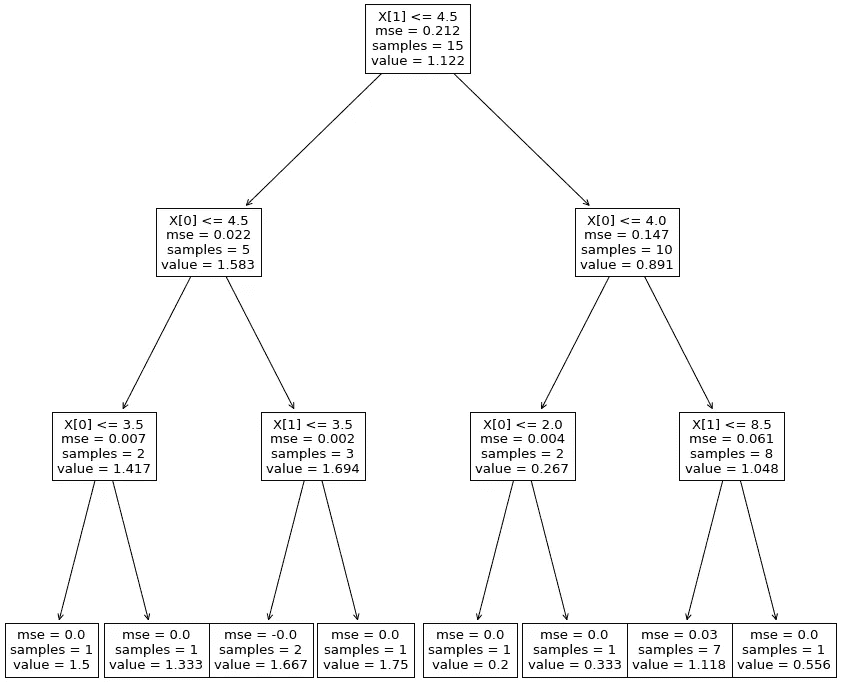
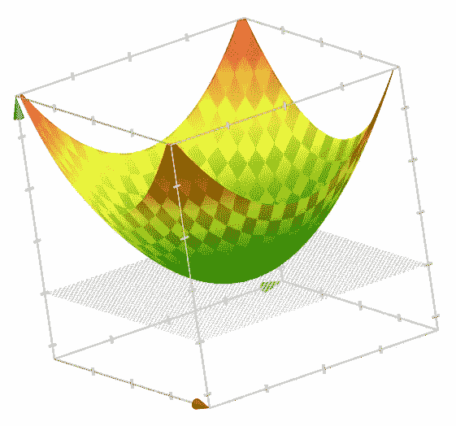
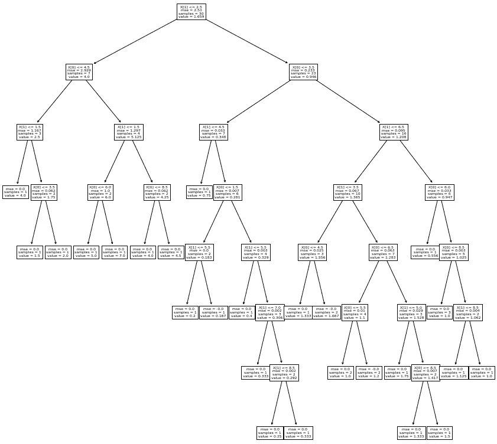
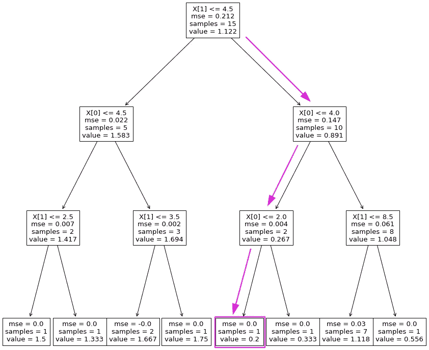
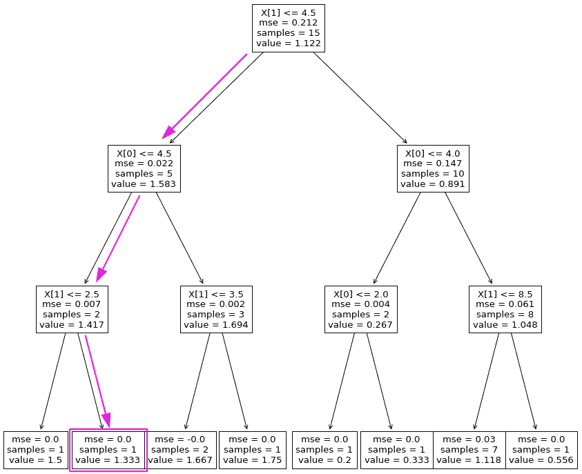
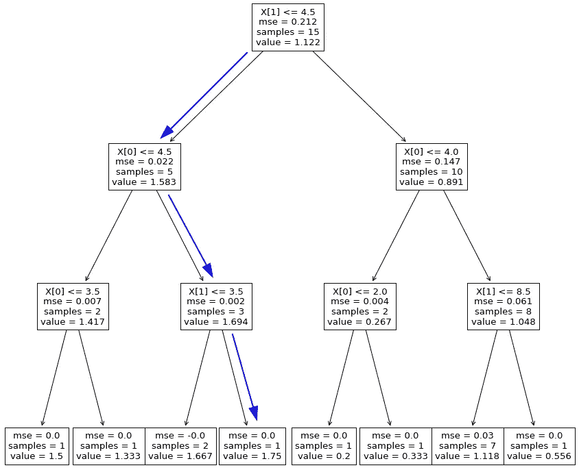

# SciPy 和 Scikit-learn 如何优化模型的响应

> 原文：<https://towardsdatascience.com/how-scipy-and-scikit-learn-can-optimize-your-models-response-12cf7f0ba3e9>

## 看看一些方便的优化功能，从预测切换到处方！

拥有一个复制基本事实的健壮模型是很好的，但是能够找到将最小化或最大化其响应的特性值可能会更好。理解为什么用巧克力饼干🍪！


[本·斯坦](https://unsplash.com/@benostein?utm_source=medium&utm_medium=referral)在 [Unsplash](https://unsplash.com?utm_source=medium&utm_medium=referral) 上拍照

# 语境

想象一下，你刚刚被一家巧克力饼干厂雇佣了！
很棒的工作，不是吗？

作为一名数据科学家，你的老板要求你在流程的第一步工作，这时所有的配料(面粉、黄油、糖等)都已经准备好了。)混合在一起，因为操作人员面临的主要问题是，他们有时会在面团中结块……这会危及饼干的质量！😱

好消息是他们已经能够测量:

*   **配料的主要特性**(如面粉的含水量，黄油的柔软度)，
*   **混合器的设置**(其速度、温度等。),
*   和**面团中的结块率**，从 0 到 10% (5%是临界阈值)

数据是干净的，结构良好(不用提醒你，这是虚构的😂)而且不用花太多时间，你就可以创建一个模型，可以满怀信心地预测面团中块状物的百分比。

为了展示您的模型有多健壮，您将所有人聚集在搅拌机周围，向模型输入当前批次的属性，并宣布面团将具有(灾难性的！)7%的包干率。

当混合操作结束时，每个人都可以看到你的模型是正确的…但是，最终，面团必须被扔掉…

你的老板看着你说:

> "**有些参数我们可以控制(搅拌器的速度、我加的水量)，有些参数我们无法控制(面粉的湿度、房间的确切温度等)。).**
> 
> **请使用您的模型告诉我们，对于每一批，如何微调生产参数以最大限度地降低废品率。**

这是一个严峻的事实:你的随机森林模型表现良好，但是，作为 100 个决策树的组合，它是完全非线性的…这使得你不可能找到一个最佳值，因为你可以用一个简单的线性方程解决…

好消息是 SciPy 确实提供了一些方便的优化功能来帮助您；让我们来发现如何！

# 建模

为了举例，我们将使用一个“过于简单”的模型，但是对于更复杂的问题，原理是一样的。

假设面团块率(Y)受两个主要参数的影响，存储在“X”NumPy 数组中:

```
nb_samples = 15np.random.seed(22)
X = np.random.randint(1, high=10, size=(nb_samples, 2))print(X)y = X[:, 0] / X[:, 1]
print(y)
```

输出:

```
[[6 5]
 [1 5]
 [7 7]
 [5 9]
 [5 3]
 [9 8]
 [3 9]
 [9 6]
 [5 3]
 [3 2]
 [7 4]
 [4 3]
 [8 8]
 [8 8]
 [5 5]][1.2        0.2        1\.         0.55555556 1.66666667 1.125  0.33333333 1.5        1.66666667 1.5        1.75       1.33333333  1\.         1\.         1\.        ]
```

*注意:完整笔记本的链接在文章的最后提供*📑

因为我们有一个“适当的”(但很简单的)数据集，所以让我们用一个简单的 Scikit-Learn[decision tree regressor](https://scikit-learn.org/stable/modules/generated/sklearn.tree.DecisionTreeRegressor.html)创建一个非线性模型:

```
model = DecisionTreeRegressor(max_depth=4)
model.fit(X, y)
model.score(X, y)#0.9343996768065437
```

画出它的样子:

```
plt.figure(figsize=(15, 15))
tree.plot_tree(model)
plt.show()
```



决策树表示法—作者图片

*我们可以观察到，根据 X[0]和 X[1]的值，该决策树有 8 种可能的输出。*

# SciPy 优化库

[**SciPy Optimize**](https://docs.scipy.org/doc/scipy/reference/optimize.html) 库提供了一组函数来最小化(或最大化)目标函数。唯一的预防措施是您应该选择与您的用例相对应的一个:

*   **使用“最小化”** = >的局部(多变量)优化在您有标量/线性函数要求解时非常有用，该函数假定有一个最优值，如下面的凸函数(x +y):



f(x，y)= x+y-作者图片

*   **“双重退火”全局优化** = >当你有一个非线性函数，意味着随机搜索最优解时，这是很有用的。这是我们在使用集合树(Random Forest，XGBoost 等)等模型时遇到的典型情况。).



决策树示例-作者图片

在开始最优搜索之前，我们需要创建一个目标函数，返回我们的非线性模型的结果:

```
def objective(v):
    return model.predict(np.array([v]))[0]
```

然后，只需设置每个特征的边界(X[0]和 X[1])并启动优化过程:

```
bounds = [[1, 10], [1, 10]]result = dual_annealing(objective, bounds, maxiter=100)print(f"Status: {result['message']}")
print(f"Total Evaluations: {result['nfev']}")
print(f"Minimum reached: {result['fun']}")
print(f"Solution vector: {result['x']}")
```

输出:

```
Status: ['Maximum number of iteration reached']
Total Evaluations: 410
Minimum reached: 0.2
Solution vector: [1.78224412 9.35220569]
```

通过将边界设置为等于原始要素的空间，该函数可以提出一对值来有效地最小化目标函数:



1 号优化结果—作者提供的图片

现在让我们用 X[1]上的约束来重现这个过程，次于 4:

```
bounds = [[1, 10], [1, 4]]result = dual_annealing(objective, bounds, maxiter=100)print(f"Status: {result['message']}")
print(f"Total Evaluations: {result['nfev']}")
print(f"Minimum reached: {result['fun']}")
print(f"Solution vector: {result['x']}")
```

输出:

```
Status: ['Maximum number of iteration reached']
Total Evaluations: 404
Minimum reached: 1.3333333333333333
Solution vector: [4.32296802 1.87272909]
```



优化结果 n 2 —作者提供的图片

该算法再次能够找到给定边界内的最小可能值(1.333)。

# 最大化或目标化

与其最小化函数，还不如尽量最大化或者达到一个特定的值。在这种情况下，你只需要修改目标函数。

*   **通过在结果前添加“-”来最大化** = >
*   **瞄准** = >通过在结果计算中包含目标

最大化示例:

```
def objective_max(v):
    return -model.predict(np.array([v]))[0]bounds = [[1, 10], [1, 10]]result = dual_annealing(objective_max, bounds, maxiter=100)print(f"Status: {result['message']}")
print(f"Total Evaluations: {result['nfev']}")
print(f"Maximum reached: {-result['fun']}")
print(f"Solution vector: {result['x']}")# Output
Status: ['Maximum number of iteration reached']
Total Evaluations: 410
Maximum reached: 1.75
Solution vector: [8.0829203 4.2638071]
```



优化结果 3 —作者提供的图片

从现在开始，再也没有理由让面团结块了，巧克力曲奇的质量是安全的🍪🍪🍪

相应的代码存储在这里:

<https://github.com/pierrelouisbescond/medium_articles/blob/main/medium_optimize.ipynb>  

请不要犹豫，浏览我在 Medium 上的其他文章:

<https://pl-bescond.medium.com/pierre-louis-besconds-articles-on-medium-f6632a6895ad> 