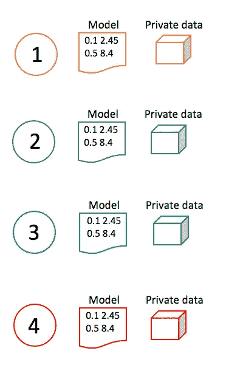
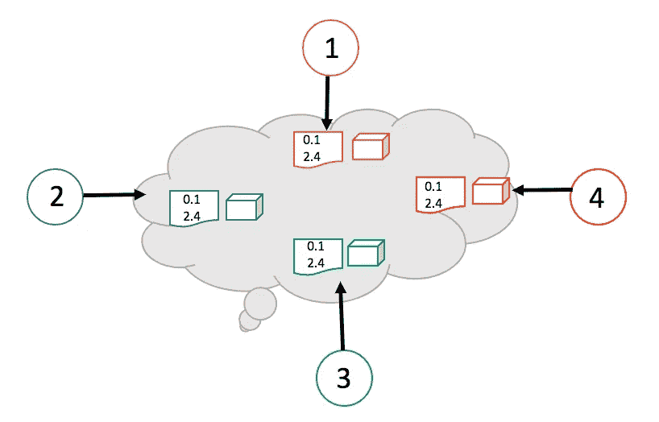
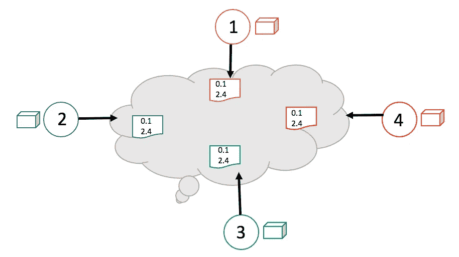
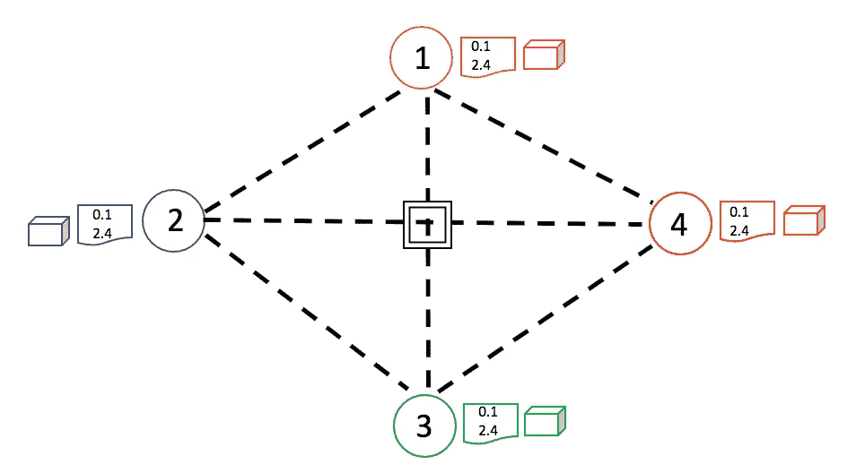

# 群体学习如何工作——区块链和机器学习相结合以获得更好的解决方案

> 原文：<https://towardsdatascience.com/how-swarm-learning-works-blockchain-and-machine-learning-combined-for-a-better-solution-20484d4f258c>

# 群体学习如何工作——区块链和机器学习相结合以获得更好的解决方案

## 群体学习简介

埃德加·恰帕罗在 [Unsplash](https://unsplash.com?utm_source=medium&utm_medium=referral) 上拍摄的照片

[估计数字](https://datacenterfrontier.com/rolling-zettabytes-quantifying-the-data-impact-of-connected-cars/)显示，一辆自动驾驶汽车每天可以产生万亿字节的数据。这些数据用于训练机器学习模型，以便汽车可以在道路上及时做出决策。

医院应用机器学习来更快地识别疾病。这些应用至关重要，尤其是对于高传染性疾病。患者不知道答案的时间越长，因此不能正确隔离自己，传染给他人的风险就越大。

它是如何工作的？在训练阶段，一个程序接收到数百万张带有标签的 x 光图像，例如，肺结核或肺炎。

最初，该程序随机预测疾病的类型，因为它在这个阶段没有学到任何东西。但是接下来，每次它猜出疾病，就和标签(肺结核还是肺炎？)并记录预测的错误程度。

该算法调整“标度”/参数/权重以最小化预测误差。优化器继续运行，直到它有把握地预测。

# 主要问题

我上面提到的机器学习系统面临着几个问题。

*   违反数据保密性/数据隐私法规的风险。
*   由于需要中央服务器来交换信息而导致速度缓慢和数据重复。

想象一下，医院 A 希望通过使用机器学习来更快地获得结核病(TB)的结果。但是医院没有太多以前病人的肺结核病例。它没有足够的标记数据来训练模型。

很好解决吧？去别的医院拿数据就行了。不幸的是，由于数据保密性的考虑，这是不可能的。这是不道德的。

自动驾驶汽车中的传感器和摄像头产生的万亿字节的数据怎么办？如果一辆车学会识别一辆自行车，它应该与所有其他节点共享该信息。但是考虑到数据量的海量，怎么做呢？

# 群体学习

群体学习是一种数据隐私保护框架，它使用区块链来分散基于机器学习的系统。数据或“知识”不会集中到一个中心位置，以允许医院或汽车之间的共享。

让我们来看看机器学习解决方案的四种构建方式，以便更好地理解。

## 本地学习

在本地学习环境中，例如，不同医院之间没有联系。所有的培训都在当地进行，并且停留在当地。一家医院不能与其他医院共享数据或知识，至少不能以自动化的方式。

一辆汽车学会识别一棵树，但不能与其他汽车分享。这是一个非常有限的结构。

局部/边缘学习。图片由作者提供。受[研究文章](https://www.nature.com/articles/s41586-021-03583-3)中一篇的启发。

## 中央学习

数据和神经网络参数被发送到中央学习中的专用服务器。所有节点(医院或汽车等。)访问它，这样，信息就被共享了。

我认为这种设置甚至不如本地学习有用。随着数据的增加，考虑到数据隐私问题，这是不切实际的。至少在本地学习中，这两个问题是不存在的，训练完成的模型可以手动分享。

中枢学习。图片由作者提供。灵感来自于[研究文章](https://www.nature.com/articles/s41586-021-03583-3)中的一篇。

## 联合学习

这种类型的部署是当今许多系统中使用的一种。这几乎和群体学习一样好。但是，仍然有一个中心位置。

系统在本地训练，原始数据留在本地的边缘。但是学习——神经网络刻度盘/参数/权重——被转移到一个中心位置。

这解决了隐私问题。模型“学习”只是一堆数字，并不透露病人或司机的信息。但是，中心位置仍然是一个薄弱环节。

联合学习。图片由作者提供。灵感来源于[研究文章](https://www.nature.com/articles/s41586-021-03583-3)中的一篇。

## 群体学习

群体学习没有中心位置。就像在联合学习中一样，训练是在本地/边缘执行的。但是在 SL 的情况下，甚至学习也不能通过一个中央专用服务器共享。

这些实体使用区块链技术交流学习成果。

如研究论文所述，

> 新节点通过区块链智能合同注册，获得模型，并执行本地模型训练，直到满足定义的同步条件。接下来，在开始新一轮训练之前，通过群应用程序编程接口(API)交换模型参数，并将其合并以创建具有更新参数设置的更新模型。

群体学习。图片由作者提供。受[研究文章](https://www.nature.com/articles/s41586-021-03583-3)中的一个启发。

# 最后的想法

群体学习(SL)是区块链和机器学习协同工作的一个令人兴奋的演示。这看起来是完美的解决方案。我提到了自动驾驶汽车，但研究的重点是疾病识别。数据保密至关重要。

群体学习背后的团队对三种疾病进行了测试。白血病、涡轮虫病和新冠肺炎。结果很有希望。值得看看[研究文章](https://www.nature.com/articles/s41586-021-03583-3)。

群体学习这个名字的灵感来自于动物的集体行为，它们聚集在一起实现共同的目标。蜜蜂需要寻找新家时会蜂拥而至。你可能见过鸟类以一种美丽而同步的方式形成。

每个动物(节点)只有一个微小的信息，通过联合和交流，他们可以实现伟大的事情。这就是 SL 的意义所在。

暂时就这样了。感谢阅读。

# 参考

[1] [用于分散和保密临床机器学习的群学习](https://www.nature.com/articles/s41586-021-03583-3)

[2][https://github.com/HewlettPackard/swarm-learning](https://github.com/HewlettPackard/swarm-learning)

【3】[什么是群体学习？AI、区块链和物联网携手揭开实时智能](https://www.youtube.com/watch?v=c29CjxfJNTY)