# 贝塔分布如何联系分类和投掷硬币

> 原文：<https://towardsdatascience.com/how-the-beta-distribution-connects-sorting-and-tossing-coins-beee3e464bbb>

# 贝塔分布如何联系分类和投掷硬币

## 这个问题源于对一家旧金山初创公司的采访

假设你有一枚硬币，但对正面概率一无所知。假设它在 *0* 和 *1* 之间均匀分布是合理的(因为我们还没有看到任何数据，所以没有理由优先选择任何概率)。现在，你投掷 10 次*，看到 6 个*正面和 4 个*反面(虽然 *60%* 是最合理的估计，但也可能是一枚公平的硬币)。根据这些新信息，概率的分布是如何变化的？原来，它现在是一个测试版。现在让我们考虑排序。*

假设您从一个均匀分布中生成了 *n* 个样本，并将它们放入一个数组中。然后，对数组进行排序，并询问排序后数组中第一项的分布情况(或第 *n* 个样本中的最小值)，第二项的分布情况，依此类推。这些恰好有一个贝塔分布。现在把制服换成*任何*阳光下的连续分布(或其他)。我们也可以用这个技巧来描述它的顺序统计量！

我们可以看到测试版在两个看似不相关的应用程序中弹出。它们之间有什么关系？在这篇博客中，我们将把这两者联系起来，并展示它们是怎么一回事。

你可以在这里看到贝塔分布的全密度函数:[https://en.wikipedia.org/wiki/Beta_distribution](https://en.wikipedia.org/wiki/Beta_distribution)，但是这篇文章我们需要记住的是，它与 *p^(x-1).成正比(1-p)^(y-1)* 其中 *p* 是我们建模的正面概率， *x* 是我们从硬币上看到的正面数量， *y* 是我们从硬币上看到的反面数量。让它与 *p^x.(1-p)^y* 成比例会更自然，但我们有一个很好的理由让-1 成比例。见[这里](http://nt.number theory - Why is the Gamma function shifted from the factorial by 1? - MathOverflow)和[这里](https://math.stackexchange.com/questions/4341534/why-dont-we-reparametrize-the-beta-so-its-parameters-represent-number-of-heads)。

与投掷硬币相关的概率密度函数和顺序统计(涉及对数组进行排序并挑选出不同位置的元素)都可以在数据科学中找到用途，从定义关键性能指标(KPI)到假设检验。

# I)背景:贝氏更新与测试

贝塔分布因其是二项式和伯努利分布的参数 *p* 的“共轭先验”而闻名。这是什么意思？从贝叶斯法则开始。如果我们有两个事件 *A* 和 *B* ，贝叶斯规则描述了以 *A* 发生为条件的 *B* 的概率，可以写成:

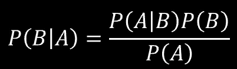

用 Latex 为本文创建的方程。

如果我们将 *A* 解释为观察到一些数据的事件，将 *B* 解释为一些模型，我们可以将 *P(B)* 认为是我们观察到数据之前模型的“先验概率”，将 *P(B|A)* 认为是我们观察到数据之后模型的“后验概率”(并因此更新了模型)。

这显示在下面的彩色方程式中。

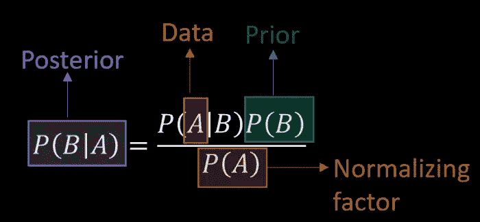

用 Latex 为本文创建的方程。

在我们的上下文中，我们可以将描述硬币正面概率的参数 *U* 解释为“模型”。抛硬币看到 a 正面和 b 反面的事件就是我们收集的数据。根据贝叶斯方程匹配颜色方案，我们得到以下结果:

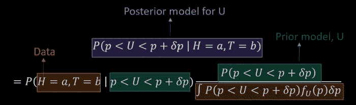

用 Latex 为本文创建的方程。

这就是“共轭先验”部分的用武之地。如果我们假设先验(绿色部分)， *P(p < U < p+δp)* 是带有参数 *x-1* 和 *y-1* 的贝塔分布(记住，这意味着硬币到目前为止已经向我们展示了 *x* 正面和 *y* 反面)，那么紫色的后验也是带有更新参数 *x+a-1* 和的贝塔分布首先，让我们把等号改成比例号，这样我们就不用担心烦人的归一化常数了。

在 PowerPoint 中为本文创建的等式。

数据(红色)的概率就是[二项式分布](https://en.wikipedia.org/wiki/Binomial_distribution)，我们提到贝塔先验与*p^(x-1)(1-p)^(y-1*成比例。插上这些

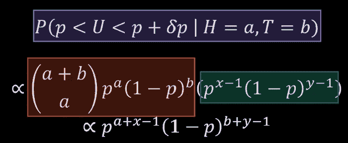

在 PowerPoint 中为本文创建的等式。

我们意识到的最终结果只是另一个 Beta 分布，它的参数已经更新为 *(x+a-1)* 和 *(y+b-1)*

就像我们已经提前看到了 *x* 正面和 *y* 反面，额外的投掷向我们展示了 *a* 更多的正面和 *b* 更多的反面。因此，如果我们一开始就看到了 *(x+a)* 正面和 *(y+b)* 反面，那么更新后的模型将会得到同样的东西。

这可以用下图来概括。它说当 *U* 是参数为 *a* 和 *b* 和 *X* 条件为 *U=p* 是参数为 *n* 和 *p* 的二项式，那么条件为 *X=x* 的 *U* 变成参数为 *a+x* 和 *b+n-x 【T 请注意配色方案，因为我们将使用它。*

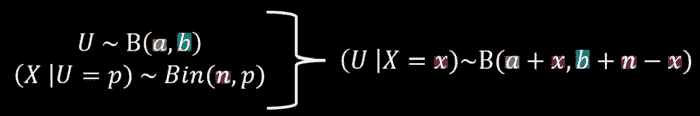

等式(1):二项分布的贝它贝叶斯更新，x。在 PowerPoint 中为本文创建的等式。

# II)背景:订单统计和 Beta

假设我们有一些连续的概率分布。我们想找到它的订单统计数据。例如，估算你所在国家的中等家庭收入。你可以选取一些家庭(比如说 *n* )作为样本，按照收入升序排列，然后选取列表中的中间一个。一般来说，如果我们有 *n* 个数据点，对它们进行升序排序，取第 *k* 个，这叫做第 k 个“顺序统计量”(我们必须对数据进行排序才能得到它，它是一个总结数据的单一统计量)。顺序统计对于从有限样本中估计中位数和其他分位数非常重要(通常在数据科学的上下文中用作 KPI)。那么测试版对他们有什么帮助呢？通过以下方式:

1.  事实:如果我们知道逆 CDF (CDF 从分布的定义域中取一点，并返回分布小于它的概率；逆 CDF 将一个概率作为输入，并返回一个点，使得下面的概率质量等于该概率)，我们可以首先生成一个均匀的随机数 *U* ，然后将它传递给逆 CDF，以从分布中获得一个样本 *X* 。这是[逆变换采样](https://en.wikipedia.org/wiki/Inverse_transform_sampling)方法的基础，用于从任何连续分布中生成随机样本，前提是我们可以轻松找到其逆 CDF。只需生成制服并将其插入逆向 CDF..
2.  注释:如果我们有一个数组，[ *X_1，X_2，…，X_n* ] 来自一个分布的样本，如果我们对这个数组进行排序，得到的数组表示为:[ *X_(1)，X_(2)，…，X_(n)* 。这个排序后的数组是订单统计数据的数组。

现在，如果我们想要生成具有逆 CDF *F_X^-1(x)* 的某些分布的 *n* 阶统计量，我们可以通过两种方式着手:

1.  下图右分支:生成 *n 个*均匀随机数，然后对它们应用逆 CDF，排序。
2.  下图的左分支:生成 *n 个*均匀随机数，先排序再应用逆 CDF。

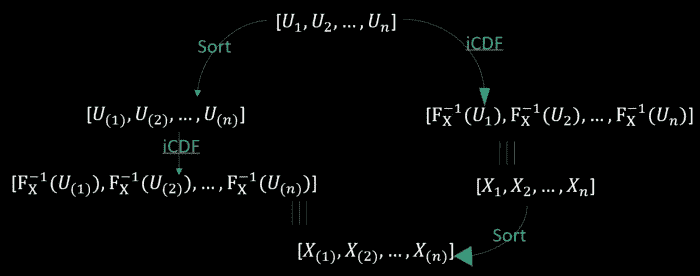

图 2:获得任何连续分布的顺序统计的两种方法。要么先生成一致性，使用逆变换采样映射到分布，然后进行排序(右分支)，要么先对一致性进行排序，然后对排序后的值应用逆 CDF。在 PowerPoint 中为本文创建。

对于左分支，作为中间步骤，我们得到均匀分布的顺序统计量。碰巧这些都是贝塔分布的。因此，要获得一般分布的第 *k-* 个 *n* 个顺序统计量，您可以首先生成代表均匀阵列的第 *n* 个 *k* 个顺序统计量的 Beta 分布，然后将您想要的任何分布的逆 CDF 应用于该 Beta 分布。

# **III)连接两个**

现在，我们需要做的就是确定均匀分布( *U_(k)* )的 *k* 阶统计量是什么样的β。

1.  *U_(k)* 是一个均匀随机数，条件是 *k-1* 其他均匀数小于它， *n-k-1* 大于它。
2.  我们可以把这个我们想要应用条件的均匀随机数想象成一个硬币。如果我们生成另一个制服，它低于它，我们认为这是一个头。否则，我们认为它是一个尾巴。这个数字的值就是硬币正面的概率(与 Beta 出现的联系)。
3.  因此，我们正在处理的事件，即 *(k-1)* 制服位于感兴趣的制服之下而 *(n-k)* 位于制服之上，这相当于说我们将硬币抛了很多次，观察到了 *(k-1)* 正面和 *(n-k)* 反面。
4.  我们已经看到，这种硬币的正面概率是β分布，参数为 *k* 和 *n-k+1* 。但是这个概率相当于我们的利益一致。因此，它也必须由相同贝塔分布给出。

我们可以在第一部分的末尾画一个类似于等式-1 的东西，并使用相同的配色方案来观察事物如何排列以产生结果。

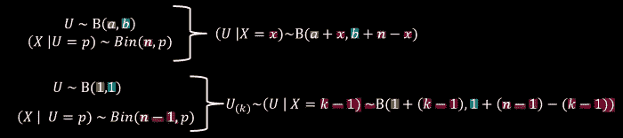

等式(2):使用来自等式(3)的贝塔贝叶斯更新来推断均匀分布的顺序统计量的分布。在 PowerPoint 中为本文创建。

# IV)悖论:测量统一订单统计的分布

正如我们建立了均匀分布的次序统计量的差是贝塔分布一样，我们可以将同样的技术应用于均匀分布的次序统计量的差。比如 *10* 制服抽的时候 *U_(6)-U_(3)* 的分布是怎样的？

我们已经可以看到这个差异将会在 *0* 和 *1* 之间。事实上，我们可以稍微修改一下我们用来推断 *U_(k)* 是β的推理，参数是 *k* 和 *n-k+1* (硬币正面的概率分布，显示给我们的是 *k-1* 正面和 *n-k* 反面)。

当时，我们将从 *0* 到 *U_(k)* 的区间映射为硬币正面朝上的概率。现在，间隔是从 *U_(j)* 到 *U_(k)* 。根据定义，我们已经看到 *(k-j-1)* 制服属于这个区间。所以我们从假想的硬币上观察到的头像数量现在是 *(k-j-1)* 。而剩下的*(n-2-(k-j-1))=**(n-k+j-1)*制服已经在这个区间之外落地了( *n-2* 在最前面，因为我们这次排除了 *U_(k)* 和 *U_(j)* 对应的两个制服)。这相当于从硬币上看到许多尾巴。所以，这应该是一个带有参数 *k-j* 和 *n-k+j.* 的贝塔分布，但是，如果你看一下[维基百科关于顺序统计的文章](https://en.wikipedia.org/wiki/Order_statistic)中关于顺序统计的概率分布的文章，这同意分布是贝塔但说参数是 *k-j* 和 *n-k+j+1* 。我们的报价似乎只差一个错误。如果维基百科的文章是正确的，我们的推理哪里出错了？

**另一条攻击线**

让我们探索另一条推理路线。关于 *U_(6)-U_(4)* 与 *U_(4)-U_(2)* 的分布，你觉得有什么可说的吗？如果我们想象一下 *10* 均匀随机数将 *0* 和 *1* 之间的区间分成 *11* 大致相等的部分会怎么样？原来 *U_(k)-U_(j)* 的分布和 *U_(k-i)-U_(j-i)* 的分布是一样的(移位两个顺序统计量)。这甚至适用于 *i=j* ，这给了我们 *U_(k-j)-U_(0)。*在这里， *U_(0)* 被解释为分布可以取的最小值(对于均匀分布是*0*；与 *U_(1)* 相反，后者是 *n* 个样本中的最小值，而不是 *0* 。现在问题回到寻找第 k 阶统计量的分布，我们知道它是 Beta，带有之前的参数 *k* 和 *n-k+1* 。只是这一次，我们需要用 *k-j* 代替 *k* ，这就给了我们参数: *k-j-1* 和 *n-j+k+1* 。现在我们同意维基百科的文章了！

这整个论点取决于这样一个事实，即当它们的指数移动时，统一的顺序统计量的差异保持它们的分布(通过 *i* 的减法)。所以我们将从视觉上证明这一点。

**1 —映射到圆**

首先，让我们在 *(0，1)* 上取对应均匀分布的线，卷成一个圆。

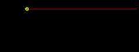

为本文创建的图片使用:[https://github.com/ryu577/pyray](https://github.com/ryu577/pyray)

在直线上均匀地生成三个(或 *n* )点将等同于在圆上均匀地生成三个点，因为我们总是可以将直线滚动到圆上，然后再返回直线。如果直线的任何部分都不可能得到其中一个点(均匀的定义)，那么圆的任何部分也不可能得到。

**2 —先旋转圆圈**

我们已经确定，在圆上均匀地随机生成 *n* 个点，然后将其分解成一条线，这与首先在这条线上生成 *n* 个点是一样的。如果我们在把圆分解成直线之前，把它旋转任意角度，θ，会怎么样？这也不会改变结论，因为圆的每一部分都同样可能得分，旋转它也不会改变这个事实。

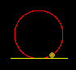

为本文创建的图片使用:【https://github.com/ryu577/pyray 

**3 —生成额外的制服，以选择在**解开的位置

因为我们可以在以我们喜欢的方式解开圆之前选择旋转圆的随机角度，所以我们也可以在圆上生成另一个均匀的数字(除了我们已经生成的 *n* 之外),然后旋转，使得该数字在该点解开之前与水平轴对齐。但这使得这个过程相当于在圆上生成 *n+1* 个均匀随机数，旋转使得其中任意一个与横轴接触，然后解开。

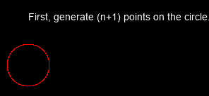

为本文创建的图片使用:【https://github.com/ryu577/pyray 

最后，展开围绕该点的圆。

为本文创建的图片使用:[https://github.com/ryu577/pyray](https://github.com/ryu577/pyray)

这将使我们在解开的线上的 *0* 和 *n* 点处留下一个点。而那 *n* 个点均匀分布在上面。

**4 —将不同的点标记为绿点**

现在妙语连珠了。我们可以将这四个点中的任何一个标记为初始的“绿点”,来解开这条线。下图显示了四种选择的最终统一线条:

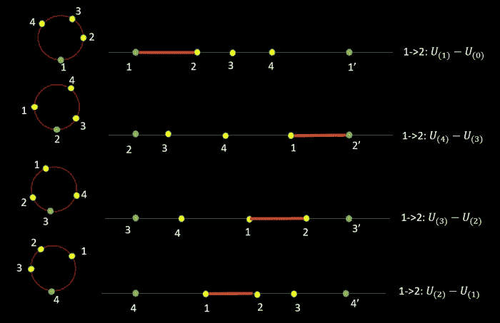

为本文创建的图片使用:[https://github.com/ryu577/pyray](https://github.com/ryu577/pyray)

我们看到，点 1 和 2 之间的距离可以是 *U_(1)-U(0)，U_(2)-U_(1)，U_(3)-U_(2)* 或 *U_(2)-U(1)* 中的任何一个，这取决于我们解开的绿点的选择。但既然那是相同的距离，那么顺序统计量中的那些差异就一定具有相同的分布。我们在这里证明了 *U_(k+1)-U_(k)* 的分布是平稳的，但是这个论证一般可以推广到 *U_(k)-U_(j)* 。

**修正原论点**

最初论点的主要问题是，我们现在看的是一个区间， *|U-U'|* ，其中 *U* 和 *U'* 是两个独立的均匀随机数。虽然单一的均匀分布是平坦的 Beta(1，1)分布，但这个区间不是。它实际上是一个 Beta(1，2)分布。换句话说，时间间隔的分布就像我们已经扔过一次硬币，观察到了反面。

这是因为 *|U-U'|* 和我们生成两个制服时的 *U_(2)-U_(1)* 分布是一样的。通过上面的论证，我们可以转移这个，并得出分布与*U _(2–1)-U _(1–1)= U _(1)-U _(0)= U _(1)相同的结论。*从第三节我们知道，这就像扔硬币，观察一个反面或 Beta(1，2)。这里有一个[同样结果的几何证明](https://math.stackexchange.com/questions/1681363/cdf-of-absolute-value-of-difference-in-random-variables/1681383#1681383)。

考虑到第二个 *2* 参数将会修正我们之前看到的一个错误。

1.  *U_(k)-U_(j)* 的分布与*| U-U’|*的分布相同，条件是 *k-j-1* 内有其他均匀数， *n-k-2* 外有其他均匀数。 *|U-U'|* 无任何条件的分布为 Beta(1，2)
2.  我们可以把我们想要应用条件的这个区间想象成一个硬币。如果我们生成另一个制服，它落在区间内，我们认为是一个头。否则，我们认为它是一个尾巴。这个数字的值就是硬币正面的概率(与 Beta 出现的联系)。
3.  因此，我们正在处理的事件，即 *(k-j-1)* 制服位于我们感兴趣的区间内而 *(n-k-2)* 位于区间外的事实，相当于说我们投掷硬币很多次，观察到 *(k-1)* 正面和 *(n-k-2)* 反面。
4.  根据之前的观察，如果正面概率是带有参数 *x* 和 *y* 的β先验，并且我们观察到 *a* 附加正面和 *b* 附加反面，则参数更新为 *a+x* 和 *b+y，*我们得到期望的结果。这显示在下面的等式中，该等式将我们所说的一切映射到等式-2(使用相同的配色方案)。

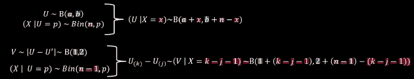

等式(3):应用来自等式(2)的贝塔贝叶斯更新来推断制服的两个次序统计量之间的差异的分布。在 PowerPoint 中为本文创建的等式。

_______________________________________________________

如果你喜欢这个故事，成为推荐会员:)

[https://medium.com/@rohitpandey576/membership](https://medium.com/@rohitpandey576/membership)