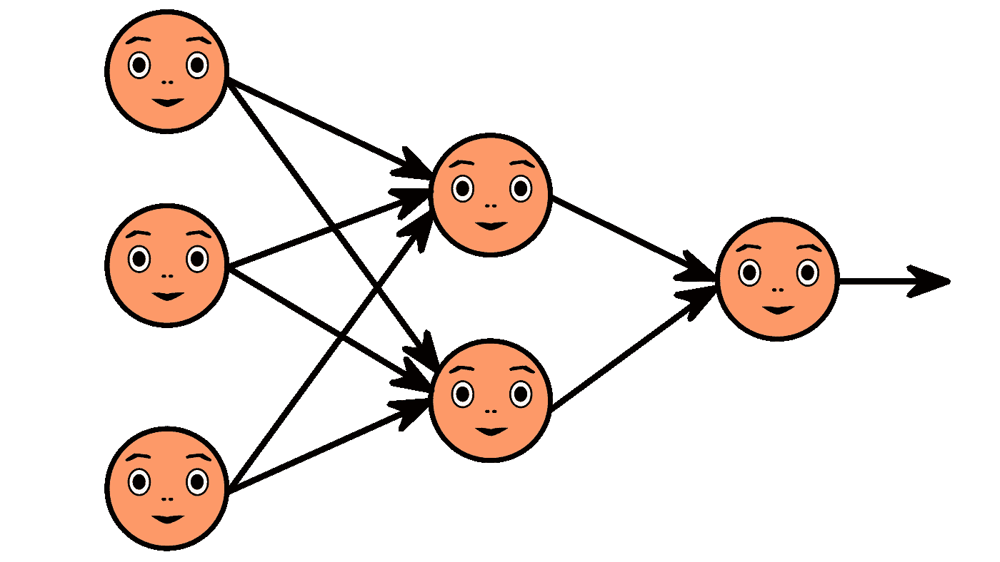
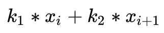
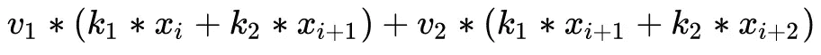
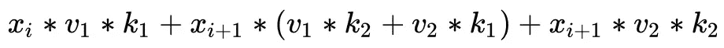
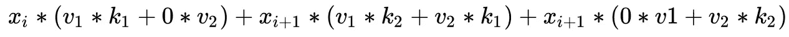

# PyTorch 卷积如何工作或者如何将两个卷积折叠成一个

> 原文：<https://towardsdatascience.com/how-the-pytorch-convolutions-work-or-how-to-collapse-two-convolutions-into-one-6dc810489d79>

## 或者仔细看看深度学习工程师的卷积

照片由 [ahmedgad](https://pixabay.com/ru/users/ahmedgad-9403351/) 在 [pixabay](https://pixabay.com/ru/illustrations/нейронная-сеть-3637503/) 上拍摄

本文有两个目标。第一个是展示如何将两个 PyTorch 卷积合并成一个。如果你想要实现，滚动文章到最后。

第二，主要目标是通过卷积合并的例子更仔细地研究卷积实现。我们将学习它们是如何被存储和使用的，特别是在 PyTorch 中，没有像 im2col 这样的核心细节。
在我们开始研究实现之前，让我们记住我们在做什么。

先说术语。神经网络或计算图形是应用于输入对象或其他操作输出的一组操作(层)。我们对计算机视觉和卷积感兴趣，所以输入对象会是一张图片:大小为[通道数 X 高度 X 宽度]的张量，其中通道数最常为 3 (RGB)。中间输出将被称为特征图。特征图在某种意义上是同一张图片，只是通道的数量是任意的，张量的每个单元称为一个特征，而不是一个像素。为了能够在一次运行中同时运行几个图像，所有这些张量都有一个额外的维度，其大小等于该批(一次运行)中对象的数量。

现在让我们继续讨论互相关。它经常与卷积混淆，但为了我们的目的，这两种运算必须加以区分。什么是神经网络环境中的互相关？首先，互相关是有核的。核是一个形状为[通道数 X 核高 X 核宽]的张量。并且互相关操作可以被表示为沿着输入特征图滑动离开内核，如同在 gif 上一样。每次我们将一个核应用于一段输入时，我们将相应的核权重与特征相乘，并将它们相加，从而在输出通道中获得一个新的特征。

[wikipedia.org](https://upload.wikimedia.org/wikipedia/commons/1/19/2D_Convolution_Animation.gif)[wikipedia.org)

是时候告诉你什么是卷积了。卷积几乎是互相关的，只有核相对于水平和垂直轴被反映。这种差异通常被忽略，因为它对于理解神经网络并不重要，但这次这种差异很重要，因为我们将直接使用权重。

您可能已经注意到，上述卷积从一组通道中创建了一个通道。在神经网络中，卷积从一组通道创建另一组通道。这是通过将上述几个内核同时存储在卷积层中来实现的，每个内核生成一个通道，然后将它们连接起来。这种卷积的核心的最终尺寸是:[每个输出的通道数 X 每个输入的通道数 X 核心高度 X 核心宽度]

PyTorch 和许多其他框架中卷积层的下一部分是 bias。偏置是每个输出通道的附加项。因此，偏置是一组参数，大小等于输出通道的数量。

是时候记住我们的任务了。任务是将两个卷积合并成一个。为什么这是可能的？简而言之，卷积和偏置加法是线性运算。并且线性运算的组合是线性运算。如果这个解释不够清楚，也不要难过。下面的例子将在实践中证明这一说法。

先说最简单的情况。一个任意大小的卷积，第二个 1x1。他们都没有偏见。两者都从一个通道生成一个通道。1x1 的卷积使得这种情况更加简单。实际上，它意味着将特征图乘以一个常数。所以，你可以简单地用这个常数乘以第一次卷积的权重。

让我们使它变得更有趣。现在让第一个卷积将任意数量的通道转换成另一个任意数量的通道。在这种情况下，我们的 1x1 卷积将是中间特征映射通道的加权和。这意味着你可以对产生这些通道的权重进行加权求和。

让我们把它变得更有趣。现在让我们的卷积将任意数量的通道转换成另一个任意数量的通道。在这种情况下，我们的 1x1 卷积将是中间特征映射通道的一组加权和。这里的逻辑是一样的。有必要将产生中间特征的权重与来自第二卷积的权重相加。

现在，是时候放弃对二次卷积大小的限制了。为了简化，我们来看一个一维卷积。内核 2 的操作“k”会是什么样子？

让我们添加内核大小为 2 的额外卷积“v ”:

重新格式化等式:

最后，让我们添加一些零。

我们得到了什么？结果是与核 3 的卷积。并且该卷积中的核是应用于第一卷积的填充权重与由第二卷积的权重创建的核的互相关的结果。对于其他尺寸的内核，对于二维情况和多通道情况，相同的逻辑起作用。但是我不会为这些复杂的情况提供数学知识，相反，我会向你展示如何将这个想法转化为代码。

现在让我们加上偏见。我们将从第二个卷积中的偏差开始。让我提醒你，偏置是一个矢量，其大小等于输出通道的数量，然后与卷积的输出相加。这意味着我们只需要把第二个卷积的偏差放到结果中。

给第一个卷积加上一个偏差稍微复杂一点。因此，我们将分两个阶段走。首先，我们注意到在卷积中使用偏差相当于创建一个额外的特征图，其中每个通道的特征将是常数并且等于偏差参数。然后将此特征添加到卷积的输出中。

但是我们不想每次都创建这个额外的特征，我们想以某种方式改变卷积参数。我们可以做到。仅仅注意到在恒定特征图上应用卷积之后，将获得另一个恒定特征图就足够了。动机很简单——无论我们把窗户放在哪里，切片都是一样的。因此，我们只需对该特征图进行一次卷积，看看每个通道上有哪些特征，然后进行偏差处理。

剩下的只是把它们都包装在一个函数中，去掉维度的神奇常数。

在文章的最后，我想说我们的函数不会对每个卷积都起作用。在这个实现中，我们没有考虑填充、膨胀、步幅或组。但尽管如此，我展示了我想要的一切。进一步改进它可能没有什么意义，因为我只见过一次将两个卷积折叠成一个卷积的任务，这里是，即使在这里，第二个卷积也是 1x1。