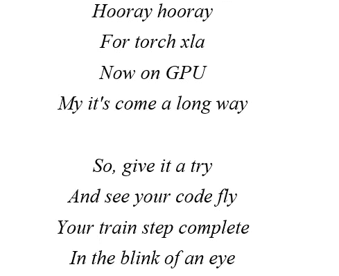
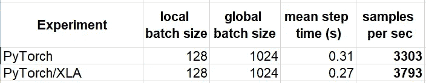

# 如何通过 XLA 加速您的 PyTorch GPU 培训

> 原文：<https://towardsdatascience.com/how-to-accelerate-your-pytorch-training-with-xla-on-aws-3d599bc8f6a9>

## PyTorch/XLA 的力量以及亚马逊 SageMaker 培训编译器如何简化其使用


照片由[帕特里克·福尔](https://unsplash.com/@patrickian4?utm_source=medium&utm_medium=referral)在 [Unsplash](https://unsplash.com?utm_source=medium&utm_medium=referral) 拍摄



按作者

在我们过去的许多帖子中(例如[这里](/cloud-ml-performance-checklist-caa51e798002))，我们都强调了管理培训成本的重要性。我们一直在寻求通过迭代过程 1 来提高训练运行时性能的方法。 ***分析*** 我们的工作负载，以确定性能瓶颈和资源利用不足，以及 2 . ***优化*** 我们的工作负载以消除瓶颈并提高资源利用率。

在这篇文章中，我们探索了通过使用 **XLA 编译**来优化我们 PyTorch 训练步骤的潜力。我们将从 XLA 的简介开始。接下来我们将演示它在 AWS 上的使用，并展示[Amazon sage maker Training Compiler](https://docs.aws.amazon.com/sagemaker/latest/dg/training-compiler.html)如何简化它的配置。我们将以 XLA 带来的一些(当前的)限制来结束。

## 放弃

我们在这篇文章中的目的是介绍加快 PyTorch/XLA 培训的潜在机会。我们的目的不是认可它的使用，也不是认可我们将提到的任何其他培训工具的使用。与往常一样，最佳培训配置高度依赖于您的模型的具体细节。我开篇的那首诗是为了娱乐目的收录的(我忍不住)。尽管有其含义，但不能保证 PyTorch/XLA 会加快你的训练。虽然我们的重点(和演示)将是 Amazon SageMaker 培训环境，但我们讨论的大部分内容也适用于其他培训环境。

# 与 XLA 的 JIT 编译

[最初创建](https://developers.googleblog.com/2017/03/xla-tensorflow-compiled.html)是为了加速 [TensorFlow](https://www.tensorflow.org/xla) 工作负载，XLA(代表**T5 Accelerated**L***linear****A****代数*采用 *Just in Time* (JIT)编译技术来优化底层加速器的计算图。更具体地，在运行时，XLA 编译器将分析与模型相关联的完整计算图，将连续的张量运算融合在一起，并输出用于底层加速器的最佳机器代码。这与标准方法相反，在标准方法中，每个张量运算都是独立优化的。融合图形组件可以通过多种方式提高性能，包括:**

1.  减少总体机器级操作(FLOPS)的数量，
2.  减少需要由 CPU 加载到加速器中的计算内核的数量，以及
3.  减少计算图的内存占用。释放的空间可用于增加训练批次大小，这可能会进一步提高性能。

如 [XLA 概览页面](https://www.tensorflow.org/xla)所示，优化整个图表而非单个操作有可能减少培训时间。

顺便提一句，XLA 的另一个优势是它是专门为支持新的后端设备而设计的。更多详情请参见此处的[和此处](https://www.tensorflow.org/xla/architecture)的[。](https://www.tensorflow.org/xla/developing_new_backend)

# XLA 换火炬

与 TensorFlow 相反，为 PyTorch 实现 XLA 提出了一个独特的挑战，我们将在下面的小节中解释。

## 急切执行与图形执行

深度学习框架可以根据它们表示和执行机器学习模型的模式进行分类。一些框架，最著名的是 TensorFlow(在 v1 中默认，在 v2 中通过 [tf.function](https://www.tensorflow.org/guide/intro_to_graphs) )，支持**图模式**，其中模型首先被表示为计算图(在 Python 中)，然后由单独的执行引擎处理和执行(例如，在 C++中)。其他框架，比如 PyTorch，急切地执行它们的模型**，也就是说，模型不是存储在数据结构中，而是直接执行每一行代码。许多人认为 Eager 模式更容易调试，并且支持更强的编程表达能力。这通常被视为 PyTorch 框架最近越来越受欢迎的原因(截至本文撰写之时)。**

**查看[这篇文章](/eager-execution-vs-graph-execution-which-is-better-38162ea4dbf6)了解更多关于这两种执行模式的区别。**

**显然，考虑到图定义和图执行**之间的分离，XLA 的 JIT 编译机制与**图模式**的执行方法非常一致。**支持 XLA 和**急切执行模式**需要更多创意。有几种方法可以解决这个问题(参见本文[的第 2 节](https://arxiv.org/pdf/2102.13267.pdf)进行简单的调查)。正如我们将看到的，在 [PyTorch/XLA](https://github.com/pytorch/xla) 库中引入和使用的方法是[懒惰张量系统](https://github.com/pytorch/xla/blob/master/API_GUIDE.md#xla-tensors-are-lazy)。**

## **PyTorch/XLA**

**[PyTorch/XLA](https://github.com/pytorch/xla) 是一个 Python 库，其创建的主要目的是使用 XLA 编译来支持在 [Google Cloud TPUs](https://cloud.google.com/tpu/) 上进行基于 [PyTorch](https://pytorch.org/) 的训练(例如，参见这里的)。PyTorch/XLA 的基本方法是**惰性张量系统**。惰性张量是一种定制的张量类型，在 PyTorch/XLA 中被称为 *XLA 张量*。与标准 PyTorch 张量相反，操作不会立即(或“急切地”)执行，而是收集到形成中间表示(IR)图的操作序列中。当被提示时(例如，在每个训练步骤结束时)，IR 图被传递到 XLA 编译器，在那里它经历对底层加速器的优化。通过这种方式，惰性张量系统支持**领域特定编译** (DSC)，同时保持*热切执行*的外观和感觉，这是 PyTorch 培训框架的标志。虽然使用惰性张量可以在不改变模型定义的情况下进行 XLA 编译，但了解标准张量和 XLA 张量之间的细微差别很重要。关于懒惰张量的更多细节以及如何理解他们的行为，请务必查看[这篇内容丰富的帖子](https://pytorch.org/blog/understanding-lazytensor-system-performance-with-pytorch-xla-on-cloud-tpu/)。**

## **用于 GPU 的 PyTorch/XLA**

**虽然 [API 文档](https://pytorch.org/xla/release/1.12/index.html)描述 PyTorch/XLA 支持所有 *XLA 设备*、**包括 GPU**，但是您可能会发现，在撰写本文时，对 [Google Cloud TPUs](https://cloud.google.com/tpu/) 的支持已经被高度优先考虑。天真地搜索“py torch/GPU 上的 XLA”会出现几个关于其支持的免责声明，以及一些创建自定义 GPU 支持构建的非官方说明(例如，参见 [this github issue](https://github.com/pytorch/xla/issues/1448) )。**

**令人欣慰的是，一些云服务提供商已经创建了 docker 映像，专门支持 GPU 上的 PyTorch/XLA。在 [GCP](https://cloud.google.com/) 可用支持见[此处](https://github.com/pytorch/xla/#-available-images-and-wheels)，在 [AWS](https://aws.amazon.com/) 最新支持图片见[此处](https://github.com/aws/deep-learning-containers/blob/master/huggingface/pytorch/training/docker/1.11/py3/cu113/Dockerfile.trcomp.gpu)。在下一节中，我们将使用亚马逊 SageMaker 培训服务提供一个在 GPU 上使用 PyTorch/XLA 的例子。**

# **py torch/AWS 上的 XLA**

**在下面的代码块中，我们展示了如何使用 torch_xla，PyTorch/XLA Python 模块来训练一个 [HuggingFace 视觉转换器](https://huggingface.co/docs/transformers/model_doc/vit)模型。为了突出 torch_xla 流和标准流之间的区别，我们实现了这两个流，并添加了一个“ *is_xla* ”标志来在它们之间切换。代码假设我们将在一个有 8 个 GPU 的实例上运行。我们强调了一些 XLA 特有的代码行。**

```
import time
import torch
import os
import json
from torch.utils.data import Datasetnum_gpus = 8
**is_xla = True**if is_xla:
  import torch_xla.core.xla_model as xm
  import torch_xla.distributed.parallel_loader as pl
  if os.environ.get('XRT_WORKERS') is None:
 **# Add ENVARS required for XLA**    host=json.loads(os.environ["SM_HOSTS"])[0]
    os.environ["XRT_WORKERS"] = f'localservice:0;{host}:43857'
    os.environ['XRT_SHARD_WORLD_SIZE'] = '1'
    os.environ['XRT_HOST_ORDINAL'] = '0'
    os.environ['FI_EFA_USE_DEVICE_RDMA'] = '1'
    os.environ['NCCL_PROTO'] =  'simple'
    os.environ['XLA_FIX_DIV_FP64'] = '1'
    os.environ['OFI_NCCL_NIC_DUP_CONNS'] = str(num_gpus)
    os.environ["GPU_NUM_DEVICES"] = str(num_gpus)
else:
  # DDP setup
  import torch.distributed as dist
  def setup(rank, world_size):
    os.environ['MASTER_ADDR'] = os.environ.get('MASTER_ADDR',
                                               'localhost')
    os.environ['MASTER_PORT'] = os.environ.get('MASTER_PORT',
                                               str(2222))
    dist.init_process_group('nccl', rank=rank,
                            world_size=world_size)
  # wrap the model with DDP
  def wrap_model(model,local_rank):
    from torch.nn.parallel import DistributedDataParallel as DDP
    model.to(torch.cuda.current_device())
    model = DDP(model,device_ids=[local_rank])
    return model# A fake dataset
class FakeDataset(Dataset):
  def __len__(self):
    return 10000000
  def __getitem__(self, index):
    rand_image = torch.randn([3, 224, 224], dtype=torch.float32)
    label = torch.tensor(data=[index % 1000], dtype=torch.int64)
    return rand_image, labeldef build_model():
  from transformers import ViTForImageClassification, ViTConfig
  return ViTForImageClassification(ViTConfig(num_labels=1000))def main(rank, world_size=num_gpus):
  dataset = FakeDataset()
  model = build_model()
 **if is_xla:
    device = xm.xla_device()
    rank = xm.get_local_ordinal()**    model = model.to(device)
  else:
    setup(rank, world_size)
    torch.cuda.set_device(rank)
    model = wrap_model(model,rank)
  batch_size = 128
  optimizer = torch.optim.Adam(model.parameters())
  data_loader = torch.utils.data.DataLoader(
                                  dataset,
                                  batch_size=batch_size,
                                  num_workers=12)
 **if is_xla:
    data_loader = pl.MpDeviceLoader(data_loader, device)** loss_function = torch.nn.CrossEntropyLoss()
  t0 = time.perf_counter()
  for idx, (inputs, targets) in enumerate(data_loader, start=1):
    if not is_xla:
      inputs = inputs.to(torch.cuda.current_device())
      targets = targets.to(torch.cuda.current_device())
    targets = torch.squeeze(targets,-1)
    optimizer.zero_grad()
    outputs = model(inputs)
    loss = loss_function(outputs['logits'], targets)
    loss.backward()
 **if is_xla:
      xm.optimizer_step(optimizer)
    else:
      optimizer.step()**    if rank == 0 and idx%1000 == 0:
      batch_time = time.perf_counter() - t0
      print(f'step: {idx}: mean step time is {batch_time/1000}')
      t0 = time.perf_counter() if not is_xla:
    dist.destroy_process_group()def _mp_fn(index):
  main(index)if __name__ == "__main__":
  if is_xla:
    import torch_xla.distributed.xla_multiprocessing as mp
  else:
    import torch.multiprocessing as mp
  mp.spawn(_mp_fn, nprocs=num_gpus, join=True)
```

**为了在 [Amazon SageMaker](https://aws.amazon.com/sagemaker/) 中运行培训脚本，我们需要对我们的培训作业进行编程，以使用其中一个 [docker 映像](https://docs.aws.amazon.com/sagemaker/latest/dg/training-compiler-support.html#training-compiler-supported-frameworks-pytorch)，该映像包含一个 torch_xla 版本，该版本经过专门配置和调整，可以在 Amazon SageMaker 的 GPU 培训实例上运行。**

```
**image_uri = "763104351884.dkr.ecr.us-east-1.amazonaws.com/" \
            "huggingface-pytorch-trcomp-training:1.11.0-" \
            "transformers4.21.1-gpu-py38-cu113-ubuntu20.04"**from sagemaker.pytorch import PyTorch
estimator = PyTorch(entry_point='train.py',
                    role=<role>,
                    instance_type='ml.p4d.24xlarge',
                    instance_count=1,
                    **image_uri=image_uri**)estimator.fit()
```

**诚然，我们上面分享的培训脚本有点乱。特别是环境变量设置，需要大量的反复试验，(以及一些逆向工程)。在下一小节中，我们将展示如何使用 [Amazon SageMaker Training 编译器](https://docs.aws.amazon.com/sagemaker/latest/dg/training-compiler.html)获得一个更简洁、更通用的解决方案。**

## **亚马逊 SageMaker 培训编译器**

**[亚马逊 SageMaker 训练编译器](https://docs.aws.amazon.com/sagemaker/latest/dg/training-compiler.html)是亚马逊 SageMaker 的一项功能，旨在加速 SageMaker 管理的 GPU 实例上深度学习模型的训练。在引擎盖下，SageMaker Training 编译器通过以我们上面描述的方式使用 XLA 编译来实现训练加速。对于其 [PyTorch 支持](https://docs.aws.amazon.com/sagemaker/latest/dg/training-compiler-enable-pytorch.html)，SageMaker Training 编译器加载一个定制构建 torch_xla 的 docker 映像，自动配置培训环境供其使用，并启动 xla 培训作业。特别是，SageMaker Training 编译器设置了所有模糊的(未记录的)环境变量，从而将用户所需的操作减少到[几个简单的步骤](https://docs.aws.amazon.com/sagemaker/latest/dg/training-compiler-enable-pytorch.html#training-compiler-enable-pytorch-pysdk)。**

**下面的代码块展示了如何用 [Amazon SageMaker 培训编译器](https://docs.aws.amazon.com/sagemaker/latest/dg/training-compiler.html)启动我们的 PyTorch 培训工作。**

```
from sagemaker.huggingface import HuggingFace, TrainingCompilerConfigdistribution={'pytorchxla': {'enabled': True}}estimator=HuggingFace(entry_point='train.py',
                      role=<role>,
                      instance_type='ml.p4d.24xlarge',
                      instance_count=1,
                      transformers_version='4.21.1',
                      pytorch_version='1.11.0',
                      compiler_config=TrainingCompilerConfig(),
                      distribution=distribution)estimator.fit()
```

**请注意，如果您的训练脚本使用了 [HuggingFace transformer 模型](https://huggingface.co/docs/transformers/index)，您可以通过使用高级 [Huggingface 训练器](https://huggingface.co/docs/transformers/main_classes/trainer) API 来进一步简化 SageMaker 训练编译器(和 torch_xla)的使用，如[特性文档](https://docs.aws.amazon.com/sagemaker/latest/dg/training-compiler-pytorch-models.html#training-compiler-pytorch-models-transformers-trainer)中所述。**

**请务必查看[功能文档](https://docs.aws.amazon.com/sagemaker/latest/dg/training-compiler-pytorch-models.html)了解更多详情。关于不同使用模式的示例，参见 [API 文档](https://sagemaker-examples.readthedocs.io/en/latest/sagemaker-training-compiler/index.html)。**

## **结果**

**在下表中，我们比较了 Vision Transformer 在使用和不使用 XLA 编译时的运行时性能，以每秒**个样本**来衡量。**

****

**XLA 编译对每秒采样数的影响—越高越好(作者)**

**应用 XLA 编译将我们模型的性能提高了 **~15%** 。我们再次强调，XLA 编译的潜在好处非常依赖于模型的细节。在不同的 ML 模型上运行相同的实验可能会产生非常不同的比较结果。**

**请注意，XLA 跑的步长时间稳定下来需要大约 10，000 步，或者接近一个小时。这是 XLA 编译的一个已知症状。**

# **XLA 限制**

**在使用 XLA 编译器之前，了解它的一些限制是很重要的。**

## **模型依赖性**

**在这篇文章中，我们强调了这样一个事实，XLA 为**提供了潜在的**性能提升，但不是性能提升的保证。您是否会从使用 XLA 中受益，如果会，性能会有多显著，都高度依赖于您的模型的具体情况。在某些情况下，例如当模型包含动态形状的张量时，您可能会发现使用 XLA 会降低性能。虽然通常很难预测你的模式是否“XLA 友好”，但有几个资源(如[此处](https://www.tensorflow.org/xla/known_issues))应该可以为你提供一些一般性的指导。**

**正如我们在上面的例子中看到的，XLA 编译是一个发生在多个训练步骤中的过程。根据您的模型，训练步长收敛到其 XLA 最优值可能需要几分钟或更长时间。特别是，如果你的整体训练持续时间相对较短，你可能看不到使用 XLA 的好处。**

## **调试和实验的局限性**

**PyTorch 培训框架及其热切的执行策略流行的原因之一是它简化了调试和实验。在 PyTorch 中，人们可以计算任何中间张量的值，而不需要跳来跳去这样做(如在图形模式执行中)。通过采用 XLA 汇编，我们基本上放弃了这一点。可以通过支持 XLA 和非 XLA 流来减轻这种限制(如上面的脚本所示)，但是，我们看到的行为总是有可能是 XLA 流所独有的。**

**使调试和实验变得复杂的另一个因素是我们的训练依赖于定制的 torch_xla 构建。截至本文写作时，还没有官方的 torch_xla [Python 包](https://pypi.org/)。在受控环境中评估 XLA 行为的一个选项是[从 CSP 的映像库中提取 XLA 特定的 docker 映像](https://docs.aws.amazon.com/AmazonECR/latest/userguide/docker-pull-ecr-image.html)(或者使用 SageMaker 的本地模式来完成)。PyTorch/XLA 文档包括配置 torch_xla 在 CPU 上运行的[指令。然而，您可能会发现在本地 GPU 上运行 docker 映像更具挑战性。无论如何，以这种方式进行调试和试验显然是有局限性的，而且远非理想。](https://pytorch.org/xla/release/1.11/index.html#before-you-start)**

## **代码调整**

**使用 torch_xla 需要大量的代码修改。这些可以分为两种类型，使用 torch_xla 所需的对培训流程的调整，以及使用 torch_xla 时作为最佳实践推荐的调整。在上面的代码示例中，我们演示了一些最基本的*所需的修改*。在实践中，经常需要额外的修改来保存和加载模型，集成自动混合精度等等。这里记录了所需的调整[。这里有几个资源，比如这里的](https://docs.aws.amazon.com/sagemaker/latest/dg/training-compiler-pytorch-models.html#training-compiler-pytorch-models-non-trainer)[这里的](https://docs.aws.amazon.com/sagemaker/latest/dg/training-compiler-tips-pitfalls.html)和[这里的](https://docs.aws.amazon.com/sagemaker/latest/dg/training-compiler-pytorch-models.html#training-compiler-pytorch-models-best-practices)，描述了*推荐的改编*以最大限度地利用 torch_xla。这些通常旨在最大限度地减少 XLA 汇编的次数。只有当模型可以被 XLA 编译一次并在所有后续步骤中重用时，它们才会从使用 XLA 中受益。需要频繁 XLA 编译的模型(例如，张量具有动态形状的模型)不会从使用 torch_xla 中受益。引用[这篇推荐的博客文章](https://pytorch.org/blog/understanding-lazytensor-system-performance-with-pytorch-xla-on-cloud-tpu/)，其中包括使用 torch_xla 的最佳实践，“编译一次，经常执行”**。****

**代码修改，不管它们是必需的还是推荐的，都会使 torch_xla 的使用复杂化。如果你选择维持 XLA 和非 XLA 的资金流动，这一点尤其正确。**

# **摘要**

**XLA 汇编有可能大大加快培训速度，进而节省培训成本。不幸的是，在撰写本文时，GPU 对 PyTorch 中 XLA 编译的支持仍然处于 TPU 的次要地位。值得庆幸的是，像 AWS 这样的 CSP 已经创建了定制版本，让我们可以从 XLA 编译中获益。我们只能希望未来能提高 torch_xla 的可用性和易用性，特别是在 GPU 上。这种改进将包括:**

1.  **一座官方多用途火炬 xla 建筑，**
2.  **torch_xla 和标准 torch API 流的一致性，**
3.  **将 XLA 支持合并到官方 PyTorch 包中(如在 TensorFlow 中)，以及**
4.  **改进了使用文档，特别是在 GPU 上。**

**同时，“试一试，看看你的代码飞起来吧”:)。**

**如有任何意见、问题或更正，请随时联系我。**