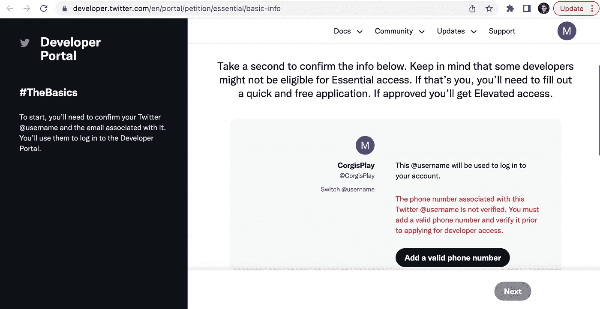
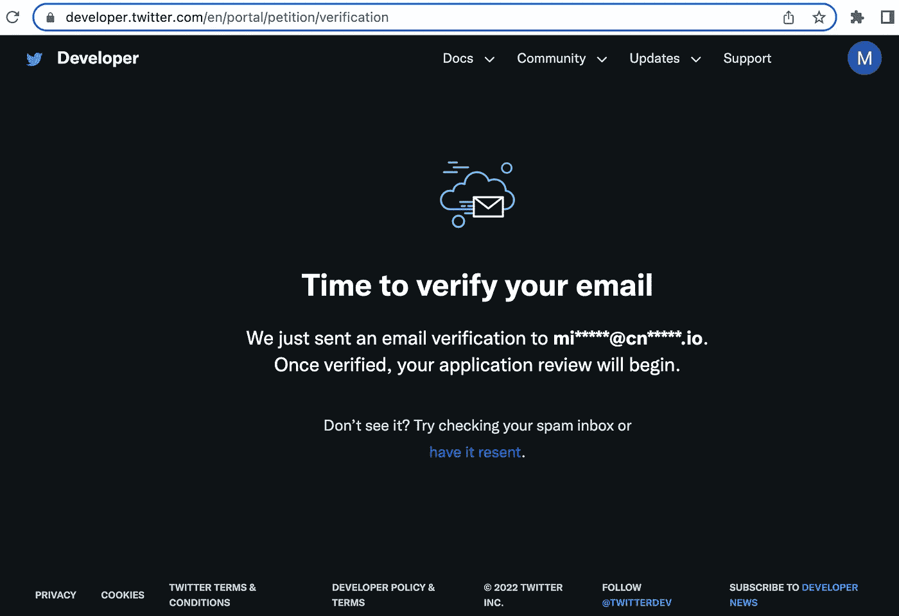
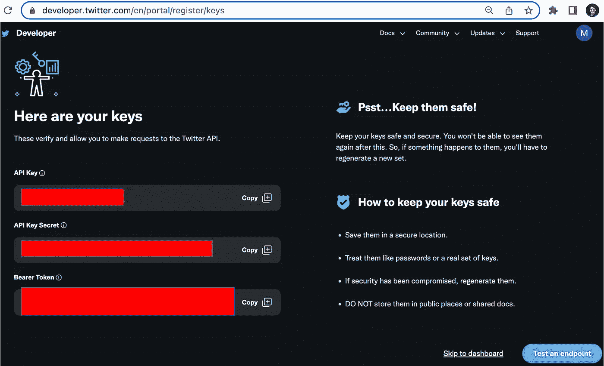
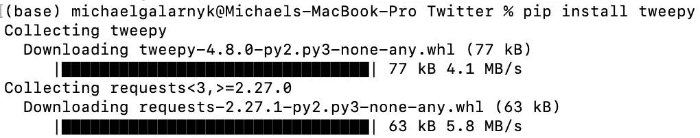

# 如何使用 Tweepy (Python)从 Twitter API 访问数据

> 原文：<https://towardsdatascience.com/how-to-access-data-from-the-twitter-api-using-tweepy-python-e2d9e4d54978>

Twitter API 允许你做很多事情，包括检索 tweet 数据。为了访问这些数据，您需要一个开发人员帐户。使用 Twitter API 应该是一件容易的事情，但是有时候图片和简单的代码可以帮你避免一些挫折。

本教程介绍了:

*   如何设置 Twitter 开发者账户
*   使用 tweepy (Python)访问 Twitter 数据

# 如何设置 Twitter 开发者账户

1.)创建一个 [twitter 账户](https://twitter.com)，如果你还没有的话。


如果你已经有了 twitter，你可以跳过这一步。图像由[迈克尔·加拉尼克](https://twitter.com/GalarnykMichael)拍摄。

2.)在 [twitter 开发者账户页面](https://developer.twitter.com/en/apply/user)，你会被要求回答几个问题。例如，我被要求输入电话号码、国家和用例。下一步是阅读并同意开发者协议。



迈克尔·加拉尼克的图片。

3.)验证你的邮箱。



迈克尔·加拉尼克的图片。

4.)验证您的电子邮件后，您将被发送到欢迎屏幕。命名你的应用程序，然后点击获取密钥。


迈克尔·加拉尼克的图片。

5.)您现在可以访问您的密钥了。请确保将您的信息保存到安全的位置。您将需要它们使用 twitter api 来访问数据。对于 OAuth 2.0 来说，这些信息已经足够了。



迈克尔·加拉尼克拍摄的图片。

# 使用 tweepy 访问 Twitter 数据

本节简要介绍如何使用 Python tweepy 库访问 twitter 数据。要开始使用这个库，您需要通过 pip 安装它。

```
pip install tweepy
```



pip 安装套件

## 搜索过去 7 天的推文

下面的代码将搜索并返回过去 7 天的推文，每个请求最多 100 条推文。这段代码搜索包含#petday 标签的英文 tweets(而不是 retweets)。

[要点](https://gist.github.com/mGalarnyk/37b6c10580f4dabbed1c760265344a3c)

请注意，为了获取过去 7 天之前的推文，您需要使用`search_all_tweets`方法，该方法仅在您升级到[学术研究产品跟踪](https://developer.twitter.com/en/products/twitter-api/academic-research)或[其他提升的访问级别](https://developer.twitter.com/en/docs/twitter-api/getting-started/about-twitter-api)时可用。这里有一个关于使用这种方法的博客。

## 使用 paginator 一次获得超过 100 条推文

如果你需要超过 100 条推文，你必须使用[分页器](https://docs.tweepy.org/en/latest/v2_pagination.html)方法并指定限制，即你想要的推文总数。将 limit=1000 替换为您想要的最大 tweets 数。

把 limit=1000 换成你想要的最大推文数量( [gist](https://gist.github.com/mGalarnyk/5b251ea41c3626d6965ac7d5006da432) )。

# 常见问题+ Twitter API 资源

本节旨在提供关于身份验证和 twitter API 的常见问题的答案和/或资源。自然，如果有人评论这篇博文，我会尽我所能回答这里的问题。

本节尽力提供人们在使用 Twitter API 和 tweepy 时遇到的常见问题。

## OAuth 1.0 和 OAuth 2.0 有什么区别？

这里有一个很好的 stackoverflow 答案。 [synopsys 也有一篇很棒的文章](https://www.synopsys.com/blogs/software-security/oauth-2-0-vs-oauth-1-0/#:~:text=OAuth%202.0%20is%20much%20more,Better%20separation%20of%20duties)介绍了签名工作流程如何适用于每一种情况。

## 我如何做一些事情，比如获得用户的关注者，喜欢一条推文的用户等等？

Twitter 上有一个全面的指南[这里](https://dev.to/twitterdev/a-comprehensive-guide-for-using-the-twitter-api-v2-using-tweepy-in-python-15d9)。

# 结论

本教程是关于 Twitter API 入门的。未来的教程将介绍如何导出 twitter 数据以及情感分析。如果您对本教程有任何问题或想法，请在下面的评论中或通过 [Twitter](https://twitter.com/GalarnykMichael) 联系我们。

【https://community.cnvrg.io/】原载于*。*