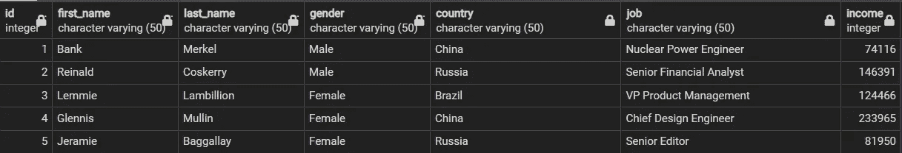
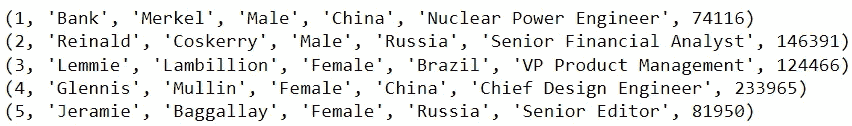
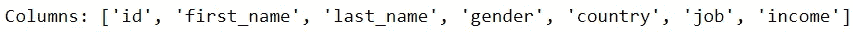
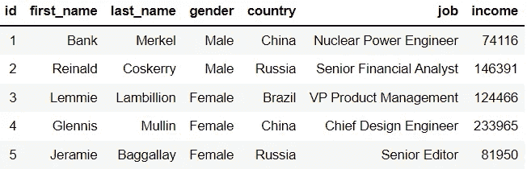
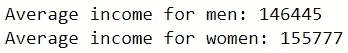
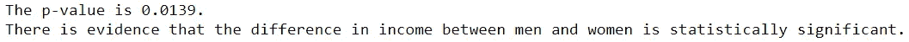
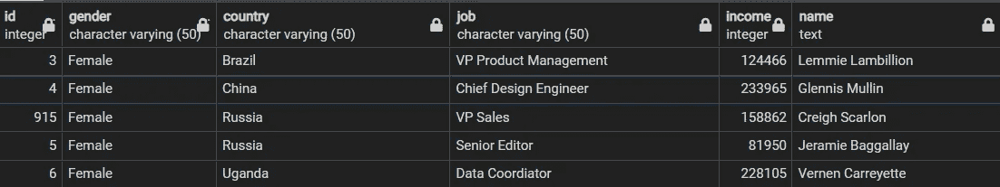

# 如何用 Python 访问关系数据库

> 原文：<https://towardsdatascience.com/how-to-access-relational-databases-in-python-f711cb38e235>

## 使用数据库适配器的简单指南

照片由来自[佩克斯](https://www.pexels.com/photo/photo-of-turned-on-laptop-computer-943096/?utm_content=attributionCopyText&utm_medium=referral&utm_source=pexels)的[丹尼·梅内塞斯](https://www.pexels.com/@danny-meneses-340146?utm_content=attributionCopyText&utm_medium=referral&utm_source=pexels)拍摄

关系数据库管理系统(RDBMS)无处不在。

它们提供了一种储存大量信息的简单方法。此外，在 SQL 的帮助下，访问、维护和修改存储在其中的数据变得非常容易。

也就是说，这样的安排带有一定的警告。如果您希望从存储在数据库中的信息中获得洞察力，您会受到 SQL 提供的命令的限制。

虽然 SQL 允许您执行连接或利用聚合函数，但它不提供执行更高级技术的方法，如执行统计测试或构建预测模型。如果你希望执行这样的操作，你将需要 Python 的帮助。

这就引出了一个问题:如何在响应 SQL 查询的数据库上实现 Python 代码？

## 数据库适配器

要访问 Python 中的数据库，您需要使用一个*数据库适配器*。

Python 通过其模块提供数据库适配器，允许访问主要数据库，如 MySQL、PostgreSQL、SQL Server 和 SQLite。

此外，所有这些模块都依赖 Python 的数据库 API (DB-API)来管理数据库。因此，用于管理数据库的代码在所有数据库适配器中都是一致的。

一旦您能够成功地与一个关系数据库通信，您就应该能够与所有关系数据库通信。

利用数据库适配器需要理解关键对象和方法，这些对象和方法将用于促进与相关数据库的交互。

## 个案研究

一个简单的演示可以展示数据库适配器的特性。

因为我使用 PostgreSQL，所以我需要依赖于 [psycopg2](https://pypi.org/project/psycopg2/) 模块。

这项研究将使用一个名为“test_db”的数据库。这个数据库包含一个名为“Person”的表，其中包含用 [Mockaroo](https://www.mockaroo.com/) 生成的假数据。

以下是数据预览:

代码输出预览(由作者创建)

1.  **连接到数据库**

首先，我们需要建立到数据库的连接，这样我们就可以使用 Python 与它通信。我们可以通过创建一个*连接*对象来实现。

创建连接对象时，您需要为其提供定位和访问数据库所需的信息。这包括主机、用户名、密码和数据库名称。

## 2.从 Python 向数据库写入查询

既然我们已经连接到数据库，我们应该能够直接从 Python 编写对数据库的查询。

尽管我们现在使用的是 Python，但我们将需要继续使用 SQL 查询来检索任何信息。

在编写任何查询之前，我们需要创建一个*光标*对象。

光标对象使用*执行*方法来执行给定的查询。可以用 *fetchall* 方法检索查询的结果输出。

让我们使用这个过程来选择 Person 表中的前 5 行。

代码输出(由作者创建)

如输出所示，每一行都表示为一个元组。

要获得表的列名，可以使用 cursor 对象上的 *description* 属性。

代码输出(由作者创建)

**3。使用数据库执行高级分析**

虽然我们可以用 Python 编写对数据库的 SQL 查询，但是如果我们只能做这些，那么使用适配器就没有什么意义了。

让我们对“Person”表中的数据执行一个操作，这是我们单独使用 SQL 查询无法完成的。

为此，我们应该首先在 Python 中将表存储为 pandas 数据框。

代码输出(由作者创建)

现在，我们可以全权处理这些数据了。

举个例子，让我们来看看这个数据集中男性和女性的平均收入。

代码输出(由作者创建)

我们可以看到，女性的平均收入高于男性。然而，没有迹象表明这种差异具有统计学意义。

我们可以利用 Python 的 [SciPy](https://docs.scipy.org/doc/scipy/) 模块来进行 t 检验，看看是否有证据表明男女收入不一样。

代码输出(由作者创建)

由于 Python 的实用性，我们能够从我们的数据中学到更多！我们现在知道，从统计数据来看，男女之间的收入差距很大。

当然，由于数据是假的，我们进行的任何分析就像在沙漠中洗桑拿一样有用，但你会明白的。

**4。直接从 Python 修改数据库**

在研究过程中，可能需要创建、删除或修改数据库中的表。这样的操作也可以从 Python 中完成。

在我们的例子中，假设不是有两个分别包含名字和姓氏的列，而是只需要一个存储全名的列。

我们可以通过以下步骤实现这一点:

1.  创建一个名为“名称”的新列
2.  通过串联“名字”和“姓氏”列中的值，向“姓名”列添加值
3.  删除“名字”和“姓氏”列

我们可以用下面的代码来执行这些步骤:

注意:代码中一个非常重要的内容是第 12 行中的*提交*方法。在 Python 中对数据库进行的任何修改都不会自动提交到数据库中。因此，必须调用此方法才能使更改生效。

当您返回数据库时，可以看到应用的更改。

代码输出(由作者创建)

数据库适配器的一个非常有用的特性是，它们允许您撤销任何不需要的修改(只要它们没有被提交)。

使用*回滚*方法，您可以将数据库恢复到上次提交时的状态。

**5。终止与数据库的连接**

一旦完成了与数据库的通信，就可以用 *close* 方法结束与数据库的连接。

## 结论

照片由 [Prateek Katyal](https://unsplash.com/@prateekkatyal?utm_source=medium&utm_medium=referral) 在 [Unsplash](https://unsplash.com?utm_source=medium&utm_medium=referral) 上拍摄

SQL 和 Python 有各自独特的优点和缺点。

令人欣慰的是，有了数据库适配器，您可以在研究中利用这两种工具，并获得两个世界的最佳效果。

为了更全面地了解您可以使用特定的数据库适配器做什么，我建议您花一些时间阅读它的文档，以了解更多关于您可以使用的工具的信息。

我祝你在数据科学的努力中好运！