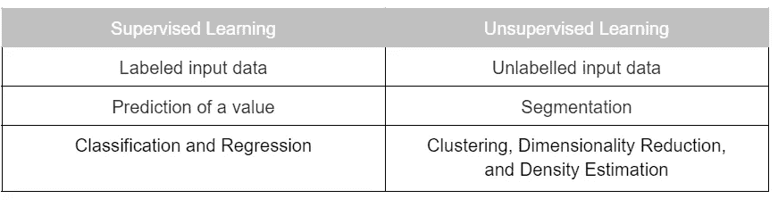
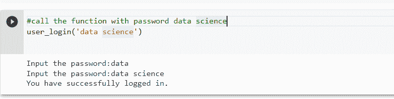

# 如何赢得数据科学面试

> 原文：<https://towardsdatascience.com/how-to-ace-a-data-science-interview-a-comprehensive-toolkit-that-boosts-your-competitive-edge-61c86cea99e3>

## **增强您竞争优势的综合工具包**


伊恩·施耐德在 [Unsplash](https://unsplash.com?utm_source=medium&utm_medium=referral) 上的照片

# 介绍

随着数据的数量、速度和种类日益增加，组织对合格的数据科学家和分析师的需求也在增加，以便能够利用和释放这些数据的价值。然而，根据我参加面试小组或与人交往的经验，我相信许多潜在的候选人很难通过面试阶段，因为他们没有完全意识到他们应该事先准备的样本问题。出于这个原因，在本教程中，我旨在介绍和讨论候选人可能遇到的最相关的理论和实践问题。

> 我应该指出，这篇文章是一个工具包，它让您对各种数据科学概念和机器学习工具有一个基本的了解；然而，你需要更深入地挖掘所讨论的话题，进一步增加你的知识，以便在处理面试问题时变得完全自信。

# **第一部分:理论部分**

面试官会有兴趣测试你在统计学、机器学习、技术栈等领域的知识。因此，第一部分将展示数据科学领域正在发展的七个类别中最相关的理论问题。

## 一)统计

1.  **说明总体和样本之间的区别:**总体是所有感兴趣的个体的集合，而样本是在研究中代表总体的精选集合。
2.  **什么是假设检验？**统计推断工具，使用样本数据来确定是否应该拒绝关于总体参数的陈述。由 H0 表示的零假设是关于总体参数的一个试探性假设，由 H1 表示的另一个假设与零假设的内容相反。
3.  **p 值表示什么？**在假设检验中用作可以拒绝零假设的最小显著性水平。p 值越低，你越有可能拒绝零假设，我们不能在小于 p 值的显著性水平上拒绝 H0。
4.  **I 型和 II 型错误有什么区别？**第一类错误称为假阳性，是当 H0 为真时拒绝它的错误，而被称为假阴性的第二类错误是当它为假时保留 H0 的错误。
5.  **如果两个随机变量 X 和 Y 是独立的，意味着什么？**这意味着知道 X 却不知道 Y，反之亦然。
6.  **什么是中心极限定理？**它描述了当我们有一个大样本量时，样本均值应该是正态分布的，因此样本均值将趋于总体均值，样本方差将等于总体方差除以样本量，而不管原始总体的分布如何。
7.  **解释相关性和协方差的区别？**相关性提供了两个变量的线性关系的强度和方向，而协方差度量了两个变量的联合线性关系的方向。
8.  **什么是大数定律？当我们进行大量实验时，平均结果将非常接近预期结果，或者换句话说，样本平均值将变得更接近总体平均值。**
9.  **如何处理异常值？我们可以用平均值或中值来改变它，标准化和缩放数据，应用对数变换，甚至删除这些值。**

## II)机器学习

10.**列举有监督和无监督学习的区别。**



**监督和非监督 ML 之间的差异**

11.**什么是混淆矩阵？**用于评估分类模型性能的 N×N 矩阵，其中 N 是目标类的数量。它将实际目标值与模型预测值进行比较。

12.**解释准确度、精确度、召回率和 F-1 评分之间的区别。** *准确度*是模型正确预测的分类数除以预测数。 *Precision* 告诉我们有多少正确预测的病例结果是阳性的(TP/TP+FP)。*回忆*告知我们使用我们的模型(TP/TP+FN)能够正确预测多少实际阳性病例。F1 分数是精确度和召回率的调和平均值。

13.讨论决策树和随机森林算法的区别。决策树是一种受监督的算法，主要用于回归和分类，它通过将数据分割成子区域并预测叶节点的平均值，将数据集分解成越来越小的子集，而随机森林通过重复对训练数据进行重采样和替换来训练树的集合，并对树进行投票以进行最终预测。

14.**定义逻辑回归，给出两个业务用例。**它是一个二元分类器，估算一个实例属于某一类的概率，并据此做出预测。它可以用来预测企业中的潜在客户，或在营销活动中寻找新客户。

15.**什么是偏倚和方差权衡，如何解决？** *偏差*是由于使用的算法过于简化而在模型中引入的误差，它会导致拟合不足。*方差*是由于过于复杂的算法而在模型中引入的误差，由此它在训练集中表现得非常好，但是在测试集中表现得很差，并且它导致过度拟合。*偏差-方差权衡*试图通过 **:** 交叉验证、维度缩减和特征选择等方法，将这两种误差源降至最低。

16.**什么是过度拟合，如何对抗？**当模型在训练集上表现良好，但在看不见的测试数据上未能很好地推广时，就会出现这种情况。为了克服这一点，我们可以增加训练集，执行特征选择，应用正则化技术，早期停止，或使用交叉验证。

## III)深度学习

17.**什么是深度学习，为什么最近一段时间开始流行？**它试图模仿人脑的功能，使用许多层神经元从输入神经网络的数据中逐步提取更高层次的特征。由于生成的数据量的增加和运行这些模型所需的计算资源的增长，它已经变得流行起来。

## IV) **自然语言处理**

18.**NLP 有哪些用例？**它帮助计算机理解不同任务的语言，如语音识别、情感分析、文本摘要、文本分类、翻译、问答、聊天机器人和命名实体识别。

19.**提供词袋和 TF-IDV 的区别。**单词袋使用词频表示文本，没有上下文或顺序，而 TF-IDV 通过将术语频率或出现次数乘以逆文档频率来测量单词重要性，该逆文档频率消除了常见的不必要术语。

## **V) Python 库**

20.定义 pandas 库和数据框架。Pandas 库建立在 NumPy 之上，为 Python 提供了易于使用的数据结构和数据分析工具。数据框是 pandas 中主要的二维数据结构，包含不同类型的列

21.**什么是 scikit-learn？**它是一个开源的 Python 库，为各种有效的预测数据分析工具采用了统一的接口，这些工具包括:机器学习、预处理、交叉验证和可视化算法。

## VI) **科技栈**

22 **。Git 是什么？**一个版本控制系统，允许用户跟踪源代码的变化。在 GitHub 或 GitLab 等网站上，数据团队可以使用 Git 推送、拉取和审查代码库。

23.**Docker 是什么？**在开发数据科学解决方案时，它确保了可移植性和可再现性，团队成员可以创建和部署隔离的环境来运行应用程序及其依赖关系。

24.**什么是阿帕奇气流？It 是一个开源工具，可以用来编写和调度 Python 中的工作流，并监控模型训练或数据抓取等过程。**

25.**什么是 API？**它是应用程序编程接口的首字母缩写，可以用作任何两台机器或应用程序之间的中间人，这些机器或应用程序希望在一组规则内相互连接，以完成指定的任务。

## VII) **其他应用**

26.**确定 A/B 测试的目标，并给出一个用例。**它通过两个变量的随机测试来检验用户体验。它可以被实施，以找出最佳的网上促销和营销策略的业务。

27.定义推荐系统并提及其类型。这是一个建议工具，评估一个平台可能为用户提供的备选方案。有两种主要类型:*内容过滤 RS，*基于学习用户过去喜欢或认为有用的内容来推荐项目，以及*协作过滤 RS，*基于学习具有相似品味的其他用户喜欢或认为有用的内容来推荐项目。

# 第二节:**实用部分**

面试官也很想测试你在 Python、SQL 和 r 等编程语言方面的技术专长和熟练程度，因此，在这一部分，我将展示并讨论一些你可能在面试中看到的编码示例。

## I- SQL 编码练习

我将展示的第一个实际例子是关于 SQL，一种用于与关系数据库通信的编程语言。任务是提取按账户类型分段的 2022 年**客户量**、**平均年龄**、**通话次数**、**通话时间**平均年龄至少为 40** 。让我们假设我们必须使用两个表，分别叫做帐户和电话。**

```
**select** k.account_type, **count**(**distinct** k.account_id) as number_customers, round(**avg**(k.customer_age),0) as avg_age, count(distinct c.call_id) as number_calls, **sum**(c.talk_time) as total_talk_time
**from** accounts as k
**join** calls as c
**on** k.account_id = c.account_id
**where** k.start_date as date >= cast('2022-01-01' as date)
**group by 1 --account_type
having** avg(customer_age) >= 40
**order by** 2 **--number_customers**
```

> *以下是我希望你明确关注和理解的构建模块:*
> 
> ***1。选择*** *，这简单地说明我们想要提取变量名称:account_type、account_id 等。*
> 
> ***2。计数和独特的*** *允许我们计数独特的(独特的)帐户 id，以生成客户总数；同样的方法也适用于呼叫，我们通过计算唯一呼叫 id 的数量来获得总呼叫数。*
> 
> ***3。Count、sum 和 avg*** *是用于从数据中获得洞察力的统计度量。*
> 
> *4。* ***从*** *中识别出表的名称。*
> 
> ***5。*******Join****使我们能够基于一个*公共唯一键*合并两个表之间的数据。有不同类型的连接:*左连接、右连接、内连接和外连接*，您应该考虑这些连接。例如，当左表(表 1)或右表(表 2)中有匹配记录时，*外连接*返回所有记录，而 as* 内连接*选择在两个表中都有匹配值的记录。还有一个* union *选项，可以合并两个表的数据。**
> 
> ****6***。 ***其中*** *表示我们用来提取数据的条件。例如，在上面的例子中，我们指定只需要某个日期(2022 年初)之后的数据。**
> 
> ****7。Group by*** *用于按类别进行聚合，在我们的例子中是 account_type。**
> 
> ****8。拥有*** *从聚合结果中过滤出行。在我们的示例中，我们按照要求过滤平均年龄超过 40 岁的人的聚合结果。**
> 
> ***9*。Order by*** *按 asc(默认)或 desc 排序数据。**

## *II- Python 编码练习*

*任务将是开发一个功能，可以作为您的帐户登录网关。它应该要求您输入您的密码，如果在两次尝试内匹配正确的密码，您将能够登录。否则，您的访问应该被阻止。*

```
*def user_login(password):
  i = 0
  while i < 3:
    user_input = input('Input the password:')
    if user_input == password:
      print('You have successfully logged in.')
      break
    if i == 2:
      print('You are not the authorized user.')
    i+=1
  return*
```

**

***Python 功能测试***

> ****以下是我希望您重点了解的构件:****
> 
> ****1-函数的用法和结构:****Python 中的术语*函数*打包了一组语句，你可以在代码中随时执行这些语句。函数的主要部分有:* 函数名、参数、函数体和返回部分。*
> 
> **2-****While****语句启用迭代，当某些条件为真时，代码块将重复执行。一旦条件评估为假，代码的下一部分被执行。要提前结束 while 循环，应使用*中断语句*。在我们的示例中，while 循环用于要求用户在一定的尝试次数内输入密码，当它收到正确的密码时，while 循环将停止(break 语句)，否则它将继续，直到最后一次允许的尝试，这将自动阻止访问。**

*在 Python 知识方面，也要精通熊猫的操作和方法以及数据扯皮技术。你可以查看我的另一篇关于 [**实践中的熊猫**](/pandas-in-practice-64be9228062a) 的文章，我正在添加一个**数据营** [**熊猫小抄的链接:Python 中的数据争论**](https://www.datacamp.com/cheat-sheet/pandas-cheat-sheet-data-wrangling-in-python) **。***

# ***结论和最终想法:***

*最后，我在本教程中展示了候选人在面试中可能会遇到的最相关的理论问题，无论是在统计学、机器学习、自然语言处理还是技术堆栈方面。我还展示并解释了两个实际操作的编码练习，这些练习描述了一些重要的概念和技巧，候选人应该有信心并有能力在面试中使用。然而，我强烈建议延长你的准备时间，进行额外的阅读，以确保你覆盖并掌握了面试中所有的关键知识。出于这个原因，我在下面列出了一些书籍和在线表格的建议，它们应该是这个工具包的补充资源。*

> *我祝你在准备和职业生涯中一切顺利。如果您需要任何指导或支持来获得技术数据科学家或分析师职位，请联系我们。*

# ***其他资源:***

*你可以在[图书馆起源](https://libgen.rocks/index.php)找到这些书的 PDF 版本:*

1.  *统计的艺术:从数据中学习*
2.  ***用于数据分析的 Python**Wes McKinney*
3.  ***数据分析的 SQL:将数据转化为洞察力的高级技术**作者 Cathy Tanimura*
4.  ***用 Scikit-learn 和 Pytorch 进行机器学习**Sebastian rasch ka，Yuxi (Hayden) Liu，Vahid Mirjalili*

*我还建议查看 Data Camp 网站上的 [**数据科学备忘单**](https://www.datacamp.com/cheat-sheet) ，这也是利用你在 Python/SQL 编程、机器学习和人工智能方面的专业知识的有益来源。*