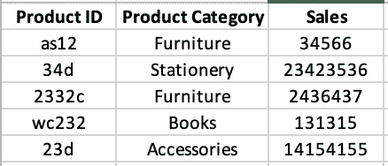
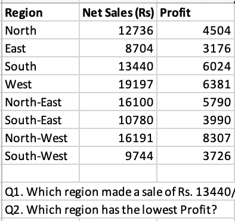

# FAANG 商业智能工程师/数据分析师如何通过技术面试(Excel)

> 原文：<https://towardsdatascience.com/how-to-ace-technical-interviews-excel-for-business-intelligence-engineer-data-analyst-at-faang-8b5b0788e4ea>

就数据而言，Excel 是最通用的工具之一。您可以在 Excel 中处理所有数据，从数据输入到数据操作到数据分析到数据报告再到数据自动化。

米卡·鲍梅斯特在 [Unsplash](https://unsplash.com?utm_source=medium&utm_medium=referral) 上的照片

难怪它是几乎所有 it 公司(无论是哪个行业)的数据分析师的必备条件。

如果你要参加 FAANG(或任何公司)的数据分析师面试，以下是你需要准备的五大 excel 公式。

## 1.COUNTIF

COUNTIF 是一个高级 IF 函数，它将条件应用于多个区域中的单元格，并计算满足所有条件的次数。

举个例子，在亚马逊的 Excel 面试中，我被问到的一个问题是关于帕累托原则的。

> 根据 wikipedia.com—
> **帕累托法则**的说法，对于许多结果来说，大约 80%的后果来自 20%的原因(“关键的少数”)。

我得到了一个数据集**，其中包含按产品类别和产品 ID 划分的销售额。我的任务是找出占销售额 80%的产品 id 集。

作者图片

**解决方法—** 有多种方法，这个可以解决。为了解决这个问题，我们需要统计占总销售额 80%的畅销产品的数量。我使用了 COUNTIF 和 SUM 公式的组合。

这是我所做的—

1.  用
    *求出所有销售额的总和 total_sales= SUM(C1:C600)*
2.  通过
    *Sales _ 80 = 0.8 * total _ Sales*找出总销售额的 80%
3.  按销售额对数据集进行降序排序。
4.  通过—
    *cum _ Sales(D 列)=SUM($C$1:C2)* 计算每行的累计销售额
5.  通过下面的公式
    *COUNTIF(D1:D600，"< =" & $H$5)* 找出 cum_sales 大于 Sales_80(H5)的产品 id 数

结果将给出占销售额 80%的最畅销产品 id 的数量。

仅仅使用 COUNTIF 函数就可以解决另一个数据集和另外三个问题。

## 2.DATEDIF

出于某种原因，DATEDIF 不是 Excel 中列出的函数。我说的列出的意思是，你打字的时候不会得到任何建议。但是它仍然得到支持。

DATEDIF 函数可以让您减去两个日期，并以指定的时间频率输出结果，如日、月、年等。

**答:**在亚马逊的面试中，有一个问题是关于学生的数据集**，带有出生日期和班级等属性。我的任务是找出 2003 年 3 月 10 日以后出生的学生的年龄，他们在 a 区。

**解决方案—** 一如既往，解决问题有多种方法。我使用 DATEDIF 函数来计算年龄，并使用多个 IF 公式来筛选来自 A 区且出生于 2003 年 3 月 10 日之后的学生。最终的公式看起来像这样—

*=IF(section="A "，If (dob > DATE(2003，3，10)，* DATEDIF *(dob，today()，" y ")，" ")，" ")*

了解这些函数确实可以将任务简化为一行，而不是计算多个中间列。

同一个数据集的另一个问题是计算 2002 年 4 月 3 日之前出生且年龄超过 12 岁的 A 区学生的数量。

**解决方法——**我分两步解决了。首先我把满足这个标准的学生标为 1，其他的标为 0。然后，我对这一列求和，得到满足要求标准的学生人数。这可以进一步简化，但在当时，这就是我的想法。

*Col F= IF(B1="A "，IF(C1 < DATE(2002，4，3)，IF(DATEDIF(C1，today()，" y") > 12，1，0)，0)*

= SUM(列 F)

**使用 COUNTIFS 的简化版本(类似于 CountIF，但您可以指定多个条件)**

*=COUNTIFS(B1:B60，“A”，C1:C60，“<”&日期(2002，4，3)，E1:E60，“>”&12)*

B 列=节，C 列=出生日期，E 列=年龄(计算为 *DATEDIF(C1，今日()，" y"))*

还有另一个数据集。接下来的三个问题回答了哪种选择对一家公司来说是最好的。使用 datedif 和 Sum 函数可以很容易地解决所有这些问题。

## 3.索引/匹配

INDEX 返回区域或数组中给定位置的值。MATCH 函数返回给定范围内满足指定条件的单元格的索引。这两个函数一起可以帮助查找精确匹配或大于或小于查找值的值。这种组合类似于 VLOOKUP。但是使用 VLOOKUP 有一些缺点。首先，它默认假设表数组中的第一列是按字母顺序排序的。第二个是，不能使用 VLOOKUP 在第一列之外的任何列中查找值。

亚马逊采访中的一个数据集**是关于每个地区的销售额和利润。这个数据集中有两个问题。

作者图片

**a.** 首先是找到具有指定销售额的地区的名称。

**解决方案——**我在这里尝试使用 VLOOKUP，当它不起作用时，我意识到了 VLOOKUP 的局限性。所以，我改用指数匹配。

这是一个简单的公式，它给我的正确答案是南方—

*=INDEX(A2:A9，MATCH(13440，B2:B9，0))*

第二个问题是找出利润最低的地区。

**解—** 我在这里用了同样的公式。刚刚用最小利润改变了销售值，我又得到了正确答案。

*=INDEX(A2:A9，MATCH(MIN(C2:C9)，C2:C9，0))*

## 4.求和乘积

> 根据 support.microsoft.com， **SUMPRODUCT** 函数返回相应区域或数组的乘积之和。默认操作是乘法，但是加法、减法和除法也是可能的。

虽然我没有经常使用这个公式，但在这次采访中的一个问题中使用了它。

在这个数据集**中，给出了雇员及其加入日期。任务是找出在一月、二月、三月等月份有多少员工加入。

**解决方案—** 同样，有多种方法可以做到这一点，我在采访中没有使用 SUMPRODUCT。但是如果使用 SUMPRODUCT，这是最简单的。公式可以这样写—

*=SUMPRODUCT((月(乙$7:乙$81) = 1)*(乙$7:乙$ 81<>)*

我们正在获取一个数组，其中加入日期的月份(B 列)等于 1(代表一月)，然后用它乘以另一个数组来处理空值。关于第二部分的更多细节在这里—如果你传递一个空值给这个函数，MONTH 函数返回 1。这将被计入不准确的一月份。因此，我们创建一个数组/范围来指示非空值，并将 1 标记为非空，0 标记为空。这将处理空值，并为 SUMPRODUCT 函数提供一个数组。

## 5.苏米夫

SUMIF 函数返回满足指定条件的某个范围内的值的总和。

尽管面试中没有直接基于这个公式的问题，但这是一个简单且常用的函数，可以帮助回答需要选择性求和的问题。例如，在带有出生日期和班级等属性的学生数据集**中，可能会要求您查找 a 部分学生完成的项目总数。SUMIF 可用于轻松找到答案。

这是我作为数据分析师经常使用的五个非常有用的 excel 函数。我希望这些信息对你有用，并祝你在接下来的面试/准备中好运。

> 额外提示:尝试通过应用这些函数来解决问题。有时，我们会读到一些功能，并对其使用感到自信。但是我们在面试的时候回忆不起来(亲身经历)。获取一个数据集并使用这些函数解决几个问题确实有助于组合多个函数并理解它们的应用场景。

感谢阅读！

*下次见……*

**所有数据集已完全改变，保持了相同的采访概念。实际采访中没有公布任何数据。提供的解决方案是我自己的。*