# 如何解决缺失值替换问题

> 原文：<https://towardsdatascience.com/how-to-ace-the-missing-value-replacement-problem-408bd9506b11>

## 解决数据科学中最常见问题的 5 大专业技巧

照片由 [Unsplash](https://unsplash.com/s/photos/tennis-serve?utm_source=unsplash&utm_medium=referral&utm_content=creditCopyText) 上的 [Moises Alex](https://unsplash.com/@arnok?utm_source=unsplash&utm_medium=referral&utm_content=creditCopyText) 拍摄

缺失值替换听起来可能微不足道，但它可能是机器学习过程中最重要的一步。你做的方式会对你的机器学习模型产生很大的影响。

此外，由于您将创建一些新数据，因此您对组织中的数据部门负有一些基本责任。数据是最重要的资产之一。因此，作为一名数据科学家，如果您使用缺失值替换来创建新数据，您必须向业务人员证明输出的合理性。

在本文中，我将向您展示 ace 缺失值替换的 5 大技巧，让您在如此重要的主题上看起来像个专家。我将使用 K-最近邻(KNN)算法作为缺失值替换算法。但是，这些提示也适用于其他缺失值替换方法。

让我从我将在这个故事中使用的数据集开始。我在 Kaggle 上发现了一个非常有趣的数据集，名为宇宙飞船泰坦尼克号(本文末尾提供了数据源引用)。这是基于一个虚构故事的数据。泰坦尼克号飞船是一艘星际客轮，被时空异常击中。虽然飞船完好无损，但几乎一半的乘客被运送到了另一个维度！

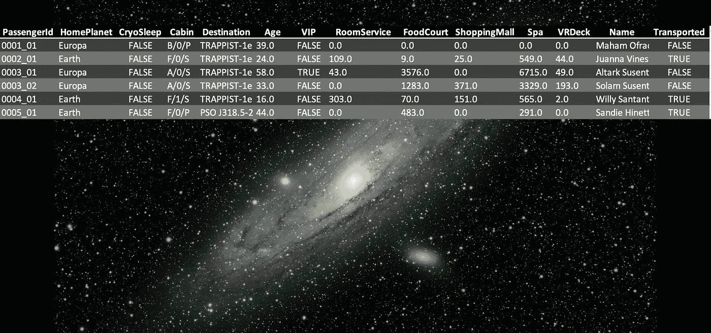

作者在 [Unsplash](https://unsplash.com/s/photos/space?utm_source=unsplash&utm_medium=referral&utm_content=creditCopyText) +数据表上的 [Guillermo Ferla](https://unsplash.com/@gferla?utm_source=unsplash&utm_medium=referral&utm_content=creditCopyText) 照片

听起来很熟悉泰坦尼克号的问题，但它更具未来感！该数据包含乘客的详细信息，如母星球、目的地、年龄和各种服务。许多列缺少值。所以现在让我们来看看最重要的技巧，它将帮助你弥补缺失的价值。

# 1.确定并定义什么是缺失的价值

识别和定义什么是缺失值的最好方法是进行可视化。它避免使用任何预先的概念。这是一张地球的柱状图。我们清楚地看到有什么东西不见了。这是识别和定义缺失值的好方法。我们可以说缺失值是一片空白。由于每个乘客都有一个家园星球，我们需要用一些价值来取代空白。

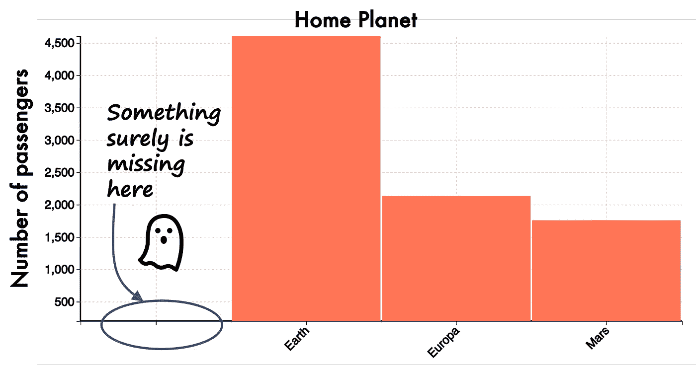

按母星划分的乘客数量条形图(图片由作者提供)

一个类似的柱状图显示了客房服务和年龄。

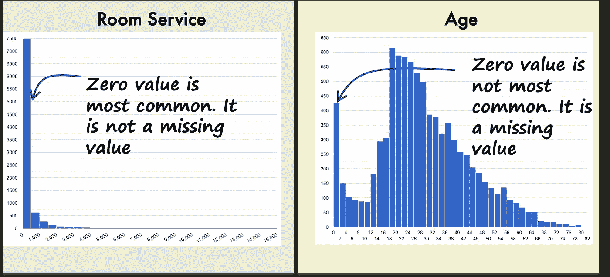

客房服务和年龄(图片由作者提供)

对于客房服务，零值是很常见的。这是正常的，因为不是所有的乘客都需要客房服务。然而，对于年龄，有零值，而且它们不是最常见的。即使我们在未来，我确定未出生的人不算乘客！所以年龄的零值肯定是一个缺失值。

# **2。确定目标变量**中缺失值的比例

通常，丢失值的努力是在机器学习的上下文中完成的。因此，检查与目标类相关的缺失值非常重要。如果相对于目标类的数据分布保持平衡，缺失值替换通常可以很好地工作。

数据集中的目标变量是乘客是否因为被运送到另一个维度而迷路。下图显示了母星相对于目标变量的分布。我们可以观察到两个目标类的空白值的比例是相似的。此外，缺失值的比例非常小。这意味着替换丢失的值不会显著改变数据的形状。这是一个好消息，我们可以自信地将缺失的价值理念传达给数据和业务人员。不会引起公司内部数据大神的任何恐慌！

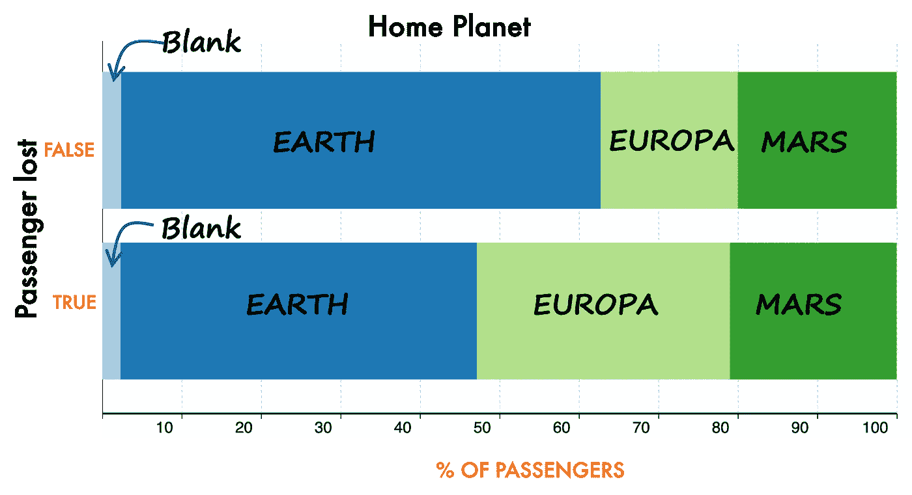

家园星球与目标阶级(图片由作者提供)

我们使用如下所示的箱线图分析，对数字列 Age 进行类似的分析。您将观察到两个目标类的盒图或多或少是相似的。此外，零值(即要替换的值)远离中值。这意味着没有很多零值。因此，我们不会彻底改变数据的形状，从而让公司中的数据之神高兴！

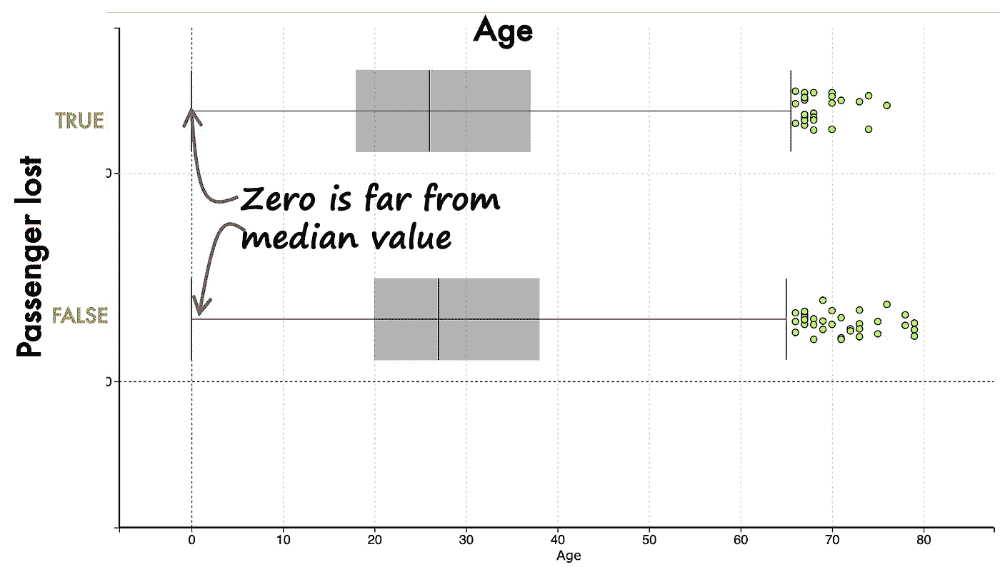

年龄与目标阶层(图片由作者提供)

# 3.对替换算法进行前后检查

现在，我们已经准备好使用“替换母星”和“年龄”字段中缺失的值。对于这项工作，最有效的算法之一是 K-最近邻(KNN)算法。该算法将尝试查找具有缺失值的记录的最近邻。对于数值，它将替换为最近邻的平均值。对于分类值，它将替换为最常见的值。

一旦算法被执行，对有多少值被替换进行热图分析是非常有用的。

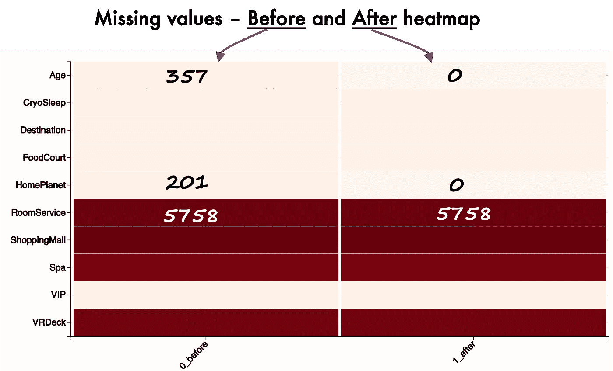

热图前后的 KNN(图片由作者提供)

我们可以观察到所有缺失的年龄和母星值都被替换了。对于客房服务等字段，我们没有选择替换缺失值，所以前后保持不变。

# 4.太好了，丢失的值被替换。但是用什么？

太好了，KNN 算法神奇地替换了丢失的值。但是用什么？我们只有明白置换后什么是价值，才能对置换算法有信心。

这一步取决于你所使用的算法。在本文中，我使用了 KNN，所以我将详细说明这个算法的方法。由于 KNN 是基于寻找最近邻的，因此了解被替换值的最近邻是什么会很有用。可以帮助可视化“接近度”的算法之一是降维算法 TSNE(t-分布式随机邻居嵌入)。

此处显示的是绘制在 2D 散点图上的 TSNE 结果。

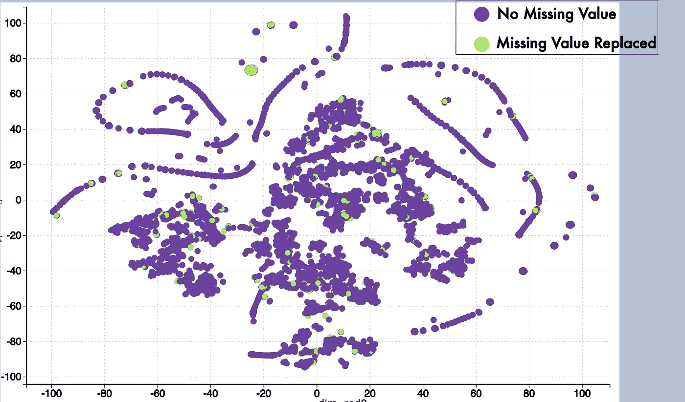

TSNE 谈 KNN 结果(图片由作者提供)

绿点表示数据点有缺失值，已使用 KNN 算法替换。紫色点是没有缺失值的数据点。由于大多数绿点被紫点包围，我们可以对 KNN 的方法有信心。这表明 KNN 是一种很好的方法，因为缺失值的最近邻并不太远。

有一个孤立的绿点集群，在下图中放大了。更仔细的观察表明，即使它是一个孤立的聚类，也有一些邻居帮助填充了缺失的值。

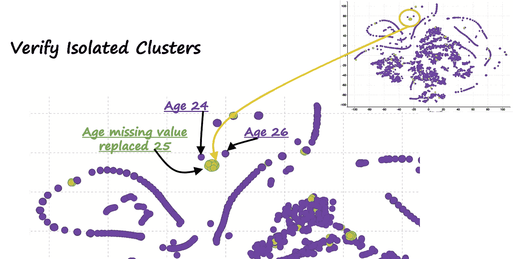

放大到孤立的集群(图片由作者提供)

我们还可以基于目标类验证比例，并将其与早期的结果进行比较。下图是对母星的分析。我们可以观察到空白值(4%)被地球(+2%)、欧罗巴(+1%)和火星(+1%)所取代。这是有道理的，因为大多数母星对应于地球，其次是欧罗巴和火星。

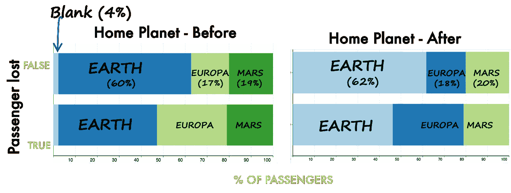

核实前后地球的比例(图片由作者提供)

类似地，我们可以观察到大多数零年龄值已经被 12 -14 岁和 24-25 岁所取代。整体直方图没有太大变化，这是个好消息。

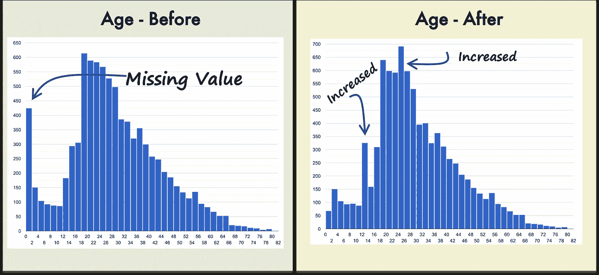

验证前后年龄比例(图片由作者提供)

# 5.验证缺失值替换是否改进了模型

所以现在是我们一直在等待的时刻。我们需要证明管理缺失价值的所有努力是否值得。展示这一点的最佳方式是训练和测试机器学习模型两次——在缺失值替换之前和之后。

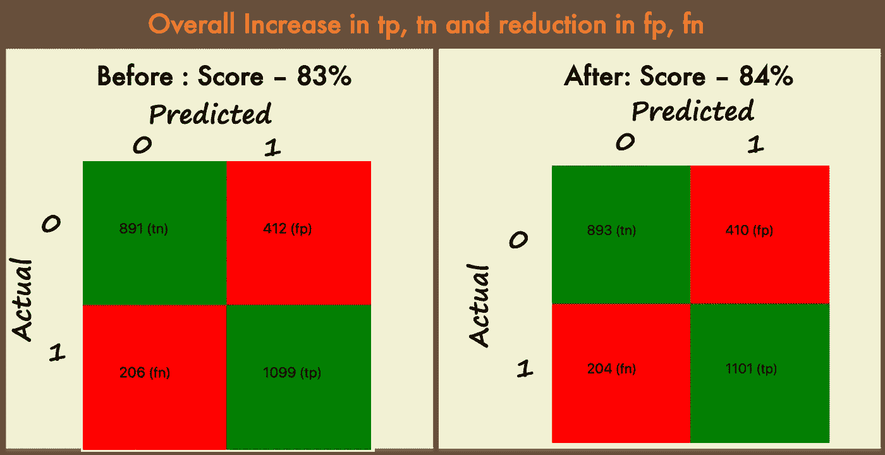

替换前后的混淆矩阵(图片由作者提供)

ROC 分上去了，说明所有缺失值替换的努力都是值得的！哪怕是 1%的分数提升，也能帮助在 Kaggle 董事会上升，为银河系的乘客们讨回公道！

# 结论

总之，缺失值替换会更改数据。因此，重要的是要有足够的证据来证明为什么会改变以及改变了什么。这里描述的 5 个技巧将帮助你解决丢失值替换的问题。

# 观看演示并亲自尝试

你可以访问我的网站做缺失值替换以及其他没有编码的分析:[https://experiencedatascience.com](https://experiencedatascience.com/)

这是我的 Youtube 频道上的一步一步的教程和演示。您将能够使用零编码根据您的数据定制演示。

请**订阅**,以便在我发布新故事时随时获得通知。

  

如果你喜欢你所读的，你也可以通过我的推荐链接**加入 Medium** 。这是支持我的直接方式，我会非常感谢你。

  

# **数据源引用**

资料在这里:[https://www . ka ggle . com/competitions/space ship-titanic/overview](https://www.kaggle.com/competitions/spaceship-titanic/overview)

正如规则([https://www.kaggle.com/competitions/spaceship-titanic/rules](https://www.kaggle.com/competitions/spaceship-titanic/rules)中所规定的，在第 7 A 节中，数据可以用于任何目的。

A.数据访问和使用。您可以出于任何商业或非商业目的访问和使用竞赛数据，包括参加竞赛和 Kaggle.com 论坛，以及学术研究和教育。