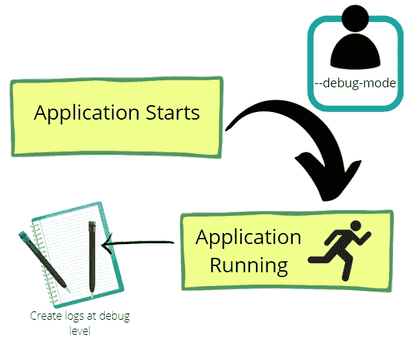
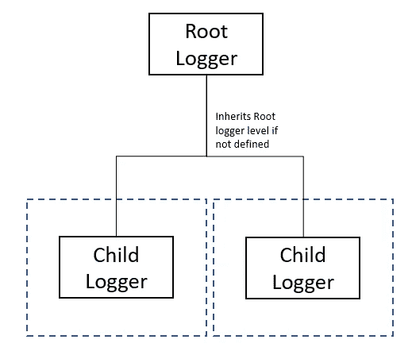
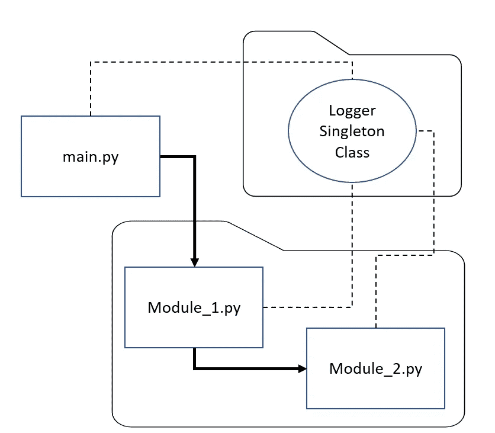
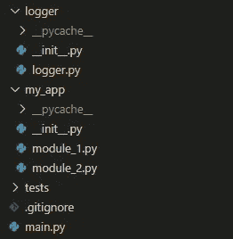
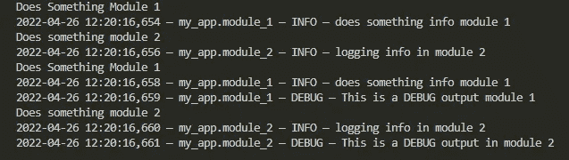

# 如何在 Python 日志运行中期添加调试模式

> 原文：<https://towardsdatascience.com/how-to-add-a-debug-mode-for-your-python-logging-mid-run-3c7330dc199d>

## Python 技巧和窍门

## 动态配置日志记录的调试模式

作者创建的图片|使用了来自[canva.com](http://canva.com/)的免费内容许可元素

让我们面对它，python 的日志工作是复杂的。如果您想在 python 应用程序中添加- debug-mode 或- verbose，该怎么办？您希望激活它会在日志“调试”级别创建一个控制台输出或日志文件，而您的默认值是“信息”级别。当你有一个脚本时，这很容易，你只需要做一个:

这很简单。但是没有足够的教程或简单的解释来跨模块这么做。这只是改变脚本记录器。我会给你一个框架，你可以应用到你所有的应用。

# 我们想要达到的目标

## 标准

让我们简单地说出我们想要什么。我们需要以下标准:

*   跨多个模块进行日志记录的简单框架。
*   一种在所有模块的日志记录应用程序的中途改变特性的方法，无论是日志记录级别、处理程序、配置文件等等。

任何人(大多数情况下是用户)都可以在应用程序运行的任何时候启动日志调试模式，无论是作为输入还是中途|作者创建的图像|使用来自 canva.com[的免费内容许可元素](http://canva.com/)

当你在 **ONE** 脚本中开始时，有大量的教程涵盖了日志记录的基础知识。但是为什么新手找登录过**多个模块**的教程那么难？

这家伙同意了，谢天谢地他已经写下来了:

</the-reusable-python-logging-template-for-all-your-data-science-apps-551697c8540> [## 适用于所有数据科学应用的可重复使用的 Python 日志模板

towardsdatascience.com](/the-reusable-python-logging-template-for-all-your-data-science-apps-551697c8540) 

他的方向是正确的，但是，这并没有帮助我们选择改变所有动态日志的方面。这需要一些信息。

## 关于记录器的必需背景信息

我不会深入解释 Python 日志包的概念。我假设您对 python 日志包有一些基本的了解。我不想重新发明轮子，所以这里有一个文档链接:

[https://docs.python.org/3/library/logging.html](https://docs.python.org/3/library/logging.html)

和一个链接到一个很好的解释伐木工。

[https://www.geeksforgeeks.org/logging-in-python/](https://www.geeksforgeeks.org/logging-in-python/)

然而，有几个相关的概念我需要提及:

*   有多种方法来配置记录器:编写函数/类，dictConfig，使用 logging.basicConfig，一个配置 YAML 文件等。第一个是我发现在运行应用程序时最通用的，所以这是我遵循的框架
*   每当您启动 logging.getLogger(__name__)时，都会创建一个子记录器。如果括号是空的，那么它就是根日志记录器。众所周知，为每个模块创建一个子类是最佳实践。
*   这个超级重要。当子记录器未指定记录级别(即信息、调试、警告等)时。)那么它将继承父类的设置。在大多数情况下，我们的例子是根日志记录器。

作者创建的图像

你明白我的意思了吧。我们将在每个模块中初始化一个子类，但是将从根日志记录器继承级别。我们可以在应用程序中途改变根日志记录器的日志级别，这将应用于所有子日志记录器。

# 框架:步骤和解释

这个框架真的很难在一篇文章中解释，所以我把完整的例子放在 GitHub 的仓库里:

<https://github.com/Causb1A/logging-debug-mode> [## GitHub-caus B1 A/logging-debug-mode:补充 TDS 文章的存储库

github.com](https://github.com/Causb1A/logging-debug-mode) 

如果你正在努力遵循下面列出的步骤。从 main.py 开始一步一步调试存储库代码，然后你就会明白它是如何工作的了。

下面是我们将要实现的目标:

作者创建的图像

如上所述，我们将创建一个 main.py 来启动应用程序，它连接到 logger 类的文件夹和模块中。Module_1 和 Module_2 都是运行应用程序所需的 python 模块，但是 module_1 从 module_2 中获取了一个函数。所有模块都使用一个名为 Logger()的实例化类。*你不必为此使用单例类，你可以有一个普通的类或函数。我用它来为将来的实现保持日志的通用性。*

为了启动“调试模式”,我们将在 module_1.py 中有一个函数，用于启动根记录器中的调试级别。

## 步骤 1:文件创建

像这样创建文件:

作者创建的图像

忽略 pycache。

1.  有一个名为 logger 的文件夹，并确保有一个 __init__。巴拉圭
2.  有一个名为 my_app(或您的应用程序名称)的文件夹，并确保有 __init__。巴拉圭
3.  在你的日志文件夹中放一个 logger.py
4.  创建一个 main.py 作为主运行文件
5.  将你的应用程序模块放在我的应用程序或者你的模块所在的任何其他文件夹中
6.  可选:放置一个测试文件夹并在此测试记录器特性

## 步骤 2:日志记录类

它位于 logger.py 中的 Logger 文件夹中。就像我前面说的，它不一定是一个类，也不一定是一个单独的类。您可以只定义函数而不定义类。只要确保你相应地修改了框架。

**对于那些问:什么是单例类？**

python 中的单例类允许你创建一个类的实例。这个实例贯穿程序的整个生命周期。想象一个你实例化一次的类对象。这个类不能被再次实例化。您可以在任何 python 模块中的整个程序中访问和更改该实例的变量，而不必再次实例化该类。

对于单例类的细节以及它们为什么工作，我不会重新发明轮子。这里有一个很好的解释:

[点击此处前往极客了解极客的解释](https://www.geeksforgeeks.org/singleton-pattern-in-python-a-complete-guide/#:~:text=A%20Singleton%20pattern%20in%20python,of%20access%20for%20a%20resource.)

我们在这里使用它的原因是为了拥有一个具有我们想要的特性的全局记录器类。所以每次我们启动一个子日志类，它都遵循我们定义的相同框架。我为将来的实现留下了一个单独的类，例如，它可以作为一个全局类来保存所有的子记录器作为属性。或者在类的属性发生变化后，可以用它来重新定义日志。我发现拥有一个全局单实例类更加通用；儿童记录器的集中访问点。对于我们所说的“调试模式”，这不是必需的。

下面是 logger.py 文件。

这些函数对于文档字符串来说是不言自明的，但是需要注意几个重要的元素。

*   def __new__(cls):这是使这个类成为单例的部分，它检查实例是否为 none。如果是，它将实例化一个实例。否则，它将返回相同的实例。因为这是一个日志记录器，我们不需要再实例化。
*   def get_logger(self，logger_name):这是我们将在所有模块中调用的函数，用于启动子记录器。
*   处理程序:这里我们创建了两个处理程序，一个终端输出和一个文件处理程序。将来，您也可以使用这个单例类来处理处理程序。
*   def add_handlers():函数 add handlers 检查它是否没有复制处理程序。如果您的应用程序中碰巧需要重新创建一个子记录器，这个函数将停止重复的处理程序。如果将来您希望重新编写这个类以适应更多的处理程序管理，请小心不要重复处理程序。
*   def set_debug_mode(self，debug_mode:bool):该函数将调试根记录器设置为调试级别。这意味着所有子记录器都将从调试根记录器继承这个特性。

## 第三步:不要忘记 __init__。py！

我们希望 logger 文件夹像一个包一样被对待。所以在 __init__ 内。记录器文件夹的 py，放入:

## 第四步:主页面

在 main.py 或运行整个应用程序的主模块中，必须启动 logger 类，并将根级别日志设置为 INFO。这必须在您运行应用程序中的任何其他内容之前发生。

见下方 my main.py

注意，我调用 logger()实例化该类来创建一个子 Logger？每次调用 Logger()时，我们会实例化一个类吗？singleton 类中的 get_logger 函数？不，因为单例类的目的是只有一个实例，所以它将返回相同的现有实例。

## 步骤 5:在任何模块中使用 logger 类

为了在每个模块中使用 singleton logger 类，我们需要导入 logger 类并调用 get_logger。记住，良好的日志记录实践意味着您需要为每个模块创建一个子日志记录器，所以一定要将模块 __name__ 放在每个函数中。

下面是 Github 资源库中“module_2.py”的一个例子。

## 步骤 6:在应用程序中途更改调试级别

现在，我们要做的是，在应用程序中途将 root logger 更改为 debug 模式。还记得步骤 2 中有一个 set_debug_mode 函数吗？该函数将根级别日志记录器更改为 debug。在 Github 存储库中的 module_1.py 中，我通过调用该函数来更改类属性。

参见下面的 module_1.py。

函数 does_something()只是一个示例函数，向您展示用例。

这个模块有什么作用？

函数 run()是整理一切以显示用例的函数。让我们一步一步来。

第 16 行:这调用了函数 does_something()记住，此时日志记录仍处于日志记录状态。信息级别。所以在控制台/日志文件中，你只会看到信息。

第 18 行:这调用了另一个模块中的函数 does_something_module_2()。在步骤 4 中可以看到相同的模块。记住，日志还在日志。信息级别，所以只会看到信息。

第 23 行:将根日志记录器级别更改为 DEBUG。所有模块子记录器都将从此继承。

第 26 行:与第 16 行相同，但是这一次启动了调试模式，日志级别为 Logging.DEBUG

第 29 行:与第 18 行相同，但是现在启动了调试模式，日志级别为 logging。甚至在另一个模块中调试。你已经完成了，你已经在一个模块中初始化了调试模式，并且它在每个其他的模块中继续初始化日志类。

以下是运行该文件时的输出。

作者创建的图像

## 步骤 7:应用到您的应用程序中

要将框架应用到您的应用程序:遵循步骤 1–6，但是不使用 module_1.py、module_2.py 和 main.py，而是将记录器放在您的模块中。

当将根级别更改为调试级别时，可以有一个函数来触发它。例如，解析来自调试模式或用户输入的参数。不管你想触发什么。

## 额外测试功能

我已经在测试库中包含了一些测试函数，只是为了测试 singleton 类的各种特性。测试是不言自明的。

# 我们取得的成就

我们在存储库和步骤 1–7 中实现的是，我们已经将 logger 类框架应用于应用程序，并在应用程序中途触发日志记录级别的更改。

# 最后的话

希望这有助于您在 python 应用程序中更多地管理日志，并为您更多地使用 singleton 类打开大门。

> 如果你喜欢这篇文章，请留下掌声和关注支持！

或者，如果您有兴趣加入 Medium 社区，这里有一个推荐链接:

<https://medium.com/@adrian.causby15/membership> [## 通过我的推荐链接加入 Medium-Adrian caus by

medium.com](https://medium.com/@adrian.causby15/membership)