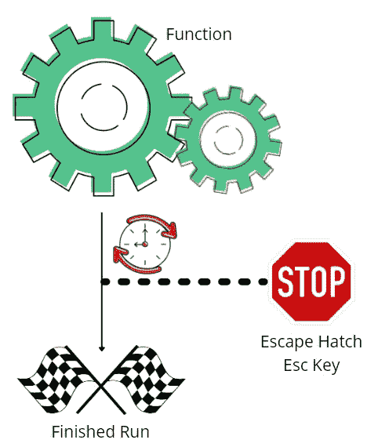
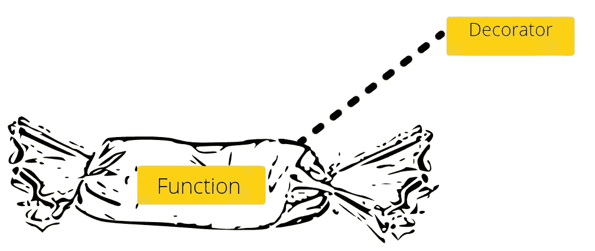
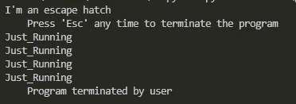

# 如何分两步在 Python 运行中添加转义

> 原文：<https://towardsdatascience.com/how-to-add-an-escape-hatch-to-your-python-run-in-two-steps-7d6818f58f14>

## Python 技巧和窍门

## 使用装饰函数为 Python 应用程序创建一个简单的出口

作者创建的图片|使用了来自[canva.com](http://canva.com/)的免费内容许可元素

你有一个运行在无限循环上的 Python 脚本/应用程序/函数，或者你有一些功能需要你在运行时间过长时安全退出程序。怎样才能安全退出程序？也许 ctrl+C，但这并不总是最安全的方式，非技术人员可能不知道这一点。也许你已经有了一个启动 ML 建模的函数，这个函数可能需要太长时间。

在这里，我将为您提供一个装饰框架，您可以在任何函数上使用它来添加安全停止程序的能力，如果您按下指定的键。在我们的例子中是“退出”键。

那么这里的标准是什么呢？

*   创建一个可以包装任何函数的装饰器，这样如果函数运行时间过长，我们可以用 escape 键安全地停止它

图片由作者创建|使用来自 canva.com[的免费内容许可元素](http://canva.com/)

# Github 存储库

我已经把这个框架放在了 GitHub 的仓库里，你可以在这里找到:

 [## GitHub-caus B1 a/Escape-hatch:Escape hatch python 库，以补充 TDS 文章

github.com](https://github.com/Causb1A/escape-hatch/tree/main) 

我可能会提到知识库的各个方面。如果使用存储库，从 main.py 开始，然后从那里进入调试模式。你可以在 my_app/api_utils.py 中找到 escape hatch

# 必备知识

在深入细节之前，我只想介绍一下我使用装饰函数和装饰工厂来做这件事。如果你不确定这些是如何工作的，请在这里阅读更多信息:

  

在一个非常高的层次上，装饰器是一个接受另一个函数并扩展后一个函数的行为的函数。

把它想象成一个包装器:

图片由作者创建|使用来自 canva.com[的免费内容许可元素](http://canva.com/)

你可以用装饰器包装任何函数，它基本上会围绕函数执行一些东西。所以无论何时你调用一个包装了装饰器的函数，它都会执行装饰器，并且函数会在装饰器中执行。这将使我们的例子更有意义。

# 步伐

## 步骤 1:定义装饰器

创建一个新的模块，在资源库中，我把这个模块叫做 api_utils.py，我在这里定义了 decorator 函数，把它叫做 escape hatch。

上面的函数是我们的装饰器，我们可以用它包装任何函数。如果我启动一个由这个装饰器包装的函数，每当我按下 escape 键，它就会暂停程序(杀死主线程)。

有几点需要注意:

*   第 34 行表示一个上下文管理器，它监听任何键盘动作，如果有一个要发生，它将启动第 26 行，暂停程序
*   第 40 行是执行函数的地方

## 步骤 2:使用我们的装饰函数

现在我们如何使用它？很简单，就像这样:

注意——如果您在存储库中跟踪，这个文件在 my_app/module_1.py 中

就像上面一样简单，现在无论何时你想使用 escape hatch，只要像上面第 5 行那样在任何函数之前简单地包装它。之后使用@escape_hatch 和函数。开始消息和结束消息是可选的。

Function_that_runs_forever()是一个永远运行的函数，用来测试逃生舱。让我们来测试一下:

作者创建的图像

我特意将一些消息移到右边，这样我们可以清楚地看到哪个部分是装饰包装器。

发生了什么事？

1.  逃生舱装饰开始，打印出一些东西，它听我们的键盘，看看我们是否按下退出。
2.  我们的实际函数 _that_runs_forever()开始运行。这种打印机正在运行，除非我停止它，否则它会一直运行下去。
3.  然后我按下 escape 键，装饰器停止这个函数并打印出用户终止的程序。

这就对了。功能正常的逃生出口。

## 额外步骤 3:捕捉键盘中断

有时，取决于你的应用程序做什么，使用键盘杀死主线程有时会引发 KeyboardInterrupt 异常并输出回溯。输出回溯可能不是您想要的。要解决这个问题，您可以添加一个 try，除了我在存储库的 main.py 中所做的:

注意在第 11 行我捕捉到了异常。

# 最后的话

希望以上内容可以帮助你更好地理解装饰函数，并允许你为那些运行时间过长的函数提供一个逃生出口。您可以操纵装饰器来使用不同的键，或者甚至是其他东西来启动 stop。一切触手可及。

> 如果你喜欢这篇文章，请留下掌声和关注支持！

或者，如果您有兴趣加入 Medium 社区，这里有一个推荐链接:

 [## 通过我的推荐链接加入 Medium-Adrian caus by

medium.com](https://medium.com/@adrian.causby15/membership) 

感谢 Marcell Orban 与我一起为我们的应用程序编写框架。