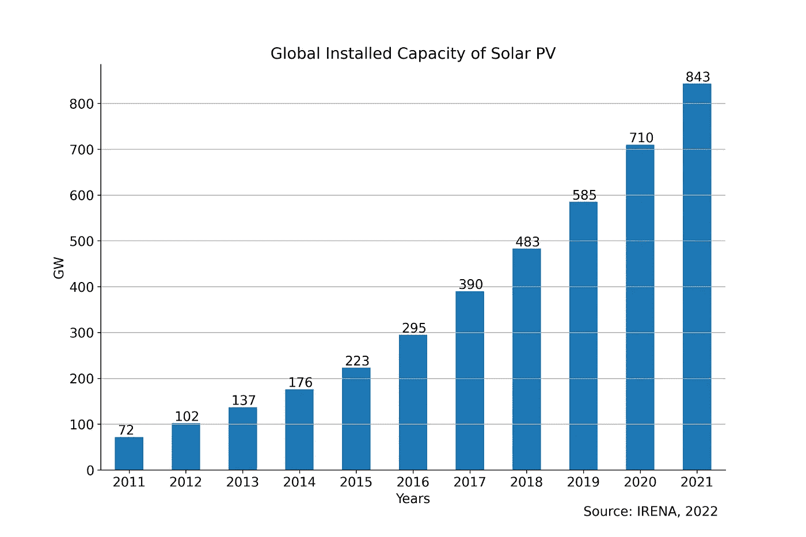
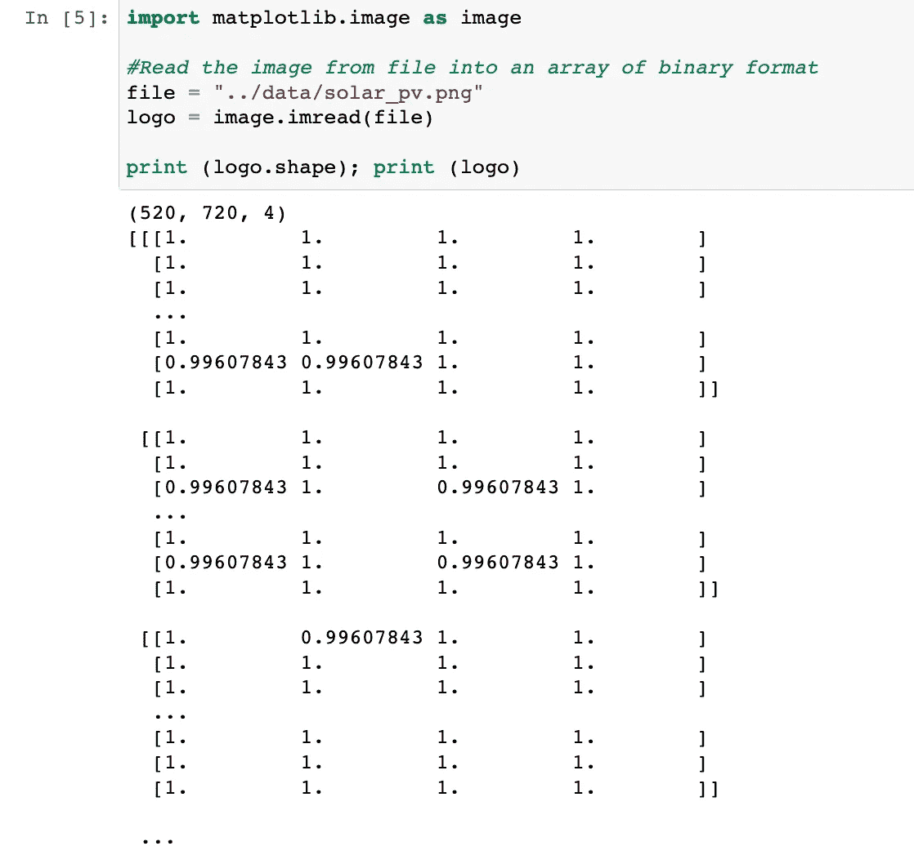
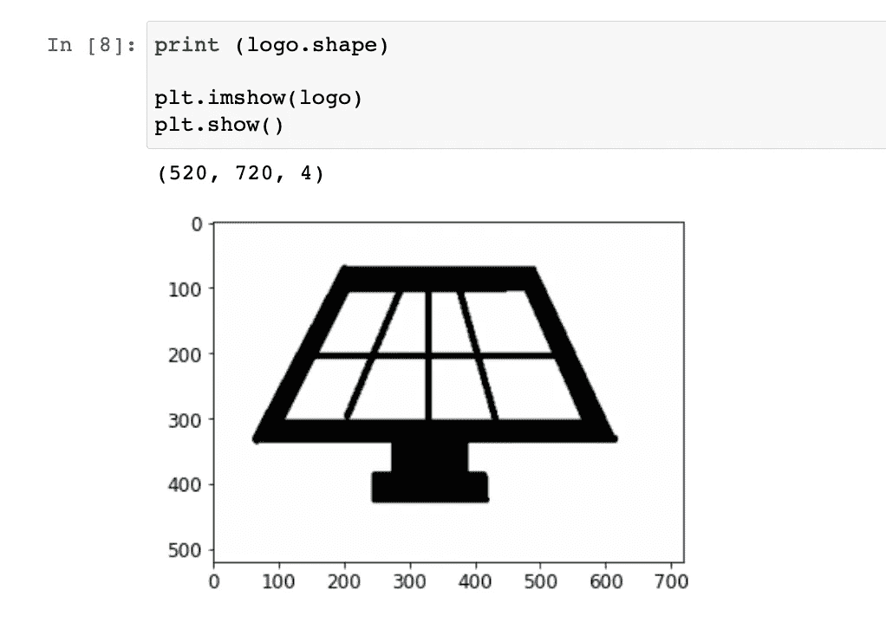
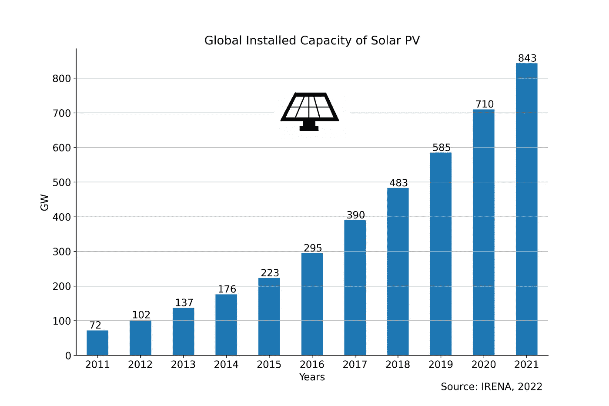

# 如何在 Python 中将图像添加到 Matplotlib 绘图中

> 原文：<https://towardsdatascience.com/how-to-add-an-image-to-a-matplotlib-plot-in-python-76098becaf53>

## 使用 Matplotlib 读取图像数据并将其添加到绘图中

向现有地块添加外部图像或图标不仅增加了美感，还从整体角度增加了其清晰度。外部图像可以是公司或产品的标志、国家的旗帜等。这些图像有助于巩固传达给读者的信息。
Python 中有不同的图像处理包。一些著名的包括 OpenCV、imageio、scikit-image、Pillow、NumPy、SciPy 和 Matplotlib。Matplotlib 是 Python 中最著名的数据分析和可视化包之一。在这篇文章中，我将分享使用 Python 中的 Matplotlib 读取图像、显示图像并将其添加到现有绘图中的步骤。事不宜迟，我们开始吧。


图片由[格伦·卡斯滕斯-彼得斯](https://unsplash.com/@glenncarstenspeters)在 [Unsplash](https://unsplash.com/) 拍摄

# 数据

我从一个数据帧`df`开始，如下图所示。`df`包含 2011 年至 2021 年全球太阳能光伏(PV)装机容量。这一数据是从(IRENA，2021 年)获得的。


# 条形图

在这一步，我用`df`创建了一个规则的条形图。相同的代码在下面的代码块中。我删除了情节的图例，包括它的框架。我把右边和顶部的刺设置为不可见。此外，我在图中添加了网格线。

使用 for 循环遍历`df`的每一行，我使用`plt.text(x, y, s)`将顶部每一条的值相加，其中，

*   `x`是年在 X 轴上的位置，从 0 到 10(包括 10)
*   `y`和`s`均基于`df`的值，即全球太阳能光伏年装机容量，单位为千兆瓦。

```
fig, ax = plt.subplots(figsize = (12, 8))df.plot(kind = “bar”, ax = ax)plt.ylabel(“GW”)#Remove legend along with the frame
plt.legend([], frameon = False)plt.title(“Global Installed Capacity of Solar PV”)# Hide the right and top spines
ax.spines.right.set_visible(False)
ax.spines.top.set_visible(False)#Set xticks rotation to 0
plt.xticks(rotation = 0)#Add grid line
plt.grid(axis = “y”)#Adding value labels on top of bars
for i in range(len(df)): 
     installed = df.iloc[i][0]
     plt.text(x = i — 0.2,
     y = installed + 5,
     s = str(installed))#Add source
plt.text(8, -100, “Source: IRENA, 2022”)plt.savefig(“../output/global solar pv trend.jpeg”,
 dpi = 300)
plt.show()
```

结果，我得到了下面的图表，它展示了在过去十年里太阳能光伏在全球范围内的急剧增长。



显示 2011 年至 2021 年全球太阳能光伏装机容量的柱状图。图片作者。

# 阅读图像

可以使用 Python 中的不同包读取图像，如 Matplotlib、OpenCV、ImageIO 和 PIL (GeeksforGeeks，2022)。在上面的图中，我想在顶部中心的某个地方添加一个太阳能电池板的图标。我用绘画软件手工绘制了一个太阳能电池板的标志。使用 Matplotlib 的[图像](https://matplotlib.org/3.5.0/tutorials/introductory/images.html)模块读取该图像，如下所示:



读取包含太阳能电池板标识的图像文件。图片作者。

这里，`logo`是形状(520，720，4)的 3D NumPy 数组。三维(3D)数组由 3 个嵌套层次的数组组成，每个维度一个(Adamsmith，2022)。

`logo`具有(M，N，4)的形状。520 和 720 是指图像的行数和列数。4 是指具有 RGBA 值(0–1 浮点或 0–255 整数，包括透明度)的图像，即红色、绿色、蓝色和 Alpha 的值(Matplotlib，2020)。

# 显示图像数据

包含 RGB(A)数据的`logo`可使用`plt.imshow(logo)`在 2D 常规光栅上显示为图像。根据`logo`的形状，该图在 X 轴和 Y 轴上分别以 720 和 520 为界限，如下图所示:



使用 Matplotlib 显示图像数据。图片作者。

# 将图像添加到 Matplotlib 图

为了将`logo`图像添加到条形图中，我创建了一个 OffsetBox(一个简单的容器艺术家),并在其中传递了`logo`。缩放设置为 0.15，即图像原始尺寸的 15%。这个 OffsetBox 被命名为 imagebox，因为它包含图像。

接下来，我创建了一个 AnnotationBbox，它是 imagebox 的容器。我在图(5700)的顶部中心为它指定了一个`xy`位置，并隐藏了框架。这在下面的代码中表示，该代码与条形图的代码块一起使用:

```
from matplotlib.offsetbox import (OffsetImage, AnnotationBbox)#The OffsetBox is a simple container artist.
#The child artists are meant to be drawn at a relative position to its #parent.
imagebox = OffsetImage(logo, zoom = 0.15)#Annotation box for solar pv logo
#Container for the imagebox referring to a specific position *xy*.
ab = AnnotationBbox(imagebox, (5, 700), frameon = False)
ax.add_artist(ab)
```

因此，我可以将太阳能电池板的徽标与显示全球太阳能光伏趋势的条形图一起添加。



在条形图上添加太阳能电池板的标志。图片作者。

接下来，我想在太阳能电池板周围加一个圈来突出它。条形图中的 X 轴和 Y 轴具有不同的刻度。X 轴上的每个小刻度以 1 年为步长，而 Y 轴上的每个小刻度以 100 GW 为步长。因此，使用`plt.Circle((x,y),r)`和`ax.add_patch(circle)`添加一个`circle`会使其在图中显得不均匀。

相反，我使用了一个散点图，其中心与 AnnotationBbox 的中心相同。我将半径`s`设置为 20000，`marker`设置为“o”形，`color`设置为“红色”，`facecolors`设置为“无”，在太阳能电池板周围添加一个圆。

```
plt.scatter(5, 700, s = 20000, marker = “o”,
            color = “red”, facecolors = “none”)
```

结果图如下所示。


在条形图上的太阳能电池板标志周围添加一个圆圈。图片作者。

# 结论

在现有地块上添加图像或图标可以增加视觉吸引力和感知度。在这篇文章中，我逐步描述了如何使用 Matplotlib 将外部图像读取为二进制格式的 NumPy 数组，以及如何显示图像数据并将其添加到条形图中。在这种情况下，我提供了一个简单的例子，在显示太阳能光伏装机容量全球趋势的条形图顶部添加一个太阳能电池板的徽标。这篇文章的笔记本可以在这个 [GitHub 库](https://github.com/hbshrestha/Data_Analytics)中找到。感谢您的阅读！

# 参考

亚当史密斯，2022。[如何用 Python 创建 3D NumPy 数组](https://www.adamsmith.haus/python/answers/how-to-create-a-3d-numpy-array-in-python)

极客 forGeeks，2022。[用 Python 阅读图像。](https://www.geeksforgeeks.org/reading-images-in-python/)

IRENA，2021。[统计时间序列:可再生能源趋势。](https://www.irena.org/Statistics/View-Data-by-Topic/Capacity-and-Generation/Statistics-Time-Series)

Matplotlib，2020。[matplotlib . axes . axes . im show](https://matplotlib.org/stable/api/_as_gen/matplotlib.axes.Axes.imshow.html)