# 使用 Esquisse 快速分析数据

> 原文：<https://towardsdatascience.com/how-to-analyze-data-quickly-without-tableau-but-close-66eb1f2fffd2>

## 回顾-工具-数据科学

## Esquisse——一个进行数据分析和可视化的免费工具

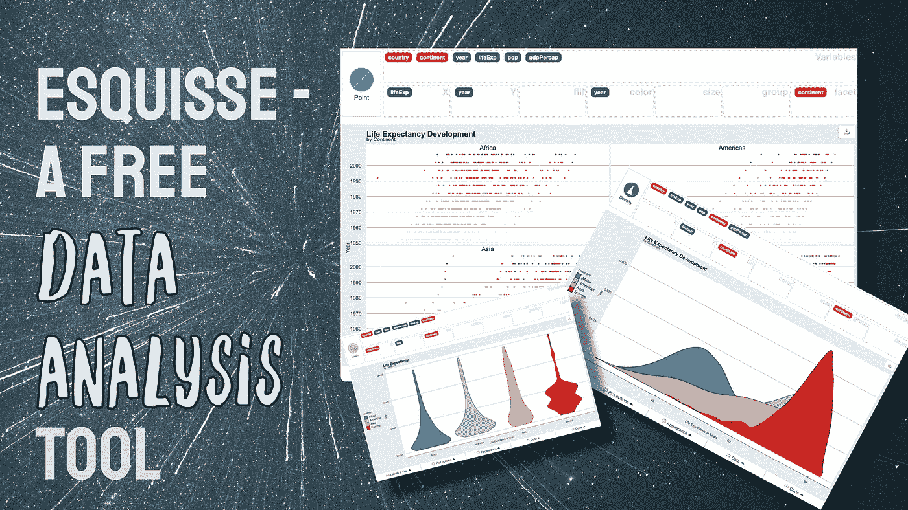

由[凯西·霍纳](https://unsplash.com/@mischievous_penguins?utm_source=unsplash&utm_medium=referral&utm_content=creditCopyText)在 [Unsplash](https://unsplash.com/s/photos/background?utm_source=unsplash&utm_medium=referral&utm_content=creditCopyText) 上拍摄的照片以及作者提供的附加图片

# 介绍

你知道当你得到一个新的大规模数据集作为你的项目的一部分，你需要很快得到它的“感觉”是什么感觉吗？你可以从查看数据的头部开始，在终端或 Jupyter 笔记本中打印出摘要，或者直接在 Excel 中打开。此外，您可以使用 matplotlib 或 ggplot2 创建一些概览图来熟悉该数据集。

但现在不是了！我最近遇到了漂亮的开源工具 esquisse，它大致遵循了著名的商业工具 Tableau 的概念。我把它称为一个工具，但实际上，它是一个 R 包，允许你通过拖放来加载数据和创建漂亮的可视化效果。

本文将向您介绍免费的开源工具 Esquisse 及其特性。这包括加载数据、选择变量和数据可视化类型、过滤、绘图完成和导出。

# Esquisse 和设置

## 埃斯奎塞

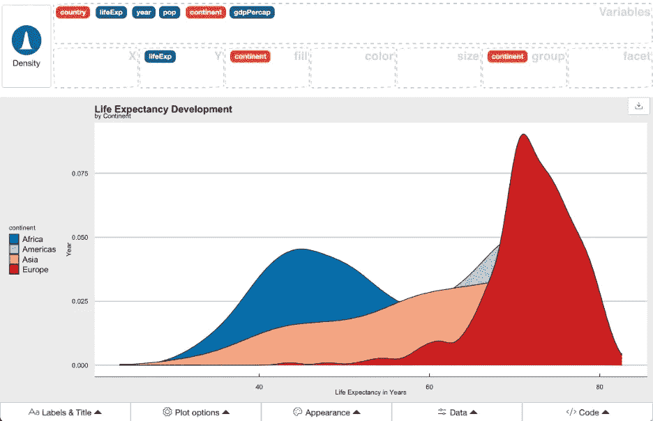

各大洲的预期寿命；作者图片

> 此加载项的目的是让您快速浏览数据以提取其中包含的信息。您可以使用{ggplot2}创建可视化，使用{dplyr}过滤数据并检索生成的代码。*来源:Esquisse 网站*

如上所述，Esquisse 是一个 R 包，因此，您可以很容易地将其集成到您的分析脚本中。但是当然，您可以在没有特定数据项目的情况下使用它。它被写成一个[闪亮的](https://shiny.rstudio.com/)应用。

在屏幕的顶部，您可以选择特定的图，如条形图、箱线图或散点图。此外，它还显示了加载的数据集的所有变量(列)。您可以将这些映射到您的 x 轴和 y 轴、颜色、大小和组。但稍后会详细介绍。屏幕的中间是画布和结果图。每当更改您的数据映射时，都会更新此信息。底部有注释你的图，改变布局，过滤数据，甚至导出产生的 ggplot2 代码的功能。

## 设置

要安装 Esquisse，只需在您的 R 终端中写入以下代码:`install.packages("esquisse")`

使用`library("esquisse")`加载库

在本文中，我使用 Gapminder 数据集展示了一些可视化示例。Gapminder 的数据是在知识共享署名 3.0 未授权[许可](https://cran.r-project.org/web/packages/gapminder/README.html#license)下发布的。请看这里如何设置:[为你的下一个数据科学项目](/7-data-wrangling-r-functions-for-your-next-data-science-project-in-under-5-minutes-d5a4ad55f99b)准备的 7 个数据争论 R 函数

然后你可以调用 Esquisse。这将允许您选择(1)R 环境中的数据，(2)从任何已安装的包中选择数据，(3)上传 CSV 或 xls 文件，(4)复制和粘贴数据，或者(5)使用 Google 电子表格。

`esquisser()`

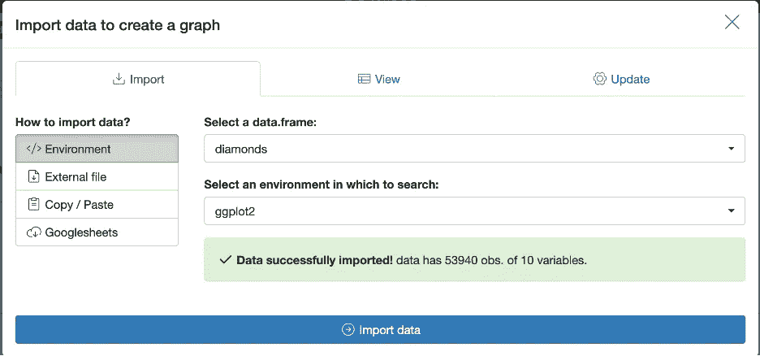

数据导入选项；作者图片

另一种方法是通过将数据框传递给 esquisser 函数来调用 Esquisse。`esquisser(gapminder)`

# 特征

在这一节中，我将详细介绍 Esquisse 出色的数据分析和可视化特性。第一个功能是导入或使用数据。这一点，我在前一节已经解释过了。

## 数据表视图

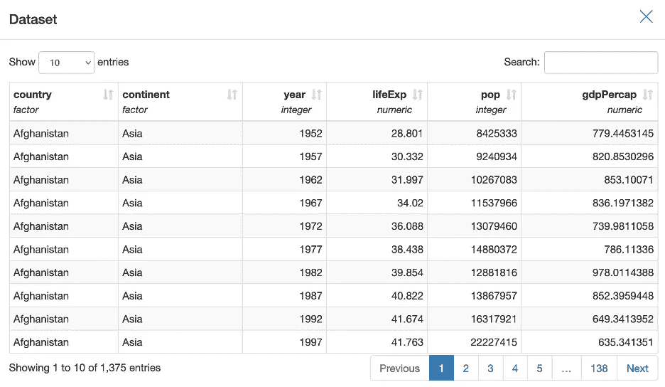

数据表视图；作者图片

导入数据并单击左侧第二个表格图标后，您将看到数据的表格视图。我觉得这个很有用。这将有助于您检查是否所有数据点实际上都是可用的。此外，如果您的一些可视化看起来与预期不同，它将帮助您仔细检查您的数据。就我个人而言，我经常使用搜索功能。此外，您可以使用每个列标题上的小箭头对数据进行排序。不可能在表格视图中过滤数据。相反，您需要关闭表格视图并点击页面底部的**数据**按钮。在本文的后面部分会有更多的介绍。

## 通过拖放创建数据图

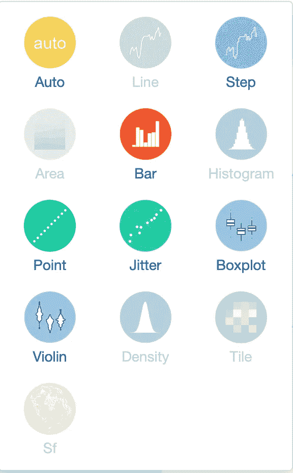

可用的图表类型；作者图片

Esquisse 提供了几种常用的图形类型。这些包括线图和点图、面积图和条形图、平铺图、箱线图和地图。需要指出的是，在数据映射期间，您可以选择“自动”。该工具将根据您的制图和数据为您推荐一种图表类型。

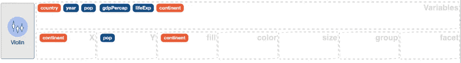

数据映射；作者图片

在图表类型选择旁边，您会看到数据集的可用列(变量)。蓝色代表数值变量，橙色告诉我们它们是分类变量。

您可以将这些变量拖到下面的部分来映射您的数据。x 和 y 表示将数据映射到数据可视化轴。在上图中，我在 x 轴上绘制了大陆，在 y 轴上绘制了人口。这对于盒状图或者在这种情况下的小提琴图来说很有效。“填充”部分允许您操作图表的任何颜色。这适用于箱线图、小提琴图、条形图和面积图。您可以使用“颜色”部分根据变量应用颜色。这最适合线条，而不是我们使用“填充”部分的区域。请参见下面的折线图示例。我们在点图中使用大小来控制点的大小。“组”允许我们比较不同组之间的数据。下面的例子会产生类似的结果，但是不会应用不同的颜色。“Facet”在任何可视化中都是一个强大的特性。它允许您创建数据的“小倍数”。一个比较复杂数据的好方法。

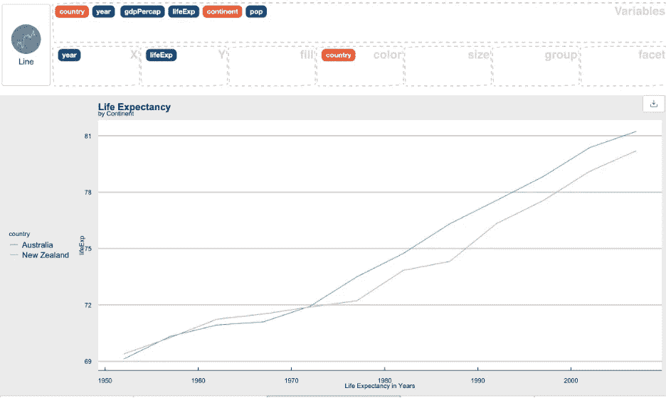

数据映射部分颜色(大洋洲大陆的过滤器)；作者图片

## 数据过滤

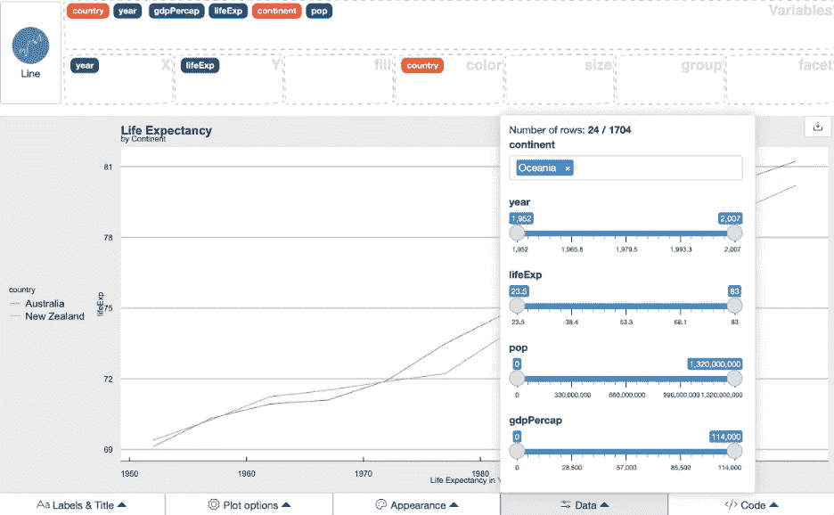

数据过滤；作者图片

通常我会在创建可视化表示之前根据一些要求过滤数据。在这里过滤数据是一个很好的功能。为此，请按底部的“数据”按钮。您将看到一个弹出窗口，其中包含您的数值和分类变量及其范围。您可以使用滑块和选项来过滤数据。

## 为您的可视化做最后的润色

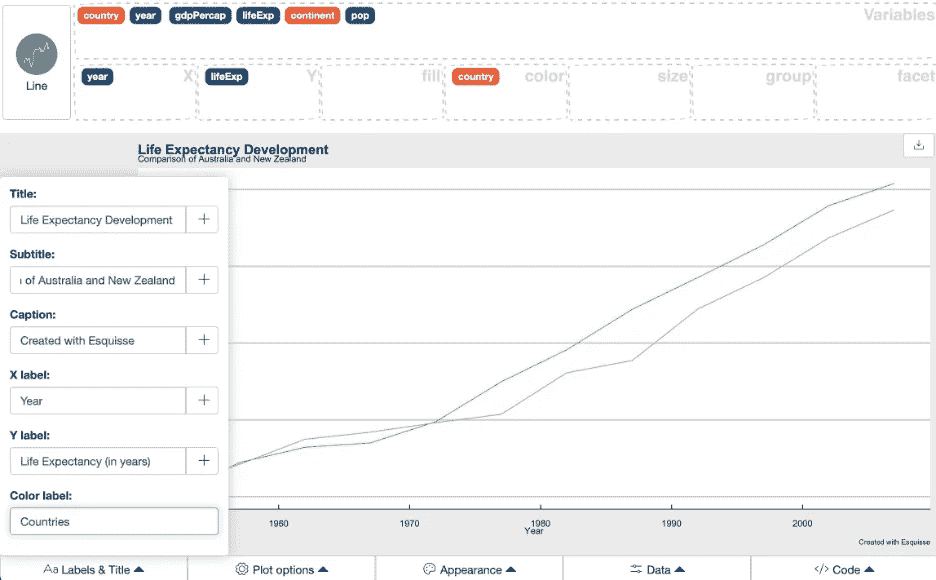

图形标注；作者图片

在映射数据、选择合适的图表类型和一些过滤之后，您可以对您的图表进行注释。在左下角，你可以找到“标签和标题”。您可以指定标题和副标题、标题、x 轴和 y 轴的标签以及颜色图例。

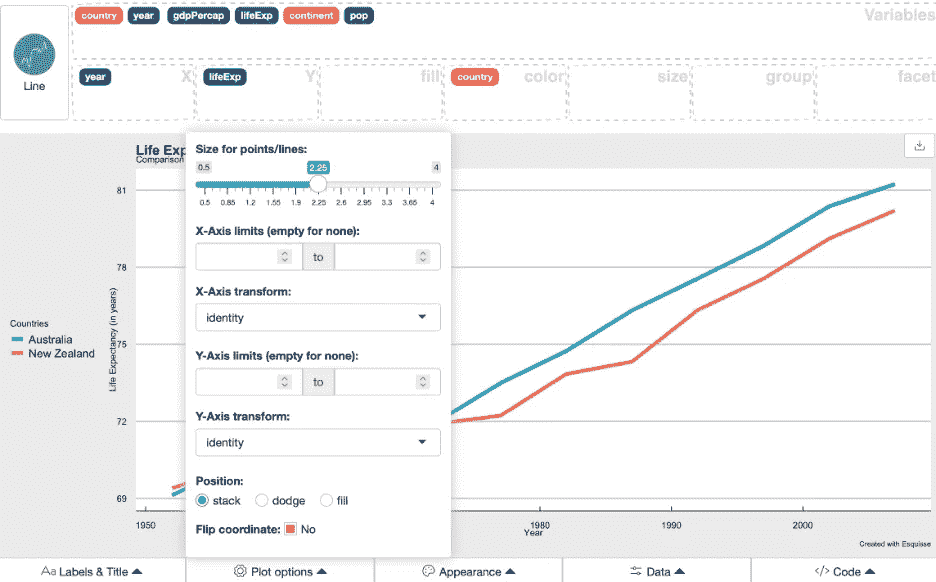

绘图选项；作者图片

你可能还想调整你的情节的一些选项。比较上面的图像以查看选项。这些包括轴限制、转换(log10)等。翻转坐标可以方便地将垂直条形图转换为水平条形图。

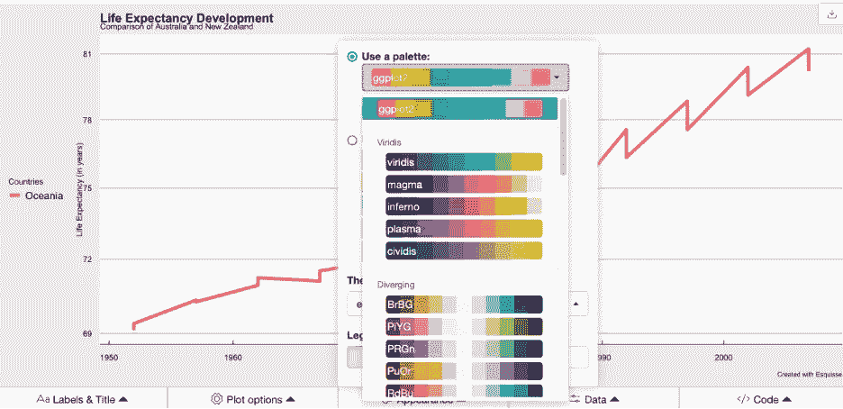

外观选项；作者图片

最后，通过“外观”，您可以选择特定的调色板，并选择一个 ggplot2 主题。我选择了“经济学家怀特”主题，你也可以在图片中看到。

## 出口

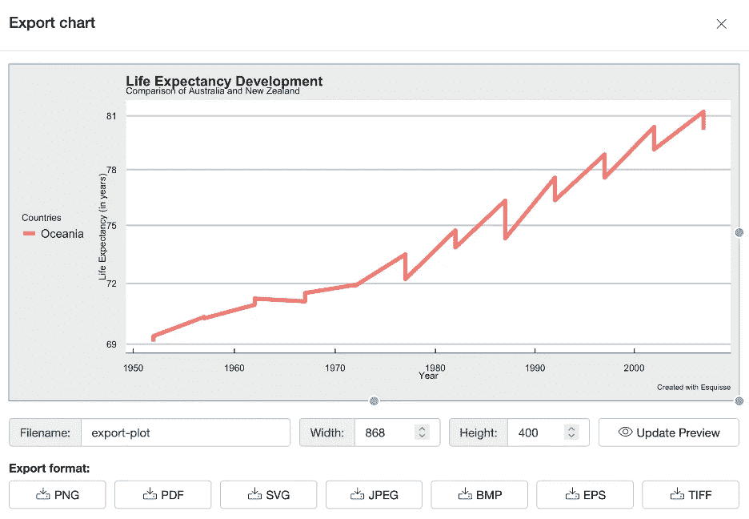

导出选项；作者图片

按下图右侧的“下载图标”,您将看到多种输出格式。按下“更多选项”，你会看到一个带有额外选项的专用屏幕，比如操作宽度和高度。

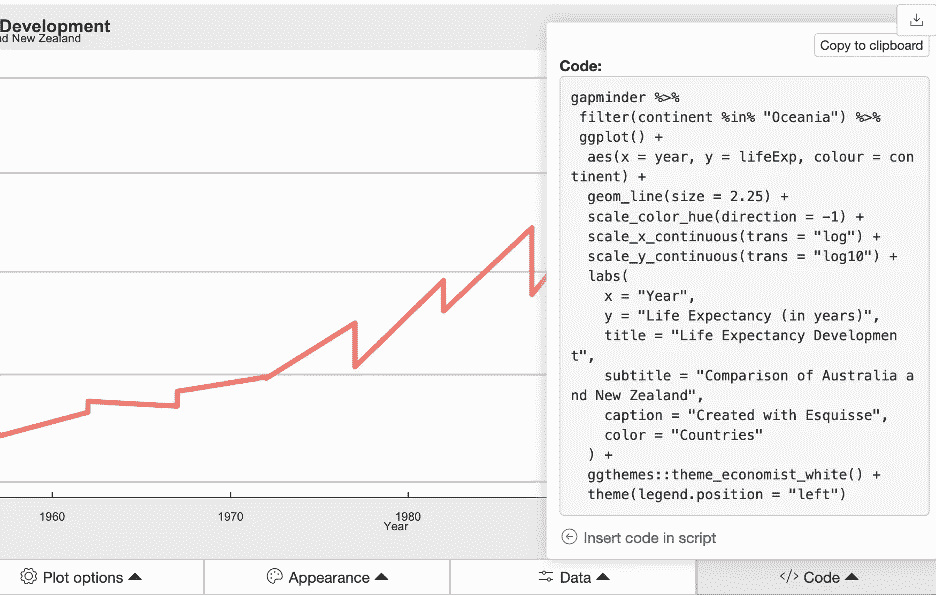

代码导出；作者图片

同样有用的是，您可以导出底层代码。因为 Esquisse 在内部使用 ggplot2 来生成这些图形，所以代码将在您自己的 R 脚本中精确地再现任何给定的图形。这也将增强我们对 ggplot2 的理解，方法是使用 Esquisse 创建一个图，然后查看代码以了解这是如何完成的。酷毙了。

# 结论

本文向您介绍了免费的开源工具 Esquisse 及其特性。这包括加载数据、选择变量和数据可视化类型、过滤、绘图完成和导出。

我发现当我需要快速理解一个新的数据集并创建一些用于交流的初始图时，它特别有用。我将这个工具整合到我的专业工作流程中。但是你对此怎么看？请在评论中分享。

如果你想阅读更多关于我的旅程，请考虑关注我，或者如果你不是一个媒体成员，请考虑[加入这里](https://gscheithauer.medium.com/membership)。非常感谢。

谢谢你，
格雷果

  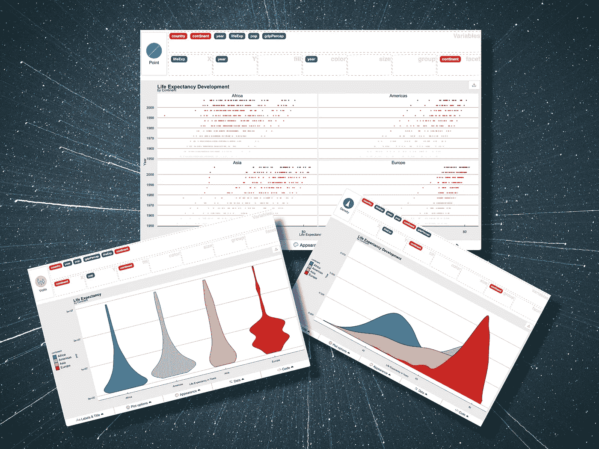

凯西·霍纳在 [Unsplash](https://unsplash.com/s/photos/background?utm_source=unsplash&utm_medium=referral&utm_content=creditCopyText) 上拍摄的照片以及作者提供的其他图片