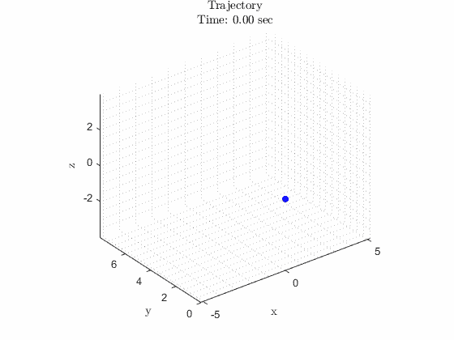

# 如何在 MATLAB 中制作动画

> 原文：<https://towardsdatascience.com/how-to-animate-plots-in-matlab-fa42cf994f3e>

## 一种简单的数据动画制作方法



动画 MATLAB 情节[由作者创建]

图表可能会令人厌烦。没有办法。如果你不是数据爱好者，不喜欢用简单的线、条或点来讲述一个故事，那么情节可能很难引起注意。一个动画可以是一个很好的工具，把观众包装成一个图表。我们的眼睛被训练来观察移动的物体，所以如果你是一名数据科学家或工程师，报告一些有趣的数据，让它随着时间的推移而发展，使它变得引人入胜。让运动为你讲述这个故事。到本文结束时，您将有一个框架来开发有趣的动画，这可能会帮助您获得下一次晋升，打动您的教授，或者只是提高您作为数据处理者的技能。


由[卢卡斯·布拉塞克](https://unsplash.com/@goumbik?utm_source=medium&utm_medium=referral)在 [Unsplash](https://unsplash.com?utm_source=medium&utm_medium=referral) 上拍摄

在本文中，我将假设你有一些关于创建数据和基本绘图的 MATLAB 编码背景。这并不是使情节生动的唯一方法；只是在我看来最直观的方法。想分享方法就留下评论吧！在本例中，我们将使用带有动态标题的三维线条和散点。但是，该方法可以扩展到您选择的绘图类型。事不宜迟，我们开始编码吧！

## 清除一切

我发现在开始你的主代码之前，最好的做法是清除命令窗口，变量，并关闭所有的图形窗口。我们将添加以下三行代码来实现这一点。

```
clc
clear variables
close all
```

## 创建或导入数据

这一步对于您的数据集来说是唯一的。对于这个例子，我们可以基于任意的数学函数创建一个数据集。您可能有一个导入的数据集，或者您可能已经创建了自己的数据，但是如果您试图按照这个示例进行操作，请使用我在这里使用的函数。在这个例子中， ***t*** 是时间(在动画中以秒为单位标注)，而 ***x*** 、**、 *y*** 、 ***z* 、**是描述粒子位置的空间数据。

```
% Creating Data to Animate
% Time array
t = linspace(0, 6, 100);% Particle coordinates
x = 4*sin(t);
y = 0.5*x.^2;
z = x.*cos(t);
```

## 初始化绘图

下一步是定义我们的情节特征。这包括创建动态标题和轴标签。动态标题包括四舍五入到两位小数的轨迹的当前时间(这些不是实时秒)。注意，我在这里对文本使用了 LaTeX 解释器；我发现它比默认文本更好看。接下来，您可以添加网格线，使轴的比例相等，并更改 3D 打印的视角。

```
% Setting up the Plot
figure; hold on
title(sprintf('Trajectory\nTime: %0.2f sec', t(1)), 'Interpreter', 'Latex');
xlabel('x', 'Interpreter', 'Latex')
ylabel('y', 'Interpreter', 'Latex')
zlabel('z', 'Interpreter', 'Latex')
grid minor  % Adding grid lines
axis equal  % Equal axis aspect ratio
view(-37.5,30);  % Setting viewing angle
```

## 查看和保存动画

对于这种方法，这两个步骤是结合在一起的，但是如果需要，可以删除保存步骤。如果要保存动画，我们需要创建一个文件名变量， *animation.gif* 。为了在动画之前正确调整轴的大小，我们绘制了没有颜色的轨道。接下来，我们初始化线和散点变量， ***p*** 和 ***m*** 。在 *for* 循环中，我们可以简单地在每次迭代中更新 ***p*** 和 ***m*** 的 x、y 和 z。对于这条线，我们将希望把它从初始点更新到我们当前的步骤， ***k*** 。对于散布点和标题，我们只需要当前步骤。我们包括一个延迟(*暂停(0.01)* )，可以调整它来改变显示的动画速度(与保存的不同)。 *gif* 速度)。

下一个代码块是用来保存的，所以如果你愿意，你可以在这个步骤之前结束的*循环，从 MATLAB 的图形窗口中观看你的动画。让我解释一下这段代码中发生了什么。 *getframe* 功能将人物窗口捕捉为*电影帧*，而 *frame2im* 将其转换为 *RGB 图像*。函数 *rgb2ind* 将图像转换为带有相关颜色图的索引图像。在*循环的*的第一个索引(在**处 *k* 处** =1)处，我们初始化*。gif* 文件，包含索引图像、颜色映射、文件名、文件类型、循环计数和动画帧之间的延迟。对于 ***k*** 的其他值，我们以类似的方式将下一个动画帧添加到现有文件中。*

```
% Create file name variable
filename = 'animation.gif';% Plotting with no color to set axis limits
plot3(x,y,z,'Color','none');% Plotting the first iteration
p = plot3(x(1),y(1),z(1),'b');
m = scatter3(x(1),y(1),z(1),'filled','b');% Iterating through the length of the time array
for k = 1:length(t)
    % Updating the line
    p.XData = x(1:k);
    p.YData = y(1:k);
    p.ZData = z(1:k); % Updating the point
    m.XData = x(k); 
    m.YData = y(k);
    m.ZData = z(k); % Updating the title
    title(sprintf('Trajectory\nTime: %0.2f sec', t(k)),...
    'Interpreter','Latex'); % Delay
    pause(0.01) % Saving the figure
    frame = getframe(gcf);
    im = frame2im(frame);
    [imind,cm] = rgb2ind(im,256);
    if k == 1
        imwrite(imind,cm,filename,'gif', 'Loopcount',inf,...
        'DelayTime',0.1);
    else
        imwrite(imind,cm,filename,'gif','WriteMode','append',...
        'DelayTime',0.1);
    end
end
```

现在，您可以将它添加到其余的代码中并运行它。您的图形窗口将显示您的动画，您将找到一个文件(名为*animation . gif*)*，其中保存了包含您的动画的代码。如果操作正确，您的绘图应该如下所示(点的速度可能不同):*

**

*轨迹动画【作者创作】*

*本文到此为止。感谢您的阅读！如果你不想错过更多的 MATLAB、Python 和工程文章，请关注我并订阅我的电子邮件。看看我的其他文章吧！*